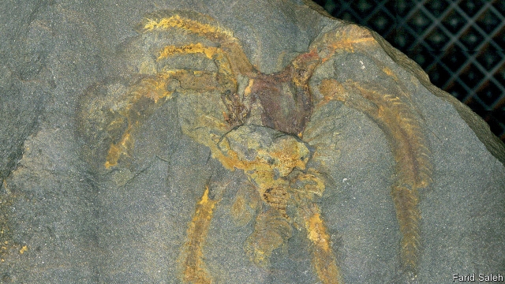

###### Palaeontology

# Shifts in Earth’s orbit increase the chances of spectacular fossils 

##### Changes in the seasons mean changes in preservation conditions 

 

> Jan 24th 2019 

 

FOR PALAEONTOLOGISTS, fossils are buried treasure, and, like treasure of the more conventional sort, such finds are not all of equal value. Fossilised bones, while useful, are reasonably common. Preserved impressions in fine sediment of soft parts like skin and organs are rarer and concomitantly more helpful when it comes to understanding what ancient life was like. But the palaeontological equivalent of finding royal jewels is the discovery of soft tissues that have themselves become preserved. Until now it has been assumed that soft-tissue preservation is a chance, and therefore unpredictable, event. But work published in Geology by Farid Saleh of Claude Bernard University in Lyon, France, suggests that regular variations in Earth’s orbit can affect the preservation of soft tissue in predictable ways. 

For such tissue to be preserved, minerals that impede the activities of tissue-consuming bacteria need to surround the body of a dead organism quickly, before it can rot away. Iron-rich minerals are particularly good at keeping flesh-eating bacteria at bay and are thus commonly found in the sediments around soft-tissue fossils. These sorts of minerals appear in the geological record seemingly at random but, while studying the Fezouata shale, a 500m-year-old formation in Morocco, Mr Saleh noted that exquisitely preserved soft-tissue fossils of annelid worms, sponges, arthropods (pictured) and echinoderms seemed to turn up at regular intervals. 

Intrigued by this, he assembled a team to take a closer look and found that, while fossils of the hard parts of animals (shells, sponge spicules and so on) were common in all sedimentary layers, soft-tissue fossils were confined to six layers deposited at intervals of 100,000 years, or multiples thereof. These particular fossils had all formed through a process called pyritisation whereby pyrite, a substance also known as fool’s gold, and composed of iron sulphide, seeped into the tissues of the dead animals and mineralised them. 

The team then analysed rock from other strata in the formation and found it to be poor in iron—with three telling exceptions. These were places that the 100,000-year cycle suggested should be pyritised, but were not. They were, however, iron-rich, suggesting the cycle is real. That pyrite seemed not to have formed in them was because the conditions of their birth were oxygen-rich. Pyrite forms only in the absence of oxygen. And, for the preservation of soft tissue, it is insufficient that iron be present. It must also invade that tissue and precipitate within it, which pyrite is particularly good at doing. 

These findings presented Mr Saleh with the question of why iron flooded into the shallow sea where the Fezouata shales were forming only every 100,000 years, and this led him to ponder planetary movements. Earth revolves around the sun in an orbit that is almost, but not quite, circular. Its actual shape is an ellipse, and the elongation of this ellipse, a property called its eccentricity, oscillates over the course of time. That, in turn, affects the extremity of the seasons Earth experiences. The more eccentric the orbit, the more extreme the difference between summer and winter. 

Such seasonal variation can show up in all sorts of ways. And, when Dr Saleh compared the pattern of this oscillation, which is well-established back beyond 500m years ago, with that of his 100,000-year spikes of iron availability, he found that the spikes coincided with moments of maximum eccentricity. He reasoned that the more intense seasonality was causing greater rainfall, increased erosion and, consequently, the transport of more iron from land to sea. These ferrous pulses, in turn, preserved the soft tissues of dead animals, so long as the sediments at the bottom of the sea were anoxic at the time. 

Whether Mr Saleh has come across something that is merely a local fluke or is a phenomenon that has parallels elsewhere—and which might thus be used to hunt for previously unknown rocks with good soft-tissue preservation—remains to be seen. At the least, though, he has shown how astronomical events can have unexpected consequences on Earth. 

-- 

 单词注释:

1.palaeontology[,pæliɔn'tɔlәdʒi]:n. 古生物学 

2.spectacular[spek'tækjulә]:a. 公开展示的, 惊人的, 壮观的 n. 奇观, 惊人之举, 展览物 

3.fossil['fɒsәl]:n. 化石, 古物 a. 化石的, 陈腐的, 守旧的 

4.preservation[.prezә'veiʃәn]:n. 保存, 保藏, 保护 [医] 保藏, 保存, 防腐 

5.Jan[dʒæn]:n. 一月 

6.palaeontologist[]: 古生物学家；化石学家 

7.fossilise['fɔsilaiz]:vt.vi. 使成化石, 变成化石, 使(思想)陈旧, 使僵化 

8.reasonably['ri:znәbli]:adv. 适度地, 相当地 

9.sediment['sedimәnt]:n. 沉淀物, 沉积 [化] 沉降物; 沉积物 

10.concomitantly[kən'kɒmɪtəntlɪ]: [医]伴随地, 并发地 

11.palaeontological[pælɪɒntə'lɒdʒɪkəl]:a. 古生物学的 

12.unpredictable[.ʌnpri'diktәbl]:a. 不可预知的 

13.farid[]:n. (Farid)人名；(印、孟、巴基、印尼、阿富、阿拉伯)法里德 

14.Saleh[]:n. 萨利赫（人名） 

15.claude[klɔ:d]:n. 克劳德（男子名） 

16.bernard[bә:'nɑ:d, 'bә:nәd]:n. 伯纳德（男子名） 

17.Lyon['laiәn]:n. 里昂 

18.predictable[pri'diktәbl]:a. 可预言的 

19.impede[im'pi:d]:vt. 妨碍, 阻碍, 阻止 

20.quickly['kwikli]:adv. 很快地 

21.geological[.dʒiәu'lɒdʒikәl]:a. 地质学的, 地质的 

22.seemingly['si:miŋli]:adv. 看来似乎, 表面上看来 

23.shale[ʃeil]:n. 页岩 

24.Morocco[mә'rɒkәu]:n. 摩洛哥, 摩洛哥皮革 [机] 摩洛哥革 

25.exquisitely['ekskwizitli]:adv. 精巧地, 敏锐地 

26.annelid['ænәlid]:n. 环节动物 [医] 环节动物 

27.arthropod['ɑ:θrәpɒd]:n. 节肢动物 [医] 节肢动物 

28.echinoderm[i'kainәdә:m]:n. 棘皮动物 [医] 棘皮动物 

29.intrigue[in'tri:g]:n. 阴谋, 复杂的事 vi. 密谋, 私通 vt. 激起...的兴趣, 用诡计取得 

30.spicule['spikju:l]:n. 针状体, 小穗, 空壳, 骨针 [医] 针, 刺; 交合刺 

31.sedimentary[.sedi'mentәri]:a. 沉渣的, 沉淀物的, 由沉淀物所生成的 [医] 沉淀的, 沉积的, 沉降的 

32.thereof[.ðєәr'ɒv]:adv. 在其中, 关于..., 由此 [法] 由是, 由此, 属于它的 

33.whereby[(h)weә'bai]:adv. 靠什么, 如何, 为何, 靠那个, 因此, 由此 [法] 因此, 由是 

34.pyrite['pairait]:n. 黄铁矿 [化] 黄铁矿 

35.sulphide['sʌlfaid]:n. 硫化物 [化] 硫化物 

36.seep[si:p]:vi. 渗出, 渗流, 漏 n. 小泉, 水陆两用吉普车 

37.mineralise[]:v. 矿化 

38.stratum['streitәm]:n. 层, 地层, 阶层 [医] 层 

39.pyritised[]:[网络] 发炎 

40.pyrite['pairait]:n. 黄铁矿 [化] 黄铁矿 

41.precipitate[pri'sipiteit]:n. 沉淀物, 凝结物, 结果 vt. 猛抛, 使陷入, 促成, 使沉淀 vi. 猛地落下 a. 突然的, 猛地落下的, 轻率的 

42.ponder['pɒndә]:v. 沉思, 考虑 

43.planetary['plænitri]:a. 行星的, 流浪的, 迁移不定的, 地球上的, 现世的 

44.revolve[ri'vɒlv]:v. (使)旋转, 反复考虑, 循环出现 

45.ellipse[i'lips]:n. 椭圆, 椭圆形 [计] 椭圆 

46.elongation[.i:lɒŋ'geiʃәn]:n. 伸长, 延长, 延伸率 [化] 伸长; 伸长率 

47.eccentricity[.eksen'trisiti]:n. 古怪, 古怪行为, 怪癖 [化] 偏心度; 偏心距; 偏心率 

48.oscillate['ɒsileit]:vi. 振动, 彷徨, 犹豫 vt. 使振动, 使动摇 

49.extremity[ik'stremiti]:n. 极端, 极点, 困境, 绝境 [医] 肢, 端 

50.eccentric[ik'sentrik]:n. 怪人, 偏心圆 a. 古怪的, 反常的, 不同圆心的 

51.seasonal['si:znәl]:a. 季节的, 依照季节的, 周期性的 [经] 季节性的, 季节的 

52.oscillation[ɒsi'leiʃәn]:n. 振动, 动摇, 变动, 彷徨, 电波 [医] 振动, 摆动 

53.spike[spaik]:n. 长钉, 鞋钉, 钉状物, 尖峰状物, 穗 vt. 以大钉钉牢, 用尖物刺穿, 阻止, 弃置不用 [计] 尖峰信号 

54.availability[ә.veilә'biliti]:n. 有效性, 可利用性, 可利用的人 [计] 有效性; 可用性 

55.coincide[.kәuin'said]:vi. 一致, 符合 [化] 重合 

56.seasonality[ˌsi:zəˈnæləti]: 季节性 

57.erosion[i'rәuʒәn]:n. 腐蚀, 冲蚀, 侵蚀 [化] 磨耗; 侵蚀 

58.ferrous['ferәs]:a. 铁的, 含铁的, 亚铁的 [医] 亚铁的 

59.anoxic[æ'nɔksik]:a. 缺氧(症) 

60.fluke[flu:k]:v. 侥幸成功 n. 锚爪, 侥幸, 偶然事故 

61.astronomical[.æstrә'nɒmikl]:a. 天文学的, 庞大的 

62.unexpect[]:[网络] 意想不到；使意外 

