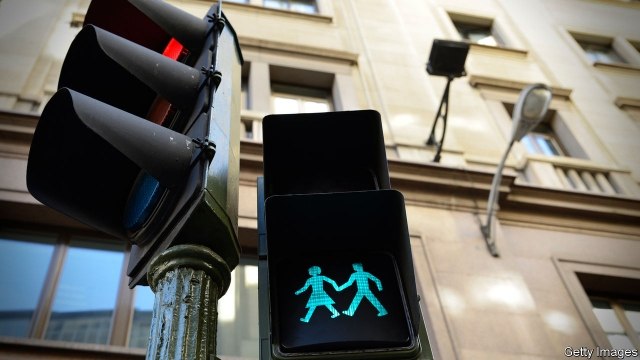

###### Modern life

# The pros and cons of placebo buttons 

##### A pressing problem 

 

> Jan 26th 2019 

 

SUPPRESSIO VERI, suggestio falsi. Over the course of many years, without making any great fuss about it, the authorities in New York disabled most of the control buttons that once operated pedestrian-crossing lights in the city. Computerised timers, they had decided, almost always worked better. By 2004, fewer than 750 of 3,250 such buttons remained functional. The city government did not, however, take the disabled buttons away—beckoning countless fingers to futile pressing. 

Initially, the buttons survived because of the cost of removing them. But it turned out that even inoperative buttons serve a purpose. Pedestrians who press a button are less likely to cross before the green man appears, says Tal Oron-Gilad of Ben-Gurion University of the Negev, in Israel. Having studied behaviour at crossings, she notes that people more readily obey a system which purports to heed their input. 

Inoperative buttons produce placebo effects of this sort (the word placebo is Latin for “I shall be pleasing”) because people like an impression of control over systems they are using, says Eytan Adar, an expert on human-computer interaction at the University of Michigan, Ann Arbor. Dr Adar notes that his students commonly design software with a clickable “save” button that has no role other than to reassure those users who are unaware that their keystrokes are saved automatically anyway. Think of it, he says, as a touch of benevolent deception to counter the inherent coldness of the machine world. 

That is one view. But, at road crossings at least, placebo buttons may also have a darker side. Ralf Risser, head of FACTUM, a Viennese institute that studies psychological factors in traffic systems, reckons that pedestrians’ awareness of their existence, and consequent resentment at the deception, now outweighs the benefits. 

Something which happened in Lebanon supports that view. Crossing buttons introduced in Beirut between 2005 and 2009 proved a flop. Pedestrians wanted them to summon a “walk” signal immediately, rather than at the next appropriate phase in the traffic-light cycle, as is normal. The authorities therefore disabled them, putting walk signals on a preset schedule instead. Word spread that button-pressing had become pointless. The consequent frustration increased the amount of jaywalking, says Zaher Massaad, formerly a senior traffic engineer for the Lebanese government. 

Beirut’s disabled buttons are, says Mr Massaad, now being removed. They should all be gone within three years. New York has similarly stripped crossings of non-functioning buttons, says Josh Benson, the city’s deputy commissioner for traffic operations, though it does retain about 100 working ones. These are in places where pedestrians are sufficiently rare that stopping the traffic automatically is unjustified. However, internet chatter about placebo buttons has become so common that doubt, albeit misguided, seems to be growing about even these functioning buttons’ functionality. This suspicion, says Mr Benson, has spread beyond New York, to include places such as Los Angeles, where almost all the crossing buttons have always worked, at least during off-peak hours. 

Truth be told, though, the end may be nigh for all road-crossing buttons, placebo or real. At an increasing number of junctions, those waiting to cross can be detected, and even counted, using cameras or infrared and microwave detectors. Dynniq, a Dutch firm, recently equipped an intersection in Tilburg with a system that recognises special apps on the smartphones of the elderly or disabled, and provides those people with 5 to 12 extra seconds to cross. That really will be pleasing. 

-- 

 单词注释:

1.pro[prәu]:adv. 正面地 [计] 可编程远程操作 

2.con[kɒn]:vt. 精读, 仔细研究, 默记 adv. 反面地, 从反面 a. 欺诈的 n. 反对者, 反对票, 肺结核 [计] 控制台 

3.placebo[plә'si:bәu]:n. (为死者所诵的)晚祷歌, 安慰剂, 安慰的话, 使人宽慰的事 [医] 安慰剂, 无效[对照]剂 

4.Jan[dʒæn]:n. 一月 

5.veri[]:[网络] 真实；验证方法(Verification)；怨敌 

6.fuss[fʌs]:n. 大惊小怪, 小题大作, 忙乱 vi. 无事自扰, 焦急, 焦燥, 忙乱 vt. 使激动, 使烦燥 

7.york[jɔ:k]:n. 约克郡；约克王朝 

8.computerise[kәm'pju:tәraiz]:vt. （英）用计算机处理；给…装备计算机（等于computerize） 

9.timer['taimә]:n. 计时员, 计时器 [计] 计时器 

10.alway['ɔ:lwei]:adv. 永远；总是（等于always） 

11.functional['fʌŋkʃәnәl]:a. 功能的 [医] 机能的, 功能的, 官能的 

12.countless['kauntlis]:a. 数不尽的, 无数的 

13.futile['fju:tail]:a. 无用的, 琐细的, 不重要的 

14.initially[i'niʃәli]:adv. 最初, 开头 

15.inoperative[in'ɒpәrәtiv]:a. 不起作用的, 无效力的 

16.les[lei]:abbr. 发射脱离系统（Launch Escape System） 

17.tal[]:abbr. 事物处理应用语言（Transaction Application Language） 

18.Negev['ne^ev]:内盖夫(西南亚巴勒斯坦南部一地区) 

19.Israel['izreil]:n. 以色列, 以色列后裔, 犹太人 

20.purport['pә:pɒ:t]:n. 意义, 要旨, 目的 vt. 意味着, 声称, 打算 

21.heed[hi:d]:n. 注意, 留心 v. 注意, 留心 

22.inoperative[in'ɒpәrәtiv]:a. 不起作用的, 无效力的 

23.eytan[]:[网络] ey an 

24.ADAR['eidɑ:(r),ɑ:'dɑ:(r)]:[计] 高级数据采集程序 

25.Michigan['miʃigәn]:n. 密歇根州 

26.ann[æn]:n. 安（女子名） 

27.arbor['ɑ:bә]:n. 藤架, 树, 心轴, 凉亭 [医] 树(树状结构) 

28.clickable[ˈklɪkəbl]:a. 可以点击的；可以打开的 

29.reassure[.ri:ә'ʃuә]:vt. 使...安心, 向...再保证 [法] 重新保证, 再保险, 使清除疑虑 

30.unaware[.ʌnә'wєә]:a. 未认识到的, 不知道的 [法] 不知道的, 不察觉的, 无意的 

31.keystroke['ki:strәuk]:n. 键击 [计] 按键, 击键 

32.benevolent[bi'nevәlәnt]:a. 善意的, 慈善的 

33.deception[di'sepʃәn]:n. 欺骗, 诡计 [法] 瞒骗, 诈欺, 欺骗 

34.inherent[in'hiәrәnt]:a. 固有的, 与生俱来的 [医] 固有的, 生来的 

35.coldness['kәuldnis]:n. 寒冷, 冷, 冷淡 

36.Ralf[]:n. 拉尔夫（男子名） 

37.risser[]: [人名] 里泽 

38.factum['fæktәm]:n. 自己的行为, 事实陈述书, 事实 [法] 事实, 个人行为, 契据 

39.viennese[viә'ni:z]:a. 维也纳的；维也纳人的；维也纳式的 

40.reckon['rekәn]:vt. 计算, 总计, 估计, 认为, 猜想 vi. 数, 计算, 估计, 依赖, 料想 

41.awareness[ә'weәnis]:n. 意识, 认识 [计] 识别, 议定, 明白 

42.consequent['kɒnsikwәnt]:n. 随后发生的事情, 结果 a. 作为结果的, 合乎逻辑的 

43.resentment[ri'zentmәnt]:n. 怨恨, 愤恨 

44.outweigh[.aut'wei]:vt. 比...重, 比...重要, 比...有价值 

45.Lebanon['lebәnәn]:n. 黎巴嫩 

46.Beirut[.bei'ru:t]:n. 贝鲁特 

47.flop[flɒp]:n. 砰然落下, 拍击声, 失败 vi. 笨重地摔, 猛落 vt. 笨拙地抛下 adv. 噗通 

48.summon['sʌmәn]:vt. 召唤, 召集, 号召, 振奋, 唤起, 鼓起 [经] 传唤, 传讯 

49.preset[pri:'set]:vt. 事先调整 n. 预调装置 [计] 边框形式 

50.pointless['pɒintlis]:a. 不尖的, 钝的, 不得要领的 

51.frustration[frʌs'treiʃәn]:n. 挫折, 顿挫 [医] 挫折 

52.jaywalk['dʒeiwɒ:k]:vi. 乱穿马路 

53.zaher[]:[网络] 札赫 

54.formerly['fɒ:mәli]:adv. 从前, 以前 

55.lebanese[,lebә'ni:z]:a. 黎巴嫩的 

56.josh[dʒɒʃ]:v. 戏弄, 说笑 n. 无恶意的戏谑, 玩笑 

57.benson[]:n. 班森（男子名） 

58.commissioner[kә'miʃәnә]:n. 委员, 理事, 行政长官 [法] 委员, 政府的特派员, 地方地官 

59.unjustified[]:[计] 未经调整的, 未对齐的 

60.chatter['tʃætә]:n. 饶舌, 啁啾, 喋喋不休 vi. 喋喋不休地谈, (鸟)啭鸣 

61.albeit[ɔ:l'bi:it]:conj. 尽管, 虽然 

62.misguide[mis'gaid]:vt. 误导 

63.functionality[,fʌŋkәʃә'næliti]:[计] 功能性, 泛函性 [化] 官能度 

64.los[lɔ:s]:abbr. 月球轨道航天器（Lunar Orbiter Spacecraft）；视线（Line of Sight） 

65.angeles[]:n. 安杰利斯（姓氏）；天使城（菲律宾地名） 

66.nigh[nai]:a. 在附近的 adv. 在附近地 prep. 近于 

67.junction['dʒʌŋkʃәn]:n. 连接, 会合处, 交叉点 [医] 接[合]处, 接点.[接]界 

68.infrared[.infrә'red]:a. 红外线的 n. 红外线 

69.detector[di'tektә]:n. 发现者, 检验器, 检波器 [计] 检波器; 检测器 

70.Dutch[dʌtʃ]:n. 荷兰人, 荷兰语 a. 荷兰的 

71.intersection[.intә'sekʃәn]:n. 交集, 十字路口, 交叉点 [计] 逻辑乘; 与 

72.Tilburg['tilb\\:^, -b\\:rk]:提耳堡[荷兰南部城市](或译蒂尔堡) 

73.APP[]:[计] 应用, 应用程序; 相联并行处理器 

74.smartphones[]: 智能手机（smartphone的复数） 

