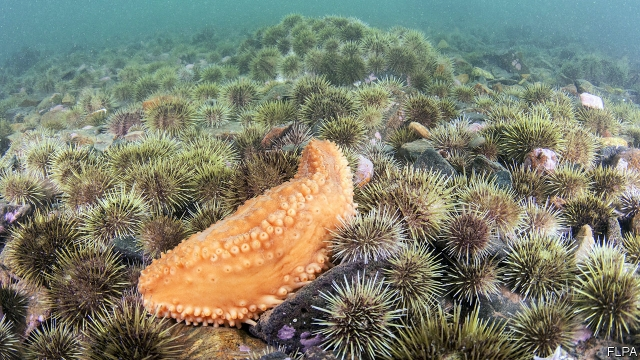

###### Marine biology

# The sea cucumber, an apparently sedentary creature, is anything but 

##### It puffs itself up with water and behaves like marine tumbleweed 

 

> Jan 24th 2019 

 

SEA CUCUMBERS, soft-bodied relatives of sea urchins and starfish, are a sought-after foodstuff. In China alone the market for their flesh is worth $3bn a year. Unfortunately for those who try to make a living catching them, their populations often seem to undergo a cycle of boom and bust. 

Annie Mercier of the Memorial University of Newfoundland, in Canada, was curious to know why this is. In particular, she wondered whether over-harvesting was to blame, or if the animals were simply migrating away. As she reports in the Journal of Animal Ecology, they not only migrate, they do so by adopting a second vegetable-like guise—that of tumbleweeds. 

The idea of adult sea cucumbers migrating sounds at first implausible. The animals’ larvae do indeed range far and wide. But once those larvae have settled they metamorphose into squishy cylinders resembling their vegetable namesakes. These grow, in most species, to a length of between 10 and 30 centimetres. Adult sea cucumbers can, as do starfish and sea urchins, move around using suckerlike structures called tube feet. But they rarely travel any great distance. 

Dr Mercier and her colleagues studied two species. One, Cucumaria frondosa, lives wild off the coasts of Newfoundland and Nova Scotia. The other, Holothuria scabra, was being farmed in enclosures with an area of 15,000 square metres, located off the coast of Madagascar. 

To monitor the Canadian animals the team used ships equipped with tethered underwater cameras. These filmed at depths of between 220 and 300 metres in Nova Scotia, and 41-57 metres in Newfoundland, for 20 to 30 minutes at a time while the ships were slowly drifting over the surface. The Madagascan animals were easier to observe, given that even at high tide they were only 1½-2½ metres below the surface. In their case the researchers monitored them every 15 days over the course of a year and a half. 

Two of the Canadian observations, one at each site, hit pay dirt. Near Newfoundland, a camera captured hundreds of the creatures drifting past in mid-ocean, in a current that was moving at 30 metres a minute. Near Nova Scotia several dozen darted by at speeds averaging 55 metres a minute—fast enough to travel 80km in a day. Madagascar provided no direct evidence of this sort of movement. It did, however, indicate how it may start. The team found that during ebb tides when the moon was full (and the tide thus at its springiest) farmed individuals of Holothuria scabra sucked in water and became buoyant enough to roll outside the fenced enclosures. Since an ebbing spring tide is the moment the current is most likely to carry an object out to sea, this behaviour looked like some sort of escape strategy. 

These discoveries suggested that adult sea cucumbers, far from being sedentary, do indeed use ocean currents to move about. To find out more, Dr Mercier welcomed members of Cucumaria frondosa into her laboratory for testing. She speculated that exposing them to crowded conditions might lead them to engage in migratory behaviours. And so it proved. 

Dr Mercier and her team put the animals into tanks at four population densities, varying from solitary confinement to 5, 10 or 15 a square metre. The higher the density the fewer the tube feet an animal kept in contact with its substrate—and the more easily it was carried away by any current. This reaction was even more extreme when other stresses, such as high turbidity or low salinity, were added. These encouraged the animals to detach their tube feet completely, open their cloacas to flood their bodies with water, and thereby transform themselves into buoyant rounded blobs, readily carried away by the slightest movement of the water. 

In light of all this Dr Mercier suggests the boom-and-bust nature of sea-cucumber fisheries, though not caused by actual overfishing, might nevertheless be a migratory response to disturbance created by trawling. If this proves to be so, then those seeking to make a living selling sea cucumbers may wish to find gentler ways of harvesting them. 

-- 

 单词注释:

1.apparently[ә'pærәntli]:adv. 表面上, 清楚地, 显然地 

2.sedentary['sedәntәri]:a. 久坐的, 坐惯的, 定栖的 [医] 静坐的; 坐式的 

3.tumbleweed['tʌmblwi:d]:n. 风滚草 

4.Jan[dʒæn]:n. 一月 

5.urchin['ә:tʃin]:n. 淘气鬼, 顽童 

6.starfish['stɑ:fiʃ]:n. 海星 

7.foodstuff['fu:dstæf]:n. 食品, 粮食 

8.bust[bʌst]:n. 半身像, 胸部, 失败, 殴打 vt. 使爆裂, 使破产 vi. 爆裂, 破产 [计] 操作错 

9.annie['æni]:n. 安妮（女子名） 

10.mercier[]:n. 梅西埃（男子名） 

11.Newfoundland[,nju:fәnd'lænd]:n. 纽芬兰 

12.migrate['maigreit]:vi. 移动, 移往, 随季节而移居 [计] 迁移程序 

13.implausible[im'plɒ:zәbl]:a. 难以置信的, 不象真实的 

14.larva['lɑ:vә]:n. 幼虫 [医] 幼虫(昆虫), 蚴(蠕虫) 

15.metamorphose[.metә'mɒ:fәuz]:vt. 使变形, 使变态, 使变质 vi. 变形, 变质 

16.squishy['skwiʃi]:a. 湿软的, 粘糊糊的 

17.cylinder['silindә]:n. 圆筒, 圆筒状物, 汽缸, 柱面 [计] 柱面 

18.namesake['neimseik]:n. 同名人, 同名物 

19.specie['spi:ʃi]:n. 硬币 [经] 硬币 

20.suckerlike[]:un. 吸盘状 

21.frondosa[]:[网络] 大狼把草；叶银耳；洋玉叶金花 

22.nova['nәuvә]:n. 新星 [计] 诺瓦计算机 

23.scotia['skәuʃә]:n. 凹形边饰 

24.Holothuria[]:海参属 

25.scabra[]:[网络] 紫花窃衣；糙海参；粗纹玉黍螺 

26.enclosure[in'klәuʒә]:n. 附件, 围墙, 围绕 [化] 机壳; 外壳 

27.Madagascar[mædә'^æskә]:n. 马达加斯加岛 

28.tether['teðә]:n. 系绳, 系链, 界限, 范围 vt. 栓, 束缚, 限制 

29.underwater['ʌndә'wɒ:tә]:a. 在水中的 adv. 在水下 

30.madagascan[ˌmædə'ɡæskən]:a. 马达加斯加的 

31.dart[dɑ:t]:n. 飞镖, 投射 vt. 投射 vi. 疾走, 突进 

32.ebb[eb]:n. 退潮, 衰退 vi. 潮退, 衰退 

33.springy['spriŋi]:a. 有弹力的, 轻快的, 多泉水的 

34.buoyant['bɒiәnt]:a. 有浮力的, 心情愉快的 [经] 降而复升的, 保持高价的, 遂之而升的 

35.eb[eb]:abbr. 电子束（Electron Beam） 

36.speculate['spekjuleit]:vi. 深思, 推测, 投机 [经] 投机 

37.migratory['maigrәtәri]:a. 迁移的, 流浪的 

38.solitary['sɒlitәri]:n. 独居者 a. 孤独的, 独居的 

39.confinement[kәn'fainmәnt]:n. 限制, 被禁闭, 分娩 [医] 分娩, 生产 

40.turbidity[tә:'biditi]:n. 浑浊, 混乱 [化] 浊度 

41.salinity[sә'liniti]:n. 盐性, 盐度 [化] 盐度 

42.detach[di'tætʃ]:vt. 使分离, 分遣 [机] 摘下, 分离, 卸下 

43.cloaca[klәu'eikә]:n. 泄殖腔, 阴沟 [医] 泄殖腔, 一穴肛; 骨瘘 

44.blob[blɒb]:n. 一滴, 小斑点 vt. 溅污 

45.fishery['fiʃәri]:n. 渔业 [法] 捕鱼, 捕鱼权 

46.overfish['әuvәfiʃ]:vt. 对(鱼)进行过度捕捞 

47.disturbance[dis'tә:bәns]:n. 扰乱, 不安, 忧虑 [化] 扰动; 干扰; 失调 

48.trawl[trɒ:l]:n. 拖网 v. 用拖网捕鱼 

49.gentl[]:[网络] 旧非；情奴；西格 

