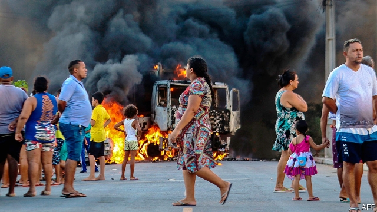
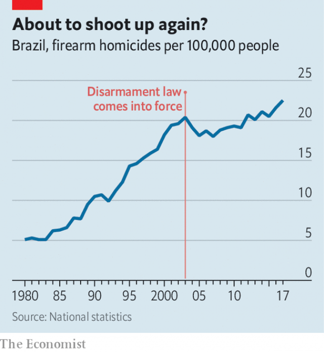

###### Fighting fire with firearms

# Jair Bolsonaro wants Brazilians to have more guns 

##### More young people will die 

 

> Jan 24th 2019 

 

THE COMMUNITY centre on the outskirts of Fortaleza, the capital of the north-eastern state of Ceará, normally hosts throngs of teenagers, who paint and rehearse plays in its tiny theatre. It has been shut on the orders of drug traffickers, who since early January have been setting fire to buses and businesses to protest against new measures to suppress gangs in prisons. Brazilian teenagers are caught in the middle. Gangs pay them 1,000 reais ($265) to carry out attacks. Police have arrested hundreds of suspects, a third of them minors, and killed at least six people. “You can’t be neutral in the war,” says Carlos (not his real name), 18, his voice breaking with emotion. “If you’re sitting on the fence, you get shot by both sides.” 

Even in calmer times, violence hits young people hard. Murder is the leading cause of death for Brazilian teenagers. In Ceará killings of adolescents increased from 191 in 2000 to 1,156 in 2017. By one reckoning in Fortaleza in 2014, 11 out of every 1,000 adolescents could expect to be murdered by the age of 19. 

The new populist president, Jair Bolsonaro, says Brazil is at war. During the election campaign last year, he promised to give police carte blanche to shoot suspected criminals and to pass laws to send adolescents to adult prisons, which are already packed. He has spoken of building more jails, but probably lacks the money. 

On January 15th he signed a decree that makes it easier for “good citizens” to buy guns. It ends the discretionary role of the police in granting licences. People will be able to buy guns freely if they meet conditions such as living in a place where the homicide rate exceeds ten per 100,000 people (most Brazilians do). As before, gun owners must have a job and no criminal record. They have to pass a psychological test and get training. It will remain illegal for most Brazilians to carry arms outside their homes or workplaces. 

Evaldo Carvalho, who owns a gun shop four blocks from the beach in Fortaleza, thinks Mr Bolsonaro’s decree is “timid” but a step in the right direction. In his view, crime rose as a result of a gun-control law in 2003. “Criminals are more audacious when they know citizens can’t defend themselves,” he says. “More guns equal less crime. Criminals only respect people they are afraid of.” He stands to profit, too, having doubled the number of shooting classes in the week after the president’s decree. 

Yet some of Mr Bolsonaro’s supporters are worried. Violence is “going to explode”, warns Plauto de Lima, a former director of state prisons in Ceará, who managed the successful election campaign of a pro-Bolsonaro senator. He thinks the state should invest more in crime prevention. “We always prepare for battle, but not for the post-war,” he says. 

In fact, criminologists and politicians in Ceará have been considering new ways of reducing violence through a mixture of social programmes and data-based policing that proved successful elsewhere. But such ideas are out of sync with Mr Bolsonaro’s belief in the iron fist. 

The causes of violence in the north-east are complex. The region has a history of settling disputes with pistols or machetes, notes César Barreira, an expert in violence at the Federal University of Ceará. The area lies on the route from drug-producing countries like Colombia to markets in Europe. Many young men migrated from rural areas to cities in recent decades just as that trade expanded. The breakdown in 2016 of a two-decade-old pact between two crime groups, the First Command of the Capital, based in São Paulo, and Red Command, from Rio de Janeiro, led to a fight for control of the slums in Ceará. 

The state’s centre-left governments assumed, wrongly, that simply reducing poverty and improving education would lead to less crime. The Workers’ Party, which governed Brazil from 2003 to 2016, made the same assumption. “Public security was the great omission,” says Renato Roseno, a state congressman from the left-wing Socialism and Liberty party. 

Then, as governments came under pressure to respond directly to rising crime, they did so ineptly. Brazil’s prison population has quadrupled to 800,000 since 2000. Prisons, designed to hold half that number, have become training grounds for gangs; the mayhem in Ceará is being directed by bosses in jail. 

In 2015 Mr Roseno set up a committee that interviewed 263 families whose children were murdered and 121 adolescents who were accused of homicide. It found that more than 60% of victims had dropped out of school. Almost all were slain with guns. Most said they had experienced police violence at least once. Killings of adolescents were geographically concentrated: 44% occurred in 17 of Fortaleza’s 119 neighbourhoods. 

His committee recommended action to usher dropouts back into school, tighter gun controls and human-rights training for police. This, together with data-based policing in high-crime areas, might have set an example for other states and for federal policy, Mr Roseno reckons. 

Under Mr Bolsonaro, though, Ceará will have more guns, not fewer. Even before his decree, the police could not keep track of the country’s arsenal of legal firearms, points out José Vicente da Silva Filho, who was Brazil’s secretary of public security in 2002. Guns have been easy to obtain. Criminals in Fortaleza used to rent them by the hour. Rental services no longer exist because guns can be bought cheaply and easily, even at street markets. 

 

The vast majority of guns used in crime were sold legally to citizens or police, and then lost or stolen. “The gun bought by the good citizen and the gun used by the criminal are the same gun,” notes Ivan Marques, the director of Instituto Sou da Paz, an NGO. That does not mean that the gun-control law was pointless. Without it, Brazil’s murder rate would have risen much more rapidly than it did, according to a study by the Institute for Applied Economic Research, a government think-tank (see chart). 

At the community centre in Fortaleza, Carlos scoffs at the idea that criminals will be deterred by a more heavily armed population. Instead, criminals will attack citizens to steal their guns. “The criminal might die, but the good citizen will die as well. A lot of people are going to die,” he predicts. Carlos is anxious. He and three community activists discuss how he might stay alive. He could attend university in a different city. Or he could join the army. Otherwise, he will have to return to the drug gang to which he briefly belonged. Friends in the same homicide-prevention programme have been murdered one by one, mostly by gangs trying to muscle in on his neighbourhood. “We were ten,” he says, “and now we are three.” 

-- 

 单词注释:

1.firearm['faiә'ɑ:m]:n. 火器, 枪炮 

2.jair[]:[网络] 睚珥；贾伊尔；睢珥 

3.Brazilian[brә'ziljәn]:n. 巴西人 a. 巴西的, 巴西人的 

4.Jan[dʒæn]:n. 一月 

5.Fortaleza[,fɔ:tә'leizә]:福塔雷萨[巴西东北部港市] 

6.Ceará[]:[地名] *塞阿拉(福塔莱萨的旧称) ( 巴西 ) 

7.rehearse[ri'hә:s]:vt. 预演, 排演, 使熟练掌握, 练习, 复述 vi. 排练, 练习, 演习 

8.trafficker['træfikә]:n. 商人, 贩子 [法] 贩卖者, 买卖者, 商人 

9.suppress[sә'pres]:vt. 镇压, 使止住, 禁止, 抑制, 查禁 [法] 镇压, 平定, 禁止出版 

10.Brazilian[brә'ziljәn]:n. 巴西人 a. 巴西的, 巴西人的 

11.reais[]:[网络] 雷亚尔；黑奥；雷阿尔 

12.carlo[]:n. 卡洛（男子名） 

13.killing['kiliŋ]:n. 谋杀, 杀戮 a. 杀害的, 疲惫的, 迷人的 

14.reckon['rekәn]:vt. 计算, 总计, 估计, 认为, 猜想 vi. 数, 计算, 估计, 依赖, 料想 

15.Populist['pɔpjulist]:n. 民粹派的成员 

16.Brazil[brә'zil]:n. 巴西 

17.carte[kɑ:t]:n. (附有价目的)菜单 

18.blanche[blɑ:ntʃ]:n. 布兰奇（女子名） 

19.decree[di'kri:]:n. 法令, 判决, 天意 vt. 颁布, 判决 vi. 发布命令 

20.discretionary[dis'kreʃәnәri]:[计] 选择的 

21.homicide['hɒmisaid]:n. 杀人, 杀人者 [医] 杀人, 杀人者 

22.carvalho[]:n. (Carvalho)人名；(葡)卡瓦略 

23.audacious[ɒ:'deiʃәs]:a. 大胆的, 鲁莽的, 胆大妄为的 

24.les[lei]:abbr. 发射脱离系统（Launch Escape System） 

25.supporter[sә'pɒ:tә]:n. 支持者, 后盾, 迫随者, 护身织物 [法] 支持者, 赡养者, 抚养者 

26.de[di:]:[化] 非对映体过量 [医] 铥(69号元素铥的别名,1916年Eder离得的假想元素) 

27.lima['li:mә]:n. 利马（秘鲁首都） 

28.senator['senәtә]:n. 参议员, (某些大学的)理事 [法] 参议员, 上议员 

29.prevention[pri'venʃәn]:n. 阻止, 妨碍, 预防 [医] 预防 

30.alway['ɔ:lwei]:adv. 永远；总是（等于always） 

31.criminologist[.krimi'nɒlәdʒist]:n. 犯罪学学者 [法] 刑事学家, 犯罪学家 

32.sync[siŋk]:[计] 同步的 

33.machete[mә'tʃeiti]:n. 大砍刀 [化] 马歇特; 丁草胺 

34.César[]:[地名] 塞萨尔 ( 葡 ) 

35.Colombia[kә'læmbiә]:n. 哥伦比亚 

36.migrate['maigreit]:vi. 移动, 移往, 随季节而移居 [计] 迁移程序 

37.breakdown['breikdaun]:n. 崩溃, 故障 [化] 事故; 击穿 

38.pact[pækt]:n. 契约, 协定, 条约 [化] 合同 

39.paulo[]:n. 保罗（男子名） 

40.rio[]:n. 里约（巴西共和国的旧首都） 

41.Janeiro[]:n. （葡）一月 

42.wrongly[]:adv. 错误地, 不恰当地, 不正确地, 不正直地, 不公正地 

43.omission[әu'miʃәn]:n. 省略, 遗漏, 疏忽 [化] 省略 

44.Renato[]:n. 雷纳托（人名） 

45.congressman['kɒŋgresmәn]:n. 国会议员, 众议院议员 [法] 国会议会 

46.ineptly[]:adv. 不适当, 不符合要求, 不恰当, 不合场面, 笨拙, 愚蠢, 无能, 不称职 

47.quadruple['kwɒdrupl]:a. 四倍的, 四重的, 四部分组成的 n. 四倍 vt. 使成四倍 vi. 成为四倍 

48.mayhem['meihem]:n. 蓄意的破坏, 故意的伤害罪 [医] 伤残, 残废 

49.slay[slei]:v. 杀害, 残杀 

50.geographically[]:[计] 自通地 

51.usher['ʌʃә]:n. 引座员, 招待员 vt. 引导, 招待 vi. 作招待员 

52.dropout['drɒpaut]:n. 退学学生, 中途退学 [电] 离去 

53.arsenal['ɑ:snәl]:n. 兵工厂, 军械库 [机] 兵工厂 

54.Vicente[]:n. 韦森特（男子名） 

55.DA[,di:'ei]:美国地方检察官 [计] 数据采集, 数据管理员, 数据分析, 设计自动化 

56.silva['silvә]:n. 森林, 森林志 

57.filho[]:[网络] 菲尔霍；菲力欧；仙奴 

58.rental['rentl]:n. 租费, 租金收入 a. 租赁的, 收取租金的 

59.cheaply['tʃipli]:adv. 便宜地 

60.legally['li:gәli]:adv. 法律上, 合法地 [法] 法律上, 合法地, 法定地 

61.ivan['aivәn]:n. 伊凡（男子名） 

62.marque[mɑ:k]:n. 商品型号 [法] 商品的型号或样式, 报复性的捕夺 

63.instituto[]:[网络] 联合队；图片 

64.sou[su:]:n. 苏（昔日法国之一种铜币）；无价值之物 

65.paz[]:abbr. polyazine 聚吖嗪 

66.ngo[]:abbr. 民间组织；非政府组织（Non-Governmental Organization） 

67.pointless['pɒintlis]:a. 不尖的, 钝的, 不得要领的 

68.scoff[skɒf]:n. 嘲笑, 愚弄, 笑柄, 食品 v. 嘲笑, 嘲弄, 贪吃, 狼吞虎咽地吃 

69.deter[di'tә:]:vt. 制止, 吓住, 威慑 

70.activist['æktivist]:n. 激进主义分子 

71.briefly['brifli]:adv. 简短地, 扼要地, 简明地, 简单地 

