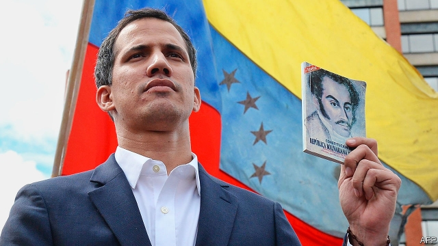

###### One republic, two presidents

# Juan Guaidó wins diplomatic recognition as Venezuela’s president 

##### But Nicolás Maduro still controls the army 

 

> Jan 26th 2019 

 

THE CROWD urged him on. “Swear in! Swear in!” they chanted. And then he did. Juan Guaidó, the gangly 35-year-old politician—unknown to most Venezuelans a month ago—raised his right hand and declared himself acting president of the republic. Tens of thousands of people, gathered in Caracas on January 23rd as part of a national demonstration against the disastrous regime of Nicolás Maduro, now deemed a usurper, let out a raucous cheer. 

By the end of the afternoon, the man Mr Maduro and his cronies have tried to dismiss as a “little boy” had been recognised internationally as the legitimate leader of a country with some of the world’s largest oil reserves. President Donald Trump was the first to endorse him; Canada and all the major economies in South America followed. 

Mr Guaidó’s rise to prominence has been spectacular. On January 5th he was chosen as head of Venezuela’s national assembly as part of a power-sharing agreement between the main opposition parties. He seemed almost the accidental president, selected largely owing to the lack of other options. Of the two more obvious candidates in his party, Voluntad Popular, one is under house arrest and the other has taken refuge in the Chilean embassy. The assembly has been defunct since 2016. After the opposition won a majority in the chamber in the previous year Mr Maduro neutered it, replacing it with a pseudo-parliament that obeys his orders. 

But Mr Guaidó has skilfully used his position as a newcomer with apparently few enemies to suspend the internecine disputes within the opposition and revitalise the hopes of all those who want to see the end of Mr Maduro’s rule. His emergence comes at a time when Venezuela’s neighbours, including the United States, are urgently looking for a solution to the country’s crisis. Mr Maduro’s incompetence has pauperised Venezuelans, forcing around a tenth of the population to emigrate. Last year, he held rigged elections and awarded himself a further six-year term, which began on January 10th. The Venezuelan constitution says that, if the president’s job is vacant, as the opposition claims, then the national assembly’s head should take over. 

From a middle-class family in the coastal state of Vargas, Mr Guaidó, a former engineering student, has none of the elitist airs of the elder generation of opposition leaders. He and his family lost their home in a catastrophic mudslide in 1999, which killed tens of thousands. That experience, and the mishandling of the aftermath by the government of Hugo Chávez, Mr Maduro’s mentor, led him into politics. He joined Voluntad Popular when it was founded in 2009 by Leopoldo López (who remains the party’s leader, but is under house arrest). He has focused on tracing the billions stolen under both the Maduro and Chávez administrations. 

Mr Guaidó repeatedly demurred from declaring himself president, saying he needed the support of both the people and the armed forces. The growing protests are evidence that he has the backing of the vast majority of Venezuelans, even those from poor neighbourhoods of Caracas, where hunger and anger have overcome the fear of the regime. But Mr Guaidó cannot yet claim to have the support of the army. There have been minor military revolts, most recently on January 21st, when 27 national guardsmen stole weapons and declared themselves in rebellion before being arrested. Military leaders, who control key areas of the economy from oil to mining to food distribution, remain outwardly loyal to Mr Maduro. Mr Guaidó is offering amnesties to those who defect. Until that happens, though, Venezuela will have two presidents: one with the legitimacy, and the other with the guns. 

See also: How to hasten the demise of Venezuela’s dictatorship (January 24th 2019) 

-- 

 单词注释:

1.juan[hwɑ:n]:n. 胡安（男子名） 

2.diplomatic[.diplә'mætik]:a. 外交的, 老练的 [法] 外交的, 外交上的, 文献上的 

3.maduro[mә'duәrәu]:a. 色深味浓的烟草做的, (雪茄)色深味浓的 

4.Jan[dʒæn]:n. 一月 

5.gangly['^ŋ^li]:a. 身材瘦长的 

6.venezuelan[,venә'zweilәŋ]:a. 委内瑞拉的；委内瑞拉人的 

7.tens[]:十位 

8.caracas[kә'rækәs]:n. 加拉加斯（委内瑞拉首都） 

9.demonstration[.demәn'streiʃәn]:n. 示范, 实证 [医] 示教, 实物教授 

10.disastrous[di'zɑ:strәs]:a. 损失惨重的, 悲伤的 

11.regime[rei'ʒi:m]:n. 政权, 当权期间, 政体, 社会制度, 体制, 情态 [医] 制度, 生活制度 

12.deem[di:m]:v. 认为, 相信 

13.usurper[ju:'zә:pә]:n. 篡夺者, 夺取者 [法] 篡位者, 篡夺权者 

14.raucous['rɒ:kәs]:a. 沙哑的, 粗声的, 喧闹的 

15.crony['krәuni]:n. 密友, 亲密伙伴, 好朋友 

16.internationally[.intә'næʃәnәli]:adv. 国际性地, 在国际间 

17.legitimate[li'dʒitimәt]:a. 合法的, 正当的, 婚生的 vt. 认为正当, 立为嫡嗣, 使合法 

18.donald['dɔnәld]:n. 唐纳德（男子名） 

19.trump[trʌmp]:n. 王牌, 法宝, 喇叭 vt. 打出王牌赢, 胜过 vi. 出王牌, 吹喇叭 

20.endorse[in'dɒ:s]:vt. 支持, 赞同, 背书于, 签署 [经] 赞成, 背书 

21.prominence['prɒminәns]:n. 突起, 突出, 显著, 突出物, 凸出 [医] 隆凸, 凸 

22.spectacular[spek'tækjulә]:a. 公开展示的, 惊人的, 壮观的 n. 奇观, 惊人之举, 展览物 

23.opposition[.ɒpә'ziʃәn]:n. 反对, 敌对, 相反, 在野党 [医] 对生, 对向, 反抗, 反对症 

24.voluntad[]:[网络] 自愿 

25.Chilean['tʃiliәn]:n. 智利人, 智利讲的西班牙语 a. 智利文化的, 智利人的, 智利的 

26.defunct[di'fʌŋkt]:a. 死的, 不能使用的 n. 死者 

27.neuter['nju:tә]:a. 中性的, 不及物的, 生殖器不完全的 n. 中性词, 无性动物, 阉割动物 

28.skilfully[]:adv. 熟练地（等于skillfully） 

29.newcomer[nju:'kʌmә]:n. 新来者 

30.apparently[ә'pærәntli]:adv. 表面上, 清楚地, 显然地 

31.internecine[.intә'ni:sain]:a. 互相残杀的, 两败俱伤的, 致命的 [法] 互相残杀的, 两败俱伤的, 杀人的 

32.revitalise[]:vt. 使有新的活力, 使新生, 使恢复元气 

33.emergence[i'mә:dʒәns]:n. 出现, 浮现, 发生 

34.urgently[]:adv. 急切地；迫切地；紧急地 

35.incompetence[in'kɔmpitәns]:n. 不胜任, 不够格, 不合格, 不适合, 无能力, 不熟练, 无资格 [医] 机能不全, 闭锁不全, 关闭不全 

36.pauperised[]:[网络] 穷人；贫民 

37.emigrate['emigreit]:v. (使)移居, (使)移民 

38.rig[rig]:n. 装备, 帆装 vt. 装配, 装扮, 给船装帆, 垄断, 操纵 

39.venezuelan[,venә'zweilәŋ]:a. 委内瑞拉的；委内瑞拉人的 

40.coastal['kәustәl]:a. 海岸的, 沿海的, 沿岸的 [法] 海岸的, 沿海的 

41.VARGAS[]:瓦尔加斯, 瓦格斯（人名） 巴尔加斯（地名, 在阿根廷、巴拿马、玻利维亚、古巴、洪都拉斯） 

42.elitist[ei'litist]:n. 优秀人材, 杰出人材 a. 优秀人材的, 杰出人材的 

43.catastrophic[.kætә'strɒfik]:a. 悲惨的, 灾难的 

44.mudslide['mʌdslaid]:[地](沿缓坡而下的)徐缓黏滞泥流, 泥流 

45.tens[]:十位 

46.mishandle[mis'hændl]:vt. 虐待, 胡乱处理 

47.aftermath['ɑ:ftәmæθ]:n. 结果, 后果 [法] 后果, 结果 

48.hugo['hju:^әu]:n. 雨果（男子名, 等于Hugh） 

49.mentor['mentɔ:]:n. 指导者, 良师益友 

50.politic['pɒlitik]:a. 精明的, 明智的, 策略的 

51.leopoldo[]:n. (Leopoldo)人名；(西、意、葡)莱奥波尔多 

52.López[]:[地名] 洛佩斯 ( 阿根、厄 ) 

53.demur[di'mә:]:vi. 提出异议, 反对, 抗辩 n. 异议, 反对 

54.cannot['kænɒt]:aux. 无法, 不能 

55.guardsman['gɑ:dzmәn]:n. 卫兵, (英)近卫兵, (美)国民警卫队士兵 

56.outwardly['ajtwәdli]:adv. 表面上, 在外, 外表上 

57.amnesty['æmnisti]:n. 大赦, 赦免 

58.Venezuela[,vene'zweilә]:n. 委内瑞拉 

59.legitimacy[li'dʒitimәsi]:n. 合法, 正统, 正当 [法] 合法性, 正统性, 婚生 

60.demise[di'maiz]:n. 崩, 薨, 死亡 vt. 让渡, 遗赠, 转让 

