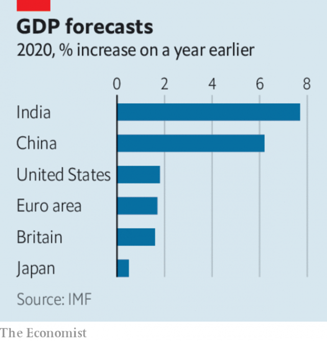

###### The neighbours say enough

# Business this week 

> Jan 24th 2019 

The French finance minister said that Carlos Ghosn had resigned as chief executive and chairman of Renault, a day before the carmaker’s board was due to meet to discuss replacing him. The French government owns a stake in Renault and had pressed it to remove Mr Ghosn following alleged financial wrongdoing at Nissan, Renault’s global partner. Mr Ghosn was sacked as Nissan’s chairman when the scandal broke last November. He has again been denied bail in Tokyo and remains in custody. He denies wrongdoing. 

Net profit at Ford fell by half last year, to $3.7bn, and it reported a fourth-quarter loss, as it continued to perform poorly in regions outside North America. The carmaker said it was facing many difficulties, including the absorption of tariff-related costs. It promised weary investors that it would soon give details of its crucial restructuring. 

Tesla’s share price took a hammering after Elon Musk said he would have to cut full-time jobs by 7%. The electric-car maker’s workforce grew by 30% last year, which its boss conceded was “more than we can support”. Production of the Model 3 has ramped up, but Mr Musk wants to offer the mass-market sedan to customers at $35,000; the cheapest versions start at around $44,000. 

The French data-protection office fined Google €50m ($57m) for the cursory manner in which it gained users’ consent. It was the first penalty levied against a big tech firm for breaching the European Union’s General Data Protection Regulation, which asserts that firms must be explicit when seeking such consent. Complaints had been lodged by data-privacy groups, including Vienna-based None of Your Business. See article. 

The EU’s antitrust commissioner fined MasterCard €571m ($650m) for obstructing merchants’ access to cross-border card-payment services. The credit-card network co-operated with the investigation and says it stopped the practice years ago. 

 

The IMF warned that “the global expansion is weakening and at a rate that is somewhat faster than expected”. The fund revised down its forecasts, particularly for advanced economies. The world’s economy is forecast to grow by 3.6% in 2020. Although that is stronger than in some previous years, the IMF thinks “the risks to more significant downward corrections are rising”, in part because of tensions over trade and uncertainty about Brexit. See article. 

The IMF also cautioned that the slowdown in China could be deeper than expected, especially if the trade spat with America is unresolved. Its economy grew by 6.6% last year, the slowest annual pace since 1990, when sanctions were imposed following the Tiananmen Square massacre. See article. 

House sales in America (excluding newly built homes) fell by 10% in December compared with the same month in 2017, according to the National Association of Realtors. The median price of a home grew by just 2.9%, to $253,600. 

It emerged that two activist hedge-funds have built stakes in eBay and are pushing the e-commerce company to spin off StubHub, its website for selling tickets, and its classified-ads division. EBay’s share price fell by a third last year from a peak in early February, as it struggled to compete with Amazon. 

UBS said clients pulled a net $7.9bn from its wealth-management business in the last three months of 2018 amid a market sell-off. The Swiss bank’s pre-tax profit rose by 2% year on year, to $862m. 

The trial began in London of John Varley, the chief executive of Barclays from 2004 to 2011, and three other former executives for alleged fraud in a deal with Qatari investors to prop up the bank in 2008. The four men deny the charges. The case, brought by the Serious Fraud Office, is expected to take up to six months in court. It is the first criminal trial of anyone who headed a big global bank during the financial crisis. 

Dyson, a British manufacturer founded by Sir James Dyson, a prominent Brexiteer, announced that it is to move its headquarters to Singapore. The official reason was to “future-proof” the company. But the timing, and the fact that in October Singapore signed a free-trade deal with the EU, drew derision from Remain supporters and dismay from hard-Brexiteers. 

Netflix received its first Oscar nomination for best picture. “Roma”, the tale of a maid in Mexico City, gathered ten nominations in all (“Icarus”, another Netflix film, won best documentary feature last year). The streaming service gained an extra 8.8m paying subscribers in the fourth quarter of 2018, 7.3m of them outside the United States. They are attracted by its original content. “Bird Box”, a horror thriller, was watched by 80m households in its first four weeks on Netflix. 

-- 

 单词注释:

1.Jan[dʒæn]:n. 一月 

2.carlo[]:n. 卡洛（男子名） 

3.ghosn[]:[网络] 戈森 

4.renault[rә'nәu]:n. 法国雷诺公司；雷诺（姓氏） 

5.allege[ә'ledʒ]:vt. 宣称, 主张, 提出, 断言 [法] 断言, 指称, 指证 

6.wrongdoing['rɒŋ'du:iŋ]:n. 干坏事, 坏事 

7.nissan[]:n. 尼桑（日产汽车名） 

8.bail[beil]:n. 保释, 拎环, 杓, 栅栏 vt. 保释, 舀水 

9.custody['kʌstәdi]:n. 监护, 拘留, 监禁 [经] 保管, 照顾, 保护 

10.ford[fɒ:d]:n. 浅滩, 福特汽车 v. 涉过, 涉水 

11.poorly['puәli]:adv. 贫穷地, 不充分地, 贫乏地 a. 身体不舒服的 

12.carmaker['kɑ:,meikә(r)]:n. 汽车制造商 

13.absorption[әb'sɒ:pʃәn]:n. 吸收, 专心, 全神贯注 [化] 吸收; 吸收作用 

14.investor[in'vestә]:n. 投资者 [经] 投资者 

15.restructuring[]:[计] 重构的 

16.elon[i'lɔn]:n. 埃伦（可溶性显影剂粉末） 

17.musk[mʌsk]:n. 麝香, 麝香的气味 [化] 麝香 

18.concede[kәn'si:d]:vt. 承认, 退让 vi. 让步 

19.ramp[ræmp]:n. 斜坡, 坡道, 敲诈 vi. 狂跳乱撞, 乱冲, 敲诈, 蔓延 vt. 使有斜面, 敲诈 

20.sedan[si'dæn]:n. 轿车, 轿子 

21.google[]:谷歌；搜索引擎技术；谷歌公司 

22.cursory['kә:sәri]:a. 匆匆忙忙的, 草率的, 粗略的 

23.penalty['penәlti]:n. 处罚, 刑罚, 罚款, 罚球, 报应, 不利结果, 妨碍 [经] 罚金(款), 违约金 

24.levy['levi]:n. 税款, 所征的人数, 征收 vi. 征税, 课税 vt. 征收, 强求, 召集 

25.tech[tek]:n. 技术学院或学校 

26.breach[bri:tʃ]:n. 裂口, 违背, 破坏, 违反, 突破, 破裂 vt. 攻破, 突破 vi. 跳出水面 

27.datum['deitәm]:n. 论据, 材料, 资料, 已知数 [医] 材料, 资料, 论据 

28.assert[ә'sә:t]:vt. 主张, 坚称, 断言 [法] 宣称, 断言, 维护 

29.antitrust[.ænti'trʌst]:a. 反托拉斯的 [法] 反托拉斯的 

30.commissioner[kә'miʃәnә]:n. 委员, 理事, 行政长官 [法] 委员, 政府的特派员, 地方地官 

31.mastercard['mɑ:stə,kɑ:d]:n. 万事达信用卡 

32.obstruct[әb'strʌkt]:vt. 阻隔, 妨碍, 阻塞, 遮没 vi. 设障碍 

33.IMF[]:国际货币基金组织 [经] 国际货币基金 

34.uncertainty[.ʌn'sә:tnti]:n. 不确定, 不可靠, 不确定的事物 [化] 不确定度 

35.slowdown['slәudaun]:n. 降低速度, 减速 

36.unresolved['ʌnri'zɔlvd]:a. 无决断力的, 不果断的, 无决心的, 未解决的, 未澄清的, 未议决的, 未分解的 [计] 非分辩的 

37.sanction['sæŋkʃәn]:n. 核准, 制裁, 处罚, 约束力 vt. 制定制裁规则, 认可, 核准, 同意 

38.Tiananmen[]:n. 天安门 

39.realtor['riәltә]:n. 房地产经纪人 [法] 房地产经纪人 

40.median['mi:diәn]:a. 中央的, 中间的, 正中的 n. 正中动脉, 中位数, 中线 

41.activist['æktivist]:n. 激进主义分子 

42.ebay[]:电子港湾；易趣（知名网上购物网站） 

43.stubhub[]:[网络] 史大博；机票代理商在线票务；演出票转售商 

44.amazon['æmәzɒn]:n. 亚马孙河 [医] 无乳腺者 

45.UB[]:[计] 上限 

46.client['klaiәnt]:n. 客户, 顾客, 委托人 [计] 客户, 客户机, 客户机程序 

47.amid[ә'mid]:prep. 在其间, 在其中 [经] 在...中 

48.john[dʒɔn]:n. 盥洗室, 厕所, 嫖客 

49.Varley['vɑ:li]:loop[电]华莱回路(一种用电桥比较电阻和测定故障位置的装置) 

50.barclay['bɑ:kli]:n. 巴克利（姓氏, 男子名） 

51.fraud[frɒ:d]:n. 欺骗, 欺诈, 诡计, 骗子 [经] 欺诈, 舞弊, 骗子 

52.Qatari['kɑ:təri]:n. 卡塔尔人 a. 卡塔尔的 

53.prop[prɒp]:n. 支柱, 支持者, 倚靠人, 道具, 螺旋桨 vt. 支撑, 维持 

54.fraud[frɒ:d]:n. 欺骗, 欺诈, 诡计, 骗子 [经] 欺诈, 舞弊, 骗子 

55.Dyson[]:戴森（人名） 

56.jame[]: 灰岩井 

57.Brexiteer[]: 

58.headquarter[,hed'kwɔ:tә]:vt. 将...的总部设在 

59.Singapore[.siŋgә'pɒ:]:n. 新加坡 

60.timing['taimiŋ]:n. 时间选择, 时间测定, 定时, 调速 [计] 定时器时钟 

61.EU[]:[化] 富集铀; 浓缩铀 [医] 铕(63号元素) 

62.derision[di'riʒәn]:n. 嘲笑 

63.supporter[sә'pɒ:tә]:n. 支持者, 后盾, 迫随者, 护身织物 [法] 支持者, 赡养者, 抚养者 

64.dismay[dis'mei]:n. 沮丧 vt. 使惊愕, 使气馁 

65.netflix[]:n. 全球十大视频网站中唯一收费站点 

66.Oscar['ɔskә]:n. 奥斯卡金像奖, 钱, 现金 

67.nomination[.nɒmi'neiʃәn]:n. 提名, 任命, 提名权 

68.roma['rɔmә. 'rәu-]:n. 罗马, 罗马帝国 

69.icarus['aikәrәs]:n. [希神]伊卡洛斯（代达罗斯的儿子） 

70.documentary[.dɒkju'mentәri]:n. 记录片 a. 文件的 

71.subscriber[sʌbs'kraibә]:n. 签署者, 捐献者, 订户 [经] 定户 

