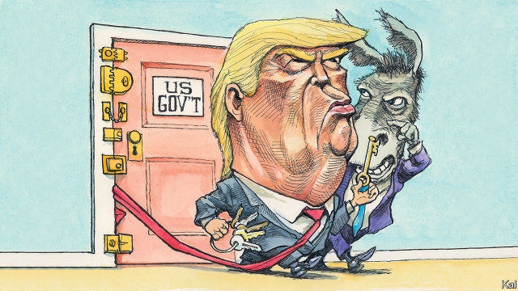

###### Lexington

# Donald Trump made a dreadful miscalculation over the shutdown 

##### He will suffer less for it than the Democrats think 

 

> Jan 24th 2019 

WHEN DONALD TRUMP shut down the government, just before Christmas, his opponents privately shuddered. Illegal immigration, the issue he had chosen to stand on, was his most powerful weapon. And, though bloodied in the mid-terms, he retained some of the imposing aura that his stunning election, loyal base and two years without serious political opposition conferred. Yet five weeks later, with daily reports of coast guards visiting food banks, IRS desertions, and FBI indictments postponed for want of cash, Democratic opinion has been dramatically revised. Mr Trump’s opponents think they have got him at last. A Democratic congressman told Lexington it was “unimaginable” that Mr Trump will be re-elected next year. 

A more dispassionate reading of the shutdown’s political fallout, as Senate negotiations point to a possible end, suggests that Mr Trump may suffer no worse than a bruising stalemate. That is not to underrate how badly he has handled the episode. Indeed, it has been a case-study in presidential incompetence. 

The sketchiest knowledge of recent shutdowns could have told Mr Trump that whoever instigates one rarely gets what he wants. Voters are liable to blame him, at which point his imagined leverage becomes a handicap. And this was especially likely to happen to Mr Trump, given that most Americans don’t want his promised border-wall and don’t need convincing that the Democrats—the party of government—are not keen to deprive 800,000 government workers of pay. Especially so, moreover, given that Mr Trump boasted that he would happily “take the mantle” of responsibility for the shutdown before it began. Even in the rundown factory-towns of Trump country, voters have been quoting his words back to reporters ever since. 

The shutdown was plainly a terrible idea. Mr Trump launched it, in response to goading from immigration hawks and with the prospect of a new Democratic House looming, at what he thought was his last moment of unrivalled power. Yet the incoming Democrats’ House majority had already reduced his bargaining room, including any chance of the deal that he turned down last year: billions for the wall in return for a pathway to citizenship for the 700,000 illegal immigrants known as “Dreamers”. Even if those or similar terms were on offer, moreover, Mr Trump seems too cowed by his right-wing critics to accept them. This leaves a more modest fix as a likelier conclusion to the stand-off—the Democrats offer a bit more money for border-security provided Mr Trump reopens the government first. 

That is embarrassing for Mr Trump. Even so, he has suffered less damage than his opponents think. His ratings, though down a few points, are well within the remarkably stable range they have maintained ever since his inauguration. With around 40% of voters approving of his performance, he is more popular than he was in December 2017, when he signed off on the tax cut that is his administration’s single main legislative achievement. 

The history of shutdown polling also suggests the knock to his ratings will be short-lived. No party blamed for a shutdown has paid a heavy electoral price for it. Political loyalties are too baked in; the federal government too remote from most people’s lives. After shutting down the government for 16 days in 2013, Republicans swept the mid-terms the next year. Moreover, the nature of Mr Trump’s appeal on immigration issues, which is based more on a sense of shared cultural anxiety with his voters than the promise of a concrete wall, makes them even less likely to desert him. As things stand, the Trump shutdown, already the longest and costliest of recent times, is more likely to entrench America’s political division than alter it. 

That might end up as a win for the Democrats. Mr Trump’s base, as the mid-terms indicated, is too small to keep him in power. And yet the nativist politics he feeds it with, including the wall, are off-putting to the more discerning conservatives he needs. Elected by a minority of Americans, and ever fearful of the handful of hard-right pundits who seem to speak for them, Mr Trump has in reality always been a weak president. Yet instead of celebrating prematurely, Democrats need to reflect more carefully on why the man who bested them in 2016 might be pursuing such an apparently self-defeating strategy. 

Compulsion, to be sure, is part of the answer. Mr Trump is facing a storm of investigations, as Special Counsel Robert Mueller approaches his end-game and House Democrats let fly their subpoenas. In response, he needs his conservative cheerleaders to be not sulkily willing to roll out the vote for him next year, but boiling over with protective fury. Yet Mr Trump’s willingness to forsake moderation is also fuelled by his confidence that the Democrats, recoiling against him to the hard-left, will do likewise. And that, Mr Trump trusts, will persuade voters who don’t much care for him to vote for him anyway. 

This is how the Trump team believes he won in 2016. It considers Hillary Clinton’s contemptuous reference to Trump voters as “deplorables” more helpful than anything the Russians did. It is an over-simplification at best, but one Democrats should be more mindful of than they are. Speaker Nancy Pelosi’s sanctimonious reference to Mr Trump’s border-wall as an “immorality” sounded too much like Mrs Clinton. And meanwhile the left-wing positions adopted by most early runners for the Democratic presidential ticket, including free college and Medicare for all, offers additional encouragement for Mr Trump’s calculation. 

As the ultimate manifestation of America’s political dysfunction, shutdowns represent a lack of mutual comprehension as well as goals. The Democrats are right to marvel at how the current one reveals Mr Trump’s ignorance of their new strength. But they should be careful. Mutual incomprehension cuts both ways. 

-- 

 单词注释:

1.lexington['leksiŋtәn]:n. 列克星敦市（位于美国肯塔基州） 

2.donald['dɔnәld]:n. 唐纳德（男子名） 

3.trump[trʌmp]:n. 王牌, 法宝, 喇叭 vt. 打出王牌赢, 胜过 vi. 出王牌, 吹喇叭 

4.dreadful['dredful]:a. 可怕的 

5.miscalculation[]:n. 算错, 失算, 估计错误 [计] 计算错误, 算错 

6.shutdown['ʃʌtdaun]:n. 关门, 停工, 停机 [经] 停工 

7.les[lei]:abbr. 发射脱离系统（Launch Escape System） 

8.democrat['demәkræt]:n. 民主人士, 民主主义者, 民主党党员 [经] 民主党 

9.Jan[dʒæn]:n. 一月 

10.donald['dɔnәld]:n. 唐纳德（男子名） 

11.trump[trʌmp]:n. 王牌, 法宝, 喇叭 vt. 打出王牌赢, 胜过 vi. 出王牌, 吹喇叭 

12.privately[]:adv. 秘密地；私下地 

13.shudder['ʃʌdә]:n. 战栗, 发抖 vi. 战栗, 发抖 

14.bloody['blʌdi]:a. 血腥的, 嗜杀的, 有血的 

15.aura['ɒ:rә]:n. 气氛, 气味 [医] 先兆 

16.stunning['stʌniŋ]:a. 打昏迷的, 弄得人昏头昏脑的, 令人震惊的 

17.opposition[.ɒpә'ziʃәn]:n. 反对, 敌对, 相反, 在野党 [医] 对生, 对向, 反抗, 反对症 

18.confer[kәn'fә:]:vt. 授予, 带来 vi. 协商 

19.IR[]:[化] 红外光谱法 [医] 铱(77号原素) 

20.desertion[di'zә:ʃәn]:n. 丢掉, 遗弃, 逃亡 [法] 长期分居, 开小差, 遗弃 

21.FBI[]:美国联邦调查局 [经] 美国联邦调查局 

22.indictment[in'daitmәnt]:n. 起诉, 控告, 起诉状 [经] 起诉书 

23.dramatically[drә'mætikli]:adv. 戏剧地, 引人注目地, 突然地 

24.congressman['kɒŋgresmәn]:n. 国会议员, 众议院议员 [法] 国会议会 

25.unimaginable[.ʌni'mædʒinәbl]:a. 不能想象的, 不可思议的 

26.dispassionate[dis'pæʃәnit]:a. 冷静的, 不带感情的 

27.fallout['fɒ:laut]:n. 原子尘的降下, 辐射性微尘, 原子尘, 附带结果 [医] [放射尘]回降 

28.negotiation[ni.gәuʃi'eiʃәn]:n. 谈判, 磋商, 交涉 [经] 谈判, 协商 

29.stalemate['steilmeit]:n. 僵持状态, 僵局, 陷于困境, 胶着状况 vt. 将...逼和, 使僵持, 使陷入困境 

30.underrate[.ʌndә'reit]:vt. 低估, 对...估计过低, 看轻 

31.presidential[.prezi'denʃәl]:a. 总统制的, 总统的, 首长的, 统辖的 [法] 总统的, 议长的, 总经理的 

32.incompetence[in'kɔmpitәns]:n. 不胜任, 不够格, 不合格, 不适合, 无能力, 不熟练, 无资格 [医] 机能不全, 闭锁不全, 关闭不全 

33.sketchy['sketʃi]:a. 概略的, 草草完成的 

34.instigate['instigeit]:vt. 教唆, 怂恿, 煽动 [法] 教唆, 煽动, 怂恿 

35.voter['vәutә]:n. 选民, 投票人 [法] 选民, 选举人, 投票人 

36.handicap['hændikæp]:n. 障碍, 困难, 不利条件 vt. 加障碍于, 妨碍 

37.deprive[di'praiv]:vt. 剥夺, 使丧失 [法] 剥夺, 剥夺, 夺去 

38.mantle['mæntl]:n. 斗篷, 罩子, 披风 vt. 罩住, 覆盖 vi. 覆盖, 脸红 

39.rundown['rʌndaun]:n. 裁减, 梗概, 夹杀出局 

40.plainly['pleinli]:adv. 清楚地, 明白地, 简单地, 朴素地, 直率地, 坦白地 

41.goad[gәud]:n. 赶牛棒, 激励, 刺激 vt. 用刺棒驱赶, 激励, 刺激, 唆使, 煽动 

42.loom[lu:m]:n. 织布机, 若隐若现的景象 vi. 朦胧地出现, 隐约可见, 可怕地出现 

43.unrivalled[]:a. 无敌的, 无双的, 无可匹敌的, 无比的, 至高无上的, 极好的 

44.incoming['inkʌmiŋ]:a. 进来的, 刚开始的, 新来的 n. 进来 

45.pathway['pɑ:θwei]:n. 路径, 途径 [医] 路径, 道 

46.citizenship['sitizәnʃip]:n. 国籍, 市民权, 市民的身份 [法] 公民权, 公民资格, 公民身分 

47.dreamer['dri:mә]:n. 做梦的人, 梦想者 

48.reopen[.ri:'әupәn]:v. 重开, 再开始, 再开 

49.rating['reitiŋ]:n. 等级, 额定功率, 责骂 [经] 等级评定 

50.remarkably[ri'mɑ:kәbli]:adv. 显著地, 引人注目地, 非常地 

51.inauguration[i,nɔ:^ju'reiʃәn]:n. (美)总统就职, 开幕仪式, 就职典礼, 开始, 开辟, 开创, 为...举行开幕式 [法] 就职, 就职典礼, 创造 

52.legislative['ledʒislәtiv]:n. 立法机构 a. 立法的, 有立法权的 

53.electoral[i'lektәrәl]:a. 选举人的, 选举的, (有关)选举的 [法] 选举的, 选举人的, 由选举人组成的 

54.cultural['kʌltʃәrәl]:a. 文化的, 教养的, 修养的 [医] 培养的 

55.entrench[in'trentʃ]:vt. 围以壕沟, 防护, 保卫, 使处于牢固地位 vi. 掘壕, 侵犯 

56.nativist['neitivist]:n. 先天论者, 乡土主义者, 本土主义者 

57.politic['pɒlitik]:a. 精明的, 明智的, 策略的 

58.discern[di'zә:n]:v. 辨别, 看清楚, 了解 

59.pundit['pʌndit]:n. 学者, 梵文学者, 博学的印度人, 权威 

60.alway['ɔ:lwei]:adv. 永远；总是（等于always） 

61.prematurely['premətʃə(r)lɪ]:adv. 过早地, 贸然地 

62.carefully['kєәfuli]:adv. 小心地, 谨慎地 

63.best[best]:a. 最好的 adv. 最好地 n. 最好的人 

64.apparently[ә'pærәntli]:adv. 表面上, 清楚地, 显然地 

65.compulsion[kәm'pʌlʃәn]:n. 强迫, 强制 [医] 强迫 

66.counsel['kaunsәl]:n. 商议, 忠告, 法律顾问 v. 商议, 劝告 

67.Robert['rɔbәt]:[法] 警察 

68.Mueller[]:米勒（人名） 

69.subpoena[sәb'pi:nә]:n. 传票 vt. 传审, 传唤 

70.cheerleader['tʃiәli:dә]:n. 啦啦队长 

71.sulkily['sʌlkili]:adv. 乖戾地, 悻悻然, 闷闷不乐地 

72.fury['fjuri]:n. 愤怒, 狂暴, 狂怒的人 [医] 狂乱, 狂暴, 狂怒 

73.forsake[fә'seik]:vt. 放弃, 断念, 抛弃 [法] 遗弃, 抛弃, 摒绝 

74.moderation[.mɒdә'reiʃәn]:n. 缓和, 适度, 温和 [化] 慢化 

75.recoil[ri'kɒil]:n. 畏缩, 后退, 弹回, 反作用, 后坐力 vi. 退却, 畏缩, 弹回, 撤退, 反冲, 报应 

76.Hillary['hiləri:]:n. 希拉里（美国现任国务卿） 

77.contemptuous[kәn'temptʃuәs]:a. 轻蔑的, 鄙视的, 瞧不起人的 

78.mindful['maidful]:a. 深切注意的, 留神的, 留心的 

79.nancy['nænsi]:n. 女性化的男人 a. 女性化的, 同性恋的 

80.sanctimonious[.sæŋkti'mәuniәs]:a. 假装圣洁的, 假装虔诚的, 假装诚实的 

81.immorality[,imә'ræliti]:n. 不道德, 道德败坏, 不道德的行为, 伤风败俗的行为 

82.Mr['mistә(r)]:先生 [计] 存储器回收程序, 多重请求 

83.clinton['klintәn]:n. 克林顿（男子名） 

84.medicare['medi,keә]:n. 医疗照顾方案, 医疗照顾项目 [法] 公办的医疗保险制 

85.manifestation[.mænifes'teiʃәn]:n. 显示, 证明, 示威运动 [医] 表现, 表示 

86.dysfunction[dis'fʌŋkʃәn]:n. 机能不良, 机能障碍 [医] 机能障碍, 机能不良 

87.marvel['mɑ:vl]:n. 奇异事物, 罕见例子 vt. 惊异于 vi. 惊异 

88.ignorance['ignәrәns]:n. 无知, 愚味 [法] 无知, 不知情, 愚昧 

89.incomprehension[in,kɔmpri'henʃәn]:n. 缺乏理解, 不了解 

