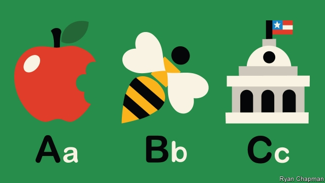

###### Young Americans

# Republicans and Democrats are taking early education more seriously 

##### Alabama and West Virginia are among the pioneers 

 

> Jan 24th 2019 

 

FROM HOT dogs, to automobiles, to diesel fuel, Americans have been touched by plenty of German inventions. Kindergarten (“children-garden”) is one of them. The programme for educating youngsters through playing and social interaction, meant as a transition from home to formal schooling, was first brought to America in the 1850s and quickly spread. Kindergarten has flourished, becoming so entrenched that it is part of the formal education system’s name (“K through 12”). Yet the garden of even younger Americans, including preschoolers, has too often gone uncultivated. 

The share of three- and four-year-olds enrolled in pre-school has not changed much in two decades. While the average country in the OECD, a club of rich nations, enrolls 80% of its three- and four-year-old children in school, America enrolls just 54%, lagging behind Chile and Mexico. This is true despite abundant evidence of the benefits of early education, especially for disadvantaged children. High-quality pre-school programmes can have lasting benefits, including improving the odds of graduating from school, earning more and staying away from drugs and out of prison. For parents there are gains, too: when their children are in day care, they can work. 

In the shadows of a government shutdown and chaotic governance generally, one achievement of President Donald Trump’s administration has gone unnoticed. In 2018 Congress approved more than $5.2bn in “child care and development block grants”, which subsidise child care for low-income families, nearly doubling available funding and indicating a rare example of bipartisan collaboration. Head Start, a federal programme that educates poor children before they enter kindergarten, has also received more funding. 

At federal level, pre-school is still perceived as more of a Democratic issue, while Republicans are more likely to support subsidised child care and home visits, says Libby Doggett, who served as the deputy assistant secretary for early learning at the Department of Education under Barack Obama. Meanwhile, in the various states, pre-K is being championed by both political parties. The fact that cities and states have the ability to implement their own programmes, rather than wait for the national government to act, is an advantage. High schools spread in America between 1910 and 1940 mainly because cities promoted and paid for them, says Steven Barnett of the National Institute for Early Education Research at Rutgers University, which compiles an annual report card on state pre-school programmes. 

In the 36 gubernatorial elections held last November, 29 winning candidates either publicly commented on the importance of early childhood education or supported such programmes. This includes not only the usual suspects—Democratic governors in states like Illinois, New Jersey and Michigan—but also Republicans in like-minded states, including Arkansas, Georgia and Idaho. For example, Mike DeWine, the Republican governor of Ohio, who assumed office this month, promised expanded access to pre-school during his campaign. In a politically symbolic move, his first staffing announcement was to choose a director of children’s initiatives. 

California’s new governor, Gavin Newsom, a Democrat, has the biggest and most closely watched plans of any state. He recently announced $1.2bn in new funding directed at the spectrum of young children’s needs, from home visits, to affordable child care, to expanded pre-K. Whereas many states have invested in early childhood, no state has “put together the whole continuum into a birth-to-five system,” as Mr Newsom hopes to do, says Ms Doggett. Central to his plan is providing six months of paid leave for new parents, so that they can bond with and care for their infants. This is not radical by European standards, but it is by American ones. 

Since California is home to around one in eight American children aged five and under, and also has the nation’s highest poverty rate (after accounting for the cost of living), what happens there matters a great deal. But smaller states are also making strides. In 2002 West Virginia passed legislation that required the state to offer pre-K to all four-year-olds by 2012. Alabama is another bright spot. In 2018 Alabama’s legislature bolstered pre-K funding by around $19m, the state’s largest-ever increase. Kay Ivey, the Republican governor, has been an outspoken advocate. Delegations from other states have travelled there to study its success. One lesson to draw is the importance of companies as allies. Businesses in Alabama have been prominent supporters of increasing funding for early education. 

Some cities are also making strides. Texas does not have a highly regarded state pre-school programme, but San Antonio does. It raised the local sales tax from 8.125% to 8.25% to invest in full-day pre-school under its former mayor, Julián Castro. Having rolled out pre-school for four-year-olds, New York City is now expanding access to three-year-olds with the support of Mayor Bill DeBlasio. 

Such widespread support tends to mask two trade-offs inherent in making early-years education more widely available. First, researchers believe that it is better to back smaller, higher-quality programmes. “It’s always easier for a state to go from better to bigger than bigger to better,” says David Kirp, author of “The Sandbox Investment”, a book about pre-school and politics. For impatient politicians, it is tempting to go for scale first. 

Second, early-years teachers are often paid little, which can hurt the quality of the programmes on offer. Earnings are so paltry that 58% of child-care workers in California qualify for some form of public assistance, such as food stamps, says Deborah Stipek of Stanford University. This contributes to extremely high turnover. Around a quarter of child-care workers and pre-school teachers leave each year, reckons Scott Moore of Kidango, the Bay Area’s largest preschool provider, who says what early educators make is “unconscionable”. But making programmes available to everyone makes them more expensive, leaving little to pay teachers more. 

-- 

 单词注释:

1.democrat['demәkræt]:n. 民主人士, 民主主义者, 民主党党员 [经] 民主党 

2.Alabama[.ælә'bæmә]:n. 亚拉巴马州 

3.Virginia[vә'dʒinjә]:n. 弗吉尼亚 

4.Jan[dʒæn]:n. 一月 

5.diesel['di:zәl]:n. 内燃机, 柴油机, 柴油 

6.transition[træn'ziʃәn]:n. 转变, 转换, 变迁, 过渡时期, 临时转调 [化] 跃迁 

7.quickly['kwikli]:adv. 很快地 

8.entrench[in'trentʃ]:vt. 围以壕沟, 防护, 保卫, 使处于牢固地位 vi. 掘壕, 侵犯 

9.K[kei]:[计] 键, 关键字, 千, 千字节 [医] 钾(19号元素) 

10.preschooler[]:n. 学龄前儿童 

11.uncultivated[.ʌn'kʌltiveitid]:a. 未经耕作的, 不文明的, 无教养的 

12.enrol[in'rәul]:vt. 登记, 使加入 vi. 参军, 注册 

13.Oecd[]:[经] 已开发国家组织 

14.enrolls[]:( enroll的第三人称单数 )；登记, 招收, 使入伍（或入会、入学等）, 参加, 成为成员；记入名册；卷起, 包起 

15.Chile['tʃili]:n. 智利 [化] 番椒; 辣椒 

16.odds[ɒdz]:n. 可能性, 几率, 机会, 胜算, 不平等 

17.shutdown['ʃʌtdaun]:n. 关门, 停工, 停机 [经] 停工 

18.chaotic[kei'ɒtik]:a. 混乱的, 无秩序的 [法] 混乱的, 混沌的 

19.governance['gʌvәnәns]:n. 统治, 统辖, 管理 [法] 统治, 管理, 支配 

20.donald['dɔnәld]:n. 唐纳德（男子名） 

21.unnotice[]:[网络] 未被注意的 

22.subsidise[]:vt. 给...补助金, 津贴, 资助 

23.bipartisan[bai,pɑ:ti'zæn]:a. 两党连立的 

24.collaboration[kә.læbә'ræʃәn]:n. 合作, 勾结 [法] 通敌卖国者, 奸细 

25.libby['libi]:n. 莉比（等于Elizabeth, 女子名） 

26.doggett[]: [人名] [英格兰人姓氏] 多格特绰号，来源于中世纪英语，含义是“狗”(dog); [人名] [英格兰人姓氏] 多格特绰号，来源于中世纪英语，含义是“狗+头”(dog+head) 

27.barack[bɑ:'ræk]:n. 巴拉克（男子名） 

28.obama[]:n. 奥巴马(姓) 

29.steven['sti:vn]:n. 史蒂文（男子名） 

30.Barnett['bɑ:net]:n. 巴奈特（姓氏） 

31.Rutger[]:n. (Rutger)人名；(德)鲁特格尔 

32.gubernatorial[.gju:bәnә'tɒ:riәl]:a. 州长的, 统治者的 

33.Illinois[.ili'nɒis]:n. 伊利诺州 

34.jersey['dʒә:zi]:n. 运动衫 

35.Arkansas['ɑ:kәnsɒ:]:n. 阿肯色州 

36.Georgia['dʒɒ:dʒjә]:n. 乔治亚州 

37.Idaho['aidәhәu]:n. 爱达荷州 

38.mike[maik]:vi. 偷懒, 游手好闲 n. 休息, 游手好闲, 扩音器, 话筒 

39.dewine[]: [人名] 德万 

40.Ohio[әu'haiәu]:n. 俄亥俄 

41.politically[]:adv. 政治上 

42.symbolic[sim'bɒlik]:a. 象征的, 符号的 [电] 符号化 

43.staffing['stɑ:fiŋ]:[计] 人员指挥 [经] 配备职工 

44.gavin[]:n. 加文（男子名） 

45.newsom[]: [人名] [英格兰人姓氏] 纽瑟姆 Newsome的变体 

46.democrat['demәkræt]:n. 民主人士, 民主主义者, 民主党党员 [经] 民主党 

47.spectrum['spektrәm]:n. 光谱, 范围, 系列 [化] 光谱 

48.affordable[]:[计] 普及型 

49.continuum[kәn'tinjuәm]:n. 连续统一体, 连续统, 闭联集 [化] 连续区; 连续谱; 连续介质 

50.California[.kæli'fɒ:njә]:n. 加利福尼亚 

51.stride[straid]:n. 大步, 步幅, 步态, 进步 v. 迈大步走, 跨过, 跨 

52.legislature['ledʒisleitʃә]:n. 立法机关, 议会, 立法院 [法] 立法机构, 立法机关 

53.bolster['bәulstә]:n. 支持, 长枕 vt. 支持, 支撑 

54.kay[kei]:n. 字母K, K字形物 

55.ivey[]: [人名] [英格兰人姓氏] 艾维 Ive的变体; [人名] [英格兰人姓氏] 艾维诺曼底住所名称，来源于古法语，含义是“紫杉树”(yew tree) 

56.ally['ælai. ә'lai]:n. 同盟者, 同盟国, 助手 vt. 使联盟, 使联合, 使有关系 vi. 结盟 

57.supporter[sә'pɒ:tә]:n. 支持者, 后盾, 迫随者, 护身织物 [法] 支持者, 赡养者, 抚养者 

58.Texas['teksәs]:n. 德克萨斯 

59.san[sɑ:n]:abbr. 存储区域网（Storage Area Networking） 

60.antonio[æn'tәuniәu]:n. 安东尼奥（男名） 

61.Castro['kæstrəu]:n. 卡斯特罗（古巴领导人, 1976-2006年在任） 

62.york[jɔ:k]:n. 约克郡；约克王朝 

63.deblasio[]: [人名] 德布拉西奥 

64.inherent[in'hiәrәnt]:a. 固有的, 与生俱来的 [医] 固有的, 生来的 

65.alway['ɔ:lwei]:adv. 永远；总是（等于always） 

66.david['deivid]:n. 大卫；戴维（男子名） 

67.kirp[]:[网络] 北京人 

68.sandbox['sændbɒks]:n. 沙箱, 沙盒 

69.politic['pɒlitik]:a. 精明的, 明智的, 策略的 

70.earning['ә:niŋ]:n. 收入（earn的现在分词） 

71.paltry['pɒ:ltri]:a. 不足取的, 琐碎的, 可鄙的 

72.deborah['debәrә]:n. 黛博拉（女子名） 

73.stipek[]:[网络] 的三段论；斯蒂皮克 

74.stanford['stænfәd]:n. 斯坦福（姓氏, 男子名）；斯坦福大学（美国一所大学） 

75.turnover['tә:n.әuvә]:n. 翻倒, 翻转, 半圆酥饼, 营业额, 流通, 周转 a. 可翻转的 

76.reckon['rekәn]:vt. 计算, 总计, 估计, 认为, 猜想 vi. 数, 计算, 估计, 依赖, 料想 

77.scott[skɔt]:n. 斯科特（男子名） 

78.moore['muә]:n. 摩尔（男子名） 

79.preschool['pri:'sku:l]:a. 就学前的 n. 育幼院, 幼稚园 

80.provider[prә'vaidә]:n. 供应者, 供养人, 伙食承办人 [计] 提供器 

81.unconscionable[.ʌn'kɒnʃәnәbl]:a. 不受良心支配的, 不合理的, 过度的 

