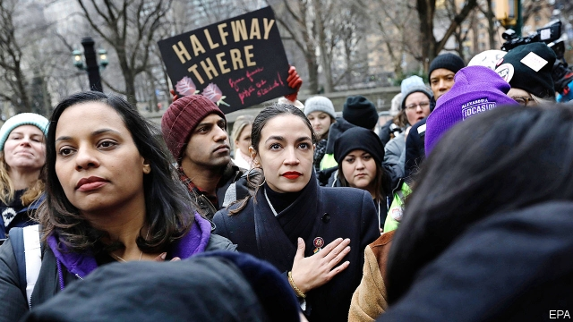

###### AO, let’s go

# Republicans may learn to love Alexandria Ocasio-Cortez 

##### If Democrats ever embraced socialism, America would probably stay conservative 

 

> Jan 24th 2019 

 

“THE CHOICE isn’t what I’m breathing in, the choice is what I’m exhaling,” said Representative Alexandria Ocasio-Cortez, at a celebration of Martin Luther King Day in the Riverside Church in Manhattan this week. “And I think that the situation right now, with this administration, with the abdication of responsibility by so many powerful people—even people who abdicate that responsibility by calling themselves liberal or Democratic—I feel a need for all of us to breathe fire.” 

The 29-year-old congresswoman’s many critics on the right are more concerned by what they think Ms Ocasio-Cortez may be smoking. Since her demolition of Joe Crowley, a moderate Democratic leader last year, in a primary bid for his safe Bronx-Queens district, she has become a hate-figure of seemingly limitless interest to conservative media outlets. (“Fox News debuts premium channel for 24-hour coverage of Alexandria Ocasio-Cortez” snarked the Onion, exaggerating only slightly.) Her rare combination of success and hard-left views is the ostensible reason. In the mould of her fellow democratic socialist, Bernie Sanders, on whose presidential campaign she worked, she is for universal Medicare, a federal job guarantee, making tertiary education free and forgiving college debt. Yet a relentless focus on Ms Ocasio-Cortez’s appearance, person and spirited behaviour suggests the vituperation is fuelled by darker forces than policy disagreement. 

This makes the activist left, including many at the Riverside, a stage for civil-rights leaders including Martin Luther King through the ages, love her all the more. They also love the fire-breathing rhetoric she showed off in an on-stage chat with the author Ta-Nehisi Coates. Best of all they love her ability to sock it to her right-wing detractors, typically for the benefit of her 2.5m Twitter followers. “Don’t hate me cause you ain’t me, fellas,” she tweeted to House Republicans, after they booed her vote for Nancy Pelosi as Speaker. 

That incident also exemplified the only way that Ms Ocasio-Cortez may actually matter. The right-wing hate-craze for her is fuelled by a fear that she could be about to turn America socialist. That rather under-rates the fact that freshmen House members have a long way to rise; that most of the new intake of Democrats are moderate (and many have had enough of her attention-grabbing); and that if their party ever did nominate a democratic socialist for president, she would be much likelier to keep America conservative. By far the biggest threat Ms Ocasio-Cortez represents is to her own party. Republicans ought really to love her for that. 

The hard-left activist world she springs from mainly exists to shunt Democrats to the left. There are signs in the emerging Democratic presidential primary that it is succeeding. All three of the senators who have so far declared their candidacies—Kirsten Gillibrand, Kamala Harris and Elizabeth Warren—support Medicare-for-all, an idea that also sprang from Mr Sanders’s campaign. And Ms Harris and Mrs Warren have endorsed the concept of Ms Ocasio-Cortez’s signature proposal, the Green New Deal, a suite of policies to address both climate change and inequality. 

Yet Ms Ocasio-Cortez wants to cause a much bigger shakeup on the left—as her on-stage reference to colleagues ducking their moral responsibility suggested. She celebrated her election last November by backing a campaign by Justice Democrats—an activist group founded by her chief-of-staff and fellow Sanders alumnus Saikat Chakrabarti—to unseat Democratic incumbents deemed insufficiently left-wing. She has since tried to make nice with the Democratic leadership, as her vote for Mrs Pelosi illustrated. “I do see my situation evolving—I take my oath of office very seriously,” she said at the Riverside. “I was giving myself a little more permission to be a little more out-of-pocket before my swearing in.” Yet keeping Ms Ocasio-Cortez sweet will be an important task for Mrs Pelosi, who has three decades more congressional experience but half a million fewer Twitter followers. 

The veteran Speaker has made a decent start. But given that AOC, as the congresswoman is known, appears to have no interest in leadership positions or other plums within Mrs Pelosi’s gift, she will have to work harder. Indeed, the real challenge of Ms Ocasio-Cortez’s populist ideas—to both parties, but to the Democrats most urgently—is the way they expose the inadequacy of mainstream policy responses to the big problems, including inequality and global warming, she describes. 

On climate, most obviously, Republicans have no basis to call her an extremist. Her diagnosis of the looming disaster is in line with scientific orthodoxy; theirs, a corporate-funded denial routine, is the outlier. Democratic leaders, by contrast, agree with her diagnosis of the problem. Yet they are alarmed by the profligacy of her proposals, which are based on an improbable ambition to decarbonise the energy sector by 2035. Their alarm is justified, yet it would carry more weight if they had more serious alternatives to offer. Republican denial of climate change has led to Democratic complacency on the issue. “This is our World War II,” Ms Ocasio-Cortez said at the Riverside. “And your biggest issue is how are we going to pay for it?” To check her left-wing enthusiasm, and perhaps save the planet, House Democrats need a better answer to that question. 

-- 

 单词注释:

1.AO[]:[医] 阳极断电, 房室瓣张开 

2.alexandria[,æli^'zɑ:ndriә]:n. 亚历山大港（位于埃及）；亚历山大市（美国弗吉尼亚一城市）；亚历山大大帝 

3.democrat['demәkræt]:n. 民主人士, 民主主义者, 民主党党员 [经] 民主党 

4.Jan[dʒæn]:n. 一月 

5.exhale[eks'heil]:v. 呼气, 发出, 散发 

6.Martin['mɑ:tin]:n. 马丁, 圣马丁鸟 

7.luther['lu:θә]:n. 卢瑟（男子名） 

8.riverside['rivәsaid]:n. 河边, 河畔 

9.Manhattan[mæn'hætәn]:n. 曼哈顿 

10.abdication[.æbdi'keiʃәn]:n. 逊位, 弃权, 辞职 

11.abdicate['æbdikeit]:vt. 正式放弃 vi. 退位, 退出, 辞职 

12.demolition[.demә'liʃәn]:n. 破坏, 毁坏, 撤销 [经] 拆毁(除,破坏) 

13.joe[dʒәu]:n. 乔（男子名） 

14.Crowley[]:克罗利 克罗利 

15.seemingly['si:miŋli]:adv. 看来似乎, 表面上看来 

16.limitless['limitlis]:a. 无限的, 无界限的 

17.debut['deibju:]:n. 初次登台, 开张 v. 初次登台 

18.premium['pri:miәm]:n. 额外补贴, 奖金, 奖赏, 保险费 [医] 保险费 

19.coverage['kʌvәridʒ]:n. 覆盖的范围, 保险总额, 新闻报导 [化] 可达范围; 覆盖度 

20.snarked[]:[网络] 惊呼 

21.ostensible[ɒs'tensibl]:a. 表面的, 假装的, 看得出的 [经] 表面的, 诡称的 

22.bernie['bә:ni]:n. 伯尼（男子名）；[俚]可卡因（等于cocaine） 

23.sander['sændә]:[电] 散沙 

24.presidential[.prezi'denʃәl]:a. 总统制的, 总统的, 首长的, 统辖的 [法] 总统的, 议长的, 总经理的 

25.medicare['medi,keә]:n. 医疗照顾方案, 医疗照顾项目 [法] 公办的医疗保险制 

26.tertiary['tә:ʃiәri]:a. 第三的, 第三位的, 第三产业的 n. 第三修道会会员, 第三纪 第三的; 三代的(指无机盐) 

27.relentless[ri'lentlis]:a. 无情的, 冷酷的, 残酷的 

28.vituperation[vitju:pә'reiʃәn]:n. 谩骂, 辱骂 [法] 辱骂, 责骂, 诽谤 

29.activist['æktivist]:n. 激进主义分子 

30.rhetoric['retәrik]:n. 修辞, 修辞学, 雄辩(术) 

31.coate[]: [人名] [英格兰人、苏格兰人姓氏] 科特 Coates的变体 

32.detractor[di'træktә(r)]:n. 毁损者, 贬低者 

33.typically['tipikәli]:adv. 代表性地；作为特色地 

34.twitter['twitә]:n. 啁啾, 唧唧喳喳声 vi. 啭, 啁啾, 颤抖 vt. 嘁嘁喳喳地讲, 抖动 

35.follower['fɒlәuә]:n. 从者, 属下, 追补者 [电] 随动机 

36.fella[felә]:n. 小伙子；[俚]伙伴, 伙计 

37.tweet[twi:t]:vi. 啁啾 n. 小鸟叫声 

38.nancy['nænsi]:n. 女性化的男人 a. 女性化的, 同性恋的 

39.pelosi[]:佩洛西 

40.exemplify[ig'zemplifai]:vt. 例证, 例示 [法] 制作经公章证明的誊本, 例证 

41.freshman[]:n. 新手, 生手, 大学一年级学生, (美)中学一年级学生 

42.intake['inteik]:n. 入口, 吸入, 吸入量 [医] 摄取量 

43.nominate['nɒmineit]:vt. 提名, 任命, 命名 [法] 提名...为候选人, 指定, 推荐 

44.shunt[ʃʌnt]:vt. 使转轨, 使分流, 回避讨论, 推延 vi. 转向一边, 转轨, 往返 n. 转轨, 分流 

45.senator['senәtә]:n. 参议员, (某些大学的)理事 [法] 参议员, 上议员 

46.gillibrand[]: [人名] 吉利布兰德 

47.kamala[kә'meilә]:n. [植] 粗糠柴 

48.harris['hæris]:n. 哈里斯（英国苏格兰一地区）；哈里斯（姓氏） 

49.elizabeth[i'lizәbәθ]:n. 伊丽莎白（女子名） 

50.Mr['mistә(r)]:先生 [计] 存储器回收程序, 多重请求 

51.warren['wɒrәn]:n. 养兔场, 拥挤的地区 

52.endorse[in'dɒ:s]:vt. 支持, 赞同, 背书于, 签署 [经] 赞成, 背书 

53.inequality[.ini'kwɒliti]:n. 不平等, 不同, 不平坦, 不平均 n. 不平等, 不等式 [计] 不等式 

54.shakeup['ʃeikʌp]:n. 摇动；抖摇；震惊；打扰 

55.alumnus[ә'lʌmnәs]:n. 男毕业生, 男校友 

56.Saikat[]:[网络] 西卡特 

57.unseat['ʌn'si:t]:vt. 剥夺...的席位, 使失去资格, 使退位, 罢免, 使去职, 使退职 

58.incumbent[in'kʌmbәnt]:a. 现任的, 依靠的, 负有义务的 n. 领圣俸者, 在职者 

59.deem[di:m]:v. 认为, 相信 

60.insufficiently[ˌɪnsə'fɪʃntlɪ]:adv. 不够地, 不能胜任地 

61.oath[әuθ]:n. 誓约, 誓言, 咒骂 [法] 誓言, 誓约, 宣誓 

62.congressional[kәn'greʃәnl]:a. 会议的, 议会的, 国会的 [法] 代表大会的, 大会的, 议会的 

63.AOC[]:[医] 阳极断电收缩 

64.congresswoman['kɒŋgreswumәn]:n. 国会女议员, 众议院女议员 

65.plum[plʌm]:n. 李子 

66.Populist['pɔpjulist]:n. 民粹派的成员 

67.inadequacy[in'ædikwәsi]:n. 不适当, 不足之处, 不充分 [医] 机能不全, 闭锁不全, 关闭不全 

68.mainstream['meinstri:m]:n. 主流 

69.extremist[iks'tri:mist]:[经] 偏激份子 

70.diagnosis[.daiәg'nәusis]:n. 诊断 [计] 诊断 

71.loom[lu:m]:n. 织布机, 若隐若现的景象 vi. 朦胧地出现, 隐约可见, 可怕地出现 

72.orthodoxy['ɒ:θәdɒksi]:n. 正统说法, 正教, 信奉正教 

73.denial[di'naiәl]:n. 否认 [法] 否定, 否认, 拒绝接受 

74.outly[]:[网络] 欧特利 

75.profligacy['prɒfligәsi]:n. 放荡, 不检点, 浪费 

76.improbable[im'prɒbәbl]:a. 不大可能的, 不象发生的, 荒谬可笑的 [法] 未必会的, 不大可能发生的, 未必确实的 

77.decarbonise[,di:'kɑ:bənaiz]:vt. [主英国英语] =decarbonize[亦作decarburise] 

78.sector['sektә]:n. 扇形, 部门, 部分, 函数尺, 象限仪, 段, 区段 vt. 把...分成扇形 [计] 扇面; 扇区; 段; 区段 

79.complacency[kәm'pleisәnsi]:n. 满足, 自鸣得意, 自满 

80.ii[]:abbr. 微光（Image Intensification） 

