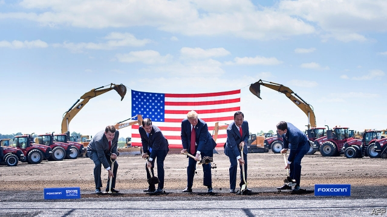

###### Makers and takers

# The arrival of Foxconn in Wisconsin divides Democrats 

##### A whopping subsidy to America's biggest foreign investment splits the party along class lines 

 

> Jan 24th 2019 

 

FROM KIM and Jim Mahoney’s kitchen the view is spectacular. Reeds edge their garden. Beyond those, large lorries trundle past roughly once a minute. Each leaves its load on an immense rising pyramid of orange sand. Machinery clanks as yellow diggers and bulldozers toil. A white factory—a multipurpose space for robot assemblers, say the Mahoneys—recently rose where a copse once stood. 

The couple had expected a bucolic life after finishing their house two years ago. It was not to be. Soon afterwards Scott Walker, then Wisconsin’s governor, said their neighbourhood would be handed to a Taiwanese manufacturer. Foxconn is building a huge, $10bn manufacturing plant on much of Mount Pleasant. Originally, at least, it promised to churn out large, latest model, LCD televisions there. 

Things moved fast. Last year President Donald Trump, a golden shovel in hand, celebrated the deal just beyond the Mahoneys’ garden, declaring the plant will be the “eighth wonder of the world”. It will reportedly be America’s biggest single foreign direct investment. Local homeowners protested, but most sold up. The Mahoneys and their dog, stubborn sorts, still cling on. 

Kim Mahoney says politicians abandoned them in a rushed, murky process. Republicans trumpeted economic benefits—especially Foxconn’s promise of 13,000 jobs, paying an average of over $50,000, for low-skilled locals such as those in the nearby, depressed, city of Racine. With a venture fund and other activities, Foxconn could transform a run-down industrial region in southern Wisconsin, once famed for making Horlicks and tractors, into a bustling hub for startups. 

Democrats, in opposition, did not resist much. Some harrumphed about dodgy favours for the Taiwanese, such as the easing of a rule that limits smog. Foxconn, unusually, is allowed to soak up lots of water from nearby Lake Michigan. Bizarrely, because of a special law, in effect it can even operate above some courts: it may instantly appeal against any lower court ruling that is not in its favour to the state Supreme Court. 

Tony Evers, a Democrat who has just replaced Mr Walker as governor, is no firebrand. He has been cautious about the deal, lest he be seen as opposing decent manufacturing jobs. In office he is loth to scare investors by breaking his predecessor’s legal contract. Urbane, educated and liberal types in Madison, the state capital, may wring their hands. But the blue-collar wing of his party, especially near Racine, is keen. Cory Mason, a philosophical type who was elected mayor of Racine in 2017, is an avid supporter who hopes Foxconn will revive his shrinking city. 

As a state legislator he was one of three Democrats who backed Mr Walker’s deal. He saw a “breakdown within Democratic voters”, as “class lines defined views” in the party. Those with factory jobs, or who wanted them, cheered Foxconn; those with a college education opposed it, he says. Greta Neubauer, another Democrat, a state legislator and a fifth-generation resident of Racine, agrees. She disliked the deal but, she says, as “this is happening, I want to make the most of it”. 

But Democrats run a risk in doing so. The Foxconn deal looks financially nonsensical. Mr Walker (pressed by Mr Trump) pledged an immense pile of taxpayers’ money for a foreign firm. Tim Bartik, an economist at the Upjohn Institute for Employment Research in Michigan, estimates that state governments typically offer big investors subsidies worth 3% of wages over 20 years. In luring Amazon last year, New York offered 6%; Virginia, just 1%, for example. Foxconn’s deal in Wisconsin, he says, is worth 30%, ten times the average. 

Wisconsin has pledged almost $4.5bn to Foxconn, a sum Mr Bartik says is impossible to rationalise. “In 20 years people will point to this as an example of what not to do,” he says. As Wisconsin barely taxes manufacturers, the help will come as relief on sales tax, free provision of land, and direct payments. The effect will be to divert about $350m annually from the state budget for many years to come. Mr Evers has promised no tax rises, so spending, such as on education or health, may have to drop. 

Worse, Foxconn, which is struggling with weak global sales of smartphones, is backing off its first bold promises. It will not make those big LCD televisions after all. Its local supply chain can shrink, doing without glassmakers. Instead goods will be shipped in and assembled. No one is yet sure what will be made; perhaps small screens for phones. 

To lower costs, robots will do many tasks, so fewer low-skilled folk from nearby Racine will be needed than expected. Locals are also short on the necessary skills. Mark Muro, at Brookings, a think-tank, has analysed automation and the availability of workers. He says the Racine area is exceptionally short of engineering, computing or maths skills. Instead, the firm will look far and wide for engineers and developers. Foxconn rejects reports that engineers will come from China, but a person well informed about the deal says “a few hundred” Chinese workers already in America may have to move to Wisconsin. 

Could the Democrats yet back away? Matt Flynn, an ex-chairman of Wisconsin’s Democratic Party, hopes to lead a private legal challenge, claiming the Taiwanese firm enjoys unconstitutional favours over its special legal arrangements. And he wants Mr Evers to see if Foxconn is in breach of contract for changing its plans. His attempts are unlikely to stop the trucks and diggers. The Mahoneys expect legal mediation over their home next month. Soon they will have no kitchen to stand in. 

-- 

 单词注释:

1.maker['meikә]:n. 制造者, 上帝 [经] 制造者, 出票人 

2.taker['teikә]:n. 取者, 捕者, 接受者, 收取者 [法] 受者, 收票人, 接受打赌的人 

3.foxconn[]:n. 富士康（公司名） 

4.Wisconsin[wis'kɒnsin]:n. 威斯康星 

5.democrat['demәkræt]:n. 民主人士, 民主主义者, 民主党党员 [经] 民主党 

6.whop[hwɒp]:v. 打, 抽出, 打败, 征服 n. 重击, 打击声 

7.Jan[dʒæn]:n. 一月 

8.kim[]:n. 金姆（人名） 

9.jim[dʒim]:n. 吉姆（人名） 

10.spectacular[spek'tækjulә]:a. 公开展示的, 惊人的, 壮观的 n. 奇观, 惊人之举, 展览物 

11.trundle['trʌndl]:n. 小车轮, 脚轮, 滚动 vi. 滚动, 移动, 投球 vt. 使滚动, 使移转 

12.machinery[mә'ʃi:nәri]:n. 机器, 机械装置, 机构 [化] 机械 

13.clank[klæŋk]:n. 叮当声 vi. 发叮当声, 发铿锵声 vt. 使铿然作响 

14.digger['digә]:n. 挖掘者 

15.bulldozer['buldәuzә]:n. 推土机 [化] 推土机 

16.toil[tɒil]:n. 辛苦, 苦工, 网, 罗网, 圈套 vi. 苦干, 跋涉 

17.multipurpose['mʌlti'pә:pәs]:[计] 多用途的, 通用的, 多功能的 

18.assembler[ә'semblә]:n. 装配工 [计] 汇编程序 

19.copse[kɒps]:n. 矮林, 小灌木林, 萌生林 

20.bucolic[bju:'kɒlik]:a. 牧民的, 牧歌的, 乡下风味的 n. 田园诗, 农夫 

21.afterwards['ɑ:ftәwәdz]:adv. 然后, 后来 

22.scott[skɔt]:n. 斯科特（男子名） 

23.walker['wɒ:kә]:n. 徒步者, 轻便鞋 [法] 山林巡视官 

24.taiwanese[,taiwɑ:'ni:z, -'ni:s]:a. 台湾人的；台湾的 

25.manufacturing[.mænju'fæktʃәriŋ]:n. 制造业 a. 制造业的 

26.originally[ә'ridʒәnli]:adv. 本来, 原来, 最初, 就起源而论, 独创地 

27.churn[tʃә:n]:n. 搅乳器 v. 搅拌, 搅动 

28.LCD[]:液晶显示器 [计] 液晶显示器; 改变目录 

29.donald['dɔnәld]:n. 唐纳德（男子名） 

30.trump[trʌmp]:n. 王牌, 法宝, 喇叭 vt. 打出王牌赢, 胜过 vi. 出王牌, 吹喇叭 

31.shovel['ʃʌvl]:n. 铲, 铁铲 v. 铲 

32.reportedly[ri'pɒ:tidli]:adv. 根据传说, 根据传闻, 据报道 

33.homeowner['hәum.әunә]:n. 私房屋主；自己拥有住房者 

34.Mahoney[]:马奥尼（人名）（爱尔兰姓氏） 

35.cling[kliŋ]:vi. 粘紧, 附着, 紧贴, 坚持 

36.kim[]:n. 金姆（人名） 

37.Mahoney[]:马奥尼（人名）（爱尔兰姓氏） 

38.murky['mә:ki]:a. 黝暗的, 阴沉的, 朦胧的 

39.racine[rә'si:n]:n. 拉辛（姓氏） 

40.famed[feimd]:a. 著名的, 闻名的 

41.horlick[]: [人名] [英格兰人姓氏] 霍利克 Horlock的变体 

42.bustle['bʌsl]:n. 喧闹, 裙撑 vi. 奔忙, 喧闹 vt. 使忙碌, 催促 

43.hub[hʌb]:n. 毂, 木片, 中心 [计] 插座; 插孔; 集线器, 集中器, 连接器, 中继站 

44.startup[]:[计] 启动 

45.opposition[.ɒpә'ziʃәn]:n. 反对, 敌对, 相反, 在野党 [医] 对生, 对向, 反抗, 反对症 

46.harrumph[hә'rʌmf]:n. 哼声, 鼻息 v. 发哼声 

47.dodgy['dɒdʒi]:a. 狡猾的, 逃避的, 难弄的 

48.Michigan['miʃigәn]:n. 密歇根州 

49.bizarrely[bɪ'zɑ:lɪ]: 古怪地; 怪诞地 

50.tony['tәuni]:a. 高贵的, 时髦的 

51.evers[]: [人名] 埃弗斯 

52.democrat['demәkræt]:n. 民主人士, 民主主义者, 民主党党员 [经] 民主党 

53.firebrand['faiәbrænd]:n. 火把, 在燃烧的木柴, 煽动叛乱者 

54.loth[lәuθ]:a. 不愿意的, 厌恶的 

55.investor[in'vestә]:n. 投资者 [经] 投资者 

56.urbane[ә:'bein]:a. 彬彬有礼的 

57.madison['mædisn]:n. 麦迪逊（姓氏）；麦迪逊（美国城市） 

58.wring[riŋ]:n. 扭绞, 拧, 挤 vt. 拧, 绞, 扭, 勒索, 折磨, 使痛苦 vi. 蠕动, 扭动, 绞, 扭, 感到痛苦 

59.cory[]:n. 克里, 科里（人名） 

60.mason[meisn]:n. 泥瓦匠, 共济会会员 vt. 用砖瓦砌成 

61.philosophical[.filә'sɒfikl]:a. 哲学的, 冷静的, 达观的, 哲学上的, 哲学家似的 

62.avid['ævid]:a. 渴望的, 急切的, 劲头十足的 

63.supporter[sә'pɒ:tә]:n. 支持者, 后盾, 迫随者, 护身织物 [法] 支持者, 赡养者, 抚养者 

64.revive[ri'vaiv]:vt. 使苏醒, 使复兴, 使振奋, 回想起, 重播 vi. 苏醒, 复活, 复兴, 恢复精神 

65.legislator['ledʒisleitә]:n. 立法者, 立法官, 立法委员 [法] 立法者, 立法机关成员, 立法委员 

66.breakdown['breikdaun]:n. 崩溃, 故障 [化] 事故; 击穿 

67.voter['vәutә]:n. 选民, 投票人 [法] 选民, 选举人, 投票人 

68.greta['^retә]:n. 格里塔（女子名, Margaret的昵称, 等于Gretta） 

69.neubauer[]: [人名] 纽鲍尔 

70.financially[]:adv. 金融上；财政上 

71.nonsensical[nɒn'sensikl]:a. 无意义的, 荒谬的 

72.pledge[pledʒ]:n. 诺言, 保证, 誓言, 抵押, 信物, 保人, 祝愿 vt. 许诺, 保证, 使发誓, 抵押, 典当, 举杯祝...健康 

73.tim[tim]:n. 蒂姆（男子名） 

74.bartik[]:n. (Bartik)人名；(匈)鲍尔蒂克；(捷)巴尔季克 

75.economist[i:'kɒnәmist]:n. 经济学者, 经济家 [经] 经济学家 

76.Upjohn[]:厄普约翰 

77.typically['tipikәli]:adv. 代表性地；作为特色地 

78.lure[luә]:n. 饵, 诱惑 vt. 引诱, 诱惑 

79.amazon['æmәzɒn]:n. 亚马孙河 [医] 无乳腺者 

80.york[jɔ:k]:n. 约克郡；约克王朝 

81.Virginia[vә'dʒinjә]:n. 弗吉尼亚 

82.rationalise['ræʃәnәlaiz]:v. <主英>=rationalize 

83.divert[dai'vә:t]:vt. 转移, 使欢娱 vi. 转移 

84.annually['ænjuәli]:adv. 一年一次, 每年 [经] 年度的, 每年的 

85.smartphones[]: 智能手机（smartphone的复数） 

86.glassmaker['^lɑ:s,meikә(r);'^læs-]:n. 玻璃工人 

87.muro[]: [人名] 穆罗; [地名] [法国、西班牙] 穆罗 

88.Brooking[]:n. (Brooking)人名；(英、西)布鲁金 忍受（brook的现在分词形式） 容忍 

89.availability[ә.veilә'biliti]:n. 有效性, 可利用性, 可利用的人 [计] 有效性; 可用性 

90.exceptionally[]:adv. 特殊地；异常地；例外地 

91.computing[kәm'pju:tiŋ]:[计] 计算 

92.developer[di'velәpә]:n. 开发者 [计] 显影器 

93.matt[mæt]:a. 表面暗淡的, 无光泽的, 表面粗糙的, 不光滑的 [医] 无光泽 

94.Flynn[flin]:[计] 弗林 

95.unconstitutional['ʌnkɔnsti'tju:ʃәnәl]:a. 违反宪法的, 不符合宪法的 [法] 违反宪法的, 违宪的, 不合宪法规定的 

96.breach[bri:tʃ]:n. 裂口, 违背, 破坏, 违反, 突破, 破裂 vt. 攻破, 突破 vi. 跳出水面 

97.mediation[.mi:di'eiʃәn]:n. 调停, 调解, 中介 [医] 间介[作用], 居间[作用] 

