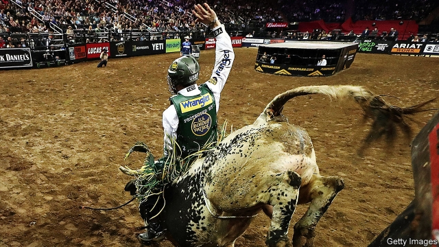

###### Masculinity on steroids

# Why bull-riding is becoming more popular 

##### It is America’s most dangerous sport 

 

> Jan 24th 2019 

 

THE RIDER is young, pale, thin-boned, fragile-looking. In a narrow pen, he tightens straps and lowers himself astride the bare back of a brown, 900kg (2,000lb) bull. Its smell, and that of a dozen more behind the stage, is intense. It jolts a black metal gate and the stage vibrates. Even for an observer standing just above, adrenalin flows. Thousands roar as beast and man fly. 

They swirl under floodlights, the bull bucks, legs high off the sandy arena floor, until the rider detaches and tumbles upwards, mercifully away from horns and wild hooves, aloft and rotating for an improbably long time. Then he crumples in the dirt. As with seven out of ten such efforts, the rider did not stay on for the eight seconds considered necessary. He collects bruises, but no points. 

Bull riding used to be one of seven events in a rodeo. For the past quarter of a century it has also been a spectator sport on its own. Riders tour America’s cities as well as Brazil, Mexico, Australia and Canada. They drew big crowds to shows at Madison Square Garden in New York and at a large arena in Chicago in January. A million television viewers also tune in to see Constant Sorrow, Lethal Larry and other taurines send riders such as Jess Lockwood or Chase Outlaw into the dirt. 

The sport is absurdly dangerous, despite the protective gear most riders wear. Mason Lowe, a rider at a Professional Bull Riding (PBR) event in Denver, was stamped on and killed on January 15th. Yet the shows go on. Researchers say 1,440 injuries occur for every 1,000 “exposure hours”, a rate 1.56 times riskier than boxing and 10.3 times worse than in American football. Last July Mr Outlaw broke 30 bones in his face in one ride. At least three riders were killed last year. 

What’s the appeal? Riders boast of thrills, money and fame. Mr Lockwood, 21 and already a former world champion, won this month’s events in New York and Chicago. Rather shy, he says he likes the adrenalin rush and has ridden since he was three. The most successful earn $1m a season, though most get far less. 

For the crowd, it is the spectacle. Olvia Alstadt, originally from Puerto Rico, was at the Chicago event with her toddler daughter. “I’m a liberal arts professor, but my husband’s family is from Texas and they like to come,” she says. Nelson Willis, who has brought his grand-daughter for the past eight years, relishes the combination of danger and family fun. It is “a tough life, exciting”, he says. 

Sean Gleason, who runs PBR, estimates that half of any crowd at a big event like Chicago’s is well versed in the riders’ skills, even if many also want to “see the wreck, the guy flying through the air.” Many of his viewers, he thinks, also enjoy the thrill and crashes of NASCAR racing. Is his sport thus an extreme case of the toxic masculinity which the American Psychological Association warns can harm the mental and physical health of boys and men? “We are masculinity on steroids,” he says, with a chuckle. If you think that’s a problem then “don’t buy a ticket…We are tough guys riding bulls.” 

-- 

 单词注释:

1.masculinity[.mæskju'liniti]:n. 男子气, 刚毅, 大丈夫气概 [医] 男子本性, 男性 

2.steroid['stiәrɒid]:n. 类固醇 [化] 甾族化合物 

3.Jan[dʒæn]:n. 一月 

4.tighten['taitn]:vt. 勒紧, 使变紧 vi. 变紧, 绷紧 

5.astride[ә'straid]:adv. 跨着 

6.jolt[dʒәult]:n. 震摇, 摇动, 颠簸 vi. 颠簸而行, 震摇 vt. 使颠簸, 使慌张, 猛击 

7.adrenalin[ә'drenәlin]:n. 肾上腺素 [化] 肾上腺素 

8.swirl[swә:l]:n. 漩涡, 涡动 vt. 使成漩涡 vi. 打漩, 盘绕, 眩晕 

9.floodlight['flʌdlait]:n. 照明灯, 泛光 vt. 用泛光灯照亮 

10.buck[bʌk]:n. 元, 雄鹿, 纨绔子弟, 鞍马, 培克(赌博时的庄家标志), 碱水, 自夸, 谈话 vi. 马背突然拱起, 反对, 吹牛, 闲聊 vt. 马背突然拱起将骑手摔下, 反对, 用碱水洗 a. 雄的 

11.arena[ә'ri:nә]:n. 角斗场, 舞台, 场地 [医] 尿沉渣, 尿沙; 脑沙 

12.detach[di'tætʃ]:vt. 使分离, 分遣 [机] 摘下, 分离, 卸下 

13.mercifully[]:adv. 仁慈地 

14.hoof[hu:f]:n. 蹄, (人的)脚 vt. 以蹄踢, 行走, 步行 vi. 走, 踢, 踏 

15.aloft[ә'lɒft]:adv. 在高处, 在上 

16.improbably[im'prɒbәbli]:adv. 未必会地, 不象真实地 

17.crumple['krʌmpl]:vt. 弄皱, 压皱 vi. 崩溃, 变皱 

18.rodeo[rәu'deiәu]:n. 竞技表演 [经] 牛市场 

19.spectator[spek'teitә]:n. 观众, 目击者, 旁观者 

20.Brazil[brә'zil]:n. 巴西 

21.madison['mædisn]:n. 麦迪逊（姓氏）；麦迪逊（美国城市） 

22.york[jɔ:k]:n. 约克郡；约克王朝 

23.Chicago[ʃi'kɑ:gәu]:n. 芝加哥 

24.lethal['li:θәl]:a. 致命的 n. 致死因子 

25.Larry['læri]:n. 拉里（男子名） 

26.taurine['tɒ:rin]:a. 像公牛的, 金牛座的 [化] 2-氨基乙磺酸; 牛磺酸 

27.jess[dʒes]:n. 鹰的脚带 vt. 系以脚带 

28.Lockwood[]:洛克伍德 

29.outlaw['autlɒ:]:n. 被剥夺法律保护的人, 罪犯 vt. 使...失去法律保护, 将...逐出社会, 宣告非法, 取缔 

30.absurdly[әb'sә:dli]:adv. 荒谬地, 荒唐地, 愚蠢地 

31.mason[meisn]:n. 泥瓦匠, 共济会会员 vt. 用砖瓦砌成 

32.lowe[]:n. 劳氏（世界知名跨国公司）；灵狮（全球第4大广告代理机构） 

33.pbr[]:abbr. payment by results 按产出付款; point-blank range 直射距离; power breeder reactor 动力增殖反应堆; precision bombing range 瞄准轰炸靶场 

34.Denver['denvә]:n. 丹佛(美国城市) 

35.risky['riski]:a. 危险的 

36.les[lei]:abbr. 发射脱离系统（Launch Escape System） 

37.olvia[]:[网络] 奥利维亚；奥利维亚公司；奥里维亚 

38.alstadt[]: [人名] 阿尔斯塔特 

39.originally[ә'ridʒәnli]:adv. 本来, 原来, 最初, 就起源而论, 独创地 

40.Puerto[]:n. 垭口, 港口, 山口 n. (Puerto)人名；(西)普埃尔托 

41.rico[]:abbr. 反诈骗腐败组织集团犯罪法（Racketeer Influenced and Corrupt Organizations Act） 

42.toddler['tɔdlә]:n. 蹒跚行走的人, 学步的小孩, 学步的幼儿, (非正式)信步走的人 

43.Texas['teksәs]:n. 德克萨斯 

44.nelson['nelsn]:n. (摔跤用语)肩下握颈 

45.willis['wilis]:n. 威利斯（姓氏, 男名） 

46.relish['reliʃ]:n. 滋味, 风味, 美味, 爱好, 食欲, 调味品 vt. 调味, 喜欢, 玩味 vi. 有味道 

47.sean[ʃɔ:n]:n. 肖恩（男子名） 

48.gleason[]:n. (Gleason)人名；(英、意)格利森 格利森 

49.verse[vә:s]:n. 诗, 韵文, 诗句 vt. 用诗表达 vi. 作诗 

50.nascar[]:abbr. 全国运动汽车竞赛协会（National Association of Stock Car Auto Racing） 

51.toxic['tɒksik]:a. 有毒的, 中毒的 [医] 中毒的, 毒物的 

52.masculinity[.mæskju'liniti]:n. 男子气, 刚毅, 大丈夫气概 [医] 男子本性, 男性 

53.chuckle['tʃʌkl]:n. 咯咯的笑声, 轻笑 vi. 咯咯的笑, 咕咕叫 

