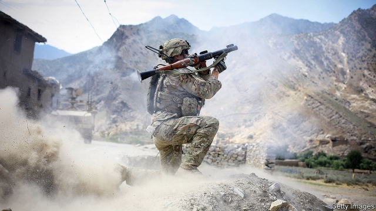

###### Khyber possibility

# America and the Taliban are edging towards a deal 

##### But is it a cover for cutting and running? 

 

> Jan 31st 2019 

COULD THERE be a ray of hope for Afghanistan? After 17 years of fighting, America and the Taliban may be ready to lay down their arms. The adversaries have agreed in principle on a framework for ending their war, says Zalmay Khalilzad, America’s point man on Afghanistan. 

The outline was forged in talks in Qatar that were originally scheduled to last two days but ended up being extended to six. It envisages America withdrawing troops in return for assurances that Afghanistan will never again become a haven for international terrorists. America also wants a ceasefire and the start of talks between the Taliban and the Afghan government, which the Taliban have resisted until now. 

Osama bin Laden was living in Afghanistan when he plotted the 9/11 attacks on America. It was to overthrow his protectors in the Taliban and to search for him that America first dispatched troops to the country in 2001. Part of their mission ever since has been to hunt for terrorists. The other part—helping build a stable democracy—has been justified on the grounds that Afghanistan may otherwise become a base for terrorists again. 

Although in 2001 the Taliban invoked Afghan traditions of hospitality in their refusal to hand over bin Laden, for at least the past decade they have promised that Afghan soil will not be used to launch attacks on other countries. They not only repeated those assurances in Qatar, Mr Khalilzad says, but also agreed to provide guarantees and an enforcement mechanism—though he has not revealed any details of those. 

In exchange America seems to have acceded to the Taliban’s main demand: that it withdraw its troops from the country. For years the insurgents have said the starting point for talks must be the end of what they call the American occupation. They do not believe America’s assurance that it does not want a permanent military presence in the country. An American pull-out now appears to be on the table although, again, the timing and scale remain unclear. 

The two other steps discussed in Qatar are a ceasefire and talks between the Taliban and the government of Ashraf Ghani, Afghanistan’s president. The Taliban have thus far refused a truce, except for three days last year during a Muslim holiday. This has been dictated both by uncompromising ideology and by pragmatism. Commanders fear it may be difficult to motivate fighters again if they lay down their weapons for a long spell. The Taliban have also long refused to speak to the elected Afghan government, which they claim is an American puppet. 

Mr Khalilzad presents all four main elements of the deal—the exclusion of international terrorists, an American withdrawal, a ceasefire and talks between the Taliban and the government—as an indivisible package. “Nothing is agreed until everything is agreed,” he says, “and ‘everything’ must include an intra-Afghan dialogue and comprehensive ceasefire.” 

The Taliban are less clear. They have triumphantly briefed their supporters about the progress towards a withdrawal, but have been more coy about the ceasefire and talks. American officials say that the Taliban have requested more time to confer among themselves on these. Their negotiators have gone home to do just that. Talks will resume later in February. 

After years of gloom, any progress is welcome. Afghanistan’s war has claimed more than 24,000 civilian lives since 2009. Mr Ghani admitted last week that 45,000 members of his security forces had died since 2014. The war and a series of other conflicts that preceded it have blighted a beautiful country, leaving it one of the poorest in the world. The framework is “historic”, says Graeme Smith of the International Crisis Group, a think-tank. “This is closer than we have ever been so far to some kind of settlement process.” 

But the framework glosses over many of the thorniest issues and, despite the desire for peace, there are concerns about motivations on both sides. Donald Trump, America’s president, has long indicated that he would like to pull American troops out of Afghanistan. That could cause Mr Khalilzad to embrace a deal that is not so much a hard-fought compromise as a figleaf to cover America’s retreat. The Taliban, for their part, may make promises they have no intention of keeping, on the assumption that America will be reluctant to return once it has withdrawn. 

Mr Khalilzad’s framework focuses on questions that stem from 9/11. Yet Afghanistan has been at war for 40 years. Resolving deeper disputes, about how Afghanistan should be governed, will depend on Afghan-to-Afghan talks. Among the chief concerns for many are whether and how the Taliban will take part in Afghanistan’s fledgling democracy. Are they prepared to sit down with factions that they battled in the 1990s? Do they want to seize power themselves? Will they continue to murder girls for going to school? 

The Taliban have a strong hand and it is getting stronger. Although the war is at something of stalemate, that is thanks only to America’s presence. The government’s casualties, America’s generals admit, are unsustainable. A hasty withdrawal would leave the government vulnerable, even if talks with the Taliban are under way. A lasting settlement will probably not come from a blockbuster deal. Instead it is likely to involve gradual and incremental steps. That would require Mr Trump to deploy a virtue he is not known for: patience. 

-- 

 单词注释:

1.Khyber[]:n. (Khyber)人名；(阿富)希贝尔 

2.Taliban[]:塔利班 

3.Jan[dʒæn]:n. 一月 

4.adversary['ædvәsәri]:n. 敌手, 对手 a. 敌手的, 敌对的 

5.zalmay[]: [人名] 扎尔梅 

6.khalilzad[]:[网络] 哈利勒扎德 

7.Afghanistan[æf'gænistæn]:n. 阿富汗 

8.forge[fɒ:dʒ]:n. 熔炉, 铁工厂 vt. 打制, 锻造, 伪造 vi. 锻造, 伪造 

9.Qatar['kɑ:tәr]:n. 卡塔尔 

10.originally[ә'ridʒәnli]:adv. 本来, 原来, 最初, 就起源而论, 独创地 

11.envisage[in'vizidʒ]:vt. 面对, 正视, 想象 

12.assurance[ә'ʃuәrәns]:n. 保证, 把握, 信心, 保险 [经] 保证, 担保, 保险 

13.haven['heivn]:n. 港, 避难所, 安息所 vt. 安置...于港中, 庇护, 入港 

14.terrorist['terәrist]:n. 恐怖分子 [法] 恐怖份子, 恐怖主义 

15.ceasefire[ˈsi:sfaɪə(r)]:n. （通常指永久性的）停火, 停战; 停火命令 

16.Afghan['æfgæn]:a. 阿富汗的, 阿富汗人的 n. 阿富汗人, 阿富汗语, 阿富汗毛毯 

17.osama[]:奥萨马 (本拉登的名字) 

18.bin[bin]:n. (贮存谷物等的)容器, 箱子 [计] 二进制, 商业信息网 

19.overthrow[.әuvә'θrәu]:n. 推翻, 瓦解, 倾覆 vt. 打倒, 推翻, 倾覆 

20.protector[prә'tektә]:n. 保护者, 保护物, 保护装置 [医] [催化]保护质, 保护器 

21.dispatch[dis'pætʃ]:vt. 派遣 n. 派遣, 急件 [计] 调度 

22.invoke[in'vәuk]:vt. 祈求, 恳求, 实行, 援引, 引起 [计] 调用; 请求 

23.hospitality[.hɒspi'tæliti]:n. 款待, 亲切, 殷勤 

24.enforcement[in'fɒ:smәnt]:n. 执行, 强制 [法] 实施, 加强, 厉行 

25.accede[æk'si:d]:vi. 同意, 正式加入, 就任, 继任 

26.insurgent[in'sә:dʒәnt]:a. 谋叛的, 起义的, 澎湃的 n. 起义者, 叛乱者 

27.timing['taimiŋ]:n. 时间选择, 时间测定, 定时, 调速 [计] 定时器时钟 

28.unclear[.ʌn'kliә]:a. 不易了解的, 不清楚的, 含混的 

29.ashraf[]:n. (Ashraf)人名；(伊朗、阿拉伯、印、孟、巴基)阿什拉芙(女)，阿什拉夫 

30.ghani[]:[网络] 贾尼；甘尼；伽尼 

31.truce[tru:s]:n. 停战, 休战 vi. 停战, 休止 vt. 以休战结束 

32.Muslim['mjzlim; (?@) 'mʌzlem]:n. 伊斯兰教, 伊斯兰教教徒 

33.uncompromising[.ʌn'kɒmprәmaiziŋ]:a. 不让步的, 不妥协的, 坚定的 [法] 坚定的, 不受协的, 不能通融的 

34.ideology[.aidi'ɒlәdʒi]:n. 思想体系, 意识形态, 观念学, 空论 [医] 观念学, 观念形态 

35.pragmatism['prægmәtizm]:n. 实用主义 [法] 实用主义, 干涉主义, 独断 

36.exclusion[ik'sklu:ʒәn]:n. 排除, 除外, 逐出 [医] 排除, 除外, 分离术 

37.withdrawal[wið'drɒ:l]:n. 提款, 撤退, 退回, 撤消, 退隐, 戒毒过程 [医] 戒除, 脱瘾 

38.indivisible[.indi'vizәbl]:a. 不能分割的, 除不尽的 [经] 不可分的, 除不尽的 

39.les[lei]:abbr. 发射脱离系统（Launch Escape System） 

40.triumphantly[traɪ'ʌmfəntlɪ]:adv. 耀武扬威地, 得意扬扬地; 胜利 

41.supporter[sә'pɒ:tә]:n. 支持者, 后盾, 迫随者, 护身织物 [法] 支持者, 赡养者, 抚养者 

42.coy[kɒi]:a. 腼腆的, 怕羞的, 羞怯的 

43.confer[kәn'fә:]:vt. 授予, 带来 vi. 协商 

44.negotiator[ni'gәuʃieitә]:n. 磋商者, 交涉者, 议定者 [经] 谈判者, 交易者, 协商者 

45.gloom[glu:m]:n. 忧郁, 暗处, 幽暗 vi. 变忧沉, 变黑暗 vt. 使忧郁, 使黑暗 

46.sery[]:n. (Sery)人名；(俄)谢雷；(科特)塞里 

47.precede[.pri:'si:d]:vt. 在...之前, 优于, 较...优先 vi. 在前面 

48.blight[blait]:n. 枯萎病 vt. 使染上枯萎病, 破坏 vi. 枯萎 

49.historic[hi'stɒrik]:a. 历史上著名的, 有历史性的 

50.Graeme[]:n. 格雷姆（男子名） 

51.smith[smiθ]:n. 铁匠, 金属品工匠 [机] 锻造工, 上手 

52.gloss[glɒs]:n. 光彩, 假象, 注释 vt. 使光彩, 掩盖, 上光于, 注释, 曲解 vi. 发光, 作注释 

53.thorny['θɒ:ni]:a. 多刺的, 令人苦恼的 

54.donald['dɔnәld]:n. 唐纳德（男子名） 

55.trump[trʌmp]:n. 王牌, 法宝, 喇叭 vt. 打出王牌赢, 胜过 vi. 出王牌, 吹喇叭 

56.figleaf[]:na. (雕塑)裸体像的遮羞叶；无花果叶 [网络] 狼战士；无花果树叶 

57.fledgling['fledʒliŋ]:n. 羽毛初长的雏鸟, 刚会飞的幼鸟, 无经验的人 

58.faction['fækʃәn]:n. 小派系, 内讧 [法] 宗派, 派别, 小集团 

59.stalemate['steilmeit]:n. 僵持状态, 僵局, 陷于困境, 胶着状况 vt. 将...逼和, 使僵持, 使陷入困境 

60.casualty['kæʒjuәlti]:n. 意外事故, 伤亡, 受害者 [化] 事故 

61.unsustainable[,ʌnsәs'teinәbl]:a. 无法支撑的, 不能忍受的, 不可证实的 [法] 未能证实的, 不能成立的 

62.vulnerable['vʌlnәrәbl]:a. 易受伤害的, 有弱点的, 易受影响的, 脆弱的, 成局的 [医] 易损的 

63.blockbuster['blɒkbʌstә]:n. 巨型炸弹 

64.incremental[.inkri'mentl]:a. 增加的, 增值的 [经] 增长的, 增量的 

65.deploy[di'plɒi]:v. 展开, 配置 

