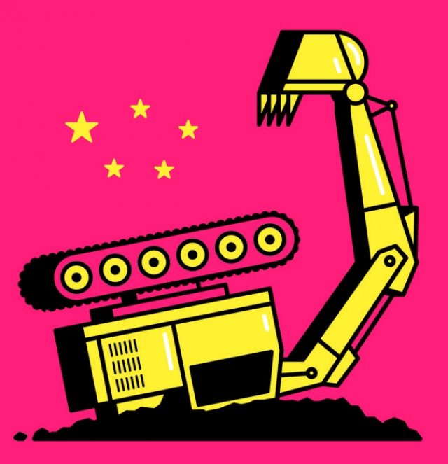

###### Banyan

# Chinese investment in infrastructure is often a diplomatic trap 

##### The Belt-and-Road Initiative creates more than economic ties 

 

> Jan 31st 2019 

 

FOR MONTHS Mahathir Mohamad has been plucking up courage to declare that, when it comes to Chinese investment in infrastructure, his is the Malaysia that can say no. At a projected cost of $20bn, the East Coast Rail Link, planned to run down peninsular Malaysia’s eastern seaboard before cutting west, is a big deal. In fact it is the second-biggest of all the projects of the Belt and Road Initiative (BRI), China’s grand scheme to improve infrastructure across scores of countries, to tie East, West and all other compass points together. 

For Dr Mahathir’s government, the link is a white elephant: the east coast is much less populated than the west. No process of competitive tenders took place when Dr Mahathir’s predecessor as prime minister, Najib Razak, awarded the construction and financing to Chinese state companies and banks. Mr Najib now faces charges over hundreds of millions of dollars missing from 1MDB, a state investment vehicle. The Malaysian government says it is investigating whether the rail link and lesser projects might have been awarded in an attempt to secure a Chinese bailout of 1MDB. 

Either way, to Malaysians deals such as the East Coast Rail Link are lopsided. The project is financed almost entirely by Chinese loans. Chinese workers, not Malaysians, are hired to do the construction work. The returns are questionable, but the bills are not. Malaysia’s government debt has been shooting up. Chinese officials describe BRI as all about openness, mutual respect and “win-win” outcomes. Malaysia’s predicament gives the lie to that. 

Yet Malaysia is clearly nervous about offending China by cancelling the deal. A minister recently announced the project was off; Dr Mahathir explained that Malaysia could not afford it. A day later, however, he reversed himself, saying no final decision had been made. There are more than fiscal considerations at stake. 

Despite China’s denials, all the concrete-pouring is a giant act of international political engineering. Bruno Maçães, a former Portuguese foreign minister and writer on BRI, argues that its spillovers into politics and society “are not a bug in the project, but its most fundamental feature”. Under way is a return of sorts to earlier, celestial concepts of power and civilisation under which China sat at the heart of things. Moral, not legal, precepts governed relations among states. They included dependence, generosity, gratitude and reciprocity—but also retribution. In the case of Malaysia, ruling-coalition politicians say the Chinese government is exceptionally annoyed. It may punish Malaysia by importing less palm oil and curbing Chinese tourism (the number of visitors is already down for Chinese new year). It is even bringing race to bear, by trying to drive a wedge between the Malaysian government and Chinese-Malaysian businessfolk, many of whom fear that China’s anger will harm their commercial interests. 

Meanwhile, others are watching closely. A report last year by the Centre for Global Development listed 23 countries involved in BRI that were at “significant” risk of debt distress. One of them, Myanmar, wants to cut the size of a port and economic zone in Rakhine state, as well as shelve for good a controversial dam on the headwaters of the Irrawaddy. Another, Pakistan, the biggest recipient of BRI projects, is facing a balance-of-payments crisis and has begged China for easier terms. Hawks making the running in the administration of President Donald Trump depict China as out to bankrupt weak governments, all the better to erode their sovereignty and dictate terms: “debt-trap diplomacy”. 

That view is certainly overstated. Opportunism, rather than centrally directed purpose, defines many of China’s belt-and-road activities. Besides, there are risks for China. In Malaysia, Myanmar, Sri Lanka and, most recently, the Maldives, democratic forces came to power in part out of revulsion over autocrats cosying up to China. In Pakistan, Chinese diplomats have been murdered by Baloch separatists who see Chinese development as a threat to their lands. And though the Chinese builder of Sri Lanka’s empty Hambantota port took control of it on a 99-year lease when the government struggled to pay interest, how China benefits from the dud project is far from clear (India has, in effect, a veto over the port’s use by the Chinese navy). Still, Malaysia’s decision is important to others. If a fairly prosperous, robust country cannot stand up to China, then poorer, weaker nations certainly won’t be able to. 

-- 

 单词注释:

1.banyan['bænjәn]:n. 印度榕树 [医] 榕树, 孟加拉榕 

2.infrastructure['infrәstrʌktʃә]:n. 基础结构, 基础设施 [经] 基础设施 

3.diplomatic[.diplә'mætik]:a. 外交的, 老练的 [法] 外交的, 外交上的, 文献上的 

4.Jan[dʒæn]:n. 一月 

5.Mahathir[]:n. (Mahathir)人名；(马来)马哈蒂尔 

6.Mohamad[]:n. (Mohamad)人名；(阿拉伯、印尼)穆罕默德 

7.Malaysia[mә'leiziә]:n. 马来西亚 [经] 马来西亚 

8.peninsular[pi'ninsjulә]:a. 半岛的 

9.seaboard['si:bɒ:d]:n. 海岸, 沿海地带 a. 海边的 

10.BRI[]:[计] 基本速率综合业务数字网 

11.les[lei]:abbr. 发射脱离系统（Launch Escape System） 

12.populate['pɔpjuleit]:vt. 使人口聚居在...中, 殖民于, 移民于, 居住于, 定居于 

13.predecessor[.predi'sesә]:n. 前任, 先辈, 前身 [医] 初牙, 前辈, 祖先 

14.najib[]:n. 纳吉彼; 纳吉布; 纳吉（人名） 

15.razak[]:[网络] 拉扎克；拉萨家族；总理拉紮克 

16.Malaysian[mә'leiziәn]:a. 马来西亚的 n. 马来西亚人 

17.lesser['lesә]:a. 较少的, 较小的, 次要的 

18.bailout['beilaut]:跳伞 

19.Malaysian[mә'leiziәn]:a. 马来西亚的 n. 马来西亚人 

20.lopside[]:n. 倾向一方 

21.entirely[in'taiәli]:adv. 完全, 全然, 一概 

22.questionable['kwestʃәnәbl]:a. 可疑的 [法] 可疑的, 有问题的, 不可靠的 

23.openness['әupәnnis]:n. 公开；宽阔；率真 

24.predicament[pri'dikәmәnt]:n. 处境, 穷境, 困局 

25.fiscal['fiskәl]:a. 财政的, 国库的 [经] 财政上的, 会计的, 国库的 

26.denial[di'naiәl]:n. 否认 [法] 否定, 否认, 拒绝接受 

27.bruno['bru:nәu]:n. 布鲁诺（男子名） 

28.spillover['spil.әuvә]:n. 溢出, 外流人口, 伴随的发展, 间接影响 [电] 流溢 

29.politic['pɒlitik]:a. 精明的, 明智的, 策略的 

30.bug[bʌg]:n. 错误, 虫, 病菌, 缺陷, 窃听器, 癖好, 防盗报警器, 双座小汽车, 要人 vt. 装防盗报警器, 装窃听器, 激怒 vi. 捉虫, 暴突 [计] 缺点, 错误 

31.celestial[si'lestjәl]:a. 天的, 天国的, 天空的 [法] 天的, 天空的, 天国的 

32.civilisation[,sivilai'zeiʃən;-li'z-]:n. 文明, 文明世界, 文化, 开化, 教化 

33.precept['pri:sept]:n. 规诫, 规矩, 格言, 训令 [经] 告诫, 指令 

34.dependence[di'pendәns]:n. 依赖, 依存, 信赖 [医] 依赖(如对药物的依赖,即瘾或癖), 从属, 偏利共生 

35.generosity[.dʒenә'rɒsiti]:n. 慷慨, 宽大 

36.retribution[.retri'bju:ʃәn]:n. 报应, 惩罚, 报酬 [法] 惩罚, 报应, 报答 

37.exceptionally[]:adv. 特殊地；异常地；例外地 

38.curb[kә:b]:n. 抑制, 勒马绳, 边石 vt. 抑制, 束缚, 勒住 

39.wedge[wedʒ]:n. 楔子, 楔形物, 起因, 导致分裂的东西 vt. 楔住, 挤进, 楔入 vi. 楔入, 挤进 

40.businessfolk[]:[网络] 商务人士 

41.Myanmar['mjænmɑ:(r)]:缅甸[东南亚国家](即Burma) 

42.Rakhine[]:[网络] 若开邦；缅甸若开邦；西部若开邦 

43.shelve[ʃelv]:vt. 放置架子上, 搁置 vi. 渐渐倾斜 

44.headwater['hed,wɔ:tә(r)]:n. [常作～s](河流)上游源头 

45.Irrawaddy[,irә'wɔdi]:伊洛瓦底江[缅甸] 

46.Pakistan[.pɑ:ki'stɑ:n]:n. 巴基斯坦 

47.recipient[ri'sipiәnt]:a. 领受的, 容易接受的, 感受性强的 n. 领受者, 容纳者, 容器 

48.donald['dɔnәld]:n. 唐纳德（男子名） 

49.trump[trʌmp]:n. 王牌, 法宝, 喇叭 vt. 打出王牌赢, 胜过 vi. 出王牌, 吹喇叭 

50.depict[di'pikt]:vt. 描述, 描写 

51.bankrupt['bæŋkrʌpt]:n. 破产者 a. 破产的 vt. 使破产 

52.erode[i'rәud]:vt. 腐蚀, 侵蚀 vi. 受腐蚀 

53.sovereignty['sɒvrәnti]:n. 主权, 独立国 [法] 主权, 主权国家, 统治权 

54.diplomacy[di'plәumәsi]:n. 外交, 外交手腕, 交际手段 [法] 外交, 外交手腕, 权谋 

55.overstate[.әuvә'steit]:vt. 夸大的叙述, 夸张, 过分强调 [经] 多计, 高估 

56.opportunism[.ɒpә'tju:nizm]:n. 机会主义 

57.centrally['sentrәli]:adv. 在中心, 在中央 

58.sri[sri]:n. 斯里兰卡（Sri Lanka）；（拉）神圣罗马帝国（Sacrum Romanum Imperium） 

59.lanka[]:n. 兰卡；楞伽 

60.Maldives['mɔ:ldaivz, 'mæl-]:马尔代夫(群岛)[亚洲岛国] 

61.revulsion[ri'vʌlʃәn]:n. 剧变, 厌恶, 强烈反感 [医] 诱导法 

62.autocrat['ɒ:tәkræt]:n. 独裁者 

63.diplomat['diplәmæt]:n. 外交官, 有外交手腕的人 [法] 外交家, 外交官, 有权谋的人 

64.baloch[]:n. (Baloch)人名；(巴基)俾路支 

65.separatist['sepәreitist]:n. 分离主义者, 独立派 

66.builder['bildә]:n. 建立者 [机] 组份 

67.Hambantota[]:[地名] 汉班托特 ( 斯里 ) 

68.lease[li:s]:n. 租约, 租期, 租 vt. 出租, 租出, 租得 

69.dud[dʌd]:n. 衣服, 哑弹, 无用物 a. 无用的 

70.veto['vi:tәu]:n. 否决权 vt. 否决, 禁止 

71.robust[rәu'bʌst]:a. 健康的, 强健的, 要用力气的, 坚定的, 粗野的 [计] 健壮性 

72.cannot['kænɒt]:aux. 无法, 不能 

