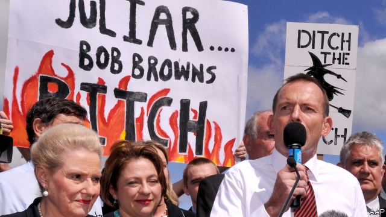

###### Sex and the subcommittee

# Female politicians in Australia complain of discrimination 

##### Less than a fifth of the Liberal party’s members in the lower house are women 

 

> Jan 31st 2019 

 

IN NOVEMBER ONE of the rising stars of Australia’s governing coalition, Julia Banks, shocked her colleagues by quitting the Liberal party to become an independent. She was sick, she said, of her party’s “cultural and gender bias, bullying and intimidation”. The announcement was a practical blow, further reducing the ranks of a government that was already a minority. But mainly it was an embarrassment, adding credence to the increasingly common complaint that the party is a slough of sexism. In January a second prominent Liberal, Kelly O’Dwyer, announced plans to resign. Last year she had complained that voters see her colleagues as “homophobic, anti-women climate-change deniers”. 

Less than a fifth of Liberal members of the lower house are women—a smaller proportion than 20 years ago. Conditions for the few who remain are rotten. Allegations of harassment have abounded since a moderate prime minister, Malcolm Turnbull, was overthrown in a right-wing coup in August. His redoubtable deputy, Julie Bishop, lost the leadership contest that followed, and several women complained of strong-arming by the putschists. Ms Bishop quit as foreign minister and returned to the backbenches, calling their behaviour “appalling”. There is speculation that she too may resign before the general election due in May. 

The Liberals have an inglorious record on these issues. During their most recent stint in opposition, several in their ranks subjected Australia’s first and only female prime minister, Julia Gillard, to a torrent of abuse with sexist undertones. Ms Gillard, who is not married but lives with her partner, should “make an honest woman of herself”, railed Tony Abbott, the Liberal leader at the time. He later gave a speech in front of posters that labelled Ms Gillard a “witch” and a Green senator’s “bitch”. 

No party is spotless, however. Sarah Hanson-Young, another Green senator, is suing an independent opponent who directed her to “stop shagging men” during a recent debate on women’s safety. Complaints of toxic masculinity hang over state and local government, too. Labor’s leader in New South Wales resigned last year over allegations that he sexually harassed a journalist at a Christmas party. The mayor of Melbourne was toppled when two colleagues accused him of groping. (Both men deny the claims.) 

Some politicians believe sexism can be curbed through a new code of parliamentary conduct. A better solution might be to draw more women into politics to start with. In the 1990s the Labor party introduced quotas guaranteeing that women would be selected as candidates in a steadily rising share of left-leaning seats. Almost half its MPs are now female, a nearly fivefold increase since this system was adopted. Labor’s deputy leader, Tanya Plibersek, says this has altered attitudes in her party: “When you have a critical mass, it’s a better workplace for every woman.” 

The Liberals have been slow to acknowledge their shortcomings. Some argue that verbal attacks are part of politics and female lawmakers should toughen up. Women in the party say their complaints are met with eye-rolling or accusations of “hysteria”. The leadership rejects quotas on the basis that politicians should be chosen on merit. That is subjective, however, especially for new candidates. Women complain that good female ones are often rejected. “Look at some of the men who have been pre-selected,” scoffs one conservative. “Don’t tell me it’s about merit.” 

The Liberals have adopted a target to have equal numbers of male and female MPs by 2025. But unlike Labor’s quotas, this goal is not binding. Few observers think it will be reached. Many of the Liberals’ incumbent women hold marginal seats, which will be lost if the party is trounced in the impending election. So far, the Liberals have selected only six female candidates to contest safe conservative seats, by the count of William Bowe, a political analyst. At that rate, the party may emerge from the election even more male-dominated than it was to start with. 

-- 

 单词注释:

1.subcommittee['sʌbkә.miti]:n. 小组委员会 

2.les[lei]:abbr. 发射脱离系统（Launch Escape System） 

3.Jan[dʒæn]:n. 一月 

4.coalition[.kәuә'liʃәn]:n. 结合体, 结合, 联合 [经] 联合, 联盟 

5.julia['dʒu:ljә]:n. 朱莉娅（女子名） 

6.cultural['kʌltʃәrәl]:a. 文化的, 教养的, 修养的 [医] 培养的 

7.gender['dʒendә]:n. 性 vt. 产生 

8.bias['baiәs]:n. 偏见, 斜纹 a. 偏斜的 adv. 偏斜 vt. 使有偏见 [计] 偏流; 偏压; 偏磁; 偏离 

9.bully['buli]:n. 欺凌弱小者, 土霸 vt. 威胁, 恐吓, 欺负 vi. 欺负 a. 特好的, 第一流的 adv. 十分 

10.intimidation[in,timi'deiʃәn]:n. 恐吓, 威胁 [法] 恐吓, 威胁 

11.embarrassment[im'bærәsmәnt]:n. 困难, 阻碍, 困窘 [医] 窘迫 

12.credence['kri:dәns]:n. 信任, 祭器台, 供桌, 凭证 [法] 设计人, 创立人, 创设人 

13.slough[slau]:n. 泥沼, 沼泽, 蜕下的皮, 腐肉 vt. 使陷入泥沼, 使沉沦, 脱落, 抛弃 vi. 在泥浆中跋涉, 蜕皮, 脱落 

14.sexism['seksizm]:n. 性别歧视, 歧视女性 

15.Kelly['keli]:n. 凯利（男子名）；[古]战士 

16.voter['vәutә]:n. 选民, 投票人 [法] 选民, 选举人, 投票人 

17.homophobic[,hɔmə'fəubik]:a. 害怕同性恋的 

18.denier[di'naiә]:n. 否认者, 法国往昔银币, 一小笔钱 [化] 旦尼尔; 旦; (曾用) 

19.allegation[.æli'geiʃәn]:n. 断言, 主张, 申辩 [法] 声明, 事实陈述, 断言 

20.harassment['hærәsmәnt]:n. 困扰, 烦扰, 烦恼 [法] 折磨, 骚扰, 侵扰 

21.abound[ә'baund]:vi. 大量存在, 富于, 充满 

22.malcolm[]:n. 马尔科姆（男子名） 

23.Turnbull[]:n. 特恩布尔（姓氏） 

24.overthrow[.әuvә'θrәu]:n. 推翻, 瓦解, 倾覆 vt. 打倒, 推翻, 倾覆 

25.coup['ku:]:n. 砰然的一击, 妙计, 出乎意料的行动, 政变 [医] 发作, 中, 击 

26.redoubtable[ri'dautәbl]:a. 可怕的, 厉害的, 可敬的 

27.julie[]:n. 朱莉（女子名） 

28.putschists[]:[网络] 凶手 

29.backbench['bækbentʃ]:n. 后座议员席 a. 后座议员的 

30.appalling[ә'pɒ:liŋ]:a. 骇人的, 令人震惊的 

31.speculation[.spekju'leiʃәn]:n. 沉思, 推测, 投机 [经] 投机交易, 买空卖空 

32.inglorious[in'glɒ:riәs]:a. 不名誉的, 可耻的, 不出名的 

33.stint[stint]:vt. 节省, 限制, 停止 vi. 节约 n. 吝惜, 节约, 限额 

34.opposition[.ɒpә'ziʃәn]:n. 反对, 敌对, 相反, 在野党 [医] 对生, 对向, 反抗, 反对症 

35.gillard[]: [人名] 吉拉德 

36.sexist['seksist]:n. 性别歧视者 

37.undertone['ʌndәtәun]:n. 低音, 浅色, 小声 

38.tony['tәuni]:a. 高贵的, 时髦的 

39.Abbott['æbət]:n. 阿尔伯特（人名）；雅培（公司名） 

40.witch[witʃ]:n. 巫婆, 女巫 vt. 施巫术, 迷惑 

41.bitch[bitʃ]:n. 母狗；泼妇；讨厌的女人；棘手的事 v. 挖苦；（尤指背后）说坏话 

42.spotless['spɒtlis]:a. 无脏污的, 无缺点的, 无可挑剔的 

43.Sarah['sєәrә]:n. 萨拉(<<圣经>>故事人物) 

44.senator['senәtә]:n. 参议员, (某些大学的)理事 [法] 参议员, 上议员 

45.sue[su:]:vt. 控告, 起诉, 请求 vi. 提出诉讼, 提出请求 

46.shag[ʃæg]:n. 粗毛, 蓬乱一团 vt. 使蓬松, 使杂乱 vi. 蓬松 

47.toxic['tɒksik]:a. 有毒的, 中毒的 [医] 中毒的, 毒物的 

48.masculinity[.mæskju'liniti]:n. 男子气, 刚毅, 大丈夫气概 [医] 男子本性, 男性 

49.wale[weil]:n. 隆起的伤痕, 鞭痕, 凸条纹, 精华, 选择 vt. 在...上留下鞭痕, 织成棱纹, 挑选, 撑住 vi. 挑选 

50.sexually[]:adv. 性别地；两性之间地 

51.harass['hærәs]:vt. 使困扰, 使烦恼, 折磨 

52.Melbourne['melbәn]:n. 墨尔本 

53.topple['tɒpl]:vt. 推翻, 颠覆 vi. 倒塌, 摇摇欲坠 

54.grope[grәup]:v. 摸索 n. 摸索 

55.curb[kә:b]:n. 抑制, 勒马绳, 边石 vt. 抑制, 束缚, 勒住 

56.parliamentary[.pɑ:lә'mentәri]:a. 国会的, 议会的, 议会制度的 

57.politic['pɒlitik]:a. 精明的, 明智的, 策略的 

58.labor['leibә]:n. 劳动, 努力, 工作, 劳工, 分娩 vi. 劳动, 努力, 苦干 vt. 详细分析, 使厌烦 

59.quota['kwәutә]:n. 配额, 限额 [化] 定额 

60.MP[]:国会议员, 下院议员 [计] 宏处理程序, 维护程序, 线性规划, 微程序, 多处理器 

61.fivefold['faivfәuld]:a. 五重的, 五倍的 adv. 五重地, 五倍地 

62.tanya['tænjә]:n. 塔尼娅（女子名） 

63.verbal['vә:bl]:a. 用言辞的, 言语的, 口头的, 逐字的, 动词的 [医] 言语的, 口述的 

64.lawmaker[lɒ:'meikә]:n. 立法者 

65.toughen['tʌfn]:v. (使)变坚韧, (使)变顽强 

66.accusation[ækju:'zeiʃәn]:n. 控告, 指控, 指责 [法] 控告, 起诉, 告发 

67.hysteria[his'tiәriә]:n. 歇斯底里症, 不正常的兴奋, 癔病 [医] 癔病, 歇斯底里 

68.scoff[skɒf]:n. 嘲笑, 愚弄, 笑柄, 食品 v. 嘲笑, 嘲弄, 贪吃, 狼吞虎咽地吃 

69.incumbent[in'kʌmbәnt]:a. 现任的, 依靠的, 负有义务的 n. 领圣俸者, 在职者 

70.marginal['mɑ:dʒinәl]:a. 边缘的, 最低限度的, 有旁注的 [医] 缘的 

71.trounce[trauns]:vt. 痛打, 严惩 

72.impend[im'pend]:vi. 迫近, 威胁, 悬挂 

73.william['wiljәm]:n. 威廉（男子名）；[常作W-][美俚]钞票, 纸币 

74.Bowe[]:n. 鲍（男子名） 

75.analyst['ænәlist]:n. 分析者, 精神分析学家 [化] 分析员; 化验员 

