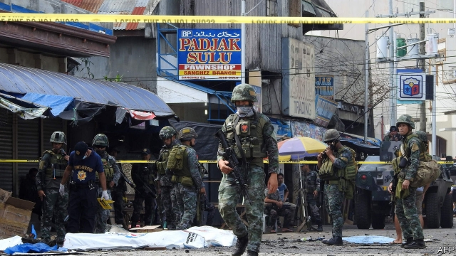
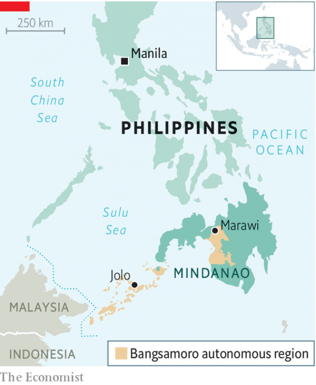

###### Not going quietly

# Jihadists bomb a church in the Philippines 

##### The attack follows a vote to enhance autonomy in Muslim areas 

 

> Jan 31st 2019 

 

THE FIRST blast came during mass on January 27th in the cathedral of Jolo, an island at the southern extreme of the Philippines. The second detonated as soldiers were rushing to the scene and the terrified congregation was fleeing. Together they killed at least 20 people and wounded scores more. 

The bombings also dented hopes that a new era of peace had arrived in the heartland of the Muslim minority in the otherwise Christian country. Filipino followers of Islamic State set off the bombs just six days after mainly Muslim areas in the south of the country had approved by plebiscite a scheme to enhance the region’s autonomy. The vote, held as part of a peace agreement with a larger Muslim group, was intended to end 50 years of separatist rebellion. The presumption is that extremists were hoping to derail this process, or at least demonstrate that they were not mollified by it. 

Rodrigo Duterte, the president, blamed the attack on Abu Sayyaf, a loose grouping of bands of armed Muslim Filipinos notorious for moneymaking crimes such as kidnapping for ransom. Some factions within Abu Sayyaf have pledged allegiance to Islamic State. The latter’s statements claiming responsibility for the attack said only that its followers had struck a “crusader temple”, without reference to politics. But it is probably no coincidence that the bombing came so soon after the plebiscite, in which 87% of the 2m voters of the largely Muslim areas of the south voted in favour of the creation of the “Bangsamoro Autonomous Region” (see map). 

 

Much of the island of Mindanao and surrounding, smaller islands already enjoy a form of autonomy, including the power to levy local taxes and to set up sharia courts. That is the result of a peace deal with the Moro National Liberation Front, the main separatist group, in 1996. But a splinter group called the Moro Islamic Liberation Front (MILF) fought on until 2014, when it struck a deal with the central government to increase the authority of the autonomous one. It will now receive fixed transfers from the central government, as well as retaining a greater share of tax revenue from the region. The president will no longer have the power to suspend the regional governor. The governor, meanwhile, will have the power to appoint the head of the local police force. The new deal is a “peacock” compared with the “chicken” of the existing system of autonomy, the MILF insists. A second plebiscite, on expanding the autonomous region, will be held on February 6th. 

The political settlement is meant to do more than end a war that has killed tens of thousands of people. The MILF and the government alike hope peace in Mindanao will allow the economy of the resource-rich region to develop, reducing poverty and so soothing Muslim disaffection in a virtuous cycle. Generations of armed, unemployed Muslims have grown up knowing nothing but lawlessness and war. They have been easily recruited by groups like Abu Sayyaf, with promises of either earthly riches (obtained through kidnapping, robbery and extortion) or an eternity in paradise for battling the enemies of Islam. 

Talk of jihad against the Christian central government reached its zenith in 2017, when armed followers of Islamic State occupied the centre of the city of Marawi in Mindanao. Government forces eventually succeeded in dislodging the occupiers, but the battle took weeks and destroyed much of the city. 

The army has been trying to mop up the remnants of the force that seized Marawi. But even though Abu Sayyaf is thought to number only a few hundred fighters, the government has not managed to eradicate it despite nearly 25 years of trying. It hopes that greater peace and prosperity will help to drain the pool from which the jihadists recruit. In the meantime, the jihadists are bound to mount further attacks. But the plebiscite showed that the tide of Filipino Muslim sentiment is running against the men of violence—even though it may take time to sweep them away. 

-- 

 单词注释:

1.quietly['kwaiәtli]:adv. 安静地, 沉着地, 秘密地 

2.jihadist[]:n. 伊斯兰圣战士 

3.Philippine['filipi:n]:a. 菲律宾(群岛)的, 菲律宾人的 

4.autonomy[ɒ:'tɒnәmi]:n. 自治, 自治权 [医] 自主性 

5.Muslim['mjzlim; (?@) 'mʌzlem]:n. 伊斯兰教, 伊斯兰教教徒 

6.Jan[dʒæn]:n. 一月 

7.Jolo['hәjlәj]:n. 霍洛岛(或和乐岛, 属菲律宾) 

8.detonate['detәneit]:vt. 引爆, 使爆炸, 使爆裂 vi. 爆炸, 发爆炸声 

9.congregation[.kɒŋgri'geiʃәn]:n. 集合, 聚集 [法] 集会, 人一, 红衣主教会议 

10.bombing['bɔmiŋ]:n. 轰炸, 投弹 

11.dent[dent]:n. 凹痕 vt. 使凹下, 削弱 vi. 塌陷 

12.heartland['hɑ:tlænd]:n. 心脏地区, 中心地带 

13.Filipino[.fili'pi:nәu]:n. 菲律宾人 

14.follower['fɒlәuә]:n. 从者, 属下, 追补者 [电] 随动机 

15.Islamic[iz'læmik]:a. 伊斯兰教的, 穆斯林的 

16.plebiscite['plebisit, -sait]:n. 公民投票, 平民表决 

17.separatist['sepәreitist]:n. 分离主义者, 独立派 

18.presumption[pri'zʌmpʃәn]:n. 专横, 放肆, 假定, 推测 [法] 假定, 推测, 设想 

19.extremist[iks'tri:mist]:[经] 偏激份子 

20.derail[di'reil]:vt. 使出轨 n. 脱轨器 [计] 转移指令 

21.mollify['mɒlifai]:vt. 平息, 缓和, 减轻, 使变软 

22.Rodrigo[]:n. 罗德里戈（歌曲名称） 

23.duterte[]:[网络] 迪泰特 

24.abu[]:abbr. 亚洲广播联盟（Asian Broadcast Union） 

25.sayyaf[]:[网络] 抗苏战士西亚 

26.grouping['gru:piŋ]:n. 分组 [计] 组 

27.Filipino[.fili'pi:nәu]:n. 菲律宾人 

28.notorious[nәu'tɒ:riәs]:a. 声名狼藉的, 臭名昭著的, 众人皆知的 

29.moneymaking['mʌni.meikiŋ]:a. 热心赚钱的；会赚钱的；赚钱的 

30.kidnap['kidnæp]:vt. 绑架, 诱拐, 拐骗 [法] 拐带, 诱拐, 绑架 

31.ransom['rænsәm]:n. 赎金, 赎身, 赎回 vt. 赎, 赎身, 赎回, 勒索赎金 

32.faction['fækʃәn]:n. 小派系, 内讧 [法] 宗派, 派别, 小集团 

33.pledge[pledʒ]:n. 诺言, 保证, 誓言, 抵押, 信物, 保人, 祝愿 vt. 许诺, 保证, 使发誓, 抵押, 典当, 举杯祝...健康 

34.allegiance[ә'li:dʒәns]:n. 忠贞, 效忠 

35.crusader[kru:'seidә]:n. 十字军战士, 改革者 

36.politic['pɒlitik]:a. 精明的, 明智的, 策略的 

37.voter['vәutә]:n. 选民, 投票人 [法] 选民, 选举人, 投票人 

38.creation[kri:'eiʃәn]:n. 创造, 创作物, 发明 [化] 产生 

39.Bangsamoro[]:[网络] 邦萨摩洛；洛国；新莫洛国 

40.Mindanao[,mindɑ:'nau]:棉兰老岛[菲律宾东南部](或译民大那峨岛) 

41.levy['levi]:n. 税款, 所征的人数, 征收 vi. 征税, 课税 vt. 征收, 强求, 召集 

42.sharia[ʃә'ri:ә]:n. 伊斯兰教教法 

43.Moro['mәurәu]:n. 摩洛族, 摩洛语 

44.splinter['splintә]:n. 碎片, 尖片, 分裂出来的小派别, 微小的东西 v. 使分裂, (使)破裂 

45.milf[]:abbr. （菲律宾）摩洛伊斯兰解放阵线（Moro Islamic Liberation Front） 

46.regional['ri:dʒәnәl]:a. 地方的, 地域性的 [医] 区的, 部位的 

47.peacock['pi:kɒk]:n. 孔雀, 好炫耀的人 vi. 炫耀, 神气活现地行走 

48.tens[]:十位 

49.soothe[su:ð]:vt. 缓和, 使安静, 安慰, 奉承 vi. 起安慰作用 

50.disaffection[.disә'fekʃәn]:n. 不满, 不平, 背叛 [法] 挑唆背判, 离判, 不满 

51.virtuous['vә:tʃuәs]:a. 品德高尚的, 公正的, 贞洁的, 有效力的 

52.unemployed[.ʌnim'plɒid]:a. 失业的, 未被利用的 [经] 没有被雇用的, 失业的, 没有被利用的 

53.Muslim['mjzlim; (?@) 'mʌzlem]:n. 伊斯兰教, 伊斯兰教教徒 

54.lawlessness['lɔ:ləsnəs]:n. 不服从法律; 不受法律制约; 未实施法律; 目无法纪 

55.earthly['ә:θli]:a. 地球的, 俗世的, 可能的 

56.riche[]:n. 暴发户 

57.extortion[ik'stɒ:ʃәn]:n. 勒索, 敲诈, 强取 [经] 勒索, 强夺 

58.eternity[i'tә:niti]:n. 永远, 来世, 不朽 

59.Islam['izlɑ:m]:n. 伊斯兰教 

60.jihad[dʒi'hɑ:d]:n. 讨伐异教徒, 拥护运动 

61.zenith['zeniθ. 'zi:-]:n. 顶点；最高点；顶峰 

62.Marawi[]:[地名] 马拉维 ( 菲 ) 

63.dislodge[dis'lɒdʒ]:vt. 逐出, 使移动, 驱逐 vi. 离开原位 

64.occupier['ɔkjjpaiә(r)]:n. 占用者, 居住者, 军事占领者 [法] 占用者, 居住者, 军事占领者 

65.remnant['remnәnt]:n. 剩余, 零料, 遗迹 a. 剩余的, 残余的 

66.eradicate[i'rædikeit]:vt. 根除, 扑灭, 根绝, 消灭 

67.sentiment['sentimәnt]:n. 感情, 感伤, 情操, 情绪, 感想, 意见 [医] 情感, 情操 

