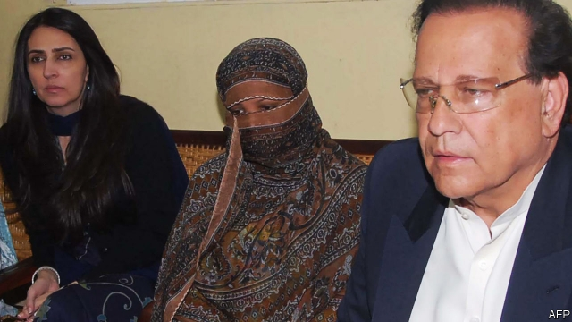

###### Blasphemy laws

# Pakistan’s Supreme Court upholds Asia Bibi’s acquittal 

##### A Christian woman who spent years on death row has been released, at last 

 

> Jan 31st 2019 

THE FIRST time Pakistan’s Supreme Court ordered Asia Bibi released, in October, the country erupted in protest. The Christian woman had been sentenced to death for blasphemy in the lower courts after being accused by Muslim neighbours of insulting the prophet Muhammad after they balked at sharing a jug of water with an infidel. Zealots from a group called Tehreek-e-Labbaik Pakistan took to the streets, demanding Ms Asia’s execution no matter what the courts said. The government, intimidated by the protests, agreed to keep Ms Asia in the country while the TLP requested a review of the ruling. But when the court rejected that request this week, upholding her acquittal, the government was better prepared. The leader of the TLP, Khadim Rizvi, has been under arrest since November. Some 3,000 other TLP activists have also been detained. Unsurprisingly, the protests that greeted the new ruling have been muted. 

-- 

 单词注释:

1.blasphemy['blæsfәmi]:n. 亵渎神明, 亵渎神明的言词 [法] 冒秽罪, 侮辱, 亵秽 

2.uphold[ʌp'hәuld]:vt. 支撑, 赞成, 鼓励, 举起, 坚持 [法] 确认, 赞成, 支持 

3.acquittal[ә'kwitәl]:n. 履行, 无罪开释 [经] (债务的)清偿 

4.Jan[dʒæn]:n. 一月 

5.bibi[]:n. 周笔畅 

6.blasphemy['blæsfәmi]:n. 亵渎神明, 亵渎神明的言词 [法] 冒秽罪, 侮辱, 亵秽 

7.Muslim['mjzlim; (?@) 'mʌzlem]:n. 伊斯兰教, 伊斯兰教教徒 

8.prophet['prɒfit]:n. 预言者, 先知, 提倡者 

9.muhammad[]:n. 穆罕默德 

10.balk[bɒ:k]:n. 障碍, 错误, 失败 vt. 阻止, 错过, 推诿 vi. 逡巡不前 

11.jug[dʒʌg]:n. 水壶, 监牢, 模仿夜莺的叫声 vt. 放入壶中, 炖, 关押 vi. 模仿夜莺叫 

12.infidel['infidl]:a. 不信神的, 无信仰的, 异端的 n. 无信仰者, 异教徒, 异端 

13.zealot['zelәt]:n. 热心者, 狂热者, 犹太教狂热信徒 [法] 狂热分子, 激烈分子 

14.Pakistan[.pɑ:ki'stɑ:n]:n. 巴基斯坦 

15.execution[.eksi'kju:ʃәn]:n. 实行, 完成, 执行, 死刑 [计] 执行 

16.tlp[]:abbr. termlimit pricing 期限条款限制的定价; threshold learning process 入门学习过程; time-lapse photography 时滞; 时延 

17.khadim[]:[网络] 哈迪姆 

18.rizvi[]:[网络] 里兹唯 

19.activist['æktivist]:n. 激进主义分子 

20.detain[di'tein]:vt. 扣留, 扣押, 耽搁 [法] 拘留, 扣押, 留住 

21.unsurprisingly[]:adv. 不出所料的；不出奇的；意料中的 

