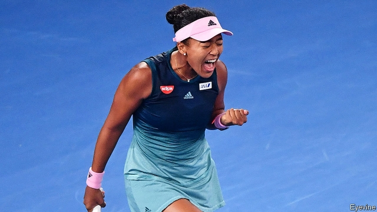

###### Hafuway there

# What does Naomi Osaka reveal about Japan’s racial attitudes? 

##### The tennis champion must soon choose whether to remain Japanese 

 

> Jan 31st 2019 

 

WHEN NAOMI OSAKA won the Australian Open on January 26th and became the world’s top-ranked female tennis player, the inhabitants of her mother’s home town of Nemuro, on Japan’s northernmost island, Hokkaido, celebrated. Congratulatory banners adorned the city hall. Townsfolk flocked to see the display of autographed rackets, clothing and other tennis paraphernalia inside. In interviews her grandfather praised her performance. 

That may not seem strange, but in Japan people are typically considered Japanese only if they have two Japanese parents, speak fluent Japanese, look the part and “act Japanese”. Ms Osaka grew up in America and is only hafu (half) Japanese; her father is Haitian. She is more comfortable speaking English than Japanese (or Creole). Her grandfather at first disowned her mother when she told him she was seeing a foreign man. 

For some, Japan’s embrace of Ms Osaka is hypocritical: everyone loves a winner. That view seemed to be vindicated when Nissin, a noodle-maker, ran an advert featuring Ms Osaka in which her skin and hair were lightened. (After complaints, the firm withdrew it.) Although Japanese television has long featured mixed-race celebrities, they serve as novelties. Life for non-famous hafu remains tough, with bullying in schools commonplace. 

Japan may be becoming more tolerant of those who are different, however. Ms Osaka has been more warmly embraced than past half-Japanese winners of beauty pageants, for instance. “Having someone like Naomi Osaka represent Japan on the international stage would not have been possible a few decades ago,” says Megumi Nishikura, a hafu herself and a co-director of the film “Hafu”. 

To some degree it is a question of numbers: 3.4% of married Japanese have a foreign spouse and three times more foreigners live and work in the country today than a decade ago. Yet the fact that the Nissin advert made it into production is “a clear indicator of the challenges that remain”, says Ms Nishikura. Since Japan does not technically allow dual citizenship for those over 22, Ms Osaka will in theory have to choose in October whether she feels Japanese enough to renounce her American citizenship and continue to play as Japanese. 

-- 

 单词注释:

1.naomi['neiәmi]:n. 内奥米（女子名, 圣经中人物） 

2.Osaka[әu'sɑ:kә]:[经] 大阪 

3.Jan[dʒæn]:n. 一月 

4.naomi['neiәmi]:n. 内奥米（女子名, 圣经中人物） 

5.Osaka[әu'sɑ:kә]:[经] 大阪 

6.Nemuro[]:[地名] 根室 ( 日 ) 

7.northernmost['nɒ:ðәnmәust]:a. 最北的 

8.hokkaido[hɔ'kaidәu]:n. 北海道（日本第二大岛） 

9.congratulatory[kәn'grætʃәlәtәri]:a. 庆祝的, 祝贺的 

10.adorn[ә'dɒ:n]:vt. 装饰, 使生色 

11.townsfolk[]:n. 镇民, 市民, 城里生长的人, 城镇居民 

12.autograph['ɒ:tәugrɑ:f]:n. 亲笔, 亲笔签名, 手稿 vt. 亲笔签名于, 亲笔写 

13.paraphernalia[.pærәfә'neiliә]:n. 随身用具 

14.typically['tipikәli]:adv. 代表性地；作为特色地 

15.hafu[]:[网络] 哈佛；女性；半全场 

16.Haitian['heitiәn]:a. 海地的 n. 海地人, 海地语 

17.Creole['kri:әul]:n. 克里奥耳人, 克里奥耳语, 克里奥耳人所讲的法语 a. 克里奥耳人的, 克里奥耳式法语的 

18.disown[dis'әun]:vt. 否认 [计] 不认, 驱逐 

19.vindicate['vindikeit]:vt. 辩护, 证明...无辜, 维护 [法] 辩护, 辩解, 辩明 

20.advert[әd'vә:t]:vi. 提出看法, 引起注意, 留意 n. 广告 

21.celebrity[si'lebrti]:n. 名声, 名人 

22.novelty['nɒvәlti]:n. 新奇, 新鲜, 新奇的事物 

23.bully['buli]:n. 欺凌弱小者, 土霸 vt. 威胁, 恐吓, 欺负 vi. 欺负 a. 特好的, 第一流的 adv. 十分 

24.commonplace['kɒmәnpleis]:n. 寻常事, 老生常谈, 普通的东西 a. 平凡的, 普通的 

25.tolerant['tɒlәrәnt]:a. 宽容的, 容忍的, (对冷、热)能耐的 [医] 能耐受的 

26.warmly['wɒ:mli]:adv. 亲切地, 温暖地, 热心地 

27.pageant['pædʒәnt]:n. 盛会, 游行, 虚饰, 露天表演 

28.megumi[]:n. (Megumi)人名；(日)惠(姓) 

29.hafu[]:[网络] 哈佛；女性；半全场 

30.spouse[spauz]:n. 配偶 

31.indicator['indikeitә]:n. 指示器, 指示剂, 指标 [计] 指示器 

32.technically['teknikli]:adv. 技术上, 学术上, 专门地 

33.dual['dju:әl]:a. 双重的, 双的 n. 双数 

34.citizenship['sitizәnʃip]:n. 国籍, 市民权, 市民的身份 [法] 公民权, 公民资格, 公民身分 

35.renounce[ri'nauns]:vt. 拒绝, 放弃, 否认, 垫牌 vi. 垫牌, 声明放弃权利 n. 垫牌 

