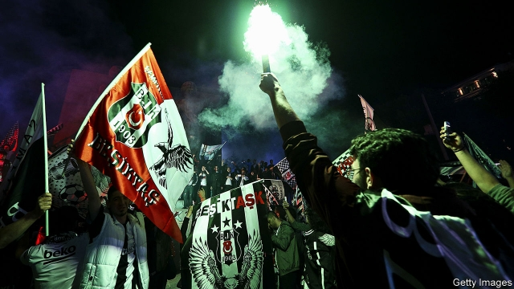

###### Believe, boys, believe

# In Turkey, football is an outlet for dissent 

##### But the government’s influence is spreading—in the stands and on the pitch 

 

> Jan 31st 2019 

 

THE RITUAL begins before dusk, at one of the restaurants in Besiktas, a neighbourhood perched on Istanbul’s European shore, with fish, meze and raki, or in a local square, with stuffed mussels from Ahmet’s, meatballs grilled by a headscarved auntie, and canned beer. Always, there is music. Fans swathed in black and white, the colours of Besiktas football club, roar out its anthems. One decries the state of the world. Another speculates about the sexual habits of rival teams. A couple of men dance to the shrill, spellbinding tune of a Roma musician’s zurna pipe and the beat of a large drum. Someone lights a red flare. 

Soon crowds stream from the taverns and march southwards, along the Bosphorus, the waterway that cleaves the city between two continents. They advance past the Naval Museum and the sumptuous Dolmabahce Palace, from which the last Ottoman sultans observed the collapse of their empire, past the adjacent mosque where the call to prayer booms out, past honking cars and troubadours eulogising Mustafa Kemal Ataturk, modern Turkey’s founding father, and into the stadium. 

And then the true delirium begins. These days, many football matches in Europe have the air of a family picnic, interrupted only sporadically by a chant or applause. Besiktas fixtures resemble choreographed riots. The fans once set the world record (at 132 decibels, as ear-splitting as a fighter jet during take-off) for the loudest crowd at a game. Moments before the match starts they hush into silence, then begin to hum, first softly, then louder, like a colossal swarm of bees. At kick-off, the swarm erupts into song. The chanting persists until the final whistle. In a stadium with more than 40,000 seats, practically no one ever sits down. 

Attend a Besiktas match, or almost any other in Turkey, lap up the revelry and the anthems, and you might think football has survived the country’s descent into autocracy unscathed. It has not. As in most places, only more so, politics and football (and business) have always been intertwined in Turkey, never more tightly than in the tumultuous past decade. “Believe, boys, believe,” bellow the denizens of Besiktas’s northern stands. “Sunny days will come,” answer their counterparts at the southern end of the stadium. Many are talking about more than just the game. 

The man whose words inspired that song, Nazim Hikmet, was a Marxist poet who died in exile in 1963 after more than a decade behind bars. Besiktas fans have traditionally been attracted to leftist causes, and to dissent. The Carsi—as the most hardcore Besiktas supporters are known—draw the a in their name in the shape of the symbol for anarchism. They have turned protest into an art form. Using banners often stitched from bedsheets, they have protested against racism, the murder of an Armenian journalist by a teenage nationalist, dam construction in Turkey’s south-east and nuclear power plants in the north. They even protest against themselves. “Carsi is against everything,” proclaims one popular banner. “Carsi is against itself too,” reads another. 

Football fans, and especially the Carsi, were in the vanguard of anti-government protests in 2013, and bore the brunt of the resulting crackdown. During one demonstration, supporters clashed with police near the residence of Turkey’s president, Recep Tayyip Erdogan. Months later, 35 were charged with forming a terrorist group and attempting to bring down the government. (They faced life sentences, but were acquitted after a lengthy trial.) The same year, the government outlawed the chanting of political slogans at games. Then the league launched a new electronic ticketing system (operated by a subsidiary of a firm once run by Mr Erdogan’s son-in-law, Berat Albayrak, the finance minister), which made it easier to monitor offenders. 

The new system has curbed hooliganism, which plagued Turkish football for decades. It has also helped throttle dissent. “They’ve turned us from fans into spectators, and then into customers,” says Cem Yakiskan, a Carsi leader. Both inside the stadiums and in the country at large, the squeeze on free expression has sharpened since 2016, when an army faction backed by members of the Gulen movement, a powerful Islamic sect once allied to Mr Erdogan, staged a bloody coup attempt. 

At a Besiktas game two years ago, a group of fans unfurled a banner in support of two teachers who went on hunger strike after being dismissed (along with 125,000 other government employees) in the wake of the abortive coup. The fans were detained on terror charges. Around the same time, the league fined a club from Diyarbakir, the heart of the south-east region where Kurds form a majority, for changing its name to Amedspor, after the city’s Kurdish moniker. One of the team’s players was recently banned from professional football and given a suspended 18-month sentence for “terrorist propaganda”. He had criticised a military offensive against Kurdish separatists and expressed sympathy with its victims. 

Along with Fenerbahce, Galatasaray and Trabzonspor, Besiktas is one of four clubs that have dominated Turkish football for as long as anyone can remember. Between them, they have won the league championship in all but one of the past 60 years. Success has been costly: expensive players have pushed the clubs deep into the red. Yet because football fans are voters, and because nearly every Turk is a fan, governments have had no qualms about saving the best-loved teams from bankruptcy. In January Turkey’s banking association announced that it would restructure the debts of all the clubs in the top division. 

Money has not always been the only thing at stake, however. In 2011 Aziz Yildirim, then Fenerbahce’s chairman, was arrested on match-fixing charges, along with dozens of players, coaches and referees. He claimed to have been framed by the Gulenists. When the alliance between the government and the Gulenists crumbled, so did the case against Mr Yildirim. Convicted by one court in 2012, he was acquitted by another three years later. In 2016 policemen and lawyers involved in the probe were themselves arrested. The scandal is so mired in the country’s noxious politics, writes John McManus in “Welcome to Hell?”, an engaging book about football and Turkish society, that determining what actually happened may be impossible. 

Now the government’s influence is making the leap from the stands to the pitch. Lately the big four have been challenged by Istanbul Basaksehir, which joined the top league only a decade ago. It takes its name from a sprawling neighbourhood on the city’s outskirts, home to the sort of conservative voters who form the backbone of Mr Erdogan’s Justice and Development (AK) party. The chairman is a relative of Mr Erdogan’s wife. The stadium was built by a firm with a knack for winning big government tenders. 

Basaksehir has surprisingly deep pockets. Its squad includes Turkey’s most recognisable player, Arda Turan, as well as several foreign stars. These assets have not translated into popularity: despite Mr Erdogan’s exhortations for young AK voters to go to home games, the average attendance is under 4,000. The stands are empty. But the team is winning. With four months of the season to go, it is set fair to win the title. 

For Basaksehir and its powerful backers, those sunny days seem to have come. To some Turkish fans, the game they love, which was once an arena for opposition politics, seems increasingly to have been tainted by authoritarianism. 

-- 

 单词注释:

1.dissent[di'sent]:n. 异议 vi. 持异议, 不同意 

2.Jan[dʒæn]:n. 一月 

3.ritual['ritʃuәl]:n. 仪式, 典礼, 宗教仪式 a. 仪式的, 依仪式进行的 

4.besikta[]:[网络] 开往贝希克塔斯 

5.perch[pә:tʃ]:n. 栖木, 高位, 杆, 河鲈 v. (使)栖息, 就位, 位于, (使)暂歇 

6.meze[]: （中东、希腊和土耳其等地餐前的）什锦开胃小吃 

7.raki[rɑ:'ki:,'ræki]:n. 葡萄酒, 梅酒 

8.mussel['mʌsl]:n. 贻贝, 珠蚌 [医] 贝壳类, 蛤贝 

9.meatball['mi:tbɒ:l]:n. 肉团, 愚蠢, 飞机降落目标 

10.headscarved[]:[网络] 头巾 

11.auntie['ɑ:nti]:n. 阿姨, 姨妈, 舅妈, 姑妈, 伯母 

12.canned[kænd]:a. 罐装的, 录音的, 一稿数用的, 刻板的, 被囚的 [机] 洋铁罐的, 罐头的 

13.alway['ɔ:lwei]:adv. 永远；总是（等于always） 

14.swathe[sweiθ]:vt. 绑, 裹, 包围 n. 带子, 绷带 

15.anthem['ænθәm]:n. 圣歌, 赞美诗 

16.decry[di'krai]:vt. 反对, 责难, 诽谤, 诋毁 

17.speculate['spekjuleit]:vi. 深思, 推测, 投机 [经] 投机 

18.shrill[ʃril]:n. 尖声 a. 尖锐的, 刺耳的 vt. 尖声说出 vi. 发出刺耳声 

19.spellbind['spelbaind]:vt. 用妖术迷惑, 迷住 

20.roma['rɔmә. 'rәu-]:n. 罗马, 罗马帝国 

21.zurna[]:[网络] 唢呐；祖尔纳唢呐乐队；民族乐器祖那 

22.tavern['tævәn]:n. 酒馆, 客栈 

23.southward['sauθwәd]:n. 朝南的方向(或地点、地区) a. 在南方的, 往南方的 adv. 往南 

24.bosphorus[]:n. (黑海与马尔马拉海间的)博斯普鲁斯海峡 [网络] 博斯普鲁海峡；博斯普鲁斯海峡游轮 

25.waterway['wɒtәwei]:n. 航道, 水路 [法] 水道, 水路航道 

26.cleave[kli:v]:vt. 劈开, 分开 vi. 劈开, 分开, 粘着, 依恋 

27.sumptuous['sʌmptʃuәs]:a. 奢侈的, 华丽的 

28.ottoman['ɔtәmәn]:a. 土耳其人的；土耳其民族的；土耳其帝国的（等于Turkish） 

29.sultan['sʌltn]:n. 苏丹(某些伊斯兰国家统治者的称号) 

30.adjacent[ә'dʒeisәnt]:a. 毗连的, 邻近的, 连接的 [机] 相邻的, 邻位的, 交界的 

31.mosque[mɒsk]:n. 清真寺 

32.honk[hɒŋk]:n. 雁鸣, 汽车的喇叭声 vi. 雁鸣叫, 按汽车喇叭 vt. 揿(喇叭) 

33.troubadour['tru:bә.duә]:n. 行吟诗人 

34.eulogise['ju:lәdʒaiz]:vt. 颂扬, 赞颂, 赞扬 

35.Mustafa['mjstɑ:fɑ:]:Kemal 穆斯塔法·基马尔(即 Kemal Atatürk) 

36.Kemal[]:n. (Kemal)人名；(葡)克马尔；(阿拉伯、印尼)卡迈勒；(土、阿塞、土库)凯末尔 

37.Ataturk[]:阿塔图尔克（人名） 

38.delirium[di'liriәm]:n. 精神错乱, 说谵语状态, 狂热 [医] 谵妄, 发狂, 妄想 

39.sporadically[]:adv. 偶发地；零星地 

40.fixture['fikstʃә]:n. 固定(状态), 固定物, 设备 [计] 夹具 

41.choreograph['kɒriәgrɑ:f]:v. 设计舞蹈动作 

42.riot['raiәt]:n. 暴动, 喧闹, 放纵 vi. 发动, 暴动, 纵情, 放荡 vt. 浪费, 挥霍 

43.decibel['desibel]:n. 分贝 [计] 分贝 

44.hush[hʌʃ]:n. 肃静, 安静, 沉默 vt. (使)肃静, (使)安静, (使)缄默 interj. 嘘, 别作声 

45.hum[hʌm]:n. 嗡嗡声, 哼声, 杂声 vi. 发低哼声 vt. 哼, 用哼声表示 interj. 哼, 嗯 

46.colossal[kә'lɒsәl]:a. 巨大的, 巨像似的 

47.revelry['revәlri]:n. 闹饮, 狂欢 

48.descent[di'sent]:n. 降落, 家系, 侵袭, 血统 [医] 下降, 世代, 血统 

49.autocracy[ɒ:'tɒkrәsi]:n. 独裁统治, 独裁统治的国家 [法] 独裁政治, 专制政治, 独裁政府 

50.unscathed[.ʌn'skeiðd]:a. 没有受伤的, 未受损伤的 

51.politic['pɒlitik]:a. 精明的, 明智的, 策略的 

52.intertwine[.intә'twain]:v. (使)纠缠, (使)缠绕 

53.tightly['taitli]:adv. 紧紧地, 坚固地 

54.tumultuous[tju:'mʌltʃuәs]:a. 吵闹的, 纷乱的, 骚乱的 [法] 喧嚣的, 骚乱的, 凶猛的 

55.bellow['belәu]:v. 怒吼 

56.denizen['denizn]:n. 居民, 外籍居民, 外来语 vt. 给...居住权, 移植 

57.counterpart['kauntәpɑ:t]:n. 副本, 复本, 配对物, 相应物 [经] 副本, 正副二份中之一 

58.nazim['nɑ:zim]:n. 警察总长(印度和伊斯兰教各国高级警官), 督军 

59.hikmet[]:[网络] 赫克买提；希可梅；亚萨维的赞诗 

60.exile['eksail]:n. 放逐, 流放, 被放逐者 vt. 放逐, 流放, 使背井离乡 

61.traditionally[]:adv. 传统上；传说上；习惯上 

62.leftist['leftist]:n. 左翼的人, 左派 a. 左派的 

63.hardcore['hɑ:dkɔ:]:a. 赤裸裸描写性行为的 

64.supporter[sә'pɒ:tә]:n. 支持者, 后盾, 迫随者, 护身织物 [法] 支持者, 赡养者, 抚养者 

65.anarchism['ænәkizәm]:n. 无政府主义 [经] 无政府主义 

66.bedsheet['bed.ʃi:t]:n. 床单 

67.racism['reisizm]:n. 种族主义, 种族偏见 [法] 种族主义, 种族歧视, 种族歧视主张 

68.Armenian[ɑ:'mi:njәn]:a. 亚美尼亚的, 亚美尼亚人的 n. 亚美尼亚人, 亚美尼亚语 

69.teenage['ti:nidʒ]:a. 十三岁到十九岁的 

70.nationalist['næʃәnәlist]:n. 国家主义者, 民族主义者 

71.carsi[]:[网络] 番红花城旧城区；市集；曼房子的地方 

72.vanguard['vængɑ:d]:n. 前锋, 先锋, 先驱 

73.brunt[brʌnt]:n. 主要冲力, 冲击 

74.crackdown['krækdaun]:n. 制裁, 镇压, 痛击 

75.demonstration[.demәn'streiʃәn]:n. 示范, 实证 [医] 示教, 实物教授 

76.clash[klæʃ]:n. 冲突, 撞击声, 抵触 vi. 冲突, 抵触 vt. 使发出撞击声 [计] 对撞 

77.recep[]:n. (Recep)人名；(土)雷杰普 

78.tayyip[]:[网络] 塔伊普 

79.erdogan[]:[网络] 埃尔多安；土耳其总理埃尔多安；艾尔多安 

80.terrorist['terәrist]:n. 恐怖分子 [法] 恐怖份子, 恐怖主义 

81.acquit[ә'kwit]:vt. 无罪释放, 表现, 使履行 [法] 开释, 释放, 免 

82.lengthy['leŋθi]:a. 冗长的, 漫长的 

83.outlaw['autlɒ:]:n. 被剥夺法律保护的人, 罪犯 vt. 使...失去法律保护, 将...逐出社会, 宣告非法, 取缔 

84.subsidiary[sәb'sidiәri]:n. 子公司, 附件, 辅助者 a. 辅助的, 次要的, 津贴的 

85.Berat[be'rɑ:t]:培拉特(阿尔巴尼亚城市) 

86.Albayrak[]:[网络] 阿贝莱克；阿尔贝拉克；阿尔巴伊拉克 

87.offender[ә'fendә]:n. 罪犯, 无礼的人, 得罪人的人 

88.curb[kә:b]:n. 抑制, 勒马绳, 边石 vt. 抑制, 束缚, 勒住 

89.hooliganism[]:n. 流氓行为 [法] 流氓行为 

90.plague[pleig]:n. 瘟疫, 天罚, 麻烦, 灾祸 vt. 折磨, 使苦恼, 使得灾祸 

91.Turkish['tә:kiʃ]:n. 土耳其语 a. 土耳其的, 土耳其人的, 土耳其语的 

92.throttle['θrɒtl]:n. 节流阀, 节气阀, 喉咙 vt. 扼喉咙, 使窒息, 压制, 使节流 vi. 窒息, 节流, 减速 

93.spectator[spek'teitә]:n. 观众, 目击者, 旁观者 

94.cem[]:n. (Cem)人名；(土)杰姆 abbr. 法国电机公司（Compagnie Electromecanique） 

95.faction['fækʃәn]:n. 小派系, 内讧 [法] 宗派, 派别, 小集团 

96.gulen[]:[网络] 居伦；葛兰 

97.Islamic[iz'læmik]:a. 伊斯兰教的, 穆斯林的 

98.sect[sekt]:n. 宗派, 教派 

99.ally['ælai. ә'lai]:n. 同盟者, 同盟国, 助手 vt. 使联盟, 使联合, 使有关系 vi. 结盟 

100.bloody['blʌdi]:a. 血腥的, 嗜杀的, 有血的 

101.coup['ku:]:n. 砰然的一击, 妙计, 出乎意料的行动, 政变 [医] 发作, 中, 击 

102.unfurl[.ʌn'fә:l]:vt. 展开, 展示, 公开, 使临风招展 vi. 打开, 展开, 显露 

103.abortive[ә'bɒ:tiv]:a. 流产的, 堕胎的, 失败的 [医] 流产的; 顿挫的 

104.detain[di'tein]:vt. 扣留, 扣押, 耽搁 [法] 拘留, 扣押, 留住 

105.Diyarbakir[di'jɑ:bʌkiə]:n. 迪亚巴克尔（土耳其东南部城市） 

106.Kurd[kuәd]:n. 库尔德人 

107.Kurdish['kә:diʃ]:a. 库尔德人的 n. 库尔德语 

108.moniker['mɔnikә(r)]:n. 名字, 绰号 

109.propaganda[.prɒpә'gændә]:n. 宣传, 宣传活动 [医] 宣传 

110.criticise['kritisaiz]:v. 批评, 吹毛求疵, 非难 

111.offensive[ә'fensiv]:a. 令人不快的, 侮辱的, 攻击性的 [法] 攻击的, 进攻的, 冒犯的 

112.separatist['sepәreitist]:n. 分离主义者, 独立派 

113.fenerbahce[]:[网络] 费内巴切；费伦巴治；费内巴切队 

114.galatasaray[]:[网络] 加拉塔萨雷；加拉塔塞雷；加拉塔萨莱 

115.trabzonspor[]:[网络] 特拉布宗；特拉布宗体育；特拉布宗队 

116.championship['tʃæmpiәnʃip]:n. 冠军身份, 冠军称号, 捍卫 

117.voter['vәutә]:n. 选民, 投票人 [法] 选民, 选举人, 投票人 

118.Turk[tә:k]:n. 土耳其人, 土耳其马 

119.qualm[kwɒ:m]:n. 晕眩, 不安, 疑虑 [法] 疑虑, 不安, 内疚 

120.bankruptcy['bæŋkrәptsi]:n. 破产者 [经] 破产, 倒闭 

121.restructure[ri:'strʌktʃә]:vt. 更改结构, 重建, 调整 

122.Aziz[]:n. 阿齐兹（男子名） 

123.yildirim[]:[网络] 交通部长耶尔德勒姆；耶尔德勒姆集团；土耳其交通部长耶勒德勒姆 

124.alliance[ә'laiәns]:n. 联盟, 联合 [法] 同盟, 联盟, 联姻 

125.crumble['krʌmbl]:v. (使)粉碎, (使)成为碎屑, 瓦解, 崩溃, 败落 

126.convict[kәn'vikt]:n. 囚犯, 罪犯 vt. 宣告有罪, 使知罪 

127.probe[prәub]:n. 探索, 调查, 探针, 探测器 v. 用探针探测, 调查, 探索 

128.mire[maiә]:n. 泥沼, 泥泞 vt. 使陷于泥泞, 使陷入困境 vi. 掉进泥坑 

129.noxious['nɒkʃәs]:a. 有害的, 有毒的, 使道德败坏的 [医] 有害的, 有毒的 

130.john[dʒɔn]:n. 盥洗室, 厕所, 嫖客 

131.McManus[]:n. (McManus)人名；(英)麦克马纳斯 

132.Istanbul[.istæn'bu:l]:n. 伊斯坦布尔 

133.sprawl[sprɒ:l]:vi. 伸开手足躺, 爬行, 蔓生, 蔓延 vt. 懒散地伸开, 使蔓生, 使不规则地伸展 n. 伸开手足躺卧姿势 

134.backbone['bækbәun]:n. 脊椎, 志气, 骨干, 支柱 [计] 主干网, 主干网点 

135.AK[]:[计] 确认, 肯定, 收悉 

136.knack[næk]:n. 熟练技术, 巧妙手法, 诀窍 [化] 窍门 

137.squad[skwɒd]:n. 班, 小队, 小集团 vt. 编成班 

138.recognisable[]:a. 可辨认的；可认识的；可承认的（=recognizable） 

139.ARDA[]:n. (Arda)人名；(土)阿尔达 

140.turan[]: [地名] [俄罗斯、伊朗] 图兰 

141.asset['æset]:n. 资产, 有益的东西 

142.exhortation[.egzɒ:'teiʃәn]:n. 劝告, 训词, 讲道词 

143.attendance[ә'tendәns]:n. 出席, 出席的人数, 照料 [法] 管理, 照料, 资助 

144.backer['bækә]:n. 援助者, 支持者 [经] 背书人, 支持人 

145.arena[ә'ri:nә]:n. 角斗场, 舞台, 场地 [医] 尿沉渣, 尿沙; 脑沙 

146.opposition[.ɒpә'ziʃәn]:n. 反对, 敌对, 相反, 在野党 [医] 对生, 对向, 反抗, 反对症 

147.taint[teint]:n. 污点, 耻辱, 感染 vt. 污染, 使腐败, 沾染, 腐蚀 

148.authoritarianism[ə,θɔrə'tɛrɪənɪzəm]:n. 独裁主义；权力主义 

