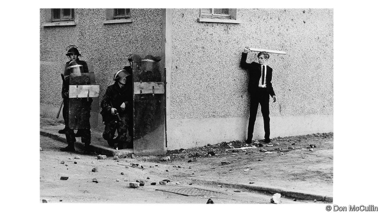
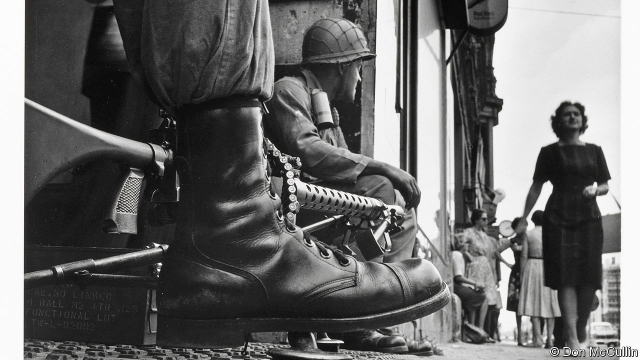

###### All kinds of murderers

# Sir Don McCullin’s photos are an accusation 

##### From war to landscapes, they are deeply political. But he insists they are not art 

 

> Feb 2nd 2019 

 

WHEN PEOPLE are about to die, Sir Don McCullin observes, “they often look up”, searching for “one last chance that maybe somebody can save [them].” Condemned prisoners glance skyward in Goya’s paintings, he notes, as did some of the doomed souls he encountered on his assignments, such as in the killing fields of Lebanon in 1976. In the pictures from Beirut that appear in a new exhibition of Sir Don’s work at Tate Britain in London, a woman wails for her murdered family. Gunmen crouch in a ruined ballroom. 

Sometimes, rather than turning to the heavens, the victims looked to Sir Don for salvation instead. He remembers in particular a starving boy in Biafra, crawling across a muddy playground, covered in flies. Often his subjects stare into his lens: an exhausted mother in a Bangladeshi refugee camp; a Zambian AIDS orphan; a woman arrested at a protest in England against the bomb. They looked, but “all I’ve got around my neck is two Nikon cameras.” He was doing a job, but you can’t “hide behind the camera”. 

Sir Don couldn’t hide, and neither can his viewers. Looking at him, his subjects seem also to be gazing through and beyond his black-and-white images. What, he asks, could he say to that starving boy? His work is an accusation—against the perpetrators of the cruelty he intimately chronicled, against his audience and against himself. 

“My whole life has been built upon violence,” Sir Don reflects. Born in London in 1935, he was evacuated to Lancashire during the war, billeted in a “hell-hole” with a bullying farmer. He took his first published photo in the aftermath of a deadly street fight; it shows a gang from Finsbury Park, his rough London neighbourhood, peering from the carcass of a bombed-out building. When the Observer ran it in 1959, the biggest thrill was seeing his father’s surname in print: the older McCullin had died when Don was 13, which was when he gave up on God. Around that time, some policemen asked him where he got his camera (“they were always smacking you around”). More worried about what his mother might do to the bobbies than what they might do to him, he kept them away from the house while he fetched the receipt. “The old lady was quite ferocious really.” 

He began to learn his craft during national service in Egypt and Kenya, where he was deployed in a unit that processed aerial reconnaissance. He took himself to Berlin when the wall was being built in 1961, snapping American troops at Checkpoint Charlie (see picture below). Then he went to war, largely for the Sunday Times. 

 

Finsbury Park, it turned out, was “child’s play”. “I’ve been with all kinds of murderers in my life,” Sir Don says; “men killing people in front of me, just because they like killing people.” Soon he eschewed the “flags and bugles and Napoleonic stuff”, focusing instead on civilians, who always suffered most. As in his shot of a besuited young Catholic, taking on British troops in Londonderry with a stick in 1971 (see top picture), in his images of conflict there is often a sense of life interrupted. Bystanders peek from doorways. Relatives mourn. 

It was a dangerous trade. In 1970 his camera took a bullet for him as he zigzagged through a Cambodian paddy field; a week later he was wounded by a mortar, crawling away to evade the Khmer Rouges. (“Did I do this?” he asks in momentary wonderment.) In 1972 he spent four days in a Ugandan prison, where every morning Idi Amin’s lorries would take corpses to the Nile to feed to the crocodiles: “I thought I’d had it.” Charles Glass, a foreign correspondent and friend, says Sir Don “will endure any amount of discomfort and suffering to get a picture.” He complained, Mr Glass says, only when pettifogging officials barred the path to his destination. 

Some wounds didn’t heal. Feeling “more elated and more blessed” for surviving, he sensed he was becoming a war junkie. “Every two or three years,” he recalls, “I’d have a kind of breakdown.” Now, at 83, stories tumble out of him, like the one about a man with a blown-off face he took to hospital in Salvador in 1982, whose “eyes were screaming”. Or about the company of marines he saw “chewed up” in Hue. “I think about it every bloody day,” he says. “My head is overcrowded with memory.” 

He blames politicians: “90% of the things I went and photographed was because they bollocksed up.” That goes equally for the struggling English towns that he documented between foreign jobs. His close-up portrait of a homeless Irishman in London’s East End, wild hair framing a haunted visage, is as wrenching in its way as his battlefields. Cities are “where the real truth is,” he reckons. Even his glowering English landscapes seem suffused with threat. For him, the Roman ruins he photographed in North Africa are imbued with the hardship of the slaves who built them. 

So his output was always political but, he insists, “it never was art…It’s not me.” His resistance to that label stems partly from his background (“I never went to school very much”), and partly from a sense of guilt, even self-disgust. To convey the “stench and the smell of war”, he had to “connive to bring [viewers] in and hold them”, with a compositional skill that transmutes anguish into a chilling beauty. As a result, many of the photos he took for newspapers have come to seem as much archetypal as records of specific events; an existential inquiry into innocence and evil, suffering and endurance, as much as journalism. Their subjects seem both frozen in a dead past and admonishingly alive. 

Sir Don invests as much effort in making the pictures as he did in taking them, constantly revisiting old negatives to refine his images. He made all the silver-gelatin prints in the Tate’s show himself. Simon Baker, one of the curators, says he has a “very curious, unusual feeling of obligation” to his material, which Mr Baker sees as a way of “paying respect to the subject”. Sir Don still does long, therapeutic stints in his dark room in Somerset, which he likens to being “alone in your mother’s womb”. 

For all that devotion, he doubts that he has made any difference: “Looking back, it served no purpose, my life.” He has “been preaching to the converted”, he concludes, as he surveys, say, the depredations of Islamic State. “I just don’t trust humanity.” Then he mentions how, that morning, he passed up a chance to take “the greatest photo in the world”. On a London street he saw a businessman drinking his coffee and squinting at his phone, while on the pavement beside him a homeless man huddled in a sleeping bag. But Sir Don didn’t have his camera. “I felt naked.” 

-- 

 单词注释:

1.don[dɒn]:n. 西班牙贵族(或绅士), 先生, 阁下 vt. 穿上 

2.accusation[ækju:'zeiʃәn]:n. 控告, 指控, 指责 [法] 控告, 起诉, 告发 

3.landscape['lændskeip]:n. 风景, 山水, 风景画 vi. 从事景观美化 vt. 美化...景观 [计] 横向 

4.feb[]:abbr. 二月（February） 

5.mccullin[]:[网络] 战地摄影师；麦库林；麦沽林 

6.skyward['skaiwәd]:adv. 向着天空, 向上 a. 向着天空的, 向上的 

7.doom[du:m]:n. 厄运, 不幸, 法律, 宣告, 判决, 死亡 vt. 命中注定, 判决 

8.Lebanon['lebәnәn]:n. 黎巴嫩 

9.Beirut[.bei'ru:t]:n. 贝鲁特 

10.tate[teit]:n. 塔特（姓氏） 

11.wail[weil]:n. 恸哭, 哀号, 嚎啕, 呼啸(声) vi. 恸哭, 呼啸, 悲叹, 哀号, 嚎啕 

12.gunman['gʌnmәn]:n. 枪手, 持枪的歹徒, 制造枪械者 [法] 持枪歹徒, 持枪抢劫或杀人者, 枪炮工人 

13.crouch['krautʃ]:n. 蹲伏, 蜷缩 vi. 蹲下, 蜷着, 缩着 vt. 低头 

14.ruine['ru:ɪn]: [医]路因碱 

15.ballroom['bɒ:lrum]:n. 舞厅, 跳舞场 

16.salvation[sæl'veiʃә]:n. 拯救, 救助, 救世 

17.Biafra[bi'ɑ:frә]:比夫拉[尼日利亚东南部一地区] , 比夫拉湾(几内亚湾一部分, 靠西非的赤道几内亚、喀麦隆和尼日利亚等国) 

18.Bangladeshi[-ʃi]:n. 孟加拉国人 a. 孟加拉国(人)的 

19.refugee[.refju'dʒi:]:n. 难民, 流亡者 [法] 避难者, 流亡者, 难民 

20.Zambian['zæmbiәn]:n. 赞比亚人 a. 赞比亚(人)的 

21.nikon[]:n. 尼康牌照相机 

22.perpetrator[]:n. 作恶者, 犯罪者, 行凶者 [法] 作恶者, 行凶者, 犯罪者 

23.cruelty['kru:әlti]:n. 残酷, 野蛮, 残酷行为 [法] 残酷, 残忍, 虐待 

24.intimately['intimitli]:adv. 亲切地, 亲密地, 个人性地 

25.chronicle['krɒnikl]:n. 年代记, 记录, 编年史 vt. 把...载入编年史 

26.Lancashire['læŋkәʃiә]:n. 兰开夏郡(英格兰郡名) 

27.billete[]:[网络] 方钢；终端；毕业的 

28.bully['buli]:n. 欺凌弱小者, 土霸 vt. 威胁, 恐吓, 欺负 vi. 欺负 a. 特好的, 第一流的 adv. 十分 

29.aftermath['ɑ:ftәmæθ]:n. 结果, 后果 [法] 后果, 结果 

30.Finsbury['fɪnzbərɪ]:n. 芬斯伯里（（英国伦敦一区, 位于泰晤士河南岸） 

31.peer[piә]:n. 同等的人, 匹敌, 贵族 vi. 凝视, 窥视, 费力地看, 隐现 vt. 与...同等, 封为贵族 

32.carcass['kɑ:kәs]:n. 尸体 [医] 屠体(宰后除脏的畜体) 

33.alway['ɔ:lwei]:adv. 永远；总是（等于always） 

34.smack[smæk]:n. 风味, 滋味, 少量, 拍击声, 咂嘴声, 小渔船, 海洛因 vi. 有味道, 咂嘴, 发出拍击声 vt. 拍, 打, 掴, 咂, 出声地吻 adv. 啪地一声, 猛然 

35.bobby['bɒbi]:n. 警察 

36.ferocious[fә'rәuʃәs]:a. 残忍的, 凶猛的, 可怕的 

37.Egypt['i:dʒipt]:n. 埃及 

38.Kenya['kenjә]:n. 肯尼亚 

39.deploy[di'plɒi]:v. 展开, 配置 

40.aerial['єәriәl]:a. 空中的, 航空的, 空气的, 空想的 n. 天线 

41.reconnaissance[ri'kɒnisәns]:n. 侦察, 勘察队 [电] 勘查 

42.Berlin[bә:'lin]:n. 柏林, (软质)柏林毛线 

43.checkpoint['tʃekpɒint]:n. 检查站 [计] 检查点 

44.Charlie[]:n. 通讯中用以代表字母C的词 

45.eschew[is'tʃu:]:vt. 避开, 远避 

46.bugle[bju:gl]:n. 喇叭, 号角 v. 吹号 

47.Napoleonic[nәpәuli'ɔnik]:a. (像)拿破仑一世的,拿破仑一世式的,拿破仑一世时期的,拿破仑一家的 

48.besuited[]: 身着套装的 

49.Londonderry[,lʌndәn'deri]:伦敦德里(英国港市) 

50.bystander['baistændә(r)]:n. 旁观者, 目击者 [法] 候补陪审员, 旁观者 

51.peek[pi:k]:vi. 偷看, 窥视 n. 偷看, 看一眼 

52.doorway['dɒ:wei]:n. 门口, 途径 

53.zigzag['zigzæg]:n. 曲折线条, Z字形道路 a. 之字形的, 曲折的, 锯齿形的 adv. 之字形地, 曲折地, 成锯齿形地 vt. 使成之字形, 使曲折进行 vi. 成之字形, 弯曲地走路 

54.cambodian[kæm'bәjdiәn]:n. 柬埔寨人（高棉人）；柬埔寨语 

55.paddy['pædi]:n. 稻, 谷, 爱尔兰人, 警察 [法] 警察 

56.mortar['mɒ:tә]:n. 臼, 研钵, 灰泥 vt. 用灰泥涂抹, 用灰泥结合 

57.evade[i'veid]:v. (巧妙地)逃脱, 规避, 逃避 

58.Khmer[kmєә]:n. 高棉人, 高棉语 

59.rouge[ru:ʒ]:n. 口红, 胭脂 v. 擦口红 

60.momentary['mәumәntәri]:a. 瞬间的, 刹那间的 

61.wonderment['wʌndәmәnt]:n. 惊奇, 惊叹 

62.Ugandan[ju:'^ændәn]:n. 乌干达人 a. 乌干达(人)的 

63.IDI[]:abbr. 以色列钻石协会（Israeli Diamond Industry）；综合控制直接点火（Integrated Direct Ignition）；初始域标识符（Initial Domain Identifier）；美国国际器件公司 

64.corpse[kɒ:ps]:n. 尸体 [医] 尸体 

65.Nile[nail]:n. 尼罗河 

66.charle[]:n. 查理（男子名）；查理（姓氏） 

67.discomfort[dis'kʌmfәt]:n. 困苦, 不适 [医] 不舒适, 不舒, 烦闷, 不快活 

68.pettifog['petifɒg]:vi. 做讼棍, 讲歪理, 欺诈, 挑剔, 诡辩 

69.elate[i'leit]:vt. 使兴高采烈, 使得意 

70.junkie['dʒʌŋki]:n. 有毒瘾者, 废旧品商人 

71.breakdown['breikdaun]:n. 崩溃, 故障 [化] 事故; 击穿 

72.Salvador['sælvәdɔ:]:[经] 萨尔瓦多 

73.hue[hju:]:n. 样子, 色度, 色彩, 叫声, 色调 [计] 色调 

74.bloody['blʌdi]:a. 血腥的, 嗜杀的, 有血的 

75.overcrowd[.әuvә'kraud]:vt. 容纳过多的人, 使过度拥挤 

76.equally['i:kwәli]:adv. 相等地, 同样地, 平等地 

77.homeless['hәumlis]:a. 无家的, 无养主的 

78.Irishman['airiʃmәn]:n. 爱尔兰人 

79.haunt[hɒ:nt]:n. 常到的地方, 生息地 vt. 常到, 出没于, 萦绕于 vi. 出没, 作祟 

80.visage['vizidʒ]:n. 脸, 面貌, 容貌 

81.wrench['rentʃ]:n. 扳钳, 扳手, 扭伤, 歪曲, 痛苦 vt. 猛扭, 扭伤, 曲解, 折磨 vi. 猛扭, 猛绞 

82.battlefield['bætlfi:ld]:n. 战场, 沙场 

83.reckon['rekәn]:vt. 计算, 总计, 估计, 认为, 猜想 vi. 数, 计算, 估计, 依赖, 料想 

84.glower['glәuә]:vi. 瞪眼, 怒目而视, 凝视 n. 怒视, 热切的注视, 灯丝 

85.suffuse[sә'fju:z]:vt. 遍布, 弥漫, 充满 

86.imbue[im'bju:]:vt. 使感染, 灌输, 使浸透 

87.guilt[gilt]:n. 罪行, 内疚 [法] 罪, 犯罪, 罪行 

88.stench[stentʃ]:n. 恶臭, 臭气 v. (使)发恶臭 

89.connive[kә'naiv]:vi. 默许, 共谋, 纵容 [法] 默许, 纵容, 共谋 

90.compositional[]:[计] 组合的 

91.transmute[træns'mju:t]:vt. 使变形, 使变质 vi. 变形, 变质 

92.anguish['æŋgwiʃ]:n. 剧痛, 痛苦 vt. 使极痛苦 vi. 感到痛苦 

93.archetypal['ɑ:kitaipl]:a. 原型的 

94.existential[.egzis'tenʃәl]:a. 有关存在的 

95.innocence['inәsәns]:n. 无罪, 无知, 天真无邪 [法] 无罪, 无罪的人, 清白无辜者 

96.endurance[in'djuәrәns]:n. 忍耐, 忍耐力, 耐性 [机] 持九性 

97.journalism['dʒә:nәlizm]:n. 新闻业, 报章杂志 [法] 报刊, 新闻业, 新闻出版 

98.admonishingly[]:adv. admonish的变形 

99.constantly['kɒnstәntli]:adv. 不变地, 不断地, 时常地 

100.revisit[ri:'vizit]:vt. 再访, 重游, 重临 n. 再访问 

101.simon['saimәn]:n. 西蒙（男子名） 

102.baker['beikә]:n. 面包师 [医] 烤箱(骨科用) 

103.curator[kjuә'reitә]:n. 管理者, 经理, 主管人, 掌管者, 馆长, 大学学监, 监护人, 保护人 [经] 临时监护人 

104.therapeutic[.θerә'pju:tik]:a. 治疗的, 有益于健康的 [医] 治疗的; 治疗学的 

105.stint[stint]:vt. 节省, 限制, 停止 vi. 节约 n. 吝惜, 节约, 限额 

106.somerset['sʌmәsit. -set]:n. 有衬垫的马鞍（独腿者乘坐的） 

107.liken['laikәn]:vt. 比喻, 比拟 

108.womb[wu:m]:n. 子宫, 发源地 [医] 子宫 

109.preach[pri:tʃ]:v. 传道, 讲道, 说教, 宣讲, 鼓吹 n. 说教, 布道 

110.depredation[.depri'deiʃәn]:n. 掠夺, 破坏 

111.Islamic[iz'læmik]:a. 伊斯兰教的, 穆斯林的 

112.humanity[hju:'mæniti]:n. 人性, 人类, 博爱 

113.squint[skwint]:n. 斜视眼, 斜着 a. 斜视的 vt. 使变斜视眼 vi. 斜视, 倾向, 斜行 

114.huddle['hʌdl]:n. 杂乱一团, 混乱, 拥挤 vt. 把...挤在一起, 乱堆, 草率了事, 蜷曲 vi. 挤作一团, 蜷缩 

