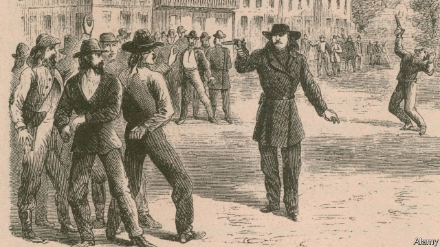

###### Agnes got his gun

# The legend of Wild Bill Hickok 

##### The gunslinger’s wife was the first woman in America to own a circus 

 

> Jan 31st 2019 

 

Wild Bill: The True Story of the American Frontier’s First Gunfighter. By Tom Clavin. St. Martin’s Press; 336 pages; $29.99 and £22.95.  

HE WAS STUNNING, or so Libbie Custer, the famous cavalryman’s wife, remembered. Wild Bill Hickok, a gunslinger said to have once killed ten men in a single fight, was “a delight to look on…the careless swing of his body as he moved seemed perfectly in keeping with the man, the country, the time in which he lived.” 

Alas, the frontispiece of Tom Clavin’s biography, “Wild Bill”, belies this swooning description. Can the man with sleepy eyes and a moustache like a limp rodent be the Adonis recalled by Mrs Custer? Then again, her account was published 14 years after his death, and truth was a fungible commodity in the Wild West. Matters big and small were twisted and embellished. The myth of the frontier as a place of freedom and opportunity has, these days, been supplanted by a less romantic understanding that for many—notably Native Americans—it was rather less idyllic. 

Mr Clavin, whose previous book explored the legend of Dodge City, takes a swipe at an earlier Hickok biography as a “somewhat mind-numbing saga of facts and disclaimers and rebuttals”. Inevitably, though, in telling “the true story” of Hickok’s life, he resorts to disclaimers and rebuttals himself. Hickok may or may not have been mauled by a bear. He was said to have founded the Pony Express (he didn’t); he may or may not have had an affair with the besotted Libbie Custer. As the author says, the truth about some of these claims will never be known. 

Hickok was anointed a Wild West celebrity by a profile in Harper’s New Monthly Magazine in 1867. When the enthralled journalist asked permission to publish it, Hickok, then 29, agreed. “I am sort of public property,” he said. The aura of the sharpshooter who could supposedly split a bullet on the edge of a dime at 20 paces was augmented by his style. His city garb included a Prince Albert coat, checked trousers, a wide-brimmed black hat and, sometimes, a cloak lined with scarlet silk. 

In Mr Clavin’s formulaic prose, men “wet their whistles” and prospectors are “busy as beavers”. Still, when Hickok becomes marshal in the cow town of Abilene, Kansas, the pace tightens. The stage is set for his stumbling descent into early-morning drinking, gambling losses and cruelly deteriorating eyesight. (Glaucoma? An infection caused by syphilis? Another unknowable detail.) 

In Abilene, Hickok meets the love of his life, Agnes Thatcher Lake, operator of the Hippo-Olympiad and Mammoth Circus, and the book’s most interesting personality. A widow of 45 (Hickok was 11 years younger), she was the first woman in America to own a circus. The circus and Agnes move on, but her affair with Hickok proceeds by post. They reunite, marry and set off on a two-week honeymoon. 

Fatefully, Hickok heads for the Black Hills to strike it rich at the gaming tables or gold fields. “Agnes Darling, if such should be we never meet again,” he writes in 1876, “while firing my last shot, I will gently breathe the name of my wife…” A murderer’s bullet ensured that they never did. 

-- 

 单词注释:

1.agnes['æ^nis]:n. 艾格尼丝（女子名） 

2.hickok['hikɔk]:希科克（姓氏） 

3.Jan[dʒæn]:n. 一月 

4.gunfighter[]:n. 用枪格斗出名的人 

5.tom[tɒm]:n. 雄性动物, 雄猫 

6.clavin[]:[医] 克累文(亮氨酸天门冬氨酸混合物) 

7.ST[]:[计] 段表, 状态, 系统测试, 直端连接器 [化] 磺胺噻唑 

8.stunning['stʌniŋ]:a. 打昏迷的, 弄得人昏头昏脑的, 令人震惊的 

9.libbie['libi]:n. <美俚>妇女解放论者 

10.custer['kʌstә]:n. 除尘器, 撒粉器 

11.gunslinger[]:n. 带枪的歹徒, 被收买来行凶的人 [法] 枪手, 带枪的歹徒, 被收买来行凶的人 

12.ala['eilә]:n. 翼, 翅 [化] 丙氨酸 

13.frontispiece['frʌntispi:s]:n. 卷头插画, 标题页, 主正面 

14.belie[bi'lai]:vt. 掩饰, 与...不符, 使失望 

15.swoon[swu:n]:n. 昏晕, 晕厥 vi. 昏晕, 着迷, 渐渐消失 

16.limp[limp]:n. 跛行 a. 柔软的, 无力的, 软弱的 vi. 跛行 

17.rodent['rәudәnt]:a. 咬的, 啮齿类的 n. 啮齿动物 

18.Adonis[ә'dәunis]:n. 阿多尼斯(希腊神话人物), 美少年, 花花公子 [医] 福寿草, 侧金盏花 

19.Mr['mistә(r)]:先生 [计] 存储器回收程序, 多重请求 

20.fungible['fʌndʒibl]:a. 可取代的, 代替的 n. 代替物 

21.commodity[kә'mɒditi]:n. 农产品, 商品, 有用的物品 [经] 商品, 货物, 日用品 

22.embellish[im'beliʃ]:vt. 修饰, 装饰, 润色 

23.myth[miθ]:n. 神话, 虚构的事, 虚构的人 

24.supplant[sә'plɑ:nt]:vt. 排挤掉, 代替 

25.les[lei]:abbr. 发射脱离系统（Launch Escape System） 

26.idyllic[ai'dilik]:a. 田园诗的, 牧歌的, 悠闲的 

27.dodge[dɒdʒ]:v. 避开, 躲避 n. 诡计, 躲藏 

28.swipe[swaip]:n. 强打, 用力挥击, 尖刻的话, 碰擦, 起重杆 vt. 强打, 用力挥击, 偷 

29.saga['sɑ:gә]:n. 传说, 英雄传奇, 冒险故事 

30.disclaimer[dis'kleimә]:n. 放弃, 拒负责任, 不承诺 [经] 弃权或不申诉条款 

31.rebuttal[ri'bʌtәl]:n. 辩驳, 驳回, 反驳, 反驳的证据, 反证 [法] 辩驳, 反驳, 驳回 

32.inevitably[in'evitәbli]:adv. 不可避免地 

33.maul[mɒ:l]:n. 大槌 vt. 打伤, 粗手粗脚地摆弄, 抨击 

34.pony['pәuni]:n. 矮种马 v. 借助逐字直译文翻译 a. 小型的, 每日摘要的 

35.besot[bi'sɒt]:vt. 使糊涂, 使痴迷, 使沉醉 

36.anoint[ә'nɒint]:vt. 涂油, 施以涂油礼 [医] 涂油膏 

37.celebrity[si'lebrti]:n. 名声, 名人 

38.profile['prәufail]:n. 侧面, 轮廓, 传略 vt. 描绘...轮廓, 写...的传略 [计] 提问档; 剖面图法; 剖面法 

39.enthral[in'θrɔ:l]:vt. 迷住, 奴役, 使做奴隶, 吸引住 

40.aura['ɒ:rә]:n. 气氛, 气味 [医] 先兆 

41.sharpshooter['ʃɑ:pʃu:tә]:n. 射击名手, 神枪手, 奸商 

42.supposedly[sә'pәuzidli]:adv. 想象上, 看上去像, 被认为是, 恐怕, 按照推测 

43.dime[daim]:n. 10分硬币(美、加) 

44.augment[ɒ:g'ment]:v. 增加, 增长 [计] 增加; 增量; 添加 

45.garb[gɑ:b]:n. 打扮, 装束 vt. 打扮, 穿衣 

46.albert['ælbәt]:n. 艾伯特（男子名） 

47.trouser['trauzә]:a. 裤子的 

48.scarlet['skɑ:lit]:n. 猩红色, 绯红色, 红衣 a. 绯红色的, 鲜红色的 

49.formulaic[-'leiik]:a. (根据)公式的,用俗套话堆砌成的,刻板的 

50.prose[prәuz]:n. 散文 v. 写散文 a. 散文的, 平凡的 

51.prospector['prɒspektә]:n. 勘探者, 采矿者 

52.beaver['bi:vә]:n. 海狸(毛皮) [机] 轻型及中型飞机加油 

53.marshal['mɑ:ʃәl]:n. 元帅, 陆空军高级将官, 典礼官, 执法官 vt. 整理, 引领, 统率 vi. 排列, 各就各位 

54.abilene['æbi,li:n]:n. 阿比林（美国城市） 

55.kansa[]:n. （日语）监察；堪萨人（旧时居住在美国堪萨斯州一带的印第安人） 

56.tighten['taitn]:vt. 勒紧, 使变紧 vi. 变紧, 绷紧 

57.descent[di'sent]:n. 降落, 家系, 侵袭, 血统 [医] 下降, 世代, 血统 

58.gamble['gæmbl]:n. 赌博, 冒险 v. 赌博, 孤注一掷 

59.cruelly['kru:әli]:adv. 残忍地, 残酷地, 极 

60.deteriorate[di'tiәriәreit]:v. (使)恶化 

61.infection[in'fekʃәn]:n. 传染, 影响, 传染病 [医] 传染, 感染 

62.unknowable[.ʌn'nәuәbl]:a. 不能知道的, 不可知的 

63.thatcher[]:n. 盖屋顶者 

64.mammoth['mæmәθ]:n. 猛犸, 庞然大物 a. 猛犸似的, 巨大的 

65.reunite[.ri:ju:'nait]:v. (使)再联合 

66.fatefully['feitfuli]:adv. 宿命地, 决定性地 

