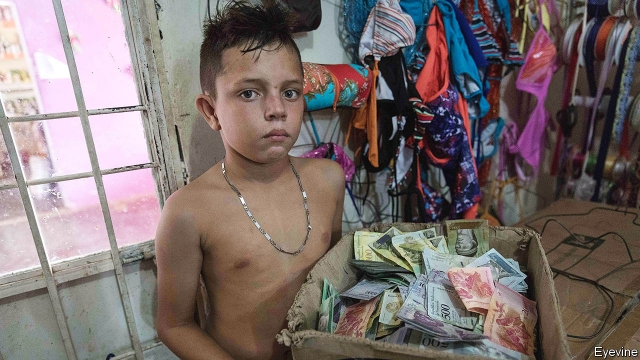

###### The day after

# How Venezuela’s economy can recover from the Maduro regime 

##### It will need a lot of help from outside, but there is hope 

 

> Jan 31st 2019 

 

THREE YEARS ago Ricardo Hausmann of Harvard University began work on what he calls the “morning-after plan”, a blueprint to rehabilitate Venezuela’s economy after President Nicolás Maduro’s hoped-for fall. Back then, he thought that new dawn would break quickly. Now, after a long delay, it again looks tantalisingly close. 

The intervening years have allowed his plan to marinate and Venezuela’s economy to rot. In December a group of opposition politicians, union leaders, businesspeople, academics and church leaders reached consensus on a broad-brush document that draws on Mr Hausmann’s work. Entitled “National Plan: the Day After”, it points out that Venezuela’s “productive apparatus” has been hammered. Its health services have collapsed and inflation is rampant. In the past five years of Mr Maduro’s rule, GDP has roughly halved. The collapse is worse than Spain suffered during its civil war, says Mr Hausmann. 

What should a new government fix first? Mr Hausmann’s team have identified two “binding” constraints that must be loosened before any other reforms can help. The first includes price controls and the threat of expropriation, which together are an “attack on the invisible hand”. The government has seized assets in many industries, from coffee-processing to banking. This has destroyed incentives for entrepreneurs to invest and increase production in response to shortages. 

The second constraint is the lack of dollars. The export earnings of PDVSA, the state oil monopoly, have shrunk. And government cronies snaffle up much of the hard currency that remains. That deprives entrepreneurs of the means to buy vital imported inputs, such as spare parts. 

Many of Venezuela’s other problems, including hyperinflation, are consequences of these deeper troubles, Mr Hausmann argues. Opponents of Mr Maduro thus plan to revive the invisible hand, by restoring property rights and relaxing price and exchange controls. This would be coupled with direct forms of help for the poor. 

What about the lack of foreign exchange? That, Venezuela cannot solve alone. It will need an infusion of dollars from outside and reassurance that its future export earnings and overseas assets will not be seized by its foreign creditors. The face value of their claims on the state exceeded $135bn last year, according to Torino Capital, an investment bank. The queue includes China (over $13bn) and Russia ($3bn), which have, in effect, pre-paid for barrels of oil with past loans. Also jockeying for position are the holders of sovereign bonds ($24bn) and PDVSA paper ($28bn). Other claimants include expropriated firms and unpaid suppliers. 

A tempting strategy for any individual creditor is to let other lenders take a haircut, wait for Venezuela to recover, then insist on full repayment. But if every creditor pursues that course, Venezuela will never recover, and without debt restructuring, the IMF may not be willing to lend. Lee Buchheit, a lawyer who advised Iraq, among other countries, and Mitu Gulati of Duke University argue that Venezuela may need America’s president to issue an executive order giving it the same sort of protection from creditors as Iraq enjoyed in its restructuring after 2003. 

Debt relief would limit the flow of dollars out of the country. On top of that, the IMF and others will have to pour more dollars into it. Mr Hausmann envisages a loan in excess of $60bn over three years. Rather than printing bolívares to cover its fiscal deficit, the government would buy local currency with the IMF’s dollars. This, in turn, would put dollars in the hands of entrepreneurs, who could spend them on the imports needed to revive their businesses. 

This mix of monetary restraint and output recovery should stem inflation. But the speed at which prices stabilise also depends on public expectations. To succeed quickly, the state must first convince the public that it will do so. To add credibility, the plan’s sponsors favour an independent central bank and an “anchor” to discipline its policies. 

The choice of anchor is important. The stricter the regime, the faster it can cure hyperinflation. A currency board (which would allow the central bank to create bolívares only when it has added the equivalent amount of dollars to its reserves) offers the best chance of immediate stability, but might prove too rigid in the long run. An exchange-rate peg would change inflation expectations more slowly, but would be more suitable for the economy over time. Mr Hausmann favours a peg over the stricter alternatives. But, he says, given the dangers of currency speculation, he is reluctant to discuss the details in public. 

After its economy has stabilised, Venezuela will have to revive its oil industry. The reformers have drafted a hydrocarbons law that will retain current royalty and tax rates, and allow foreign firms to own their ventures outright. Experienced Venezuelans are working in the global industry, including at Norway’s Equinor and BP. The country’s exports would benefit from re-importing some of this expertise. 

Would such a plan win the outside support it needs? The interim government has powerful friends in America, Brazil and elsewhere. Nothing in it will shock the IMF. And although China supports Mr Maduro in public, its oil investments give it an incentive to support the industry’s revival. But Mr Hausmann needs no reminder about the uncertainties. He began work on his morning-after plan after the opposition won a two-thirds majority in the national legislature, when it seemed that change was “imminent”. Sadly Mr Maduro has survived in office over 1,150 mornings-after since then. 

-- 

 单词注释:

1.maduro[mә'duәrәu]:a. 色深味浓的烟草做的, (雪茄)色深味浓的 

2.regime[rei'ʒi:m]:n. 政权, 当权期间, 政体, 社会制度, 体制, 情态 [医] 制度, 生活制度 

3.Jan[dʒæn]:n. 一月 

4.Ricardo[ri'kɑ:dәu]:里卡多(姓氏) 

5.hausmann[]: [人名] 豪斯曼 

6.Harvard['hɑ:vәd]:n. 哈佛大学 

7.blueprint['blu:'print]:n. 蓝图, 设计图, (周详的)计划 vt. 制成蓝图, 计划 

8.rehabilitate[.ri:hә'biliteit]:vt. 恢复原状, 修复, 使康复 [法] 恢复, 使恢复心理健康, 修复 

9.quickly['kwikli]:adv. 很快地 

10.tantalisingly[]:adv. tantalising的变形 

11.intervene[.intә'vi:n]:vi. 插入, 调停, 干涉 [经] 进场干预 

12.marinate['mærineit]:vt. 用腌泡汁腌/泡(肉/鱼) 

13.opposition[.ɒpә'ziʃәn]:n. 反对, 敌对, 相反, 在野党 [医] 对生, 对向, 反抗, 反对症 

14.businessperson['bɪznəspɜ:sn]:n. 商人 

15.inflation[in'fleiʃәn]:n. 胀大, 夸张, 通货膨胀 [化] 充气吹胀; 膨胀 

16.rampant['ræmpәnt]:a. 猖獗的, 蔓生的, 猛烈的, 跃立作扑击状的 

17.GDP[]:[化] 鸟苷二磷酸 

18.halve[hɑ:v]:vt. 二等分, 对半分享, 把...减半 

19.Spain[spein]:n. 西班牙 

20.constraint[kәn'streint]:n. 强制, 约束 [计] 约束 

21.expropriation[eks.prәupri'eiʃәn]:n. 征用, 收用, 征收 [经] 征用, 没收, 征购 

22.asset['æset]:n. 资产, 有益的东西 

23.incentive[in'sentiv]:n. 动机 a. 激励的 

24.entrepreneur[.ɒntrәprә'nә:]:n. 企业家, 主办人 [经] 承包商, 企业家 

25.earning['ә:niŋ]:n. 收入（earn的现在分词） 

26.pdvsa[]: 委内瑞拉石油公司总部所在地：委内瑞拉主要业务：炼油 

27.monopoly[mә'nɒpәli]:n. 垄断, 专卖权, 独占事业 [经] 垄断, 专利品, 垄断(权)独占 

28.crony['krәuni]:n. 密友, 亲密伙伴, 好朋友 

29.snaffle['snæfl]:n. 马嚼子 vt. 装以马嚼子, 轻勒, 偷窃 

30.deprive[di'praiv]:vt. 剥夺, 使丧失 [法] 剥夺, 剥夺, 夺去 

31.hyperinflation[,haipәrin'fleiʃәn]:n. 恶性通货膨胀 

32.revive[ri'vaiv]:vt. 使苏醒, 使复兴, 使振奋, 回想起, 重播 vi. 苏醒, 复活, 复兴, 恢复精神 

33.Venezuela[,vene'zweilә]:n. 委内瑞拉 

34.cannot['kænɒt]:aux. 无法, 不能 

35.infusion[in'fju:ʒәn]:n. 注入, 泡制, 注入物 [化] 浸渍; 浸泡 

36.reassurance[.ri:ә'ʃurәns]:n. 安心, 放心, 再保证 

37.oversea['әuvә'si:]:adv. 海外, 向国外, 向海外, 国外 a. 外国的, 在国外的, 在海外的, 舶来的 

38.creditor['kreditә]:n. 债权人 [法] 债权人, 债主, 贷方 

39.Torino[tɔ'ri:nɔ]:托里诺[意大利西北部城市](即都灵) 

40.jockey['dʒɒki]:n. 赛马骑师, 驾驶员, 操作工 vt. 骗, 瞒, 驾驶, 移动 vi. 当赛马的骑师 

41.holder['hәuldә]:n. 持有人, 所有人, 支持物 [化] 夹持器; 夹具; 贮罐 

42.sovereign['sɒvrin]:n. 元首, 独立国 a. 具有主权的, 至高无上的, 国王的, 完全的 

43.claimant['kleimәnt]:n. 提出要求者, 原告 [经] 索赔人, 债权人 

44.expropriate[eks'prәuprieit]:vt. 剥夺, 没收, 征用 [法] 征用, 没收, 剥夺...的所有权 

45.unpaid[.ʌn'peid]:a. 未付款的, 不支薪水的 [经] 未付的, 未缴纳的 

46.supplier[sә'plaiә]:n. 供应者, 供给国, 供应商 [化] 承制厂; 供应厂商 

47.lender['lendә]:n. 出借人, 贷方 [经] 出借者, 贷方, 贷款人 

48.repayment[ri'peimәnt]:n. 付还, 偿还, 报复, 付还的钱 [经] 偿还, 付还 

49.restructuring[]:[计] 重构的 

50.IMF[]:国际货币基金组织 [经] 国际货币基金 

51.lee[li:]:n. 背风处, 避风处, 下风处, 保护, 庇护 a. 避风的, 背风的, 下风的, 保护的 

52.buchheit[]:[网络] 布赫海特 

53.Iraq[i'rɑ:k]:n. 伊拉克 

54.mitu[]: [医][=mobile inflatable treatment unit]流动充气式治疗单元 

55.gulati[]:[网络] 古拉蒂；古拉第 

56.duke[dju:k]:n. 公爵 

57.envisage[in'vizidʒ]:vt. 面对, 正视, 想象 

58.fiscal['fiskәl]:a. 财政的, 国库的 [经] 财政上的, 会计的, 国库的 

59.deficit['defisit]:n. 赤字, 不足额 [医] 短缺 

60.monetary['mʌnitәri]:a. 货币的, 金钱的 [经] 货币的, 金融的 

61.stabilise['steibilaiz]:vt.vi. (使)稳定, (使)安定, (使)坚固 vt. 装稳定器 

62.credibility[.kredi'biliti]:n. 可信用, 确实性, 可靠 [法] 证据能力, 可信程度, 确实性 

63.peg[peg]:n. 钉, 桩, 栓, 藉口, 销子, 借口 vt. 钉木钉, 固定, 限制, 使受约束 vi. 坚持不懈地奋力于, 疾行 

64.speculation[.spekju'leiʃәn]:n. 沉思, 推测, 投机 [经] 投机交易, 买空卖空 

65.reformer[ri'fɒ:mә]:n. 改革家, 改革运动者 [化] 转化炉; 转化器; 重整器; 重整炉 

66.hydrocarbon[.haidrәu'kɑ:bәn]:n. 碳氢化合物 [化] 烃; 碳氢化合物 

67.royalty['rɒiәlti]:n. 皇室, 王族成员, 王权, 特权阶层, 庄严 [经] 特许权, 使用费, 使用税 

68.outright['autrait]:a. 率直的, 完全的, 总共的, 直率的 adv. 完全地, 率直地, 立刻地, 一直向前 

69.venezuelan[,venә'zweilәŋ]:a. 委内瑞拉的；委内瑞拉人的 

70.bp[]:[化] 碱基对 

71.expertise[.ekspә:'ti:z]:n. 专家意见, 专门技术 [法] 专门知识, 专家意见 

72.interim['intәrim]:a. 暂时的, 临时的, 间歇的 n. 过渡时期 

73.Brazil[brә'zil]:n. 巴西 

74.revival[ri'vaivl]:n. 复兴, 复活, 恢复精神, 苏醒 [医] 复苏, 回生, 精神重振 

75.reminder[ri'maindә]:n. 提醒的人, 暗示 [经] 催单 

76.uncertainty[.ʌn'sә:tnti]:n. 不确定, 不可靠, 不确定的事物 [化] 不确定度 

77.legislature['ledʒisleitʃә]:n. 立法机关, 议会, 立法院 [法] 立法机构, 立法机关 

78.imminent['iminәnt]:a. 即将来临的, 逼近的 

