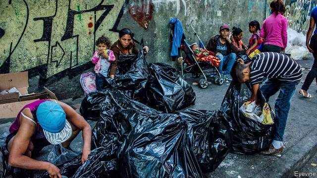
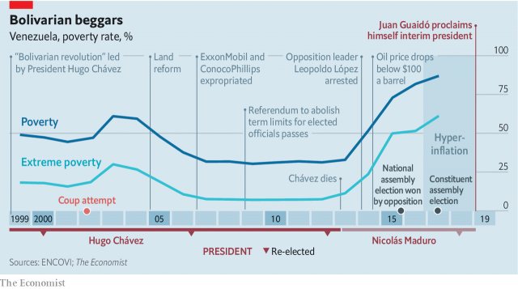

###### A chance, at last, for liberation

# Venezuela’s failed revolution may itself be overthrown 

##### America’s intervention could topple the government of Nicolás Maduro 

 

> Jan 31st 2019 

 

THE OP-13 BUILDING at the entrance to the Catia shantytown in Caracas is an ugly red and grey edifice, built a decade ago by a Russian company. With such housing projects Hugo Chávez, the founder of Venezuela’s “Bolivarian revolution”, established himself as the benefactor of the poor. The polyurethane cladding suits Moscow, not the tropics. The windows are too small to admit much breeze. But people who live in Catia are grateful to the government. “It’s completely chavista here,” says Ayax Armas, a cook who lives opposite. 

Loyalty is reinforced by fear. Catia is controlled by pro-government colectivos, which are at once local intelligence-services, neighbourhood-watch groups and criminal gangs. Protests against the left-wing regime were almost unheard of. But anger is simmering. The oil boom, which paid for Chávez’s largesse, ended soon after he died in 2013. Under Nicolás Maduro, who took over from him, the economy has slumped and food has become scarce. Annual inflation is 1.7m per cent, according to the opposition-controlled legislature. “Who wouldn’t want to change this situation?” asks Carlos, who scavenges for fruit and vegetables in the rubbish, cleans them and resells them. More than 80% of Venezuelans want Mr Maduro out, according to Datanalisis, a polling firm. 

Just before midnight on January 22nd Catia erupted. Residents of OP13 streamed out, set fire to rubbish that had been piling up for weeks and banged pots and pans. “This government is about to fall,” they chanted. After two decades of socialist rule that descended into ever-greater repression and economic mismanagement, they may just be right. 

Since Catia’s rebellion events have moved at a dizzying pace. On January 23rd Juan Guaidó, a young, little-known politician who had been head of Venezuela’s legislature for just 18 days, proclaimed himself the country’s acting president before a cheering crowd in Caracas. He declared the presidency vacant on the grounds that Mr Maduro’s re-election last May was a fraud. In those circumstances, the constitution gives the presidency to the head of the legislature until fresh elections can be held. 

Along with more than 1m protesters across Venezuela that day, the United States, Canada and almost all large Latin American countries recognised Mr Guaidó. Britain, France, Germany and Spain said they would follow if Mr Maduro doesn’t call a free election within days. 

President Donald Trump has moved to make Mr Guaidó’s claim a reality. On January 28th America imposed its toughest sanctions yet on Venezuela’s regime. It froze the American accounts and assets of PDVSA, the national oil monopoly, and said that it will divert the proceeds of further sales into an account that will be accessible only after PDVSA comes under the control of Mr Guaidó or an elected government. This cuts off the regime from its main source of cash. Already it has defaulted on most of its debt and is short of money to buy the loyalty of the armed forces, maintain oil production and import enough to feed 32m Venezuelans. The new sanctions will make all that even harder. 

Venezuela thus finds itself part of a trial of strength. A peaceful transition to a democratic, economically literate government could restore normality to what was once one of the region’s richest countries (see article). Equally, the Trump-Guaidó gambit might lead to conflict between armed groups or simply fail, leaving the regime more dominant than ever. In that case, millions more Venezuelans would join the 3m who have already fled, mostly to neighbouring countries such as Colombia. American prestige, wagered on ousting Mr Maduro, would suffer, too. 

Mr Maduro has resisted growing opposition since 2013, when poverty began to rise (see chart). As Venezuelans turned against him, his power came to depend on a patronage network of enchufados, or “plugged-in people”, especially in the security forces. He has appointed over 2,000 officers to the rank of general or equivalent. The army runs companies in as many as 20 industries, including an insurer, a rubber manufacturer and a television channel, according to Crónica Uno, a newspaper. 

 

The armed forces collar scarce dollars at an artificially cheap rate and sell them to dollar-starved companies at a much dearer one. The national guard smuggles petrol, weapons, food, gold and diamonds, according to Margarita López Maya of Universidad Central de Venezuela, citing investigations by American authorities. After Mr Guaidó’s proclamation, all of the country’s top brass pledged support to Mr Maduro. 

They have stomped on dissent. At the protests in Catia the colectivos were first on the scene, followed by the dreaded FAES, an elite police force (“colectivos with a licence”, Mr Armas calls them). “We are not going to let anyone fuck with us,” said one colectivo leader in Catia after the fracas. Repression took place across the country on the next day. Some 700 people were detained, a record number for one day, according to Foro Penal, a human-rights group. Thirty-five people were killed. 

But the oppressors are also unhappy. Despite the money to be made from corruption, the crisis affects the armed forces as it does the rest of society, says Rocío San Miguel, a Caracas-based military analyst. The salary of a major in the national guard is 36,000 bolívares a month, worth less than $15. “That is not enough for two days’ worth of food for a family of four,” says Ms San Miguel. 

Growing disgruntlement in the security forces increases the importance of the several hundred Cuban counter-intelligence agents (supplied in return for cheap oil) who also prop up Mr Maduro’s rule. They tap Venezuelan phones to monitor dissent as well as looking after the president’s personal security, says a western intelligence source. He adds that Mr Maduro gets an intelligence briefing every morning from two Cuban officers. The most intense snooping is on the police and armed forces—anyone with a gun, says Ms San Miguel. 

The regime has disrupted several coup attempts. Around 100 senior officers are in prison, including several who were close to Chávez and who served Mr Maduro as ministers. Troop commanders have been shuffled frequently to prevent them from building close relations with their soldiers, according to Caracas Chronicles Political Risk Report, a newsletter. 

Even before the latest sanctions, the regime was running out of money to keep the generals happy. Production by PDVSA, which has been mismanaged for years, was expected to fall to less than 1m barrels a day in 2019, its lowest level since the 1940s. If sold at world prices, that should bring in about $20bn for the year, except that 45% of the oil goes directly to China and Russia to repay debt, according to Siobhan Morden of Nomura, an investment bank. Cash from oil sales goes mainly to pay other claimants and to pay Venezuela’s import bill. Less than $250m would be left to spend on patronage. That is less than the wage bill for Manchester City’s footballers. Venezuela would have to dip further into its dwindling foreign-exchange reserves. 

With the new sanctions, money will be even tighter. They freeze PDVSA’s $7bn of assets in America, which include three oil refineries, and will reduce revenue from oil exports by more than $11bn, says the Trump administration. PDVSA might find other buyers, perhaps in Asia, but is likely to earn less because transport costs will be higher. Almost as painful is the ban on the sale of diluents to PDVSA, without which its thick oil will not flow through pipes. 

These measures will accelerate Venezuela’s economic collapse. GDP will shrink by 26% this year, bringing the total decline since Mr Maduro took office to 60%, estimates Francisco Rodríguez of Torino Capital, an investment bank. Bond prices suggest that the markets put the odds of Mr Maduro’s ousting at 50-90%. 

Mr Guaidó and Mr Trump are betting that hardship will topple the regime before it starves the Venezuelan people. The opposition is striving to persuade the armed forces to switch allegiance. The national assembly passed a law offering amnesty for those who help “build democracy”. Volunteers distributed pamphlets laying out the terms at army bases (some soldiers burned them). To members of the regime too discredited to be part of any democratic government, including Mr Maduro, the opposition is offering passage to a comfortable retirement, perhaps in Cuba. 

He is not ready to be pensioned off. He has called for support from China and Russia. On January 26th their UN ambassadors rebuked America for interfering. Both countries have big financial stakes in Venezuela. China, which has extended a total of $60bn in loans over the past 20 years, is its biggest creditor. And Russia has lent $17bn to oil projects and to finance arms sales. 

China, which takes a hard-headed view of Venezuela, has promised little new money. It is to Russia’s authoritarian leader, Vladimir Putin, that Mr Maduro has turned. Mr Putin sees Venezuela as a stage for his confrontation with America. Sergei Lavrov, Russia’s foreign minister, said his government will do all it can to support the Venezuelan president. Unconfirmed reports say that 400 men from Wagner, a military company owned by an associate of Mr Putin, flew to Venezuela, perhaps to protect Mr Maduro from his own officers. 

It is hard to see Russia committing troops or much treasure to keeping Mr Maduro in power. But Mr Putin would profit from other outcomes, too. Violence would demonstrate the risk of allowing a mob to subvert an established leader. An American military intervention could be cited as evidence that America shares Mr Putin’s belief in great powers’ spheres of influence. 

Without Chinese or Russian cash, Mr Maduro will have to rule on emergency rations. That can work for a while. As people become poorer, the cost of patronage falls. Voters who once expected a flat now accept a box of food. But the forces working to topple Mr Maduro are getting stronger while those holding him up are weakening. For Venezuela’s sake and his own, he should take early retirement. 

-- 

 单词注释:

1.overthrow[.әuvә'θrәu]:n. 推翻, 瓦解, 倾覆 vt. 打倒, 推翻, 倾覆 

2.intervention[.intә'venʃәn]:n. 插入, 介入, 调停 [经] 干预 

3.topple['tɒpl]:vt. 推翻, 颠覆 vi. 倒塌, 摇摇欲坠 

4.maduro[mә'duәrәu]:a. 色深味浓的烟草做的, (雪茄)色深味浓的 

5.Jan[dʒæn]:n. 一月 

6.catia[]:abbr. CG aided three-dimensional interactive application 计算机图形辅助三维交互应用 

7.shantytown['ʃæntitaun]:n. 棚户区 

8.caracas[kә'rækәs]:n. 加拉加斯（委内瑞拉首都） 

9.edifice['edifis]:n. 大厦, 大建筑物 

10.hugo['hju:^әu]:n. 雨果（男子名, 等于Hugh） 

11.founder['faundә]:n. 创立者, 建立者 vt. 使沉没, 使摔倒, 弄跛, 浸水, 破坏 vi. 沉没, 摔到, 变跛, 倒塌, 失败 

12.Bolivarian[]:玻利瓦尔的 

13.benefactor['benifæktә]:n. 恩人, 捐助者, 施主 [法] 捐赠人, 赠送人 

14.polyurethane[.pɒli'juriθein]:n. 聚氨酯 [化] 聚氨基甲酸酯; 聚氨酯 

15.clad[klæd]:vt. 在金属外包上另一种金属 a. 包层金属的 clothe的过去式和过去分词 

16.tropic['trɒpik]:n. 回归线 

17.chavista[]:[网络] 查维斯派人士；查维兹党人；查维斯主义者 

18.arma[]:abbr. 自回归滑动平均模型；Agung Rai Museum of Art；档案管理和档案管理员协会 

19.colectivos[]:[网络] 公共汽车；集合名词 

20.regime[rei'ʒi:m]:n. 政权, 当权期间, 政体, 社会制度, 体制, 情态 [医] 制度, 生活制度 

21.unheard[.ʌn'hә:d]:a. 没有被听到的, 未予倾听的, 未予考虑的 

22.simmer['simә]:vt. 煨 vi. 炖, 内心充满 n. 即将沸腾的状态, 即将发作 

23.largesse[lɑ:'dʒes]:n. 慷慨的赠与, 慷慨赠与物, 慷慨的赏钱 

24.slump[slʌmp]:n. 暴跌, 垂头弯腰的姿态 vi. 猛然掉落, 陷入, 衰落(经济等) 

25.inflation[in'fleiʃәn]:n. 胀大, 夸张, 通货膨胀 [化] 充气吹胀; 膨胀 

26.legislature['ledʒisleitʃә]:n. 立法机关, 议会, 立法院 [法] 立法机构, 立法机关 

27.carlo[]:n. 卡洛（男子名） 

28.scavenge['skævindʒ]:vt. 打扫, 排除废气, 在...中找有用之物, 以...为食, 清除 vi. 清扫 

29.resell[ri:'sel]:vt. 再卖, 转售 [经] 转卖, 再卖 

30.venezuelan[,venә'zweilәŋ]:a. 委内瑞拉的；委内瑞拉人的 

31.repression[ri'preʃәn]:n. 抑制, 压抑, 制止 [医] 压抑, 抑制 

32.mismanagement[]:n. 管理不善；处置失当 

33.juan[hwɑ:n]:n. 胡安（男子名） 

34.presidency['prezidәnsi]:n. 总统职权, 总裁职位 

35.fraud[frɒ:d]:n. 欺骗, 欺诈, 诡计, 骗子 [经] 欺诈, 舞弊, 骗子 

36.protester[]:n. 抗议者, 持异议者, 拒付者 [经] 反对者 

37.Venezuela[,vene'zweilә]:n. 委内瑞拉 

38.Spain[spein]:n. 西班牙 

39.donald['dɔnәld]:n. 唐纳德（男子名） 

40.trump[trʌmp]:n. 王牌, 法宝, 喇叭 vt. 打出王牌赢, 胜过 vi. 出王牌, 吹喇叭 

41.sanction['sæŋkʃәn]:n. 核准, 制裁, 处罚, 约束力 vt. 制定制裁规则, 认可, 核准, 同意 

42.asset['æset]:n. 资产, 有益的东西 

43.pdvsa[]: 委内瑞拉石油公司总部所在地：委内瑞拉主要业务：炼油 

44.monopoly[mә'nɒpәli]:n. 垄断, 专卖权, 独占事业 [经] 垄断, 专利品, 垄断(权)独占 

45.divert[dai'vә:t]:vt. 转移, 使欢娱 vi. 转移 

46.default[di'fɒ:lt]:n. 违约, 不履行责任, 缺席, 默认值 v. 疏怠职责, 缺席, 拖欠, 默认 [计] 默认; 默认值; 缺省值 

47.transition[træn'ziʃәn]:n. 转变, 转换, 变迁, 过渡时期, 临时转调 [化] 跃迁 

48.economically[i:kә'nɔmikәli]:adv. 节约地, 不浪费地, 节省地, 节俭地, 在经济上, 在经济学上 

49.literate['litәrit]:n. 学者 a. 有读写能力的, 精通文学的, 受过教育的 

50.normality[nɒ:'mæliti]:n. 常态 [化] 规定浓度; 当量浓度 

51.equally['i:kwәli]:adv. 相等地, 同样地, 平等地 

52.gambit['gæmbit]:n. 以取得优势的开局棋法, 开场白, 话题 

53.dominant['dɒminәnt]:a. 占优势的, 支配的 [医] 优性的, 显性的 

54.Colombia[kә'læmbiә]:n. 哥伦比亚 

55.prestige[pre'sti:ʒ]:n. 声望, 威望, 威信 [经] 商誉, 声誉 

56.wager['weidʒә]:n. 赌注, 赌博, 赌物 vt. 下赌注, 向...保证 vi. 打赌 

57.oust[aust]:vt. 逐出, 罢黜, 剥夺, 驱逐 [法] 驱逐, 剥夺, 免职 

58.opposition[.ɒpә'ziʃәn]:n. 反对, 敌对, 相反, 在野党 [医] 对生, 对向, 反抗, 反对症 

59.patronage['pætrәnidʒ]:n. 赞助, 恩赐态度, 光顾, 任免权, 保护人的身分 [经] 光顾, 资助, 赞助 

60.insurer[in'ʃuәrә]:n. 保险公司 [法] 保险人, 承保人, 保险公司 

61.UNO['ju:nәu]:联合国组织 

62.artificially[.ɑ:ti'fiʃәli]:adv. 人工地, 人为地, 不自然地 

63.smuggle['smʌgl]:vt. 偷运, 走私, 私运 vi. 走私 

64.margarita[,mɑ:^ә'ri:tә]:n. 玛格丽塔(Margaret的异体)(f.) 

65.López[]:[地名] 洛佩斯 ( 阿根、厄 ) 

66.Maya['mɑ:jә]:n. 马雅人, 马雅语 a. 马雅人的, 马雅语的 

67.universidad[]:[网络] 国立大学；大学一词；大学区 

68.de[di:]:[化] 非对映体过量 [医] 铥(69号元素铥的别名,1916年Eder离得的假想元素) 

69.cite[sait]:vt. 引用, 引证, 表彰 [建] 引证, 指引 

70.proclamation[.prɒklә'meiʃәn]:n. 宣言, 公布, 布告, 公告 [法] 宣告, 宣布, 布告 

71.pledge[pledʒ]:n. 诺言, 保证, 誓言, 抵押, 信物, 保人, 祝愿 vt. 许诺, 保证, 使发誓, 抵押, 典当, 举杯祝...健康 

72.stomp[stɒmp]:n. 跺脚 vt. 跺, 践踏 vi. 跺脚, 践踏 

73.dissent[di'sent]:n. 异议 vi. 持异议, 不同意 

74.faes[]:[网络] 火焰原子发射光谱法(flame atomic emission spectrometry)；Flow Accumulator Energy Storage；火焰原子发射分光法 

75.elite[ei'li:t]:n. 精华, 精锐, 中坚分子 

76.fuck[fʌk]:vt. 与...性交, 欺骗, 诅咒 vi. 性交 n. 性交, 些微, 杂种 interj. 他妈的, 混帐 

77.colectivo[]:[网络] 集体；公共汽车；小巴士 

78.fracas['frækɑ:]:n. 喧噪, 吵闹, 纷扰 

79.repression[ri'preʃәn]:n. 抑制, 压抑, 制止 [医] 压抑, 抑制 

80.detain[di'tein]:vt. 扣留, 扣押, 耽搁 [法] 拘留, 扣押, 留住 

81.foro[]:[网络] 广场；福乐；议事广场 

82.penal['pi:nl]:a. 有关处罚的, 刑的, 刑罚的, 刑法上的, (课税)繁重的 [法] 刑事的, 刑法的, 受刑罚的 

83.oppressor[ә'presә]:n. 压迫者, 压制者 [法] 压迫者, 压制者, 强迫者 

84.corruption[kә'rʌpʃәn]:n. 腐败, 堕落, 贪污 [计] 论误 

85.san[sɑ:n]:abbr. 存储区域网（Storage Area Networking） 

86.Miguel[mi'gel]:n. 米格尔（男子名） 

87.analyst['ænәlist]:n. 分析者, 精神分析学家 [化] 分析员; 化验员 

88.les[lei]:abbr. 发射脱离系统（Launch Escape System） 

89.disgruntlement[]:不满 

90.Cuban['kju:bәn]:a. 古巴的, 古巴人的 n. 古巴人 

91.prop[prɒp]:n. 支柱, 支持者, 倚靠人, 道具, 螺旋桨 vt. 支撑, 维持 

92.venezuelan[,venә'zweilәŋ]:a. 委内瑞拉的；委内瑞拉人的 

93.snoop[snu:p]:vi. 调查, 窥探 n. 窥视行为, 爱管闲事的人, 私家侦探 

94.disrupt[dis'rʌpt]:a. 分裂的, 中断的 vt. 使分裂, 使瓦解 

95.coup['ku:]:n. 砰然的一击, 妙计, 出乎意料的行动, 政变 [医] 发作, 中, 击 

96.shuffle['ʃʌfl]:n. 拖着脚走, 曳步, 混乱, 蒙混, 洗纸牌 v. 拖曳, 马虎地做, 笨手笨脚地穿(脱)衣, 推诿, 洗牌 [计] 混洗 

97.chronicle['krɒnikl]:n. 年代记, 记录, 编年史 vt. 把...载入编年史 

98.newsletter['nju:z.letә]:n. 时事通讯, 业务通讯, 时事传报 [法] 时事通讯, 时事信札 

99.mismanage[mis'mænidʒ]:vt. 处置失当, 对...管理不善 

100.repay[ri'pei]:v. 偿还, 报答, 报复 

101.Siobhan[]:n. (Siobhan)人名；(英)西沃恩 

102.Morden['mɔdən]:n. 莫登（加拿大曼尼托巴省南方临近美国边界的城市） 

103.Nomura[]:n. 野村证券；野村（日本企业） 

104.claimant['kleimәnt]:n. 提出要求者, 原告 [经] 索赔人, 债权人 

105.Manchester['mæntʃestә]:n. 曼彻斯特 

106.footballer['futbɒ:lә]:n. 足球员, 足球选手 

107.dwindle['dwindl]:vi. 减少, 缩小, 衰落 vt. 使缩小 

108.refinery[ri'fainәri]:n. 精炼厂 [化] 精炼厂炼糖厂 

109.buyer['baiә]:n. 买主, 买方 [经] 买主, 买方, 买手 

110.diluent['diljuәnt]:a. 冲淡的, 稀释的 n. 稀释液, 冲淡剂 

111.GDP[]:[化] 鸟苷二磷酸 

112.francisco[fræn'siskәu]:n. 弗朗西斯科（男子名, 等于Francis） 

113.Torino[tɔ'ri:nɔ]:托里诺[意大利西北部城市](即都灵) 

114.odds[ɒdz]:n. 可能性, 几率, 机会, 胜算, 不平等 

115.strive[straiv]:vi. 努力, 奋斗, 斗争 

116.allegiance[ә'li:dʒәns]:n. 忠贞, 效忠 

117.amnesty['æmnisti]:n. 大赦, 赦免 

118.pamphlet['pæmflit]:n. 小册子, 活页文选 

119.discredit[dis'kredit]:n. 无信用, 丢脸, 不名誉 vt. 不信, 怀疑, 使丢脸 

120.retirement[ri'taiәmәnt]:n. 退休, 隐居, 撤退 [经] 退休, 退股, (固定资产)报废 

121.Cuba['kju:bә]:n. 古巴 

122.UN[ʌn]:pron. 家伙, 东西 [经] 联合国 

123.rebuke[ri'bju:k]:n. 指责, 谴责, 非难 vt. 斥责, 指责, 制止 

124.creditor['kreditә]:n. 债权人 [法] 债权人, 债主, 贷方 

125.authoritarian[ɒ:.θɒri'tєәriәn]:a. 独裁的, 独裁主义的 

126.Vladimir[vlɑ'dimɪr]:n. 弗拉基米尔（古罗斯弗拉基米尔-苏兹达里公国的古都） 

127.putin['putin]:n. 普京（人名） 

128.confrontation[.kɔnfrʌn'teiʃәn]:n. 对抗；对质；面对 

129.Sergei[]:塞奇（人名） 

130.lavrov[]:[网络] 拉夫罗夫；俄罗斯拉夫罗夫 

131.unconfirmed['ʌnkәn'fә:md]:a. 未最后认可的, 未最后确定的, 未确证的, 未证实的 [经] 未确证的, 未认可的 

132.wagner['wæ^nә]:[电] 瓦格纳接地法 

133.mob[mɒb]:n. 暴民, 民众, 暴徒 vt. 大举包围, 蜂拥进入, 围攻 vi. 聚众生事 

134.subvert[sәb'vә:t]:vt. 推翻, 颠覆, 毁灭 [法] 颠覆, 推翻, 减亡 

135.ration['ræʃәn]:n. 定额, 定量, 配给 vt. 配给, 定量供应 

136.voter['vәutә]:n. 选民, 投票人 [法] 选民, 选举人, 投票人 

