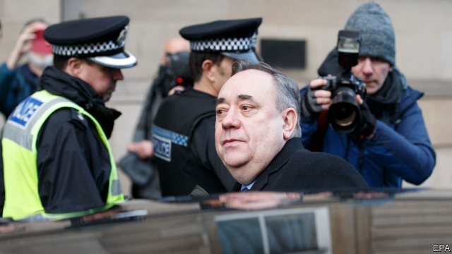

###### Salmond, hooked

# Alex Salmond’s sex charges rock the SNP 

##### Scotland’s former first minister faces 14 charges, including attempted rape 

 

> Jan 31st 2019 

EVEN AS IT enters its 12th year in government the Scottish National Party remains popular. Despite the trials of office and the efforts of opposition parties to sink the nationalist project, the SNP has sailed serenely on, polling around 40% while the Conservatives and Labour scrap it out in the 20s. At around the same point in its life-cycle the New Labour government, that other election-winning behemoth, was sometimes slipping into third behind the Lib Dems. 

But the SNP’s smooth progress has hit an iceberg. On January 24th Alex Salmond, the party’s 64-year-old former leader, who from 2007 to 2014 was Scotland’s first minister, was charged with nine sexual assaults, two attempted rapes, two indecent assaults and one breach of the peace. He denies them all. 

Mr Salmond is the most important figure in the SNP’s history. He took the party into government and led it to an unexpectedly close 55%-45% defeat in the independence referendum of 2014. His successor as leader and first minister, Nicola Sturgeon, has long described him as her mentor and friend. 

That relationship now looks wrecked. When two female civil servants made allegations against Mr Salmond last year, the Scottish government began an investigation, after which the police were called in. Mr Salmond is said to feel betrayed by his protégée; Ms Sturgeon’s aides accuse his team of smearing her. 

The wider consequences could be significant. Ms Sturgeon insists her timetable for calling another independence referendum is unchanged, and that she will set out her plans before Brexit, due on March 29th. But it is hard to see how the SNP could mount an independence campaign with the charges against Mr Salmond in the air. Much depends on the outcome of his case. 

Further, Ms Sturgeon is herself in hot water. She had five private conversations with Mr Salmond during her government’s investigation, including two at her home. It took her two months to report them to civil servants. An inquiry is considering whether she breached the ministerial code. More may follow. 

The next election to the Holyrood parliament is due in May 2021. Few have been predicting a change at the top. The SNP has avoided the ideological extremes of the two big British parties and kept its dignity amid the Brexit chaos that reigns elsewhere. Yet the party’s reputation for competence has taken a knock. Its claim to an uncommon level of unity has been blown apart. Its progressive credentials—Ms Sturgeon has promoted women and policies like expanded childcare—are under a shadow. Whatever the result of the Salmond case, some voters may reach a new verdict on the SNP. 

-- 

 单词注释:

1.Salmond[]:n. (Salmond)人名；(英)萨蒙德 

2.Alex[]:[计] 开放网络文件系统 

3.snp[]:abbr. （英国）苏格兰国民党（Scottish National Party） 

4.rape[reip]:n. 抢夺, 掠夺, 强奸, 葡萄渣, 芸苔 vt. 掠夺, 抢夺, 强奸 

5.Jan[dʒæn]:n. 一月 

6.opposition[.ɒpә'ziʃәn]:n. 反对, 敌对, 相反, 在野党 [医] 对生, 对向, 反抗, 反对症 

7.nationalist['næʃәnәlist]:n. 国家主义者, 民族主义者 

8.serenely[sə'ri:nlɪ]:adv. 安详地, 沉着地, 宁静地 

9.scrap[skræp]:n. 碎片, 残余物, 些微, 片断, 铁屑, 吵架 vt. 扔弃, 敲碎, 拆毁 vi. 互相殴打 a. 零碎拼凑成的, 废弃的 

10.behemoth[bi'hi:mɔθ]:n. 庞然大物 

11.lib[lib]:a. [口]解放的（等于liberal）；解放论者的 

12.DEM[dem]:[计] 解调器 

13.iceberg['aisbә:g]:n. 冰山, 冷冰冰的人 

14.assault[ә'sɒ:t]:n. 攻击, 袭击 vt. 袭击, 攻击 vi. 发动攻击 

15.indecent[in'di:sәnt]:a. 下流的, 不礼貌的 [医] 猥亵的 

16.breach[bri:tʃ]:n. 裂口, 违背, 破坏, 违反, 突破, 破裂 vt. 攻破, 突破 vi. 跳出水面 

17.unexpectedly[]:adv. 想不到的, 突然的, 意外的, 出乎意料的 

18.referendum[.refә'rendәm]:n. （就重大政治或社会问题进行的）全民公决，全民投票 

19.successor[sәk'sesә]:n. 继承者, 接任者 [计] 后继 

20.nicola[]:n. 尼古拉（男子名） 

21.sturgeon['stә:dʒәn]:n. 鲟鱼 

22.mentor['mentɔ:]:n. 指导者, 良师益友 

23.allegation[.æli'geiʃәn]:n. 断言, 主张, 申辩 [法] 声明, 事实陈述, 断言 

24.aide[eid]:n. 助手, 副官 [计] 数据输入的可说明性 

25.smear[smiә]:vt. 涂, 擦上, 玷污, 把...擦模糊 vi. 被弄脏 n. 污点, 污迹, 污蔑 

26.unchanged[.ʌn'tʃeindʒd]:a. 无变化的 [经] 持稳的 

27.Brexit[]:[网络] 英国退出欧盟 

28.ministerial[.mini'stiәriәl]:a. 部长的, 内阁的, 执政的 [法] 部长的, 部的, 公使的 

29.Holyrood[]:霍利鲁德 

30.ideological[.aidiә'lɒdʒikәl]:a. 意识形态的, 空想的 [法] 思想的, 思想上的, 意识形态的 

31.amid[ә'mid]:prep. 在其间, 在其中 [经] 在...中 

32.chao[]:n. 钞（货币） 

33.uncommon[.ʌn'kɒmәn]:a. 不寻常的, 非凡的, 罕有的 adv. 不平常地 

34.voter['vәutә]:n. 选民, 投票人 [法] 选民, 选举人, 投票人 

35.verdict['vә:dikt]:n. 裁决, 判决, 判断性意见, 定论, 结论 [法] 定论, 判断, 意见 

