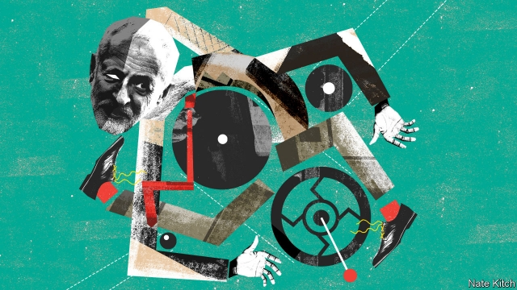

###### Bagehot

# Jeremy Corbyn is having a bad Brexit 

##### The issue is driving a wedge between Labour’s leader and his activists 

 

> Jan 31st 2019 

 

THERESA MAY’S slow progress through the great mangle of Brexit has been so gruesome that it has distracted attention from another political flattening: that of Jeremy Corbyn. The leader of the opposition put in another fumbling performance in the House of Commons this week in proposing that the government should be forced to put off Britain’s departure from the European Union if it doesn’t reach a deal. But lacklustre rhetoric and a feeble grasp of detail mark only the beginning of his problems. 

The Labour Party is even more divided over Brexit than the Conservatives. Most Labour members disagree with their party’s official support for leaving, whereas most Tory party members support their party’s position. Mr Corbyn is much farther away from his party’s centre of gravity than Theresa May is from hers. He is a long-standing Eurosceptic who believes that the EU is a capitalist club that stands in the way of building his socialist Jerusalem. He voted against Britain’s membership in 1975, opposed the single market in the 1980s and only pretended to campaign for Remain in the referendum of 2016. He is surrounded by an inner circle of Eurosceptic advisers who do their best to steer a Europhile party in a Eurosceptic direction. 

Mr Corbyn has tried to manage these contradictions by resorting to grand banalities. He has claimed that Labour supports a “jobs-first Brexit” that will magically provide all the benefits of Brexit with none of the costs. He has headed off calls for a second referendum by saying that he wants a general election instead. That strategy is wearing thin. With Brexit less than two months away, Mr Corbyn is being forced to make real and urgent decisions. This week he lent his support to Yvette Cooper’s amendment requiring the government to delay Brexit if Parliament hasn’t agreed on a deal by a certain date (the measure failed, in part because Mr Corbyn’s backing was so late and his advocacy so feeble). 

Brexit is driving a wedge between Mr Corbyn and his activist fans. Most activists are even more Europhile than the membership in general, particularly the young idealists who flooded into the party from 2015 onwards. Corbynmania is not dead: many activists claim that they forgive their idol his unfortunate views on Europe. But it is hard not to lose some of your enthusiasm when you disagree with your leader on the most important issue of the day. For example, 79% of party members support having another vote on Brexit, whereas Mr Corbyn has done everything in his power to prevent that from happening. Party membership is drifting down and polls show Labour failing to overtake the floundering Tories. 

Brexit is wreaking havoc with Mr Corbyn’s plan to turn Labour into a mass movement as well as a parliamentary party. The lefties demonstrating on the streets these days are calling for Britain to remain in the EU, not for the abolition of capitalism. Brexit is also dividing the left. Mr Corbyn rose to power by uniting the broad left against the Blairite right. The 69-year-old looked as if he was a prophet of a progressive future while the middle-aged Blairites looked as if they were locked in a neo-liberal past. Now he is splitting the left between Europhobes and Europhiles (even his long-term ally and shadow chancellor, John McDonnell, is distancing himself from Mr Corbyn’s Euroscepticism) and allowing Blairites such as Ms Cooper to rebrand themselves as champions of an open future. 

Above all, Brexit is forcing Mr Corbyn to fight on uncongenial terrain. He takes every opportunity he can to change the topic back to his old favourites: the evils of greedy bosses and the ravages of austerity. The only time he comes alive in prime minister’s questions is when he is talking about victims of the government’s cuts. But his words keep falling on deaf ears. 

Mr Corbyn’s response is to shout louder. He is convinced that Brexit is not a “productive antagonism” for the left, as one aide puts it, and that the best way to deal with it is to shift the subject back to the antagonisms that have defined his career. History has other plans. Growing psephological evidence suggests that Brexit is profoundly reshaping British political allegiances. Voters are increasingly defining themselves by where they stand on Brexit rather than by where they stand on old-fashioned politics. Geoff Evans and Florian Scheffner note that only 6% of Britons do not identify with either Leave or Remain, whereas 22% do not identify with a party. Tim Bale, another academic, notes that 61% of Labour members think Brexit is the biggest issue facing the country, versus just 9% who plump for the next-biggest, health and the environment. 

Mr Corbyn’s contortions over Brexit are forcing his supporters to rethink their idea that he is a man of principle. He seems almost Clintonian in his willingness to triangulate on all things Brexitrelated, embracing vague formulae so he can appease both Leavers and Remainers, and indulging in procedural prevarication in order to avoid making difficult decisions. At the same time, his manifold confusions over Brexit, in interviews and at the dispatch box, are reinforcing his critics’ worries that he is not up to the job of taking real decisions. He often seems to be confused about basic questions such as what a customs union means, let alone the details of complicated negotiations. 

The biggest danger for Mr Corbyn is that he will be defined by history as a handmaiden of Brexit if he doesn’t get off the fence and try to prevent it. One prominent Labour Remainer says that he and his friends will do everything in their power to brand Mr Corbyn as a latter-day Ramsay MacDonald, the Labour prime minister who was expelled from his party after he agreed to lead the Conservative-dominated National Government in 1931. Given Mr Corbyn’s irritating habit, throughout his long life in politics, of demonising anybody to his right in the party as a traitor to the true cause, it would be a delicious irony if he went down in history as Ramsay MacCorbyn, the enabler of the most dastardly Tory project since Thatcherism. Brexit has done stranger things. 

-- 

 单词注释:

1.Bagehot[ˈbædʒət]:白芝浩；巴杰特（人名） 

2.jeremy['dʒerimi]:n. 杰里米（男子名） 

3.Corbyn[]:科尔宾（人名） 

4.Brexit[]:[网络] 英国退出欧盟 

5.wedge[wedʒ]:n. 楔子, 楔形物, 起因, 导致分裂的东西 vt. 楔住, 挤进, 楔入 vi. 楔入, 挤进 

6.activist['æktivist]:n. 激进主义分子 

7.Jan[dʒæn]:n. 一月 

8.theresa[ti'ri:zә]:n. 特丽萨（女子名） 

9.mangle['mæŋgl]:vt. 乱砍, 损坏, 轧布 n. 轧布机 

10.gruesome['gru:sәm]:a. 可怕的, 令人毛骨悚然的, 阴森的 

11.distract[dis'trækt]:vt. 转移, 分心, 使发狂 

12.opposition[.ɒpә'ziʃәn]:n. 反对, 敌对, 相反, 在野党 [医] 对生, 对向, 反抗, 反对症 

13.fumble['fʌmbl]:n. 摸索, 笨拙的行动, 漏球 vt. 摸索, 乱摸, 笨拙的处理, 漏接(球) vi. 摸索, 笨手笨脚, 漏球 

14.lacklustre['læklʌstә]:a. 无光泽的, 无生气的 n. 无光泽, 无生气 

15.rhetoric['retәrik]:n. 修辞, 修辞学, 雄辩(术) 

16.Tory['tɒ:ri]:n. 托利党党员, 保守党员, 亲英分子 a. 保守分子的 

17.theresa[ti'ri:zә]:n. 特丽萨（女子名） 

18.eurosceptic[ˌjʊərəʊ'skeptɪk]:n. 欧洲统一怀疑论者；反对英国亲近欧盟的人 

19.EU[]:[化] 富集铀; 浓缩铀 [医] 铕(63号元素) 

20.capitalist['kæpitәlist]:n. 资本家, 资本主义者 a. 资本主义的 

21.Jerusalem[dʒә'ru:sәlәm]:n. 耶路撒冷 

22.membership['membәʃip]:n. 会员的资格, 全体会员, 会员数目 [法] 会员资格, 成员资格, 会籍 

23.referendum[.refә'rendәm]:n. （就重大政治或社会问题进行的）全民公决，全民投票 

24.adviser[әd'vaizә]:n. 顾问, 劝告者, 指导教师 [法] 顾问, 劝告者 

25.Europhile[]:亲欧分子 

26.banality[bә'næliti]:n. 平凡, 陈腐 

27.magically[]:adv. 用魔法地；如魔法般地 

28.les[lei]:abbr. 发射脱离系统（Launch Escape System） 

29.yvette[i'vet]:n. 伊薇特（女子名） 

30.amendment[ә'mendmәnt]:n. 修订, 改善, 改良, 改正 [化] 调理剂; 修正 

31.advocacy['ædvәkәsi]:n. 拥护, 支持, 鼓吹, 辩护, 辩护术 [法] 辩护, 拥护, 提倡 

32.idealist[ai'diәlist]:n. 理想主义者, 唯心主义者 a. 唯心论的, 理想主义的 

33.onward['ɒnwәd]:a. 向前的, 前进的 adv. 向前, 前进, 在先 

34.idol['aidәl]:n. 偶像, 崇拜物, 宠儿, 幻象, 谬论 

35.flounder['flaundә]:vi. 挣扎, 折腾；错乱地做事或说话 

36.Tory['tɒ:ri]:n. 托利党党员, 保守党员, 亲英分子 a. 保守分子的 

37.wreak[ri:k]:vt. 发泄(怒火), 报仇 [法] 报仇, 报复, 施 

38.havoc['hævәk]:n. 大破坏, 蹂躏 vt. 严重破坏 

39.parliamentary[.pɑ:lә'mentәri]:a. 国会的, 议会的, 议会制度的 

40.lefty['lefti]:n. 左撇子, 左翼分子 

41.abolition[.æbәu'liʃәn]:n. 废除, 废奴运动 [医] 禁止, 消失 

42.capitalism['kæpitәlizәm]:n. 资本主义 [经] 资本主义 

43.Blairite[]:[网络] 布莱尔主义；布莱尔派；布莱尔派系 

44.prophet['prɒfit]:n. 预言者, 先知, 提倡者 

45.Blairites[]:[网络] 布莱尔派；布朗的布莱尔派；贝派 

46.europhobe['juərəufəub]:n. 恐欧盟的人 

47.europhiles[]:[网络] 欧洲支持者；欧盟者 

48.ally['ælai. ә'lai]:n. 同盟者, 同盟国, 助手 vt. 使联盟, 使联合, 使有关系 vi. 结盟 

49.chancellor['tʃɑ:nsәlә]:n. 大臣, 总理, 首相, 大使馆/领事馆的一等秘书, 司法官, 大学校长 

50.john[dʒɔn]:n. 盥洗室, 厕所, 嫖客 

51.McDonnell[]:麦克唐奈（人名） 

52.Euroscepticism[]:[网络] 欧洲怀疑主义；欧洲怀疑论；欧主义 

53.cooper['ku:pә]:n. 制桶工人 v. 制桶 

54.rebrand[ˌri:ˈbrænd]:v. 给（产品或组织）重新命名（或包装）, 重塑…的形象 

55.uncongenial[ˌʌnkənˈdʒi:niəl]:a. 志趣不相投的; 忤 

56.terrain['terein]:n. 地带, 地区, 地形, 领域, 范围 

57.ravage['rævidʒ]:n. 破坏, 蹂躏 v. 毁坏, 破坏, 掠夺 

58.austerity[ɒ'sterәti]:n. 朴素, 苦行, 严格, 严峻 

59.antagonism[æn'tægәnizm]:n. 对立, 敌对, 敌意 [化] 拮抗作用; 消效作用 

60.aide[eid]:n. 助手, 副官 [计] 数据输入的可说明性 

61.psephological[,psefə'lɔdʒikəl; psi-]:a. psephology的变形 

62.profoundly[prә'fajndli]:adv. 深深地, 深切地 

63.reshape[ri:'ʃeip]:vt. 改造, 使成新的形状, 打开新局面 vt. 整形 vi. 整形 [计] 整形 

64.allegiance[ә'li:dʒәns]:n. 忠贞, 效忠 

65.voter['vәutә]:n. 选民, 投票人 [法] 选民, 选举人, 投票人 

66.politic['pɒlitik]:a. 精明的, 明智的, 策略的 

67.geoff[]:n. 杰夫（男子名） 

68.evan['evən]:n. 埃文（男子名） 

69.Florian[]:n. 佛罗莱恩（咖啡馆）；御马（车名） 

70.Briton['britәn]:n. 大不列颠人, 英国人 

71.tim[tim]:n. 蒂姆（男子名） 

72.bale[beil]:n. 包, 捆, 货物, 灾难 vt. 打包, 捆包 

73.versus['vә:sәs]:prep. 对... [法] 诉, 对, 相形 

74.plump[plʌmp]:a. 圆胖的, 丰满的, 直接下落的, 直率的 vt. 突然放下, 支持, 使丰满, 使鼓起 vi. 扑通落下, 投票赞成, 变丰满, 鼓起 adv. 沉重地, 突然地, 直截了当地 

75.contortion[kәn'tɒ:ʃәn]:n. 扭弯, 扭歪, 曲解 [医] 扭歪, 扭转 

76.supporter[sә'pɒ:tә]:n. 支持者, 后盾, 迫随者, 护身织物 [法] 支持者, 赡养者, 抚养者 

77.rethink[ri:'θiŋk]:v. 再想, 重想 

78.Clintonian['klintəniən]:n. [地质] 克林顿阶 

79.triangulate[trai'æŋgjuleit]:vt. 把...分成三角形, 作三角测量, 使...成三角形 a. 三角形的, 由三角形组成的, 有三角斑纹的 

80.appease[ә'pi:z]:vt. 抚慰, 缓解, 平息, 姑息 [法] 使和缓, 使满足, 姑息 

81.leaver['li:vә]:n. 离开者（常指学校毕业生） 

82.remainers[]:[网络] 剩余物 

83.indulge[in'dʌldʒ]:vt. 纵情于, 使高兴, 放任, 迁就 vi. 沉溺 

84.procedural[prә'si:dʒәrәl]:a. 程序上的 [经] 程序上的 

85.prevarication[pri.væri'keiʃәn]:n. 支吾, 搪塞 [法] 推诿, 支吾其词, 搪塞 

86.manifold['mænifәuld]:n. 复印本, 多种 a. 多种的, 有许多部分的, 多方面的 vt. 复写, 使多样化, 增多 

87.dispatch[dis'pætʃ]:vt. 派遣 n. 派遣, 急件 [计] 调度 

88.negotiation[ni.gәuʃi'eiʃәn]:n. 谈判, 磋商, 交涉 [经] 谈判, 协商 

89.handmaiden['hændmeid(ә)n]:n. 侍女, 女仆 

90.remainer[]:[网络] 剩下的 

91.Ramsay['ræmzi]:拉姆齐(①姓氏 ②Sir William, 1852-1916, 英国化学家, 氦的发现者, 曾获1904年诺贝尔化学奖) 

92.macdonald[mәk'dɔnәld]:n. 麦克唐纳（姓氏）；麦当劳快餐店 

93.irritate['iriteit]:vt. 激怒, 使发怒, 使兴奋, 使发炎 vi. 引起不快 

94.demonise['di:mәnaiz]:vt.<主英>=demonize 

95.irony['aiәrәni]:n. 反语, 讽刺, 具有讽刺意味的事 

96.enabler[]:n. 使能器, 使能者；促成者, 赋能者 

97.dastardly['dæstәdli]:a. 卑怯的人, 懦夫, 怯懦 

98.thatcherism['θætʃərizəm]:n. 撒切尔主义 

