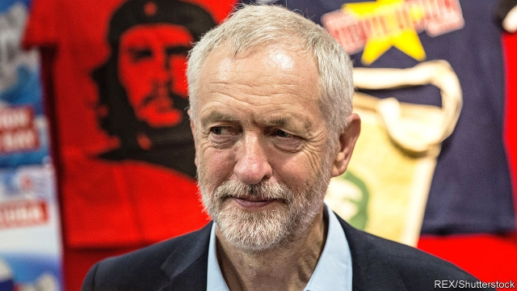

###### ¡Hasta la victoria Corbynista!

# Latin America provides a canvas for Jeremy Corbyn’s worldview 

##### Why is the British left obsessed with Latin America? 

 

> Jan 31st 2019 

 

AN EVENT FEATURING Ivanka Trump, the king of Spain and Jeremy Corbyn sounds like a fever dream. But for one curious afternoon in December the trio came together in Mexico City for the inauguration of Andrés Manuel López Obrador. While a Brexit-induced political crisis raged in Britain, the Labour leader was in Mexico to watch the new president—who calls Mr Corbyn his “eternal friend”—being sworn in. 

Latin America looms large in Mr Corbyn’s political imagination. He spent his formative years gallivanting round South America and speaks fluent, London-accented Spanish. His wife is from Mexico (and his ex-wife from Chile). While fending off a leadership coup in the summer of 2016, Mr Corbyn took time to attend an event hosted by the Cuba Solidarity Campaign, of which he is a long-term supporter. It is a fixation shared by his close allies. John McDonnell, the shadow chancellor, and Diane Abbott, the shadow home secretary, were among several senior Corbynites who signed a letter this week dismissing the “US attempt at regime change” under way in Venezuela. 

An obsession with all things Latin has long been common in the Labour movement, points out Grace Livingstone of Cambridge University. The Cuban revolution represented a socialism that did not stem from the dour bureaucrats of the Soviet Union (even if Havana did eventually fall in line behind Moscow). Salvador Allende’s election in Chile in 1970 was seen as a triumph for democratic socialism; his removal in a coup is still taken as evidence that the forces of capital would smash an embryonic Corbyn-led government. “There are powerful forces…that want to oppose those who want to bring about economic and social justice,” Mr Corbyn told La Jornada, a Mexican newspaper, last year. 

Activists hail radical leaders such as Evo Morales in Bolivia as bulwarks against neoliberalism and decry any attempt to rein in the government of Venezuela, whose economy has collapsed as its left-wing leaders have turned to autocracy. Where Latin American governments have succeeded, it is an example of socialism in action; where they have failed, it is a demonstration of nefarious American imperialism. 

The obsession can backfire. Mr Corbyn’s support for the late Hugo Chávez looks even more ill-judged now that Venezuela has fallen deeper into anarchy. Footage of a chat between Mr Corbyn and Chávez’s successor, Nicolás Maduro, on the latter’s radio talk-show, “En contacto con Maduro”, does not help. 

Whether British voters care is another matter; few share his interest in Latin American politics. But Mr Corbyn’s rise means that Latin America may start paying more attention to the British left. On the eve of his inauguration, Mr López Obrador said he wanted “with all my heart, with all my soul” to see his British friend become prime minister. Should Mr Corbyn make it to Downing Street, a transatlantic invitation will be in the post and another fever dream can begin. 

-- 

 单词注释:

1.La[lɔ:, lɑ:]:[医] 镧(57号元素) 

2.victoria[vik'tɔ:riә]:n. 维多利亚（女子名） 

3.jeremy['dʒerimi]:n. 杰里米（男子名） 

4.worldview['wɜ:ldvju:]:n. 看; 视力; 观点; 目的 

5.obsess[әb'ses]:vt. 迷住, 使困扰 

6.Jan[dʒæn]:n. 一月 

7.ivanka[]:[网络] 伊凡卡；伊万卡；伊凡佳 

8.trump[trʌmp]:n. 王牌, 法宝, 喇叭 vt. 打出王牌赢, 胜过 vi. 出王牌, 吹喇叭 

9.Spain[spein]:n. 西班牙 

10.Corbyn[]:科尔宾（人名） 

11.trio['tri:әu]:n. 三重唱 

12.inauguration[i,nɔ:^ju'reiʃәn]:n. (美)总统就职, 开幕仪式, 就职典礼, 开始, 开辟, 开创, 为...举行开幕式 [法] 就职, 就职典礼, 创造 

13.manuel['mænjuel]:n. 曼纽尔（男子名）；曼努埃尔二世（拜占庭皇帝约翰五世的次子） 

14.López[]:[地名] 洛佩斯 ( 阿根、厄 ) 

15.obrador[]:[网络] 布拉多 

16.eternal[i'tә:nl]:a. 永恒的, 永远的, 不灭的 

17.loom[lu:m]:n. 织布机, 若隐若现的景象 vi. 朦胧地出现, 隐约可见, 可怕地出现 

18.formative['fɒ:mәtiv]:a. 有助于形成的, 造型的, 形成的 n. 构词要素 

19.gallivant[.gæli'vænt]:vi. 与异性闲荡, 闲逛 

20.Chile['tʃili]:n. 智利 [化] 番椒; 辣椒 

21.fend[fend]:vt. 击退, 保护, 供养 

22.coup['ku:]:n. 砰然的一击, 妙计, 出乎意料的行动, 政变 [医] 发作, 中, 击 

23.Cuba['kju:bә]:n. 古巴 

24.solidarity[.sɒli'dæriti]:n. 团结, 团结一致, 共同一致 [法] 团结, 共同责任 

25.supporter[sә'pɒ:tә]:n. 支持者, 后盾, 迫随者, 护身织物 [法] 支持者, 赡养者, 抚养者 

26.fixation[fik'seiʃәn]:n. 定置, 固定, 定色 [医] 固定; 固定法, 固定术; 定影 

27.ally['ælai. ә'lai]:n. 同盟者, 同盟国, 助手 vt. 使联盟, 使联合, 使有关系 vi. 结盟 

28.john[dʒɔn]:n. 盥洗室, 厕所, 嫖客 

29.McDonnell[]:麦克唐奈（人名） 

30.chancellor['tʃɑ:nsәlә]:n. 大臣, 总理, 首相, 大使馆/领事馆的一等秘书, 司法官, 大学校长 

31.diane[dai'æn]:n. 黛安（等于Diana, 女子名） 

32.Abbott['æbət]:n. 阿尔伯特（人名）；雅培（公司名） 

33.regime[rei'ʒi:m]:n. 政权, 当权期间, 政体, 社会制度, 体制, 情态 [医] 制度, 生活制度 

34.Venezuela[,vene'zweilә]:n. 委内瑞拉 

35.obsession[әb'seʃәn]:n. 困扰, 困扰人的情绪 [医] 强迫观念 

36.Livingstone['liviŋstәn]:利文斯敦[赞比亚西南部城市] 

37.Cambridge['keimbridʒ]:n. 剑桥 

38.Cuban['kju:bәn]:a. 古巴的, 古巴人的 n. 古巴人 

39.dour[duә]:a. 阴沉的, 严厉的, 顽强的 

40.bureaucrat['bjuәrәukræt]:n. 官僚作风的人, 官僚, 官僚主义者 [法] 官僚, 官僚作风的人 

41.Havana[hә'vænә]:n. 哈瓦那, 哈瓦那雪茄烟 

42.Salvador['sælvәdɔ:]:[经] 萨尔瓦多 

43.embryonic[.embri'ɒnik]:a. 萌芽的, 初期的, 未成熟 [医] 胚胎的 

44.La[lɔ:, lɑ:]:[医] 镧(57号元素) 

45.jornada[dʒɔ:'neɪdə]:n. 一天的旅程，（美国南部、墨西哥的）荒漠地带 

46.activist['æktivist]:n. 激进主义分子 

47.hail[heil]:n. 冰雹, 致敬, 欢呼, 招呼 vt. 向...欢呼, 致敬, 招呼, 使象下雹样落下 vi. 招呼, 下雹 interj. 万岁, 欢迎 

48.evo[]:abbr. 意蓝虚拟办公室（eLand Virtual Office, 软件名）；国际能效评估组织（Efficiency Valuation Organization）；三菱兰瑟（汽车品牌） 

49.morale[mɒ'rɑ:l]:n. 士气, 道德 

50.Bolivia[bә'liviә]:n. 玻利维亚 

51.bulwark['bʌlwәk]:n. 保障, 壁垒, 防波堤 

52.neoliberalism[,niәu'libәrәlizәm]:新自由主义 

53.decry[di'krai]:vt. 反对, 责难, 诽谤, 诋毁 

54.autocracy[ɒ:'tɒkrәsi]:n. 独裁统治, 独裁统治的国家 [法] 独裁政治, 专制政治, 独裁政府 

55.demonstration[.demәn'streiʃәn]:n. 示范, 实证 [医] 示教, 实物教授 

56.nefarious[ni'feәriәs]:a. 恶毒的, 极坏的 

57.imperialism[im'piәriәlizm]:n. 帝国主义, 帝制 [法] 帝国主义 

58.backfire[.bæk'faiә]:n. 逆火, 回火, 放火 vi. 放逆火, 预先放火, 发生意外 

59.hugo['hju:^әu]:n. 雨果（男子名, 等于Hugh） 

60.anarchy['ænәki]:n. 无政府状态, 政治混乱 [法] 混乱, 无秩序, 无政府状态 

61.footage['futidʒ]:n. 英尺长度, 英板尺, (影片的)连续镜头 

62.successor[sәk'sesә]:n. 继承者, 接任者 [计] 后继 

63.maduro[mә'duәrәu]:a. 色深味浓的烟草做的, (雪茄)色深味浓的 

64.en[en]:n. 字母N, (铅字)半方 prep. 在...中, 作为 

65.contacto[]:[网络] 智利商展 

66.con[kɒn]:vt. 精读, 仔细研究, 默记 adv. 反面地, 从反面 a. 欺诈的 n. 反对者, 反对票, 肺结核 [计] 控制台 

67.voter['vәutә]:n. 选民, 投票人 [法] 选民, 选举人, 投票人 

68.politic['pɒlitik]:a. 精明的, 明智的, 策略的 

69.transatlantic[.trænsәt'læntik]:a. 横渡大西洋的, 大西洋彼岸的, 美国的 

