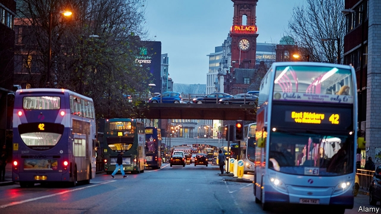
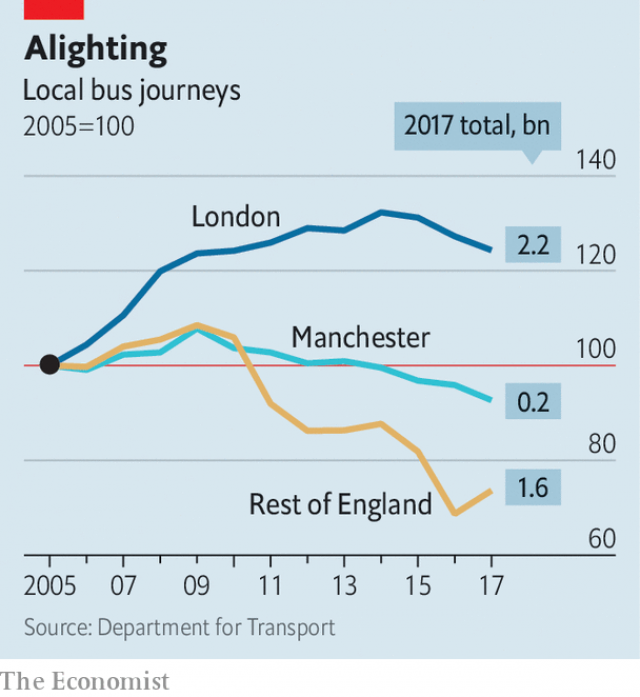

###### Off the buses

# Manchester’s mayor considers taking back control of buses 

##### Passengers approve. But who runs the routes may matter less than how congested the roads are 

 

> Jan 31st 2019 

 

THERE IS ONE thing in particular that Mancunians love to moan about: their buses. The number 43, which trundles down what is thought to be Europe’s busiest route, is far from loved. Onboard, one student riding from the university to the railway station complains that it takes three times as long in rush hour. “They are always changing the route—never for the better,” says a nurse working at a nearby hospital. At least it is easier to find a seat these days, they say—as riders are switching to faster modes of transport. 

Andy Burnham, the mayor, is keen to find a way to reverse this gradual decline in passenger numbers in his city (see chart). On January 25th the ten councils that make up his Greater Manchester Combined Authority (GMCA) approved an increase in council tax to fund a detailed study into the options for bus reform. One strategy Mr Burnham is considering is to “re-regulate” bus services, taking the routes back under public control. If he does so, the city will be the first to use a new law that gives mayors the power to franchise bus services. 

In the past decade bus travel has gone into steep decline outside the capital. Since 2009 the number of bus journeys in Manchester has fallen by 14%. Austerity has played a role. Councils in England and Wales have slashed bus subsidies by 45% since 2010, resulting in 3,347 routes being cut back or closed. 

 

Re-regulation could help reverse some of that decline, argues Pascale Robinson of Better Buses for Greater Manchester, a campaign group. Passenger numbers have fallen by 40% in Manchester since bus routes there were handed to private operators in 1986. Meanwhile in London, where franchising continued, patronage has doubled. Letting GMCA manage the system could lure riders back by co-ordinating bus schedules and offering through-ticketing for routes operated by different firms. 

That argument is popular among passengers. But re-regulation is no magic bullet, argues David Brown, chief executive of Go-Ahead, a bus firm. Passenger numbers are now falling at a faster rate in central London than in the regions. Belfast, where the bus market was never deregulated, has seen falls in usage much like Manchester’s. Nor would re-regulation deal with changes in demand for bus travel, Mr Brown argues. Although the number of journeys by bus to work has remained remarkably stable, those for activities such as shopping and socialising have fallen. The decline of the high street and the rise of home delivery have made many journeys unnecessary. 

The key to luring people away from travelling by car or taxi is to speed up buses, says David Begg of Plymouth University. Growing traffic jams, caused in part by a proliferation of delivery vans and Ubers, are slowing them down. The average delay caused by congestion in Britain’s cities has increased by 14% in the past three decades, according to TomTom, a maker of satnavs. Manchester is badly affected: the 43 bus now takes nearly 80% longer to cover its route in rush hour than it did 30 years ago. The average speed of Stagecoach’s buses fell by 4.9% in 2014-16; one route which took just nine minutes seven years ago now takes 27, according to the company. 

Giving buses their own lane, or priority over other traffic, could help, says Giles Fearnley of First Bus, a big operator in Manchester. Vantage, a bus-priority scheme linking Leigh, Mr Burnham’s former parliamentary seat, to Manchester, has seen weekly passenger numbers rise by nearly 140% since it opened in 2016. Other policies to make car use less attractive, such as pricier parking or congestion charges, could also nudge folk onto buses. But since a local referendum in 2008 rejected a congestion charge, Manchester’s politicians have shown little interest in the idea. With 70% of Mancunians getting to work by car each day, it is easy to see why. 

-- 

 单词注释:

1.les[lei]:abbr. 发射脱离系统（Launch Escape System） 

2.congest[kәn'dʒest]:vt. 使充满, 使拥塞, 使充血 vi. 充塞, 充血, 拥挤 

3.Jan[dʒæn]:n. 一月 

4.Mancunian[mæŋ'kju:niәn]:a. 曼彻斯特的 n. 曼彻斯特人 

5.trundle['trʌndl]:n. 小车轮, 脚轮, 滚动 vi. 滚动, 移动, 投球 vt. 使滚动, 使移转 

6.onboard['ɒn'bɒ:d]:adv. 在板上, 在船上, 在车上, 在飞机上 

7.alway['ɔ:lwei]:adv. 永远；总是（等于always） 

8.andy['ændi]:n. 安迪（男子名, 等于Andrew） 

9.Burnham[]:n. (Burnham)人名；(英、西)伯纳姆 

10.Manchester['mæntʃestә]:n. 曼彻斯特 

11.GMCA[]:[网络] 拟子协同进化算法；通讯社 

12.franchise['fræntʃaiz]:n. 公民权, 特权, 特许经营权, 免赔额 vt. 给以特权, 给以...公民权 

13.austerity[ɒ'sterәti]:n. 朴素, 苦行, 严格, 严峻 

14.wale[weil]:n. 隆起的伤痕, 鞭痕, 凸条纹, 精华, 选择 vt. 在...上留下鞭痕, 织成棱纹, 挑选, 撑住 vi. 挑选 

15.slash[slæʃ]:v. 猛砍, 乱砍 n. 猛砍, 乱砍, 删减 [计] 斜线 

16.pascale[]:[网络] 帕斯卡尔；帕斯凯尔；帕斯格尔 

17.robinson['rɔbinsn]:n. 罗宾逊（男子名） 

18.patronage['pætrәnidʒ]:n. 赞助, 恩赐态度, 光顾, 任免权, 保护人的身分 [经] 光顾, 资助, 赞助 

19.lure[luә]:n. 饵, 诱惑 vt. 引诱, 诱惑 

20.david['deivid]:n. 大卫；戴维（男子名） 

21.Belfast[.belfɑ:st]:n. 贝尔法斯特 

22.deregulate[di:re^jjleit]:[法] 解除管制 

23.remarkably[ri'mɑ:kәbli]:adv. 显著地, 引人注目地, 非常地 

24.socialise['sәjʃәlaiz]:vt. 使社会化, 使社会主义化, 使适合社会需要 vi. (美)(非正式)参加社交活动, 发生社交往来 

25.Begg[]:贝格 

26.plymouth['plimәθ]:n. 普利茅斯（英国一座城市） 

27.proliferation[.prәulifә'reiʃәn]:n. 增殖, 激增 [医] 增生, 增殖 

28.congestion[kәn'dʒestʃәn]:n. 拥挤, 充血 [计] 拥挤, 拥塞 

29.tomtom[]:n. (印度等地用手拍击的)长筒鼓(鼓声)；锣 v. 拍击长筒鼓 [网络] 汤姆汤姆；通腾；导航 

30.maker['meikә]:n. 制造者, 上帝 [经] 制造者, 出票人 

31.satnav['sætnæv]:n. （卫星信息辅助的）航行; （可接收卫星信息的）航海系统 

32.gile[]: [人名] 贾尔 

33.fearnley[]: [人名] [英格兰人姓氏] 弗恩利 Farley的变体 

34.vantage['væntidʒ]:n. 优势, 有利情况 

35.leigh[l i:]:n. 利（男子名, 等于Lee） 

36.parliamentary[.pɑ:lә'mentәri]:a. 国会的, 议会的, 议会制度的 

37.pricy['praisi]:a. 昂贵的, 价格高的 

38.nudge[nʌdʒ]:n. 用肘轻推, 推动, 讨厌家伙 

39.referendum[.refә'rendәm]:n. （就重大政治或社会问题进行的）全民公决，全民投票 

