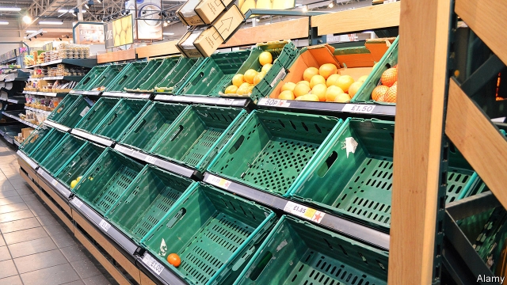

###### Dealing with no deal

# No-deal planning accelerates, at least for firms that can afford it 

##### Many are putting contingency plans into action. Others cannot spare the cash 

 

> Jan 31st 2019 

 

LESS THAN two months before Brexit day it is still unclear what kind of exit deal Britain will end up with—or even whether it will get one. The votes in Parliament on January 29th offered little reassurance. If anything, argued Carolyn Fairbairn, head of the Confederation of British Industry, a lobby group, they will persuade companies to accelerate their preparations for a no-deal exit. Tom Enders, the boss of Airbus, spoke for many firms when he recently branded the government’s handling of Brexit a “disgrace”. Businesspeople are furious. But they must also be pragmatic. And so as March 29th approaches, their no-deal plans are being put into effect. 

Strategically sensitive industries such as banking and pharmaceuticals were advised by regulators to implement no-deal plans some time ago, says Mats Persson, head of the Brexit team at EY, a consultancy. Banks have already moved staff to subsidiaries on the continent to secure “passporting rights” and continue operations within the European Union. On January 30th the High Court approved a plan by Barclays to move €190bn ($218bn) in assets from London to Dublin. In December the government asked drug companies to add at least six months’ worth of supply to their usual stock as a precaution. 

Other industries have held out longer. Many retailers, including some big supermarkets, triggered their contingency plans at the beginning of January. A week after Parliament rejected the government’s Brexit plan on January 15th, P&O said it would re-flag its cross-Channel ferries (including the Spirit of Britain) to Cyprus. Sony, a Japanese electronics giant, announced that it was moving its European headquarters from London to Amsterdam. 

Companies preparing for no deal tend to have the same priorities. The first, says Mr Persson, is to set up a new entity on the continent, to qualify, like the banks, for the required permits to continue to trade in the EU and to enjoy the same tax regimes if Britain leaves without a deal. 

Second, some firms are preparing to move production, distribution and warehousing. Take Goodfish, a medium-sized manufacturer of plastic injection mouldings, which ships a third of its products to the EU. Greg McDonald, its boss, has registered the company in Slovakia and is ready to transfer some production there in the event of no deal. Art Logistics, which ships fine art between Britain and the continent, has made plans for a Dutch company to provide trucks and drivers if its own fleet of seven specially modified vans is grounded without EU travel permits. 

Many businesses are stockpiling. Consumer-products firms, such as Dixons Carphone, and clothes retailers like Burberry, are stacking up inventory to keep the shelves full after no deal. The Chartered Institute for Procurement and Supply says that December saw the second-sharpest rise in the stocking of finished goods since its survey began in 1992. In the manufacturing industry, the value of loans rose by 8% in the year to December, which analysts see as a sign of stockpiling. 

In some areas it is already too late. Refrigerated space ran out in September. And some products cannot be stockpiled. In a joint letter to MPs on January 28th, some of the country’s largest supermarkets and fast-food outlets warned that perishable items such as lettuces and tomatoes, which come mainly from the EU during the British spring, would be missing from shelves. Carmakers’ “just in time” supply chains make it impossible to store the hundreds of thousands of parts that enter the country every day. Rather, the likes of Toyota, BMW and Jaguar Land Rover have rescheduled planned maintenance shutdowns for the weeks after Brexit day. BMW will live off just two days’ worth of “buffer” stocks before closing down production of the Mini for four weeks and the Rolls-Royce for two. 

Companies are also re-examining their supply chains. Haulage companies are honing plans to avoid the pinch points of Dover and Folkestone. CEVA, a big logistics firm headquartered in the Netherlands, has reserved several freight planes with charter companies and is preparing new routes for roll-on, roll-off ferries to ports like Liverpool, to avoid the south coast. 

Needs must. But no-deal planning is expensive, and many of Britain’s 5.7m small and medium companies are loth to invest in something that may never happen. In a recent poll by the Institute of Directors, which mainly represents smaller firms, 40% said they would not do anything until “the new relationship between the UK and the EU is completely clear.” They are in for a long wait. 

-- 

 单词注释:

1.contingency[kәn'tindʒәnsi]:n. 偶然性, 可能性, 意外事故 [经] 意外事故, 意外开支, 偶然事故 

2.cannot['kænɒt]:aux. 无法, 不能 

3.Jan[dʒæn]:n. 一月 

4.les[lei]:abbr. 发射脱离系统（Launch Escape System） 

5.Brexit[]:[网络] 英国退出欧盟 

6.unclear[.ʌn'kliә]:a. 不易了解的, 不清楚的, 含混的 

7.reassurance[.ri:ә'ʃurәns]:n. 安心, 放心, 再保证 

8.carolyn[]:n. 卡洛琳（女子名） 

9.Fairbairn[]:n. (Fairbairn)人名；(英)费尔贝恩 

10.confederation[kәn.fedә'reiʃәn]:n. 同盟, 联盟, 组织联盟 

11.lobby['lɒbi]:n. 大厅, 休息室, 游说议员者 vi. 游说议员, 游说 vt. 游说 

12.tom[tɒm]:n. 雄性动物, 雄猫 

13.ender[]:n. 安德（游戏中的人物名）；恩德（男子名） 

14.airbus['eәbʌs]:空中客车 

15.disgrace[dis'greis]:n. 耻辱, 不名誉 vt. 使受耻辱, 使失体面 

16.businessperson['bɪznəspɜ:sn]:n. 商人 

17.pragmatic[præ^'mætik]:a. 忙碌的, 爱管闲事的, 自负的, 固执己见的, 实际的, 务实的, 国事的, 国务的 [法] 闲断的, 固执己见的, 实用主义的 

18.strategically[strә'ti:dʒikәli]:adv. 在战略上, 颇策略地 

19.pharmaceutical[,fɑ:mә'sju:tikәl]:a. 药学的, 制药的, 药用的, 药物的, 药剂师的, 药师的 n. 药品, 成药, 药剂 

20.regulator['regjuleitә]:n. 调整者, 校准者, 校准器, 调整器, 标准钟 [化] 调节剂; 调节器 

21.persson[]:n. (Persson)人名；(法、德、芬、挪、瑞典)佩尔松 

22.ey[]:abbr. 医院；阿联酋阿提哈德航空公司 

23.consultancy[]:n. 商量, 协商, 磋商, 会诊, 与...商量, 咨询, 请教, 找(医生)看病, 查阅, 考虑 [经] 咨询业务, 咨询服务 

24.subsidiary[sәb'sidiәri]:n. 子公司, 附件, 辅助者 a. 辅助的, 次要的, 津贴的 

25.passporting[]:[网络] 护照 

26.barclay['bɑ:kli]:n. 巴克利（姓氏, 男子名） 

27.asset['æset]:n. 资产, 有益的东西 

28.Dublin['dʌblin]:n. 都柏林 

29.retailer['ri:teilә]:n. 零售商人, 传播的人 [经] 零售商 

30.trigger['trigә]:n. 触发器, 扳机 vt. 触发, 发射, 引起 vi. 松开扳柄 [计] 切换开关 

31.Cyprus['saiprәs]:n. 塞浦路斯 [经] 赛浦路斯 

32.sony[]:n. 索尼（日本电子娱乐公司） 

33.headquarter[,hed'kwɔ:tә]:vt. 将...的总部设在 

34.Amsterdam[.æmstә'dæm]:n. 阿姆斯特丹(荷兰首都) 

35.entity['entiti]:n. 实体, 实存物, 存在 [计] 实体 

36.EU[]:[化] 富集铀; 浓缩铀 [医] 铕(63号元素) 

37.regime[rei'ʒi:m]:n. 政权, 当权期间, 政体, 社会制度, 体制, 情态 [医] 制度, 生活制度 

38.moulding['mәuldiŋ]:n. 模制, 浇铸 [医] 儿头变形; 塑型 

39.greg[greg]:n. 格雷格（男子名, 等于Gregory） 

40.mcdonald[mәk'dɔnәld]:n. 麦克唐纳（男子名）；麦当劳（快餐店名称） 

41.Slovakia[slәu'vækiә]:n. 斯洛伐克 

42.logistic[lәu'dʒistik]:a. 逻辑的, 后勤学的 

43.Dutch[dʌtʃ]:n. 荷兰人, 荷兰语 a. 荷兰的 

44.stockpile['stɒkpail]:n. 储蓄, 积蓄, 库存 vt. 储蓄, 贮存 

45.dixon['diksn]:n. 狄克逊（姓氏） 

46.carphone[]:na. (汽车上安装的)车载电话 [网络] 卡锋；车用电话；汽车无线电话 

47.Burberry['bә:bәri]:n. 柏帛丽雨衣, 柏帛丽防雨布 

48.inventory['invәntәri]:n. 详细目录, 存货清单 vt. 列入详细目录, 清点存货 [计] 存货清单 

49.charter['tʃɑ:tә]:n. 特许状, 执照, 宪章 vt. 特许, 发给特许执照 

50.procurement[prә'kjuәmәnt]:n. 获得 [经] 采购 

51.manufacturing[.mænju'fæktʃәriŋ]:n. 制造业 a. 制造业的 

52.analyst['ænәlist]:n. 分析者, 精神分析学家 [化] 分析员; 化验员 

53.refrigerate[ri'fridʒәreit]:vt. 使冷却, 使清凉, 冷藏 [机] 冷冻 

54.MP[]:国会议员, 下院议员 [计] 宏处理程序, 维护程序, 线性规划, 微程序, 多处理器 

55.perishable['periʃәbl]:a. 易腐坏的, 会枯萎的, 易毁灭的, 不经久的 n. 易腐坏的东西 

56.lettuce['letis]:n. 莴苣, 生菜, 纸币 [医] 莴苣 

57.toyota[]:n. 日本丰田汽车（公司名） 

58.bmw[]:abbr. 德国宝马汽车公司（Bavarian Motor Works） 

59.jaguar['dʒægjuә]:n. 美洲虎 

60.rover['rәuvә]:n. 漂泊者, 流浪者, 海盗 [法] 流浪者, 海盗, 海盗船 

61.reschedule[ri:ʃedju:l]:[计] 重安排, 重调度 [化] 修订计划 

62.shutdown['ʃʌtdaun]:n. 关门, 停工, 停机 [经] 停工 

63.buffer['bʌfә]:n. 缓冲器, 缓冲区 vt. 缓冲 [计] 缓冲区, 缓冲器 

64.mini['mini]:n. 同类中的极小者, 微型汽车, 超短裙 a. 微型的 

65.haulage['hɒ:lidʒ]:n. 拖曳, 运费, 牵引量 [经] 公路运输, 拖运费 

66.HON[hʌn]:[化] δ-羟基-γ-氧代正缬氨酸 [医] 羟氧基正缬氨酸 

67.Dover['dәuvә]:n. 多佛(英国港口) 

68.Folkestone['fәukstәun]:福克斯通(英国肯特郡东部港市) 

69.Ceva[]:[地名] 切瓦 ( 意 ) 

70.Netherlands['neðәlәndz]:n. 荷兰 

71.Liverpool['livәpu:l]:n. 利物浦 

72.loth[lәuθ]:a. 不愿意的, 厌恶的 

73.UK[ju: 'kei]:n. 联合王国 

