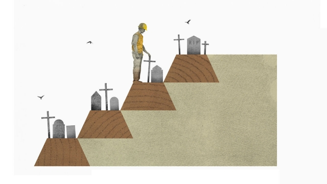

###### Schumpeter

# A Brazilian tragedy is a Deepwater Horizon moment. Sort of 

##### Into the valley of death 

 

> Jan 31st 2019 

 

FROM THE air, the iron-ore mines in Minas Gerais look like roughshod capitalism let loose. Mines are torn out of the landscape, and ramshackle mining towns exist perilously close by. Squeezed within the dense topography are tailings dams, pools of waste material extracted from the mine that sit behind pharaonic embankments reaching dozens of storeys high. On January 25th an 86-metre-tall one owned by Vale, the world’s biggest iron-ore producer, breached, unleashing a wave of sludge that may have killed more than 350 people. They included hundreds of the company’s own employees, many of them having lunch in the cafeteria, recklessly sited below. 

Such a death toll would make this one of the worst tailings tragedies in history; worse for instance than Aberfan in Wales in 1966, or Buffalo Creek, West Virginia in 1972. Even more damaging for Vale, this is the second such disaster in which it is implicated in just over three years. For the world’s mining industry, too, it is cause for soul-searching. Similar tailings dams, which exist in their thousands around the world, mock mining’s mantra of “safety first”. At a time when the industry is under increasing pressure to put roughshod capitalism back in its box and respect land, local peoples and the law, this is a problem it cannot ignore. 

As hopes of rescue fade, the immediate question for Vale is what went wrong—not once, but twice. In 2015 Samarco, a company jointly owned by Vale and BHP, an Anglo-Australian mining giant, suffered a similar tailings-dam disaster, causing the deaths of 19 people and the worst environmental mishap in Brazilian history. In the aftermath, one of Vale’s proudest boasts was about the safety of its own operations. As recently as September, a German-owned firm inspected the latest doomed mine near Brumadinho and gave it the all-clear. But it is an “upstream” dam, with a structure consisting of tailings on top of tailings, and the most vulnerable of all to failure. Experts say water seepage into the supporting dam face is the most common reason for them to burst. Days after the Brumadinho disaster, Fabio Schvartsman, Vale’s chief executive, ordered the decommissioning of all ten of the firm’s upstream tailings dams, halting production at the mines nearby, which will affect about a tenth of the company’s 390m tonnes of annual iron-ore production. 

This leads to a bigger question about Vale’s future. Does the scale of the twin disasters threaten it with the sort of fines, lawsuits and damage to its reputation that BP, a British oil company, incurred after the Deepwater Horizon disaster in the Gulf of Mexico in 2010? The total bill for BP came to more than $60bn. There are four reasons to take potential Armageddon seriously. Since the disaster angry Brazilians have noted that, under Mr Schvartsman, Vale offered generous dividends and share buy-backs to investors, helping its share price double since he took over in 2017. They say some of the money should have been spent on safety instead. 

If the authorities accept that line of reasoning, they could demand additional safety measures and shutdowns across Minas Gerais, where Vale mines about half of its iron ore. Second, it faces still undetermined damages for the Samarco disaster, which could rise as a result of the latest tragedy. Third, Brazil’s top prosecutor has said she will pursue criminal charges against executives: three Vale employees and two contractors have been arrested. State authorities have quickly levelled fines against the company and frozen selected assets. Damages could soar. Fourth is morale. Vale’s employees will mourn the loss of their colleagues, damaging motivation. Executives will be so worried about yet another accident that they lose their appetite for risk. The more listless the company, the more likely financial performance will suffer. 

That said, this is crony-capitalist Brazil, not litigation-mad America. Though politicians argue that disasters in Brazil should be no less costly to big firms than those in the Gulf of Mexico, few would be willing to see Vale suffer the same drawn-out agony as BP. The firm says mining accounts for as much as 5% of Brazil’s GDP. Vale’s big shareholders are some of Brazil’s top pension funds. It could compensate for shutdowns near Brumadinho by shifting production to the Amazon rainforest, where it has a more modern, safer mine. There are plenty of incentives for the new government of Jair Bolsonaro to be lenient, not least its pro-business bent. Initially Vale lost $19bn of its market capitalisation after the disaster, but then pared some losses. Its bond prices, though cheaper, are not indicating severe trouble ahead. Vale will probably soldier on. 

In corporate disasters such as this, rivals are usually quick to twist the knife. That happened to BP in 2010. But the industry should look at itself in the mirror. Mining firms claim to be obsessed with safety; in head offices, that can extend to absurdities like obliging visitors to hold on to handrails. Yet their record on tailings dams is abysmal. The more metals they mine, the more “very serious” accidents occur, involving deaths and large quantities of sludge. According to World Mine Tailings Failures (WMTF), a database, 13 have taken place in the decade to 2017, as many as between 1948 and 1977. WMTF experts say tailings dams fail at ten times the rate of reservoirs, mostly because of poor drainage. This indicates that the industry needs to tighten its engineering standards. 

The reason firms continue to build upstream dams, such as the one at Brumadinho, is not because they are safe, but because they are cheap; they require the least amount of new material. Yet that is a false economy. Though markets reward mining firms for generating profits, not for spending heavily on safety measures, in the long run the risks are literally piling up. The world needs mining to continue, and these days, with big miners focusing on richer countries with high levels of scrutiny, that means taking corporate governance seriously, not just paying it lip service. To take it seriously means shutting down facilities that are dangerous. 

-- 

 单词注释:

1.Schumpeter[]:n. 熊彼特（美籍奥匈帝国经济学家, 当代资产阶级经济学代表人物之一） 

2.Brazilian[brә'ziljәn]:n. 巴西人 a. 巴西的, 巴西人的 

3.deepwater['di:p,wɔ:tә(r)]:a. 深海的,海洋上的,靠近海洋的 

4.Jan[dʒæn]:n. 一月 

5.mina['mainә]:n. 迈纳(古希腊单位) 

6.gerais[]:[网络] 戈亚斯州 

7.roughshod['rʌfʃɒd]:a. 马蹄上装有防滑钉的 

8.capitalism['kæpitәlizәm]:n. 资本主义 [经] 资本主义 

9.landscape['lændskeip]:n. 风景, 山水, 风景画 vi. 从事景观美化 vt. 美化...景观 [计] 横向 

10.ramshackle['ræmʃækl]:a. 象要倒的, 摇晃的, 放荡的 

11.perilously[ˈperɪləslɪ]:adv. 充满危险地, 危机四伏地 

12.topography[tә'pɒgrәfi]:n. 地志, 地形学, 地势, 局部解剖学 [医] 局部解剖, 局部记载 

13.tailing['teiliŋ]:n. 下脚, 嵌入墙中砖石突出部, 尾料 [化] 谱尾 

14.extract[ik'strækt]:n. 榨出物, 精汁, 摘录, 选段 vt. (费力地)取出, 采掘, 榨取, 摘录, 吸取 [计] 提取 

15.pharaonic[]:a. （古埃及王）法老的; 像法老的; 暴君（般）的 

16.embankment[im'bæŋkmәnt]:n. 堤防, 筑堤 

17.vale[veil]:n. 谷, 溪谷, 告别 interj. 再见 

18.producer[prә'dju:sә]:n. 生产者, 制作者, 制作人 [化] 发生器; (炉煤气)发生炉; 制气炉; 生产者 

19.breach[bri:tʃ]:n. 裂口, 违背, 破坏, 违反, 突破, 破裂 vt. 攻破, 突破 vi. 跳出水面 

20.unleash[.ʌn'li:ʃ]:vt. 解开...的皮带, 发出, 发动 

21.sludge[slʌdʒ]:n. 软泥, 泥泞 [化] 沉淀物; 泥状沉淀 

22.recklessly[]:adv. 不注意, 粗心大意, 不在乎, 鲁莽, 不顾后果, 不顾一切, 妄动 

23.toll[tәul]:n. 通行费, 代价, 钟声 vt. 征收, 敲钟, 鸣钟, 勾引, 引诱 vi. 征税, 鸣钟 

24.Aberfan[]:[网络] 伯凡 

25.wale[weil]:n. 隆起的伤痕, 鞭痕, 凸条纹, 精华, 选择 vt. 在...上留下鞭痕, 织成棱纹, 挑选, 撑住 vi. 挑选 

26.buffalo['bʌfәlәu]:n. 水牛 [机] 水牛 

27.creek[kri:k]:n. 小溪, 小河, 小湾 

28.Virginia[vә'dʒinjә]:n. 弗吉尼亚 

29.implicate['implikeit]:vt. 涉及, 含意, 暗示, 牵连 n. 包含的东西 

30.mock[mɒk]:n. 嘲笑, 戏弄, 模仿 a. 假的, 伪造的, 模拟的 adv. 虚伪地 vt. 嘲弄, 模仿, 使失望, 欺骗, 挫败 vi. 嘲弄 

31.mantra['mʌntrә, 'mæn-]:颂歌, 咒语(尤指四吠陀经典内作为咒文或祷告唱念的) 

32.cannot['kænɒt]:aux. 无法, 不能 

33.jointly['dʒɒintli]:adv. 共同地, 连带地 

34.bhp[]:abbr. [军]制动马力（Brake Horse Power） 

35.environmental[in.vaiәrәn'mentәl]:a. 周围的, 环境的 [经] 环境的, 环保的 

36.mishap['mishæp]:n. 不幸之事, 灾祸, 恶运 

37.aftermath['ɑ:ftәmæθ]:n. 结果, 后果 [法] 后果, 结果 

38.doom[du:m]:n. 厄运, 不幸, 法律, 宣告, 判决, 死亡 vt. 命中注定, 判决 

39.Brumadinho[]:[地名] 布鲁马迪纽 ( 巴西 ) 

40.upstream['ʌp'stri:m]:adv. 向上游, 逆流地 a. 向上游的, 逆流而上的 

41.vulnerable['vʌlnәrәbl]:a. 易受伤害的, 有弱点的, 易受影响的, 脆弱的, 成局的 [医] 易损的 

42.seepage['si:pidʒ]:n. 渗漏, 渗出物 [化] 渗流 

43.fabio[]:n. 法比奥（意大利常用名） 

44.decommissioning[]:[化] 退役; 设施退役; 停运 

45.tonne[tʌn]:n. 吨, 公吨 [经] 吨 

46.lawsuit['lɒ:sju:t]:n. 诉讼 [法] 诉讼, 诉讼案件 

47.bp[]:[化] 碱基对 

48.incur[in'kә:]:vt. 招致, 蒙受, 遭遇 [经] 招致, 蒙受, 担负 

49.Armageddon[,ɑ:mә'^edn]:n. [圣经]哈米吉多顿(世界末日善恶决战的战场) 

50.Brazilian[brә'ziljәn]:n. 巴西人 a. 巴西的, 巴西人的 

51.dividend['dividend]:n. 被除数, 股利 [计] 被除数 

52.investor[in'vestә]:n. 投资者 [经] 投资者 

53.shutdown['ʃʌtdaun]:n. 关门, 停工, 停机 [经] 停工 

54.undetermined['ʌndi'tә:mind]:a. 未经决定的, 未确定的, 性质未明的, 形式未定的, 缺乏决断力的 [计] 未定的 

55.prosecutor['prɒsikju:tә]:n. 实行者, 告发者, 公诉人 [法] 原告, 起诉人, 检举人 

56.contractor['kɒntræktә]:n. 立契约的人, 承包商 [化] 承包者; 承包工厂 

57.quickly['kwikli]:adv. 很快地 

58.asset['æset]:n. 资产, 有益的东西 

59.soar[sɒ:]:n. 高扬, 翱翔 vi. 往上飞舞, 高耸, 翱翔 

60.morale[mɒ'rɑ:l]:n. 士气, 道德 

61.listless['listlis]:a. 倦怠的, 无精打采的 [经] 交易清淡的 

62.Brazil[brә'zil]:n. 巴西 

63.les[lei]:abbr. 发射脱离系统（Launch Escape System） 

64.GDP[]:[化] 鸟苷二磷酸 

65.shareholder['ʃєә.hәuldә]:n. 股东 [法] 股东, 股票持有人 

66.amazon['æmәzɒn]:n. 亚马孙河 [医] 无乳腺者 

67.rainforest['rein'fɔrist]:[生态]雨林 

68.incentive[in'sentiv]:n. 动机 a. 激励的 

69.jair[]:[网络] 睚珥；贾伊尔；睢珥 

70.lenient['li:njәnt]:a. 宽大的, 温和的, 慈悲为怀的 [法] 宽大的, 仁慈的 

71.initially[i'niʃәli]:adv. 最初, 开头 

72.capitalisation[,kæpitәlai'zeiʃən;-li'z-]:n. <主英>=capitalization 

73.pare[pєә]:vt. 剥, 削, 消减 

74.corporate['kɒ:pәrit]:a. 社团的, 合伙的, 公司的 [经] 团体的, 法人的, 社团的 

75.obsess[әb'ses]:vt. 迷住, 使困扰 

76.absurdity[әb'sә:diti]:n. 荒谬, 悖理, 荒谬的言行 

77.handrail['hændreil]:n. 栏杆, 扶手 

78.abysmal[ә'bizmәl]:a. 深不可测的, 无底的 

79.reservoir['rezәvwɑ:]:n. 贮水池, 贮藏处, 贮备, 水库 vt. 储藏 

80.drainage['dreinidʒ]:n. 排水 [医] 引流[法], 导液[法], 排水[设备] 

81.tighten['taitn]:vt. 勒紧, 使变紧 vi. 变紧, 绷紧 

82.literally['litәrәli]:adv. 逐字地, 按照字面上地, 不夸张地 

83.scrutiny['skru:tini]:n. 细看, 仔细检查, 监视, 选票检查 [经] 复查, 评核, 仔细检查 

84.governance['gʌvәnәns]:n. 统治, 统辖, 管理 [法] 统治, 管理, 支配 

