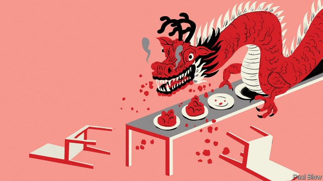
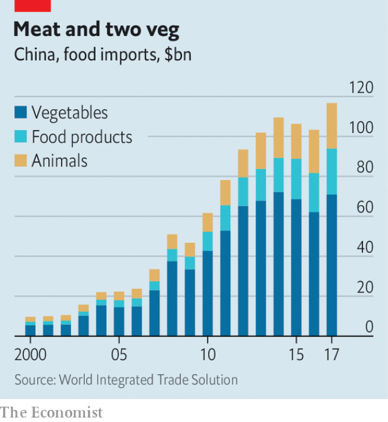

###### Feeding the dragon

# A Chinese state-backed giant’s rapid rise in global trading of food 

##### Four-year-old COFCO International is already rivalling Western giants 

 

> Jan 31st 2019 

 

THE WORLD of grain trading is a gerontocracy. The four giant firms that dominate global agricultural flows—ADM, Bunge, Cargill and Louis Dreyfus, collectively known as the ABCDs—were all founded over a century ago. Their age is an edge: their unique networks of silos, ports, ships and farmer relationships, built over decades, make them indispensable middlemen. But a toddler from China is threatening to put a pitchfork in the works. COFCO International (CIL), the overseas trading arm of China’s state-owned food and oil giant, wants to “become a true global agribusiness”, says Chi Jingtao, its chairman. It is barely four years old. 

Mr Chi’s aims are not only commercial but strategic. China does not have enough arable land to feed its 1.4bn people. As a rising middle class consumes more meat, that gap worsens, for animal feed is mostly made of grain. One solution from the government has been to buy farmland abroad. Chinese firms have done so in more than 30 countries—China is the largest foreign owner of agricultural land in Australia, for example. But the government soon realised that export bans could render its acquisitions useless, and host countries tightened rules on foreign investment. 

Instead, China’s leadership is seeking to establish a position in global trading of foodstuffs by building China’s own champion, CIL, founded in 2014 as an offshoot of state-owned COFCO Group. In that same year China abandoned its official goal of being self-sufficient in soyabeans, indicating that it was prepared to rely on global suppliers for some staples. CIL’s main task is to help China source crops directly from overseas farmers. COFCO had done that as the main Chinese importer of global foodstuffs. But managing the domestic market was its focus, whereas CIL’s remit is global. There are profits to be made, too, from taking a margin on food imports that have soared 12-fold since 2000, to $117bn in 2017. 

CIL’s first steps were awkward; it began by buying Nidera of the Netherlands and Hong Kong-based Noble Agri, two traders with a strong presence in South America, for inflated prices. It then neglected to integrate them, and both kept undercutting each other. Then a $200m unauthorised trading loss was found on Nidera’s biofuel desk, followed by a $150m hole in the accounts of its Latin American division. Rivals “thought it hilarious” that the Chinese newbie seemed so clueless, says Jonathan Kingsman, a commodities expert and former Cargill employee. 

No one is laughing now. CIL already earns $34bn in revenue—four-fifths that of Louis Dreyfus, the smallest ABCD. It shifts 105m tons of grain, oilseeds and sugar a year, a volume roughly equal to America’s entire production of soyabeans. CIL wants to be far more than China’s procurement platform. Already China accounts for less than half of its sales. 

CIL is selling to more than 50 countries, focusing on Europe, the Black Sea and Latin America. Like the ABCDs, it has invested in massive silos, transport links and processing facilities. It is the fourth-largest soya exporter in Brazil. Latin America remains its most important region for sourcing, but it is also creating export routes from North America and the Black Sea. 

The speed of its turnaround has caught the industry off guard. In the first half of 2018, CIL reportedly made trading losses of $122m because of wrong-way bets on agricultural markets. It also went through painful staff cuts and a long shutdown at a key port and processing plant. But “the company is probably in much better shape than it seems from the outside”, says Sönke Lorenz of BCG, a consultancy. The trade war has further convinced China of the merchant’s vital role. Last July, China responded to American tariffs on its goods by slapping high duties on American soyabeans, making it too expensive to buy them. This forced China to find a new source for one-third of its $40bn yearly needs—totalling 33m tonnes or four times what all of Southeast Asia consumes. CIL did much of the work by finding new suppliers in Brazil. 

Mr Chi claims that 2019 should be a pivotal year. Last year, after integrating Noble and Nidera in 2017, CIL also had to deal with operational problems from the mergers, fallout from the trade war between America and China and severe droughts in Argentina. But the firm is at last in a position “to embrace growth and development”, the chairman argues. He notes that CIL achieved profitability last year “for the first time in history” (it does not disclose figures). It will invest in sourcing more grain directly from the world’s breadbaskets, including Russia, Argentina and North America, and it will search for new customers in Europe, the Middle East and South-East Asia, including state-owned entities such as wheat boards, local traders and food processors. CIL’s strategy, summarises Mr Chi, “is to leverage our strong presence in China to grow our global business”. 

The first element is already under way. In December the firm appointed Dong Wei, a 25-year veteran of COFCO Group, as chief executive. Mr Dong is an expert in the procurement and processing of soyabeans—a good fit for CIL. “His arrival will facilitate the integration of our domestic and international business,” explains Mr Chi. 

What worries CIL’s big rivals is that the firm’s efforts to dominate direct access to China’s vast market of consumers for grain—both for strategic and business reasons—could have the side-effect of locking them out. For now, they have a prized direct relationship with COFCO Group and with other Chinese food manufacturers. “CIL could become an unavoidable middleman,” says Jean-François Lambert, a consultant and former head of commodity finance at HSBC, a bank. 

The ABCDs can take comfort that their position is still robust. In the markets that count, such as America and Russia, much of the infrastructure used to store, process and ship grain belongs to the established firms. “It’s very difficult, if not impossible, to become an ABCD without purchasing an ABCD,” argues Jay O’Neil of Kansas State University. That may be true in the short term. Two members of the club are private, and ADM, the largest of their two listed peers, is nearly twice as big as CIL, so would be hard to swallow. Bunge, an American firm that is the weakest of the bunch, may be a good target, but America’s Committee on Foreign Investment in the United States would probably block a Chinese bid. 

Still, CIL could seek to form alliances with peers to penetrate specific markets. Mr Lambert also suspects the firm could seek to buy a chunk of Louis Dreyfus. (Its owner took a large loan to buy out other shareholders late last year). 

 

CIL must also contend with the fact that its entry into the bulk-commodity trade comes when the activity is hardly profitable. Digitalisation and competition have destroyed margins. The savviest traders are shifting towards value-added products: Cargill makes most of its money from making animal feed and proteins; ADM has carved a niche in food ingredients such as sweeteners and colouring. CIL needs to master the basic activities first. “This is a young company”, Valmor Schaffer, CIL’s Brazil chief, said in November. “At this moment we have other priorities.” 

That highlights a dilemma for the firm. CIL’s primary objective remains “feeding the dragon”, as Mr Lorenz puts it, so it may be ready to accept far lower profits than peers. If the going gets tough, it could also tap the government for cheap back-up capital, insiders suspect. 

But the company cannot entirely disregard its bottom line. While state-owned entities own most of CIL, minority shareholders include Singapore’s Temasek, the World Bank’s private investment arm and Standard Chartered, a British bank. These took a stake in 2014, when the trader bought Nidera, and all expect a good return. Such pressure is unlikely to abate. Mr Chi says CIL could seek to raise more capital to fund its expansion: “Going public is a direction CIL is going to take.” When that might happen is a decision for shareholders to make, but an IPO would entail more scrutiny of the company’s results. 

CIL’s game may be a longer one. Trading is an information war: superior insights on global production, prices, inventories and shipping capacity are the sinews of merchants’ profit. Incumbents know this. Cargill in 2017 invested in a startup that analyses satellite images to forecast crop yields. As CIL tightens its grip over China’s food market, the world’s largest, its edge could become unmatchable. “Everything starts and ends with Chinese demand,” says a former ABCD executive. “Understand what the biggest national buyer is doing, and you control the trading game.” 

-- 

 单词注释:

1.Cofco[]:[网络] 中粮集团；中粮集团有限公司；中国 

2.Jan[dʒæn]:n. 一月 

3.gerontocracy[.dʒerɒn'tɒkrәsi]:n. 老人统治, 老人管理, 老人集团 

4.bunge[]: [人名] 邦奇 

5.Cargill[]:n. 美国嘉吉公司 

6.louis['lu(:)i, 'lu(:)is]:n. 路易斯（男子名） 

7.Dreyfus['dreifәs,drei'fjus]:德莱弗斯(①姓氏 ②Alfred, 1859-1935, 法国炮兵军官, 法国历史上著名冤案“德莱弗斯案件”的受害者) 

8.collectively[]:adv. 集合, 聚合性, 共同, 集体主义, 集团, 集体 

9.silo['sailәu]:n. 筒仓, 青贮窖 [机] 储仓 

10.middleman['midlmæn]:n. 中间人 [法] 调解人, 中间人, 中人 

11.toddler['tɔdlә]:n. 蹒跚行走的人, 学步的小孩, 学步的幼儿, (非正式)信步走的人 

12.pitchfork['pitʃfɔ:k]:n. 干草叉, 草靶, 音叉 vt. 骤然把...塞进, 骤然把...抛入 

13.CIL[]:公共接口库 

14.oversea['әuvә'si:]:adv. 海外, 向国外, 向海外, 国外 a. 外国的, 在国外的, 在海外的, 舶来的 

15.agribusiness['ægri.bizinis]:n. 农业综合经营 [经] 农产品行业 

16.chi[kai, ki:]:n. 希腊语的第22个字母 [医] 卡, χ(希腊文的第二十二个字母) 

17.Jingtao[]:[网络] 涛；中国；郑州 

18.arable['ærәbl]:a. 适于耕种的, 可耕的 

19.worsen['wә:sn]:vt. 使更坏, 使恶化 vi. 变得更坏, 恶化 

20.farmland['fɑ:mlænd]:n. 农田 

21.tighten['taitn]:vt. 勒紧, 使变紧 vi. 变紧, 绷紧 

22.foodstuff['fu:dstæf]:n. 食品, 粮食 

23.offshoot['ɒ:fʃu:t]:n. 分支, 旁系, 衍生事物 

24.soyabean[]:[医] 大豆 

25.supplier[sә'plaiә]:n. 供应者, 供给国, 供应商 [化] 承制厂; 供应厂商 

26.staple['steipl]:n. 主要产物, 常用品, 主要要素, 原料, 订书钉, 钩环 a. 主要的, 重要的 vt. 分级, 钉住 

27.importer[im'pɒ:tә]:n. 输入者, 进口商 [法] 进口商, 输入者 

28.remit[ri'mit]:vt. 宽恕, 赦免, 免除, 汇出, 缓解, 减轻, 把...提交, 使恢复原状, 推迟 vi. 缓解, 汇款 n. 移交的事物 

29.soar[sɒ:]:n. 高扬, 翱翔 vi. 往上飞舞, 高耸, 翱翔 

30.Netherlands['neðәlәndz]:n. 荷兰 

31.hong[hɔŋ]:n. （中国、日本的）行, 商行 

32.agri[]:n. 阿格里（土耳其地区）；阿勒（罗马利亚村落） 

33.trader['treidә]:n. 商人, 商船 [经] 交易者, 商船 

34.inflate[in'fleit]:vt. 使膨胀, 使得意, 使通货膨胀, 使充气 vi. 充气, 膨胀 

35.undercut['ʌndәkʌt]:n. 底切, 牛腰部下侧嫩肉, 下口, 下旋削球 vt. 廉价出售, 底切, 雕出, 下旋削球 vi. 切除底部 

36.unauthorised[ʌn'ɔ:θəraizd]:a. 无权的（等于unauthorized） 

37.biofuel[baiәu'fju:әl]:[机] 生物燃料 

38.hilarious[hi'lєәriәs]:a. 喜不自禁的, 欢闹的, 引人发笑的 

39.newbie[]:[计] 新成员 

40.clueless[ˈklu:ləs]:a. 无能的, 笨的 

41.jonathan['dʒɔnәθәn]:n. 乔纳森（男子名） 

42.kingsman[]:[网络] 金斯曼；咨询机构；金仕曼 

43.commodity[kә'mɒditi]:n. 农产品, 商品, 有用的物品 [经] 商品, 货物, 日用品 

44.abcd[]:abbr. 加快收寄投递系统（Accelerated Business Collection and Delivery） 

45.oilseed['ɔilsi:d]:[经] 油籽 

46.procurement[prә'kjuәmәnt]:n. 获得 [经] 采购 

47.les[lei]:abbr. 发射脱离系统（Launch Escape System） 

48.ABCDs[]:[网络] 资产证券化信用违约互换 

49.soya['sɔiә]:[医] 大豆 

50.exporter[ik'spɒ:tә]:n. 出口商, 输出者, 出口公司 [经] 出口商, 输出者 

51.Brazil[brә'zil]:n. 巴西 

52.turnaround['tә:nә.raund]:n. 转向, 回车道, 转变 [化] 小修; 预防(性)修理 

53.reportedly[ri'pɒ:tidli]:adv. 根据传说, 根据传闻, 据报道 

54.shutdown['ʃʌtdaun]:n. 关门, 停工, 停机 [经] 停工 

55.Lorenz[]:n. 洛伦兹（姓氏, 奥地利动物学家） 

56.BCG[]:卡介苗 [化] 卡介苗 

57.consultancy[]:n. 商量, 协商, 磋商, 会诊, 与...商量, 咨询, 请教, 找(医生)看病, 查阅, 考虑 [经] 咨询业务, 咨询服务 

58.tariff['tærif]:n. 关税, 关税表, 价格表, 收费表 vt. 课以关税 [计] 价目表 

59.slap[slæp]:n. 掴, 掌击, 侮辱, 拍击声 v. 拍击, 惩罚 adv. 正面地, 直接地, 突然地 

60.tonne[tʌn]:n. 吨, 公吨 [经] 吨 

61.pivotal['pivәtәl]:a. 枢轴的, 关键的, 起中心作用的 

62.merger['mә:dʒә]:n. 合并, 归并 [经] 购并 

63.fallout['fɒ:laut]:n. 原子尘的降下, 辐射性微尘, 原子尘, 附带结果 [医] [放射尘]回降 

64.Argentina[.ɑ:dʒәn'ti:nә]:n. 阿根廷 

65.profitability[.prɒfitә'biliti]:n. 收益性, 利益率 [经] 可获利润率 

66.breadbasket['bred,bɑ:skit]:n. <俚>胃, 腹 

67.entity['entiti]:n. 实体, 实存物, 存在 [计] 实体 

68.processor[prә'sesә]:n. 信息处理机, 加工者, 处理者 [计] 处理器 

69.summarise['sʌmәraiz]:vt. 概括, 总结, 摘要, 概述 

70.dong[dɔŋ]:n. 盾（越南货币单位） 

71.wei[]:n. 魏（姓氏）；魏（朝代）；渭河 

72.facilitate[fә'siliteit]:vt. 使容易, 促进, 帮助 [法] 使容易, 使便利, 推进 

73.integration[.inti'greiʃәn]:n. 综合, 与环境协调的行为, 集成 [化] 集成; 整合 

74.unavoidable[.ʌnә'vɒidәbl]:a. 不可避免的, 不得已的, 不能作废的 [医] 难免的 

75.lambert['læmbә(:)t]:[计] 兰伯特 [医] 朗伯(亮度单位) 

76.hsbc[]:abbr. 汇丰银行（Hong Kong and Shang Hai Banking Corporation） 

77.robust[rәu'bʌst]:a. 健康的, 强健的, 要用力气的, 坚定的, 粗野的 [计] 健壮性 

78.infrastructure['infrәstrʌktʃә]:n. 基础结构, 基础设施 [经] 基础设施 

79.jay[dʒei]:n. 鸟, 喋喋不休的人, 傻瓜 

80.kansa[]:n. （日语）监察；堪萨人（旧时居住在美国堪萨斯州一带的印第安人） 

81.ADM[]:[计] 自适应数据库管理程序, 自动数据管理, 自动绘图机 

82.peer[piә]:n. 同等的人, 匹敌, 贵族 vi. 凝视, 窥视, 费力地看, 隐现 vt. 与...同等, 封为贵族 

83.alliance[ә'laiәns]:n. 联盟, 联合 [法] 同盟, 联盟, 联姻 

84.chunk[tʃʌŋk]:n. 大块, 矮胖的人(或物) [经] 定样 

85.shareholder['ʃєә.hәuldә]:n. 股东 [法] 股东, 股票持有人 

86.contend[kәn'tend]:vi. 奋斗, 斗争, 竞争 vt. 为...斗争 

87.digitalisation[dɪdʒɪteɪlaɪ'zeɪʃən]: [医]数字化 

88.savvy['sævi]:v. 理解, 领悟 n. 理解能力, 机智, 悟性 

89.niche[nitʃ]:n. 壁龛 vt. 放入壁龛, 安顿 

90.sweetener['swi:tnә]:n. 代糖, 甜料 [化] 脱硫设备 

91.Schaffer[]:谢弗（人名） 

92.insider['in'saidә]:n. 内部的人, 权威人士, 知道内情的人 [经] 熟悉内情者 

93.cannot['kænɒt]:aux. 无法, 不能 

94.entirely[in'taiәli]:adv. 完全, 全然, 一概 

95.disregard[.disri'gɑ:d]:n. 忽视, 漠视 vt. 忽视, 不顾 

96.temasek[]:n. 淡马锡控股 (Temasek Holdings)，新加坡投资机构 

97.charter['tʃɑ:tә]:n. 特许状, 执照, 宪章 vt. 特许, 发给特许执照 

98.abate[ә'beit]:vt. 减少, 减轻, 减弱, 废除, 打折扣 vi. 减轻, 减弱, 减少, 失效, 被废除 

99.ipo[]:abbr. 首次公开募股（Initial Public Offerings）；初次公开发行（Initial Public Offering） 

100.entail[in'teil]:vt. 使成为必需, 需要, 使承担, 遗传给 n. 限定继承 

101.scrutiny['skru:tini]:n. 细看, 仔细检查, 监视, 选票检查 [经] 复查, 评核, 仔细检查 

102.inventory['invәntәri]:n. 详细目录, 存货清单 vt. 列入详细目录, 清点存货 [计] 存货清单 

103.sinew['sinju:]:n. 肌肉, 精力, 体力, 力量的源泉, 腱 vt. 赋予力量, 加强 

104.incumbent[in'kʌmbәnt]:a. 现任的, 依靠的, 负有义务的 n. 领圣俸者, 在职者 

105.startup[]:[计] 启动 

106.unmatchable[.ʌn'mætʃәbl]:a. 不能匹敌的, 不能相配的 

107.buyer['baiә]:n. 买主, 买方 [经] 买主, 买方, 买手 

