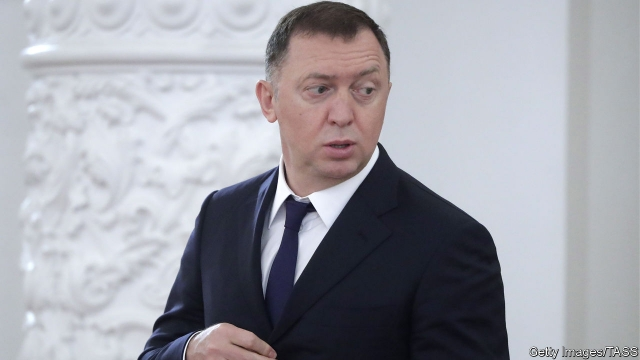

###### An oligarch surrenders

# America lifts sanctions on Oleg Deripaska’s business empire 

##### But the Kremlin has nothing to celebrate 

 

> Jan 31st 2019 

 

AT FIRST GLANCE, the American government’s decision to lift sanctions on Oleg Deripaska’s business empire looks questionable. He is a Russian oligarch close to the Kremlin and a former business partner of Donald Trump’s erstwhile campaign manager, Paul Manafort. Shares in EN+, Mr Deripaska’s holding firm, soared this week after a deal with America’s Treasury department that saw Mr Deripaska reduce his ownership stake below 50% in exchange for the sanctions relief. Given Mr Trump’s alleged fondness for Russia, many in America smelled a rat. 

But what unfolded may be less a tale of wrongdoing than of incompetence. Richard Nephew, a former State Department sanctions specialist, compares the debacle to the children’s rhyme about the old lady who swallowed a fly—officials tried to solve a problem but compounded it. It began with the new Trump administration’s perceived softness on Russia, which spurred a Republican-controlled Congress to pass the Countering America’s Adversaries Through Sanctions (CAATSA) act in 2017, mandating the Treasury department to make a list of potential Russian targets. 

For political reasons the Trump administration resisted the order and in 2018 published little more than a copy of the billionaires list from the Russian edition of Forbes, a magazine. Facing criticism, the treasury secretary, Steven Mnuchin, sanctioned seven Russian businessmen and their firms several months later, most prominently Mr Deripaska, and his listed aluminium giant Rusal and the EN+ conglomerate that controlled it. Shares in EN+ and Rusal fell; so did the Russian rouble. 

Yet Russia is more integrated into the global economy than other countries America has sanctioned. Hitting Rusal, a huge aluminium producer, roiled aluminum markets, disrupted supply chains, and strengthened Rusal’s Chinese competitors. The economic shocks touched American and European firms which relied upon Rusal’s aluminium, as well as EN+’s downstream assets in the West. 

Officials in America, Europe and Russia began scrambling for a way out. The Treasury issued a series of exemptions that in effect kept the sanctions on Rusal and EN+ from going into force. Mr Deripaska orchestrated a lobbying campaign in Washington. EN+’s British chairman, Lord Gregory Barker of Battle, began shuttling between Mr Deripaska and the Treasury’s Office of Foreign Assets Control to try and negotiate a plan. 

The deal they cut has been touted by the Treasury as providing “unprecedented transparency”. It seems robust. Mr Deripaska will reduce his stake in EN+ from 70% to under 45%, will control just 35% of voting rights, and will not have access to dividends. VTB, a state-run Russian bank, will take on a large block of the shares, but has been forced to surrender voting rights for them to an independent director. Smaller chunks of shares will go to Glencore, a commodity trader, and Mr Deripaska’s charitable foundation; all stakes held by Deripaska-controlled entities or his relatives will also forfeit voting rights. 

In all, two-thirds of the board will be controlled by independent directors; half of the board will come from America and Britain. Mr Deripaska himself will remain under sanctions. In the case of foul play, the Treasury can reimpose penalties on the companies. The deal has drawn support from European governments and prominent Russia hawks in Washington. 

Critics contend that focusing on the 50% ownership threshold is overly legalistic. Although wresting control of the board from Mr Deripaska will limit his influence, it will not eliminate it, especially if senior management appointed under his leadership remains loyal. Nonetheless, for the Kremlin, the deal is hardly cause to celebrate. America forced a Russian oligarch to surrender control of a nationally significant company—an unsettling precedent. What is more, lifting one set of sanctions may make Congress and the Treasury eager to demonstrate their tough-on-Russia bonafides by slapping on another. 

-- 

 单词注释:

1.oligarch['ɒligɑ:k]:n. 寡头政治执政者 

2.sanction['sæŋkʃәn]:n. 核准, 制裁, 处罚, 约束力 vt. 制定制裁规则, 认可, 核准, 同意 

3.Oleg[]:n. 奥列格（俄罗斯名） 

4.Kremlin['kremlin]:n. 克里姆林宫 [经] 克里姆林宫 

5.Jan[dʒæn]:n. 一月 

6.questionable['kwestʃәnәbl]:a. 可疑的 [法] 可疑的, 有问题的, 不可靠的 

7.donald['dɔnәld]:n. 唐纳德（男子名） 

8.erstwhile['ә:stwail]:adv. 以前, 往昔地 a. 以前的, 往昔的 

9.paul[pɔ:l]:n. 保罗（男子名） 

10.manafort[]:[网络] 马纳福特 

11.soar[sɒ:]:n. 高扬, 翱翔 vi. 往上飞舞, 高耸, 翱翔 

12.treasury['treʒәri]:n. 国库, 宝库, 财政部, 国库券 [经] 库存, 国库, 金库 

13.deripaska[]:[网络] 杰里帕斯卡 

14.allege[ә'ledʒ]:vt. 宣称, 主张, 提出, 断言 [法] 断言, 指称, 指证 

15.fondness['fɔndnis]:n. 溺爱；爱好 

16.les[lei]:abbr. 发射脱离系统（Launch Escape System） 

17.wrongdoing['rɒŋ'du:iŋ]:n. 干坏事, 坏事 

18.incompetence[in'kɔmpitәns]:n. 不胜任, 不够格, 不合格, 不适合, 无能力, 不熟练, 无资格 [医] 机能不全, 闭锁不全, 关闭不全 

19.richard['ritʃәd]:n. 理查德（男子名） 

20.debacle[dei'bɑ:kl]:n. 崩溃, 大失败 

21.trump[trʌmp]:n. 王牌, 法宝, 喇叭 vt. 打出王牌赢, 胜过 vi. 出王牌, 吹喇叭 

22.softness['sɒftnis]:n. 柔和, 温柔 

23.adversary['ædvәsәri]:n. 敌手, 对手 a. 敌手的, 敌对的 

24.mandate['mændeit]:n. 命令, 指令, 要求 vt. 委任统治 

25.billionaire[.biljә'nєә]:n. 亿万富翁 

26.forbes['fɔ:bz, 'fɔ:bis]:n. 福布斯（美国出版及媒体集团）；福布斯（美国著名财经杂志）；福布斯（姓氏） 

27.treasury['treʒәri]:n. 国库, 宝库, 财政部, 国库券 [经] 库存, 国库, 金库 

28.steven['sti:vn]:n. 史蒂文（男子名） 

29.prominently['prɔminәntli]:adv. 显著地 

30.Rusal[]:[网络] 俄罗斯铝业公司；俄铝；俄罗斯铝业联合公司 

31.conglomerate[kәn'glɒmәrit]:a. 聚成球形的, 砾岩性的 n. 集成物, 混合体, 砾岩 v. (使)凝聚成团 

32.rouble['ru:bl]:n. 卢布 

33.producer[prә'dju:sә]:n. 生产者, 制作者, 制作人 [化] 发生器; (炉煤气)发生炉; 制气炉; 生产者 

34.roil[rɒil]:vt. 搅浑, 使焦急 

35.disrupt[dis'rʌpt]:a. 分裂的, 中断的 vt. 使分裂, 使瓦解 

36.downstream['daun'stri:m]:adv. 下游地 a. 下游的 

37.asset['æset]:n. 资产, 有益的东西 

38.scramble['skræmbl]:n. 攀缘, 爬行, 抢夺, 混乱, 紧急起飞 vi. 攀缘, 杂乱蔓延, 争夺, 拼凑, 匆忙 vt. 攀登, 扰乱, 使混杂 

39.sery[]:n. (Sery)人名；(俄)谢雷；(科特)塞里 

40.exemption[ig'zempʃәn]:n. 解除, 免除, 免税 [化] 免检 

41.orchestrate['ɒ:kistreit]:v. 编管弦乐曲 

42.lobby['lɒbi]:n. 大厅, 休息室, 游说议员者 vi. 游说议员, 游说 vt. 游说 

43.Washington['wɒʃiŋtn]:n. 华盛顿 

44.gregory['^re^әri]:n. 格雷戈里（男子名, 古代罗马教皇之名） 

45.barker['bɑ:kә]:n. 招徕顾客的人, 剥树皮者 [机] 去皮机, 剥皮机 

46.tout[taut]:vi. 招徕顾客, 兜售物品 vt. 招徕, 刺探...情报 n. 兜售者, 侦查者 

47.unprecedented[.ʌn'presidentid]:a. 空前的 [经] 空前的, 无前例的 

48.transparency[træns'pærәnsi]:n. 透明, 透明度, 透过性, 透明物, 清晰 [计] 透明性; 透明 

49.robust[rәu'bʌst]:a. 健康的, 强健的, 要用力气的, 坚定的, 粗野的 [计] 健壮性 

50.dividend['dividend]:n. 被除数, 股利 [计] 被除数 

51.VTB[]:[网络] 俄罗斯外贸银行；成功投资俄罗斯外贸银行；外贸银行(Vietcombank) 

52.chunk[tʃʌŋk]:n. 大块, 矮胖的人(或物) [经] 定样 

53.Glencore[]:[网络] 嘉能可；交易商嘉能可；嘉能可公司 

54.commodity[kә'mɒditi]:n. 农产品, 商品, 有用的物品 [经] 商品, 货物, 日用品 

55.trader['treidә]:n. 商人, 商船 [经] 交易者, 商船 

56.charitable['tʃæritәbl]:a. 大慈大悲的, 宽厚的, 慈善的 [法] 慈善的, 慷慨的, 宽恕的 

57.entity['entiti]:n. 实体, 实存物, 存在 [计] 实体 

58.forfeit['fɒ:fit]:n. 没收物, 罚金, 丧失 vt. 没收, 丧失 a. 丧失了的 

59.foul[faul]:a. 污秽的, 邪恶的, 恶臭的, 肮脏的, 恶劣的, 淤塞的 vt. 弄脏, 妨害, 污蔑, 犯规, 淤塞 vi. 腐烂, 犯规, 缠结 adv. 违反规则地, 不正当地 n. 犯规, 缠绕 

60.reimpose[.ri:im'pәuz]:vt. 再强加, 重新征收 [经] 再征收, 重新征收 

61.penalty['penәlti]:n. 处罚, 刑罚, 罚款, 罚球, 报应, 不利结果, 妨碍 [经] 罚金(款), 违约金 

62.contend[kәn'tend]:vi. 奋斗, 斗争, 竞争 vt. 为...斗争 

63.threshold['θreʃәuld]:n. 门槛, 入口, 开端, 阈 [计] 阈; 阈值 

64.overly['әuvәli]:adv. 过度地, 极度地 

65.legalistic[.li:gә'listik]:a. 尊重法律的 

66.wrest[rest]:n. 扭, 拧 vt. 夺取, 猛扭, 歪曲, 费力取得 

67.nonetheless[,nʌnðә'les]:conj. 然而, 尽管, 不过 adv. 不过, 仍然, 尽管如此, 然而 

68.nationally['næʃәnәli]:adv. 作为整个民族, 举国一致地, 全国性地 

69.unsettle[.ʌn'setl]:vt. 使移动, 搅乱, 使动摇, 使不安宁 vi. 动荡不定, 离开固定位置 

70.precedent['presidәnt]:n. 先例, 前例 a. 在先的, 在前的 

71.bonafides[]:na. 真实 [网络] 善意；罗马法中的诚信；真心实意 

72.slap[slæp]:n. 掴, 掌击, 侮辱, 拍击声 v. 拍击, 惩罚 adv. 正面地, 直接地, 突然地 

