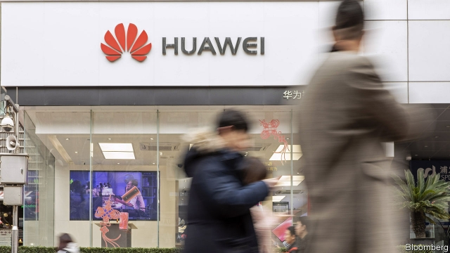

###### Weighing on Huawei

# America unseals its indictment against Huawei 

##### The Chinese giant is accused of rewarding trade-secret pilferers on its staff 

 

> Jan 31st 2019 

IN A CIVIL lawsuit in 2017 an employee of Huawei, a Chinese telecoms giant, was found to have swiped one of the arms of Tappy, a phone-testing robot owned by T-Mobile, an American wireless carrier, and with it the smart proprietary technology in its fingertip. A jury in Seattle ordered Huawei to pay compensation of $4.8m to T-Mobile. The court found, however, “neither damage, unjust enrichment nor wilful and malicious conduct by Huawei”. 

This week the Chinese company reminded the world of that verdict in its public response to a sweeping set of fresh allegations against it by America’s Department of Justice. The charges include obstruction of justice—and technology theft, as Tappy becomes the subject of a new criminal case. Huawei was also accused of defrauding four big banks (one of which is known to be HSBC) into clearing transactions that violated international sanctions on Iran. This was why Canadian police arrested Meng Wanzhou, the company’s chief financial officer, on December 1st, on behalf of the American authorities. On January 28th they made a formal request for her extradition. Canada's Department of Justice now has 30 days to consider whether to formally commence the extradition process. 

Huawei said that it had not committed “any of the asserted violations” and repeated that it was “not aware of any wrongdoing by Ms Meng”. Among the charges unsealed thus far, Tappy is the only direct evidence of intellectual-property theft. And none suggests that America has any concrete evidence to confirm its gravest suspicions: that Chinese spooks use Huawei gear to listen in, or that it has ties to the People’s Liberation Army (for which its founder and chief executive, Ren Zhengfei, once worked as an engineer), as has long been rumoured. 

The fact that events over a decade old are only now being used to bring charges has also raised some eyebrows. They include the questioning of Mr Ren by FBI agents in 2007, in which he is alleged to have misled investigators by saying that Huawei did not conduct activity that violated American export laws. In a statement on Monday the FBI made the leap from trade-secret theft to telecom-infrastructure threat, stating that “the prosperity that drives [America’s] economic security is inherently linked to our national security”. China’s foreign ministry predictably railed against America’s “strong political motives and manipulations”. 

The indictments are explosive. Huawei is alleged to have awarded bonuses to staff based on the value of information they filched from competitors, as revealed in internal emails written in 2013, obtained by the FBI. Speculation swirled that prosecutors might have secretly indicted Mr Ren as well; America’s acting attorney-general, Matthew Whitaker, said Huawei’s criminal activity went “all the way to the top of the company”. In one of the indictments, some defendants’ names have been blacked out. 

And if America is able to prove a simple case of trade-secret theft and bank fraud, Huawei will have plenty to fret about. A bipartisan bill introduced in Congress a few weeks ago would, if passed, systematically ban the sale of American tech to any Chinese firm found to have violated export-control laws or sanctions. When ZTE, a Chinese peer, was hit with such a ban last April, only a surprise reprieve from President Donald Trump three months later saved it from collapse. In October Fujian Jinhua, a state-owned chipmaker, was hit with an export ban for posing a “significant risk” to American national security; it is soon expected to suspend all operations. 

The threat of a similar ban is Huawei’s greatest fear. “Any relief for the Chinese national champion will likely come at a steep price,” writes Dan Wang of Gavekal Dragonomics, a research firm. Huawei could perhaps dodge such a ban by paying a fat fine and allowing Americans to monitor it from the inside (a demand to which ZTE yielded last year). The big American suppliers that sell so much of their gear to Huawei, including Qualcomm, Intel and Seagate, would also rather see it more leniently treated. But for now, at least, America seems determined to press on, not settle. 

  

Correction (31st January 2019): This article has been changed to make clear that Canada's Department of Justice has 30 days to consider whether to commence the extradition process. It originally stated that Canada has 30 days to respond.  

  

-- 

 单词注释:

1.huawei[]: 华为 

2.unseal[.ʌn'si:l]:vt. 开封, 开启, 使解除束缚 

3.indictment[in'daitmәnt]:n. 起诉, 控告, 起诉状 [经] 起诉书 

4.pilferer['pilfәrә]:n. 小偷 [法] 小偷, 扒手, 窃贼 

5.Jan[dʒæn]:n. 一月 

6.lawsuit['lɒ:sju:t]:n. 诉讼 [法] 诉讼, 诉讼案件 

7.telecom['telәkɔm]:telecommunication 电信 

8.swipe[swaip]:n. 强打, 用力挥击, 尖刻的话, 碰擦, 起重杆 vt. 强打, 用力挥击, 偷 

9.tappy[]:[网络] 宇琪 

10.proprietary[prә'praiәtәri]:a. 所有者的, 所有权的, 私有的 n. 所有者, 业主, 所有权 

11.fingertip['fiŋgәtip]:n. 指尖, 指套 

12.Seattle[si'ætl]:n. 西雅图 

13.compensation[.kɒmpen'seiʃәn]:n. 补偿, 赔偿金, 工资 [医] 代偿(机能), 补偿 

14.enrichment[in'ritʃmәnt]:n. 丰富, 肥沃 [化] 富集 

15.wilful['wilful]:a. 任性的, 固执的, 故意的, 存心的 [法] 有意的, 故意的, 任性的 

16.malicious[mә'liʃәs]:a. 怀恶意的, 恶毒的 

17.verdict['vә:dikt]:n. 裁决, 判决, 判断性意见, 定论, 结论 [法] 定论, 判断, 意见 

18.allegation[.æli'geiʃәn]:n. 断言, 主张, 申辩 [法] 声明, 事实陈述, 断言 

19.obstruction[әb'strʌʃәn]:n. 障碍, 妨碍, 闭塞物 [医] 梗阻, 不通 

20.defraud[di'frɒ:d]:vt. 欺骗 [经] 骗取, 诈取, 欺骗 

21.hsbc[]:abbr. 汇丰银行（Hong Kong and Shang Hai Banking Corporation） 

22.transaction[træn'sækʃәn]:n. 交易, 办理, 学报, 和解协议 [计] 事务处理 

23.sanction['sæŋkʃәn]:n. 核准, 制裁, 处罚, 约束力 vt. 制定制裁规则, 认可, 核准, 同意 

24.Iran[i'rɑ:n]:n. 伊朗 

25.meng[]:abbr. 工程硕士（Master of Engineering） 

26.Wanzhou[]:万州 

27.extradition[.ekstrә'diʃәn]:n. 引渡逃犯, 亡命者送还本国 [法] 引渡 

28.formally['fɒ:mәli]:adv. 正式地, 形式上 

29.commence[kә'mens]:v. (使)开始, 得学位 

30.assert[ә'sә:t]:vt. 主张, 坚称, 断言 [法] 宣称, 断言, 维护 

31.violation[.vaiә'leiʃәn]:n. 违反, 违背, 妨碍 [法] 违犯, 违背, 违反 

32.wrongdoing['rɒŋ'du:iŋ]:n. 干坏事, 坏事 

33.spook[spu:k]:n. 幽灵, 鬼 vt. 惊吓, 鬼怪般地出没 vi. 惊吓而逃窜, 受惊 

34.founder['faundә]:n. 创立者, 建立者 vt. 使沉没, 使摔倒, 弄跛, 浸水, 破坏 vi. 沉没, 摔到, 变跛, 倒塌, 失败 

35.REN[]:[计] DOS内部命令:更改文件名 [医] 肾 

36.Zhengfei[]:[网络] 钟晓东 

37.eyebrow['aibrau]:n. 眉毛 [医] 眉 

38.FBI[]:美国联邦调查局 [经] 美国联邦调查局 

39.allege[ә'ledʒ]:vt. 宣称, 主张, 提出, 断言 [法] 断言, 指称, 指证 

40.investigator[in'vestigeitә]:n. 调查者, 审查者 [法] 审查员, 侦查员, 调查员 

41.inherently[in'hiәrәntli]:adv. 内在地, 生来地, 固有地 [计] 固有的 

42.predictably[]:adv. 可预言地 

43.manipulation[mә.nipju'leiʃәn]:n. 操作, 处理 [化] (用手)操作; 使用 

44.filch[filtʃ]:vt. 偷窃, 窃取 

45.speculation[.spekju'leiʃәn]:n. 沉思, 推测, 投机 [经] 投机交易, 买空卖空 

46.swirl[swә:l]:n. 漩涡, 涡动 vt. 使成漩涡 vi. 打漩, 盘绕, 眩晕 

47.prosecutor['prɒsikju:tә]:n. 实行者, 告发者, 公诉人 [法] 原告, 起诉人, 检举人 

48.secretly['si:kritli]:adv. 秘密地, 背地里 

49.indict[in'dait]:vt. 起诉, 控告, 指控 [法] 控告, 揭发, 对...起诉 

50.Matthew['mæθju:]:n. 马太, 马太福音 

51.whitaker['hwitәkә(r)]:n. 惠特克（姓氏） 

52.fraud[frɒ:d]:n. 欺骗, 欺诈, 诡计, 骗子 [经] 欺诈, 舞弊, 骗子 

53.fret[fret]:n. 烦躁, 磨损, 焦急, 网状饰物 vi. 烦恼, 不满, 磨损 vt. 使烦恼, 腐蚀, 使磨损, 使起波纹 

54.bipartisan[bai,pɑ:ti'zæn]:a. 两党连立的 

55.systematically[.sisti'mætikli]:adv. 有系统地, 有组织地, 有条理地 

56.tech[tek]:n. 技术学院或学校 

57.zte[]:abbr. 中兴通讯（公司名） 

58.peer[piә]:n. 同等的人, 匹敌, 贵族 vi. 凝视, 窥视, 费力地看, 隐现 vt. 与...同等, 封为贵族 

59.reprieve[ri'pri:v]:n. 缓刑, 缓刑令, 暂缓 vt. 暂时解救, 缓期执行 

60.donald['dɔnәld]:n. 唐纳德（男子名） 

61.trump[trʌmp]:n. 王牌, 法宝, 喇叭 vt. 打出王牌赢, 胜过 vi. 出王牌, 吹喇叭 

62.Fujian['fu:'dʒjen]:福建(位于中国东部沿海) 

63.Jinhua[]:[网络] 金华；浦江；朱慧郅 

64.chipmaker[t'ʃɪpmeɪkə]:n. 芯片制造商 

65.dan[dæn]:n. 段(柔道、围棋运动员的等级) [建] 小车, 空中吊运车, 杓 

66.wang[]:n. 王（姓氏）；王安电脑公司 

67.Gavekal[]:[网络] 研究机构加维卡尔 

68.Dragonomics[]:[网络] 龙洲经讯；龙州经讯；北京龙洲经讯 

69.dodge[dɒdʒ]:v. 避开, 躲避 n. 诡计, 躲藏 

70.supplier[sә'plaiә]:n. 供应者, 供给国, 供应商 [化] 承制厂; 供应厂商 

71.qualcomm['kualkɔm]:n. 高通（美国公司）; 高通公司 

72.intel[]:n. 美国英特尔公司（财富500强公司之一, 以生产CPU芯片著称） 

73.Seagate[]:n. 希捷, 希捷公司；希捷科技 

74.leniently[]:adv. 温和地；宽大地 

75.originally[ә'ridʒәnli]:adv. 本来, 原来, 最初, 就起源而论, 独创地 

