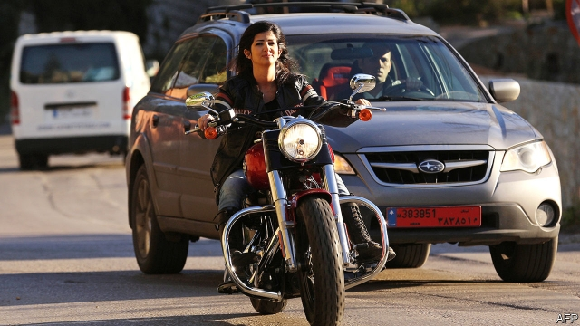

###### Rough ride

# Harley-Davidson brought low by tariffs and demographics 

##### Sales keep plunging in the home market 

 

> Feb 2nd 2019 

 

A TOUR OF the modernist building of the Harley-Davidson museum in Milwaukee helps to explain why the midwestern maker of motorcycles has iconic status, but also why it is struggling. Nearly all the visitors are white, middle-aged men, some clad in leather and heavily tattooed, others dressed conservatively. Harley is the quintessential baby-boomer brand but its customers are slowing down. 

The firm has been losing sales at home for eight consecutive quarters with the latest being no exception. Sales in America plunged by a tenth in the three months ending at the end of December compared with the same period a year earlier, it said this week. The total cost of tariffs (those imposed specifically on its bikes by the European Union and China, and also those levied by America on imports of steel and aluminium, its main materials), together with restructuring costs, wiped out its profits. 

The 116-year-old business has been through tough times before. It almost went under in 1981 when America was in recession and Japanese makers of motorcycles dumped unsold inventory onto the American market at extremely low prices. Then a group of employees bought the company, persuaded the government to impose tariffs on Japanese bikes, improved the quality of its wares and returned to the heavy retro look of the 1940s. That did the trick for baby boomers who flocked in droves to the expensive toys cleverly marketed as a symbol of freedom, individualism and adventure on America’s scenic roads. 

 

Now tariffs are the enemy: the company expects their cost to rise to $120m this year. Matt Levatich, Harley’s boss, stoked President Donald Trump’s ire when he announced in June his plans to move production of motorcycles destined for the European market out of America to avoid new EU duties. Some attribute recent poor sales to Mr Trump’s tweet in August supporting a boycott of the firm. But, “most Harley enthusiasts don’t care,” says Steven Levin, a surgeon from Chicago who has owned a succession of Harleys since college. 

Harley’s other challenge is to win over millennials, women and non-white buyers. Last year Mr Levatich unveiled a five-year plan centred on the introduction of 16 new motorcycle models such as Livewire electric bikes, and increasing Harley’s appeal in international markets. 

Dealers are counting on the new models to be more affordable, and attractive to a wider audience. Harley may suffer from the quality of its older wares. Sales of used bikes are outpacing those of new ones by three to one (a decade ago it was the other way around). But while old bikes, and Harley accessories and clothing sold in specialist shops and on Amazon are selling well, they won’t compensate for the damage done to the hogs by tariffs and youthful disinterest. 

-- 

 单词注释:

1.tariff['tærif]:n. 关税, 关税表, 价格表, 收费表 vt. 课以关税 [计] 价目表 

2.demographic[.demә'græfik]:a. 人口统计的 [法] 人口统计的, 人口学的 

3.feb[]:abbr. 二月（February） 

4.modernist['mɒdәnist]:n. 现代主义者, 现代人, 现代主义作家 

5.milwaukee[mil'wɔ:ki,(:)]:n. （美国）密尔沃基 

6.midwestern['mid'westәn]:a. 美国中西部的 

7.maker['meikә]:n. 制造者, 上帝 [经] 制造者, 出票人 

8.iconic[ai'kɔnik]:[计] 图标的 

9.statu[]:[网络] 状态查看；雕像；特级雪花白 

10.clad[klæd]:vt. 在金属外包上另一种金属 a. 包层金属的 clothe的过去式和过去分词 

11.conservatively[kən'sɜ:vətɪvlɪ]:adv. 保存地; 保守地; 谨慎地 

12.harley['hɑ:li]:n. 哈利（男子名） 

13.quintessential[.kwinti'senʃәl]:a. 精萃的, 精髓的, 典范的 

14.consecutive[kәn'sekjutiv]:a. 连续的, 联贯的 [计] 连续的; 连接的 

15.specifically[spi'sifikli]:adv. 特定地, 明确地, 按特性 

16.levy['levi]:n. 税款, 所征的人数, 征收 vi. 征税, 课税 vt. 征收, 强求, 召集 

17.restructuring[]:[计] 重构的 

18.recession[ri'seʃәn]:n. 后退, 凹处, 衰退, 归还 [医] 退缩 

19.unsold[.ʌn'sәuld]:a. 未售出的 [经] 未售出的 

20.inventory['invәntәri]:n. 详细目录, 存货清单 vt. 列入详细目录, 清点存货 [计] 存货清单 

21.ware[wєә]:n. 物品, 器具, 货物, 商品, 陶器 vt. 留心, 小心 a. 知道的, 意识到的, 留神的 

22.retro['retrәu]:n. 制动火箭, 减速火箭；（服装式样等）重新流行 

23.boomer['bu:mә]:n. 往来无定的临时工 

24.drove[drәuv]:n. 畜群 drive的过去式 

25.cleverly[]:adv. 聪明地, 全然, 完全, 巧妙地 

26.individualism[.indi'vidʒuәlizm]:n. 个人主义, 个人特征 [经] 个人主义 

27.scenic['si:nik]:a. 风景好的, 戏剧性的, 舞台的, 布景的 n. 风光影片, 风景照片 

28.matt[mæt]:a. 表面暗淡的, 无光泽的, 表面粗糙的, 不光滑的 [医] 无光泽 

29.stoke[stәuk]:v. 司炉, (使)大吃 

30.donald['dɔnәld]:n. 唐纳德（男子名） 

31.ire[aiә]:n. 忿怒 [电] 美国无线电工程师学会 

32.destine['destin]:vt. 注定, 预定 

33.EU[]:[化] 富集铀; 浓缩铀 [医] 铕(63号元素) 

34.tweet[twi:t]:vi. 啁啾 n. 小鸟叫声 

35.enthusiast[in'θju:ziæst]:n. 热心家, 狂热者, 爱好者 

36.steven['sti:vn]:n. 史蒂文（男子名） 

37.levin['levin]:n. 闪电 

38.Chicago[ʃi'kɑ:gәu]:n. 芝加哥 

39.harleys[]:[网络] 哈利 

40.millennials[mɪ'leniəl]:adj. 一千年的；一千年至福的 [网络] 千禧世代；千禧之子；千禧一代 

41.buyer['baiә]:n. 买主, 买方 [经] 买主, 买方, 买手 

42.unveil[.ʌn'veil]:vt. 揭开, 揭幕, 除去...的面纱 vi. 显露, 除去面纱 

43.livewire[]:na. 通电的电线；生龙活虎般的人 [网络] 火线；富汇；现场直播 

44.dealer['di:lә]:n. 经销商, 商人 [经] 交易员, 贩卖商 

45.affordable[]:[计] 普及型 

46.outpace[.aut'peis]:vt. 超过...速度, 赶过 

47.amazon['æmәzɒn]:n. 亚马孙河 [医] 无乳腺者 

48.hog[hɒg]:n. 猪, 贪婪者, 象猪般的人 v. (使)拱起 

49.disinterest[dis'intrist]:n. 无兴趣, 不关心 vt. 使不关心 

