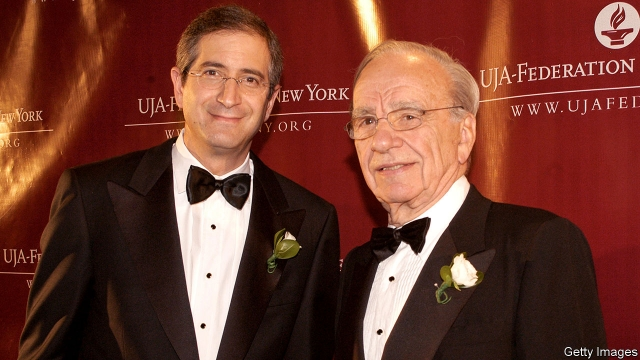
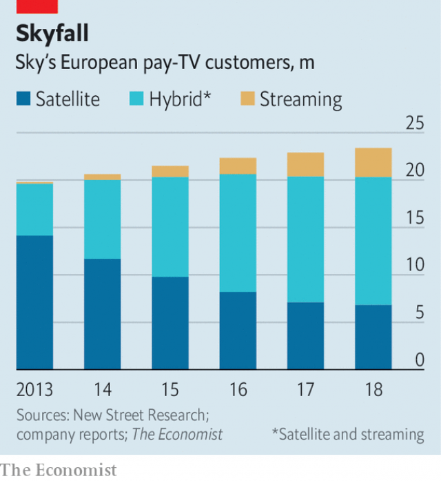

###### Dish of the day

# Has Comcast bet against technology? 

##### Sceptics of its Sky deal abound, but its boss has often wrongfooted critics 

 

> Jan 31st 2019 

 

IN FORGING HIS media empire Rupert Murdoch never worried much about whether he was spending too much money. He thought it mattered more what businesses he was building. Such as, in 1989, a cash-haemorrhaging satellite broadcaster in Britain called Sky Television. Decades later Brian Roberts, chief executive of Comcast, an American pay-TV giant, proved Mr Murdoch right again. In October he completed a deal to buy Sky, a successor to Sky Television, for £30.6bn ($40bn). 

Mr Roberts is also testing the wisdom of profligate spending with his deal. In buying Sky he is taking Comcast into Britain, Italy and Germany, adding 24m customers and $20bn a year in revenue (including Sky, Comcast has a total of 54m customers and $110bn in annual revenues). Critics say he massively overpaid for an antiquated technology at a time when internet video is the future. Four months on Mr Roberts has not articulated a grand strategy for the purchase. Comcast’s shares are trading at over 10% below what even some bears think is their fair value. 

Investors may be discounting Mr Roberts too steeply. He has a similar record to Mr Murdoch of striking expensive deals that later look astute. First, he made a modest regional cable business he took over from his father, Ralph, into a media behemoth. In 2002 Comcast took over AT&T’s broadband business and improved its margins. Then came his acquisition of NBCUniversal, a TV network and film studio, at a valuation of $30bn, which some analysts found laughably high. Now it could not be had for twice that price. 

Mr Roberts has bought Sky for a hefty premium over what Sky’s management team recently deemed it to be worth: in December 2016 they agreed to sell to Mr Murdoch’s Fox, a minority stakeholder, for £10.75 a share. Comcast paid £17.28, about 10% more than the final bid from Fox (which was backed by Disney, which is acquiring much of Fox). Yet Mr Roberts has become even more confident that his purchase of Sky is a good decision. “I believe we have more long-term opportunities than we originally conceived,” he says. 

The bears think Mr Roberts is wrong for several reasons. The most obvious is the continuing ascent of Netflix, which gives customers in Europe a cheaper option for TV and films; in Britain, for example, Netflix has about as many customers—close to 10m—as Sky has satellite customers. Yet unlike in America, Europe’s pay-TV market has room to grow even as Netflix expands. Just one in three homes in Sky’s markets has pay-TV, compared with nearly 80% in America. Italy and Germany are growth markets. Pay-TV is also much less expensive in Europe. New Street Research, a research firm, predicts Sky will add 2.6m of the 78m available homes by 2023. 

Another reason for wariness is that Sky could lose much of its best content, making it harder to add pay-TV customers. That is because AT&T, owner of HBO and Warner Bros, and Disney could pull their films and TV shows by 2021 as they launch their own mini-Netflixes—or because Comcast is a competitor. But that understates the value to those firms of Sky’s distribution platform, argues Claire Enders of Enders Analysis in London. From it they can sell their new services to 24m customers. 

Comcast also has leverage for its negotiations with Disney in the shape of its 30% stake in Hulu, an internet-video service with 25m subscribers. Disney will own 60% of Hulu after its Fox deal closes, and may want Comcast out. If Sky loses valuable content licences, it will invest more in original European productions to attract subscribers. It can also count on content from Comcast’s subsidiary, NBCUniversal. 

As for Sky’s main technology, to some analysts Comcast’s purchase resembles AT&T’s acquisition in 2015 of DirecTV, a satellite provider in America (also formerly owned by Mr Murdoch) that has lost nearly 2m of its 21m customers in less than two years. Sky has been losing satellite customers in Britain (see chart). Craig Moffett of MoffettNathanson, a research firm in New York, argues that Sky will be a write-off within a decade. He says that it represents a massive bet against advancing technology. 

 

But that understates Sky’s investments in tech beyond the satellite kind, and its diversification under Jeremy Darroch, its boss, and James Murdoch, its former chairman. Sky is a leading seller of broadband in Britain, despite having to pay BT, a competitor, for the “last mile” of connection to the home. Its business is estimated to have gross margins of 50%. Sky also built Now TV, an internet-video service that gives users customised options. NBCUniversal will incorporate technology from Now TV into an ad-supported video service that Comcast will distribute free of charge to its pay-TV customers in America and Europe. 

Last but not least, Comcast-watchers worry about football. Sky has top-flight football rights, such as the Premier League in Britain, a huge draw for customers. But these are put up for sale every three years, and would become more expensive if a new competitor, like Amazon or Facebook, bid. Yet the tech giants have yet to show real interest in sports rights, and it may be years before they can reliably deliver live events to millions of viewers concurrently. Britain is short on high-speed fibre connections. Mr Darroch says if he tried to deliver Sky Sports entirely over Britain’s broadband infrastructure, “it would simply crash”. 

It would be a more exciting gamble if Comcast took on Netflix directly in its markets. But Comcast wins in more boring ways. Chasing Netflix is “a fool’s game”, says Barry Diller, boss of IAC/InterActiveCorp, a media and internet firm in New York. Mr Roberts is ambitious, Mr Diller adds, but he is no fool. 

-- 

 单词注释:

1.comcast[]:n. 康卡斯特（美国最大的有线系统公司） 

2.sceptic['skeptik]:n. 怀疑论者 

3.abound[ә'baund]:vi. 大量存在, 富于, 充满 

4.wrongfoot[]:un. 不熟练的脚 [网络] 屈脚 

5.Jan[dʒæn]:n. 一月 

6.forge[fɒ:dʒ]:n. 熔炉, 铁工厂 vt. 打制, 锻造, 伪造 vi. 锻造, 伪造 

7.Rupert['ru:pət]:n. 鲁珀特（男子名） 

8.MURDOCH['mә:dɔk]:n. 默多克(m.) 

9.broadcaster['brɒ:dkæstә]:n. 播送者, 广播装置, 播种机 

10.brian['braiәn]:n. 布莱恩（男子名） 

11.Robert['rɔbәt]:[法] 警察 

12.successor[sәk'sesә]:n. 继承者, 接任者 [计] 后继 

13.profligate['prɒfligit]:a. 放荡的, 不检点的, 浪费的 n. 放荡者, 享乐者 

14.massively[]:adv. 大而重, 厚实, 粗大, 强有力, 结实, 魁伟, 大块, 大量, 大规模, 实心, 块状 [计] 大规模地 

15.overpay[.әuvә'pei]:vt. 多付, 多给报酬 vi. 付得过多 

16.antiquate['æntikweit]:vt. 使古旧, 废弃 

17.articulate[ɑ:'tikjulit]:a. 发音清晰的, 口才好的 vt. 明白地说, 以关节连接, 使成为系统的整体 

18.investor[in'vestә]:n. 投资者 [经] 投资者 

19.steeply['sti:pli]:adv. 险峻地 

20.astute[ә'stju:t]:a. 敏锐的, 狡猾的 

21.regional['ri:dʒәnәl]:a. 地方的, 地域性的 [医] 区的, 部位的 

22.Ralph[reif, rælf]:n. 拉尔夫（男子名） 

23.behemoth[bi'hi:mɔθ]:n. 庞然大物 

24.broadband['brɔ:dbænd]:[计] 宽带 

25.NBCUniversal[]:[网络] 环球；美国国家广播环球公司；广播公司环球新闻部 

26.valuation[.vælju'eiʃәn]:n. 评价, 估价, 价值判断 [经] 估价, 计价, 评价 

27.analyst['ænәlist]:n. 分析者, 精神分析学家 [化] 分析员; 化验员 

28.laughably['lɑ:fәbli]:adv. 荒唐可笑地, 有趣地 

29.hefty['hefti]:a. 重的, 肌肉发达的 

30.premium['pri:miәm]:n. 额外补贴, 奖金, 奖赏, 保险费 [医] 保险费 

31.deem[di:m]:v. 认为, 相信 

32.stakeholder['steikhәuldә]:n. 赌金保管者 [法] 赌款保存人, 保存保证金的人 

33.Disney['dizni]:n. 迪斯尼 

34.originally[ә'ridʒәnli]:adv. 本来, 原来, 最初, 就起源而论, 独创地 

35.conceive[kәn'si:v]:vt. 构思, 认为 vi. 怀孕 

36.ascent[ә'sent]:n. 上升, 提高, 攀登, 上坡路 

37.netflix[]:n. 全球十大视频网站中唯一收费站点 

38.les[lei]:abbr. 发射脱离系统（Launch Escape System） 

39.wariness['wєәrinis]:n. 谨慎, 注意, 小心 

40.hbo[]:abbr. 家庭影院（Home Box Office）；美国家庭电影院 

41.warner['wɔ:nә]:n. 警告者, 告诫者, 预告者 [化] 报警器 

42.bro[]:abbr. 兄弟（brother） 

43.understate[.ʌndә'steit]:v. 不完全地陈述, 保守地说, 有意轻描淡写 

44.claire[kleә]:n. 克莱儿（女子名） 

45.ender[]:n. 安德（游戏中的人物名）；恩德（男子名） 

46.negotiation[ni.gәuʃi'eiʃәn]:n. 谈判, 磋商, 交涉 [经] 谈判, 协商 

47.hulu[]: [地名] [印度尼西亚] 胡卢 

48.subscriber[sʌbs'kraibә]:n. 签署者, 捐献者, 订户 [经] 定户 

49.subsidiary[sәb'sidiәri]:n. 子公司, 附件, 辅助者 a. 辅助的, 次要的, 津贴的 

50.directv[]:[网络] 美国直播电视集团；直播电视公司；美国直播电视集团有限公司 

51.provider[prә'vaidә]:n. 供应者, 供养人, 伙食承办人 [计] 提供器 

52.formerly['fɒ:mәli]:adv. 从前, 以前 

53.craig[krei^]:n. 克雷格（男子名） 

54.moffett[]: [人名] [苏格兰人、爱尔兰人姓氏] 莫菲特 Moffatt的变体 

55.york[jɔ:k]:n. 约克郡；约克王朝 

56.tech[tek]:n. 技术学院或学校 

57.diversification[daivә:sifi'keiʃәn]:n. 变化, 多样化 [经] 分散 

58.jeremy['dʒerimi]:n. 杰里米（男子名） 

59.darroch[]: [人名] [英格兰人姓氏] 达洛克住所名称，来源于盖尔语，含义是“栎树”(oak); [人名] [英格兰人姓氏] 达洛克来源于盖尔语人名，含义是“无畏的”(stouthearted) 

60.jame[]: 灰岩井 

61.bt[]:abbr. 英国电信（British Telecom） 

62.customise['kʌstәmaiz]:vt.<主英>=customize 

63.incorporate[in'kɒ:pәreit]:a. 合并的, 组成公司的, 一体化的 vt. 吸收, 合并, 使组成公司, 体现 vi. 合并, 混合, 组成公司 

64.amazon['æmәzɒn]:n. 亚马孙河 [医] 无乳腺者 

65.facebook[]:n. 脸谱网 

66.reliably[ri'laiәbli]:adv. 可靠地, 可信赖地 

67.concurrently[]:[计] 并行地 

68.entirely[in'taiәli]:adv. 完全, 全然, 一概 

69.infrastructure['infrәstrʌktʃә]:n. 基础结构, 基础设施 [经] 基础设施 

70.gamble['gæmbl]:n. 赌博, 冒险 v. 赌博, 孤注一掷 

71.Barry['bæri]:n. 巴里（男子名） 

72.diller[dɪl]:n. [植物]莳蔓,小茴香(Anethum graveolens)；莳蔓籽(或叶)(常作调味品) 

73.ambitious[æm'biʃәs]:a. 有野心的, 抱负不凡的, 雄心勃勃的 

