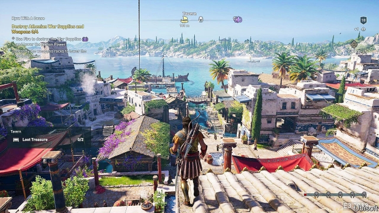

###### Gameflix

# Netflix, but for video games 

##### If game streaming works, the market could expand even further 

 

> Jan 31st 2019 

 

THE ABILITY to stream films and songs over the internet has upended the entertainment industry, but the $140bn market in video-gaming has resisted the revolution. That may soon change. A battle is brewing between big media and technology firms to see who—if anybody—can become the Netflix of video games. 

In October Google began tests of a cloud-gaming service called “Project Stream”, using a big-budget game, “Assassin’s Creed Odyssey” (a still is pictured). The game was designed to run on dedicated consoles and beefy PCs. But with the computational heavy-lifting shifted to Google’s data-centres, even a modest laptop could have the game’s sumptuous take on the Peloponnesian War piped to it over the web. 

Those initial trials are now finished. Microsoft, which makes the Xbox consoles, is due to start testing a similar service, Project xCloud, later this year. Amazon is also thought to be interested. The giants will be battling a string of competitors. Electronic Arts, a big games publisher, has plans for a streaming product of its own. Nvidia, a maker of video-gaming graphics chips, is testing a similar service. Sony, which makes the PlayStation consoles, already has a cloud-gaming offering called PlayStation Now, as do startups such as Loudplay and Shadow. Customers of Telecom Italia, an Italian internet provider, and Orange, a French one, can avail themselves too. 

The hope is that cloudified games will be more appealing to consumers. The industry would simply be keeping up with their habits, says Kareem Choudhry, who runs Project XCloud at Microsoft. People are trained to expect entertainment to be portable, transferable between different devices, and instantly available. 

Gaming also has high upfront costs relative to other media—games sell for $40-60 and consoles cost between $250 and $400. (Super-powered gaming PCs are even pricier.) With the cloud-gaming model those costs are replaced with a subscription fee. Sony, for instance, charges $19.99 a month, or $99.99 a year; in return gamers get access to more than 700 titles. 

The economics of cloud gaming, indeed, could be more attractive to manufacturers. Consoles such as the Xbox One or the PlayStation 4 are expensive to design and often sold at a loss, with firms hoping to recoup the money on game sales. In a cloudified future, expensive loss-leaders would no longer be necessary. 

Streaming appeals for other reasons too, says Piers Harding-Rolls of IHS Markitt, an analysis firm. The games industry is increasingly making money from users paying for digital goods bought in a game. “Fortnite Battle Royale”, one of the most successful examples, is believed to have earned more than $1bn from in-app purchases since 2017. Since the marginal cost of generating such digital goods is zero, every sale is pure profit. That model rewards scale, which is what cheap cloud gaming could help deliver. 

But the business will live or die on how well the technology works. Unlike a film, a video game is an interactive experience. The computer running it must react instantly to the user’s input, or the game will feel sluggish. When hundreds of miles separate players from the devices crunching the numbers, that gets tricky. If the round trip from a player’s device to a data-centre and back again takes more than a couple of dozen milliseconds, things start to break down, especially for the frantic action games that dominate the best-seller charts. 

Another issue is that data-flow created by a game can change unpredictably. While music- and film-streaming services can “buffer”—fetching the next few minutes of content before it is needed, to guard against connection hiccups—video games cannot. Connections must be rock solid. 

Earlier attempts at cloud gaming—notably by a company called OnLive, which was founded in 2003, shut down in 2012 and sold its assets to Sony in 2015—foundered on such problems. Firms today are convinced things have changed. Home broadband connections are faster than they were ten years ago, for one thing. Clever new video-compression technologies can mitigate some of the old problems, says Mr Choudhry. Firms such as Amazon and Google have the resources and technical expertise to pose a serious threat to incumbent firms like Microsoft and Sony. 

It is too early to guess who will win the battle. Amazon and Google already have data-centres in dozens of countries, and putting hardware close to customers is the easiest way to minimise all-important latency. Microsoft combines its own cloud expertise with a long pedigree in games. There are dark horses, too: Javier Polo, the boss of PlayGiga, a Spanish firm that licenses game-streaming technology, points out that ISPs can put kit even closer to customers than the cloud firms, which might prove a useful advantage. 

Change will not happen overnight. Microsoft and Sony have said that, for now at least, they view streaming as a complement to their conventional business models. Both are working on new consoles. The Xbox Two and PlayStation 5 are likely to launch in 2020. Whether an Xbox Three or PlayStation 6 ever make it to market is another question. 

-- 

 单词注释:

1.netflix[]:n. 全球十大视频网站中唯一收费站点 

2.Jan[dʒæn]:n. 一月 

3.upend[ʌp'end]:v. 颠倒, 倒放 

4.brew[bru:]:n. 酿造酒, 酝酿 v. 酿造, 酝酿 

5.google[]:谷歌；搜索引擎技术；谷歌公司 

6.creed[kri:d]:n. 宗教信条, 教义, 纲领 

7.Odyssey['ɒdisi]:n. 奥德赛(古希腊史诗) 

8.dedicate['dedikeit]:vt. 献出, 贡献 

9.console[kәn'sәul]:vt. 安慰, 藉慰 n. 控制台 [计] 控制台 

10.beefy['bi:fi]:a. (牛)多肉的, 象牛肉的, 粗壮的, 结实的 

11.PC[]:个人计算机 [计] 外部控制, 个人计算机, 光电导体, 伪码 

12.computational[.kɒmpju'teiʃәnәl]:a. 计算的 

13.laptop[]:[计] 膝上型的 

14.sumptuous['sʌmptʃuәs]:a. 奢侈的, 华丽的 

15.Peloponnesian[.pelәpә'ni:ʃәn]:a. 伯罗奔尼撒半岛的 n. 伯罗奔尼撒人 

16.Microsoft[]:n. (美国)微软公司 [电] 微软公司 

17.xbox[]:n. 微软游戏机 

18.amazon['æmәzɒn]:n. 亚马孙河 [医] 无乳腺者 

19.publisher['pʌbliʃә]:n. 出版者, 发行人 [法] 发行人, 出版者, 报刊发行者 

20.nvidia[]:恩威迪亚（芯片厂方） 

21.maker['meikә]:n. 制造者, 上帝 [经] 制造者, 出票人 

22.graphic['græfik]:a. 生动的, 轮廓分明的, 绘画似的, 图解的 [计] 图形的 

23.chip[tʃip]:n. 屑片, 薄片, 碎片 vt. 削, 切, 削成碎片, 使摔倒, 凿 vi. 削下屑片 [计] 孔屑; 组件; 晶片; 芯片 

24.sony[]:n. 索尼（日本电子娱乐公司） 

25.playstation[]:n. 游戏机 

26.startup[]:[计] 启动 

27.telecom['telәkɔm]:telecommunication 电信 

28.italia[i'tɑ:ljɑ:]:n. 意大利 

29.provider[prә'vaidә]:n. 供应者, 供养人, 伙食承办人 [计] 提供器 

30.avail[ә'veil]:vi. 有用, 有利 vt. 有利于 n. 效用, 利益 

31.cloudified[]:[网络] 浑浊 

32.kareem[]:卡里姆（人名） 

33.choudhry[]:[网络] 邹瑞 

34.transferable[træns'fә:rәbl]:a. 可转移的 [经] 可转让的, 可过户的 

35.upfront[ˌʌpˈfrʌnt]:a. 正直的, 坦率的; 最前面的, 首要的; 在前面的; 预先的 adv. 在最前面; 提前支付（工资） 

36.pricy['praisi]:a. 昂贵的, 价格高的 

37.subscription[sәb'skripʃәn]:n. 捐献, 订金, 订阅, 签署, 同意 [化] 订购 

38.gamer['ɡeimә]:n. 玩家, 博弈者 

39.recoup[ri'ku:p]:vt. 偿还, 赔偿, 补偿, 扣除 vi. 补偿损失 

40.pier[piә]:n. 码头, 桥墩, 支框, 防波堤 [医] 桥基, 基牙 

41.ih[]:abbr. 测量端（Instrument Head）；间接加热（Indirect Heating）；反时针（Inverted Hour） 

42.royale[rɔi'æl]:n. 蛋糕饰块（用作汤中饰菜） 

43.marginal['mɑ:dʒinәl]:a. 边缘的, 最低限度的, 有旁注的 [医] 缘的 

44.interactive[,intәr'æktiv]:a. 相互作用的, 相互影响的 [计] 交互, 人机对话的 

45.sluggish['slʌgiʃ]:a. 偷懒的, 懒惰的, 迟钝的 [经] 萧条的, 呆滞的 

46.crunch[krʌntʃ]:v. 嘎吱嘎吱的咬嚼, 压碎, 嘎吱嘎吱地踏过 n. 咬碎, 咬碎声 

47.tricky['triki]:a. 狡猾的, 机敏的 

48.millisecond['mili,sekәnd]:n. 毫秒 [计] 毫秒 

49.frantic['fræntik]:a. 狂乱的, 疯狂的 

50.unpredictably[ˌʌnprɪˈdɪktəblɪ]:adv. 无法预言地）；不可预见地（不能预料地 

51.cannot['kænɒt]:aux. 无法, 不能 

52.onlive[]:[网络] 在线游戏；平湖；一种游戏点播服务 

53.asset['æset]:n. 资产, 有益的东西 

54.broadband['brɔ:dbænd]:[计] 宽带 

55.mitigate['mitigeit]:vt. 温和, 缓和, 减轻 [医] 缓和, 减轻 

56.expertise[.ekspә:'ti:z]:n. 专家意见, 专门技术 [法] 专门知识, 专家意见 

57.incumbent[in'kʌmbәnt]:a. 现任的, 依靠的, 负有义务的 n. 领圣俸者, 在职者 

58.minimise[]:vt. 使减到最少/最小, 使降到最低限度, 使缩到最小, 极度轻视 

59.latency['leitnsi]:n. 潜伏, 潜在 [计] 传输时间, 传输延迟时间 

60.pedigree['pedigri:]:n. 血统, 家谱, 名门世系 [法] 家系, 出身, 血统 

61.Javier[]:n. 哈维尔（第80届奥斯卡最佳男配角）；海威尔（美国联合商业协会中国区副会长） 

62.polo['pәulәu]:n. 马球, 水球 

63.ISP[]:[医] 同位素分离率 

64.kit[kit]:n. 装备, 工具箱, 成套工具 [计] 成套部件; 成套零件 

65.complement['kɒmplimәnt]:n. 补足物, 补语, 补数 vt. 补充, 补足 [计] 补码; 反相器; 补数 

