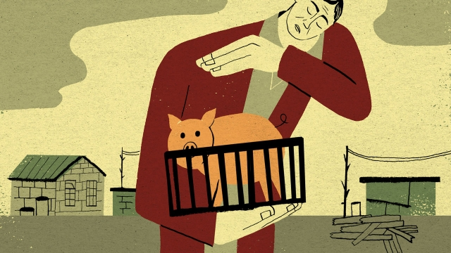

###### Chaguan

# A swine-fever epidemic like China’s would enrage farmers elsewhere 

##### Millions of Chinese pig-rearers face ruin, in silence 

 

> Jan 31st 2019 

 

UNTIL NOW links between social-realist cinema and “Peppa Pig”, a sweet British-made animated television series for children, have been hard to spot. Then came “What is Peppa?”, a beautifully crafted film about China’s rural-urban divide, family ties and the sadness of old age that has accumulated hundreds of millions of online views over the past few days. 

Officially, the six-minute short is an advertising trailer for a children’s feature film made for the China market, “Peppa Pig Celebrates Chinese New Year”. It is timed to cash in on the festival: day one of a pig-year in the Chinese zodiac falls on February 5th. Yet many grown-ups felt a pang of recognition as they watched the trailer’s bittersweet, live-action depiction of Li Yubao, a gruff-but-loving Chinese villager striving to please his city-dwelling grandson, notably by puzzling out the toddler’s request for a Peppa-themed gift. Filmed in the village of Waijinggou, in the dusty, hardscrabble hills that encircle northern Beijing, the short film is rather honest about modern inequalities. The mystery of Peppa’s identity is solved by a village woman who worked in Beijing as a nanny. When grandfather and toddler meet, the child’s eyes show fear at this wild-haired, over-loud old man, as well as excitement. 

Still, the film leaves a lot out. A true work of social realism, if set in a farming village in February 2019, would acknowledge a reality that Chinese officials and state media are trying to downplay. Rural China is in the grip of a long-feared catastrophe, an epidemic of African Swine Fever (ASF). China’s first case was confirmed on August 3rd 2018. It could ruin millions of pig-rearing smallholders in places just like Waijinggou. As of January 25th the Food and Agriculture Organisation, a UN agency, had confirmed 104 outbreaks of ASF in China and the culling of 916,000 pigs. Though the disease poses no threat to humans, there is no cure for infected swine and no vaccine against it. Vincent Martin, the agency’s envoy to China, says eradication “may not be feasible in the short term”, especially if wild pigs act as a reservoir for the virus. Russia offers ominous clues to the future. There an 11-year fight to control ASF has caused backyard pork production to fall by almost half, while large commercial farms which can afford strict biosecurity controls actually increased production. Such a shift would transform rural China, where almost half a billion pigs are produced each year, about 40% of them on small farms with fewer than 30 sows. 

Transparency is a work in progress. Just a dozen years ago Chinese government vets talking to foreign colleagues sometimes refused to speak the names of illnesses aloud, coyly lamenting the arrival of “disease X” in “province Y”. Today China tells the UN about outbreaks and quarantine zones in which the transport of live pigs is banned and markets are closed. It has announced new bans on feeding pigs with food waste. But China is also intent on minimising the crisis. With new-year cooks busy planning pork-heavy feasts, China’s agriculture ministry assured the public on January 16th that ASF is having a “limited impact” on markets. 

Dirk Pfeiffer, a vet and infectious-diseases expert at City University of Hong Kong, credits China with working hard to contain ASF. He notes that even rich European countries struggle with it. Still, he worries about why China’s outbreaks are scattered as dots across the map rather than in clusters, as might be expected. This suggests either that the disease is being controlled with unusual success, or that outbreaks are being underreported. 

Whether swine fever smoulders or blazes across China’s farm-country, it has already exposed the striking political weakness and isolation of the country’s small farmers. In Europe, where farmers wield outsize political clout, the spread of ASF is blamed on government bungling, bringing calls for ministerial resignations. From Romania to Poland, Belgium and Estonia, pig farmers demanding compensation and stricter controls on wild boar have variously obstructed government vets, blocked motorways with tractors and threatened to dump animal dung on parliament. Governments have hastened to appease them. “I am one of you,” a Polish minister told protesters pleadingly, citing his pig-farming past. To reassure farmers, Denmark is building a fence to stop wild boar crossing from Germany. On January 25th France said that it would mobilise troops to kill wild pigs. European farmers are used to deference. They often enjoy geographically concentrated voting power. Voters see them as defenders of cherished traditions. Tractors are a handy prop: governments fear sending riot police to attack anything that routinely appears in children’s books. 

Chinese breeders mount protests, too, for instance when corrupt officials steal land. But though ASF threatens many with financial calamity, this is not causing visible unrest. In part that is because the government works to stop citizens from banding together. And when it comes to public opinion, Chinese farmers are often on their own. Chaguan visited a farmer surnamed He, in the coastal province of Fujian. The 57-year-old grumbles about “hassle” from health inspectors. “We’re not that afraid of swine fever, we’re afraid the government’s management is getting too strict,” Mr He says, hosing manure from pens holding about 150 pigs. His three-year-old grandson scampers nearby, bells tinkling on ankle bracelets. Mr He makes a profit of up to 30 yuan ($4.46) per kilo on his pigs, not enough to pay for biosecurity measures ordered by officials. He sees no end to the ASF crisis. “Doesn’t seem like there’s much we can do.” He is not puzzled that his children do not want his farm: the government “subsidises big farms, not small ones”. 

A bleak truth lurks in “What is Peppa?”. Many Chinese feel for that film’s hero, rattling around his half-empty village. They also understand why such places are abandoned. Tellingly, the trailer’s emotional climax involves the grandfather relishing the big city with his family. For many small farmers in this country in a hurry, swine fever will hasten an end that was already in sight. 

-- 

 单词注释:

1.epidemic[.epi'demik]:n. 传染病, 流行病 a. 流行的, 传染性的 

2.enrage[in'reidʒ]:vt. 激怒, 使暴怒 

3.Jan[dʒæn]:n. 一月 

4.peppa[]:[网络] 粉红小猪；滨江英语情境中心 

5.animate['ænimeit]:vt. 使有生气, 赋予生命 a. 有生命的, 有生气的 

6.sery[]:n. (Sery)人名；(俄)谢雷；(科特)塞里 

7.beautifully['bju:tifuli]:adv. 美好地, 漂亮地 

8.online[]:[计] 联机 

9.officially[ә'fiʃәli]:adv. 作为公务员, 职务上, 官方地 

10.advertising['ædvәtaiziŋ]:n. 广告业, 广告 a. 广告的 [计] 发广告 

11.trailer['treilә]:n. 追踪者, 拖车 [电] 拖车 

12.zodiac['zәudiæk]:n. 黄道带, 黄道十二宫图 

13.pang[pæŋ]:n. 剧痛, 悲痛, 苦闷 vt. 使剧痛, 折磨 

14.bittersweet['bitәswi:t]:a. 又苦又甜的, 苦乐参半的 [医] 白英, 蜀羊泉 

15.depiction[di'pikʃәn]:n. 描写, 叙述 

16.Li[li:]:[医] 锂(3号元素) 

17.strive[straiv]:vi. 努力, 奋斗, 斗争 

18.notably['nәjtbәli]:adv. 显著地, 著名地, 尤其, 特别 

19.hardscrabble['hɑ:d'skræbl]:[美]贫脊的, 非常穷困的 

20.encircle[in'sә:kl]:vt. 环绕, 围绕, 包围 

21.Beijing[beidʒiŋ]:[经] 北京 

22.inequality[.ini'kwɒliti]:n. 不平等, 不同, 不平坦, 不平均 n. 不平等, 不等式 [计] 不等式 

23.nanny['næni]:n. 保姆；母山羊 

24.toddler['tɔdlә]:n. 蹒跚行走的人, 学步的小孩, 学步的幼儿, (非正式)信步走的人 

25.realism['riәlizm]:n. 写实主义, 现实, 实在论 [法] 现实主义 

26.downplay['daunplei]:vt. 不予重视 

27.swine[swain]:n. 猪, 卑鄙的家伙 

28.ASF[]:[计] 现行字段域 [医] 苯胺硫甲醛树脂 

29.smallholder['smɒ:l.hәuldә]:n. 小农, 小佃农 

30.organisation[,ɔ: ^әnaizeiʃən; - ni'z-]:n. 组织, 团体, 体制, 编制 

31.UN[ʌn]:pron. 家伙, 东西 [经] 联合国 

32.outbreak['autbreik]:n. 爆发, 暴动 [医] 暴发 

33.cull[kʌl]:vt. 采, 摘, 拣 n. 拣出的等外品, 被剔出的动物 

34.swine[swain]:n. 猪, 卑鄙的家伙 

35.vaccine['væksi:n]:n. 牛痘苗, 疫苗 a. 疫苗的, 牛痘的 

36.Vincent['vinsәnt]:n. 文森特（男名） 

37.Martin['mɑ:tin]:n. 马丁, 圣马丁鸟 

38.envoy['envɒi]:n. 外交使节, 特使 [法] 使者, 代表, 使节 

39.eradication[i,rædi'keiʃәn]:n. 连根拔除, 歼灭, 消灭, 根除, 使断根 [医] 根除, 扑灭, 消灭 

40.reservoir['rezәvwɑ:]:n. 贮水池, 贮藏处, 贮备, 水库 vt. 储藏 

41.ominous['ɒminәs]:a. 恶兆的, 不吉利的, 预兆的 

42.backyard['bæk'jɑ:d]:n. 后院, 后庭 

43.biosecurity[ˌbaɪəʊsɪ'kjʊərətɪ]: 生物安全 

44.transparency[træns'pærәnsi]:n. 透明, 透明度, 透过性, 透明物, 清晰 [计] 透明性; 透明 

45.vet[vet]:n. 兽医 vi. 当兽医 vt. 诊断, 检审 

46.coyly[kɔɪlɪ]:adv. 害羞地, 羞怯地 

47.lament[lә'ment]:n. 悲叹, 悔恨, 恸哭, 挽歌, 悼词 vt. 哀悼 vi. 悔恨, 悲叹 

48.x[eks]:n. 未知数 [计] 交换, 变址, 索引, 传输 

49.Y[wai]:[计] 原型 [医] 钇(39号元素) 

50.quarantine['kwɒrәnti:n]:n. 隔离, 封锁交通, 检疫期 vt. 隔离, 排斥 

51.intent[in'tent]:n. 意图, 含义, 故意 a. 专心的, 决心的, 热心的 

52.minimise[]:vt. 使减到最少/最小, 使降到最低限度, 使缩到最小, 极度轻视 

53.dirk[dә:k]:n. 短剑, 匕首 vt. 用短剑刺 

54.Pfeiffer[]:法伊弗（人名） 

55.hong[hɔŋ]:n. （中国、日本的）行, 商行 

56.kong[kɔŋ]:n. 含锡砾石下的无矿基岩；钢 

57.cluster['klʌstә]:n. 串, 丛, 群, 簇 vi. 成串, 丛生 vt. 使聚集 [计] 簇 

58.underreported[]:[网络] 少报；低估；漏报 

59.smoulder['smәuldә]:vi. 闷烧, 郁积 n. 闷烧 

60.isolation[.aisә'leiʃәn]:n. 隔绝, 孤立, 隔离 [化] 分离; 生物分离 

61.wield[wi:ld]:vt. 挥舞, 运用 

62.outsize['autsaiz]:a. 特大的 n. 特大号 

63.clout[klaut]:n. 敲击, 破布 vt. 打补钉 

64.bungle['bʌŋgl]:v. 拙劣地工作, 粗制滥造, 把...搞糟 n. 粗劣, 失误, 笨拙 

65.ministerial[.mini'stiәriәl]:a. 部长的, 内阁的, 执政的 [法] 部长的, 部的, 公使的 

66.Romania[rәu'meinjә]:n. 罗马尼亚 

67.Poland['pәulәnd]:n. 波兰 

68.Estonia[es'tәuniә]:n. 爱沙尼亚 

69.compensation[.kɒmpen'seiʃәn]:n. 补偿, 赔偿金, 工资 [医] 代偿(机能), 补偿 

70.boar[bɒ:]:n. 公猪, 野猪 

71.variously['veәriәsli]:adv. 各种各样, 种种, 不同, 多方面, 多才多艺, 许多, 各个, 个别, 杂色, 彩色 

72.obstruct[әb'strʌkt]:vt. 阻隔, 妨碍, 阻塞, 遮没 vi. 设障碍 

73.motorway['mәutәwei]:n. 高速公路 

74.dung[dʌŋ]:n. 粪 vt. 施粪肥于 

75.appease[ә'pi:z]:vt. 抚慰, 缓解, 平息, 姑息 [法] 使和缓, 使满足, 姑息 

76.protester[]:n. 抗议者, 持异议者, 拒付者 [经] 反对者 

77.pleadingly[ˈpli:dɪŋli]:adv. 祈求地, 诉愿地 

78.cite[sait]:vt. 引用, 引证, 表彰 [建] 引证, 指引 

79.reassure[.ri:ә'ʃuә]:vt. 使...安心, 向...再保证 [法] 重新保证, 再保险, 使清除疑虑 

80.Denmark['denmɑ:k]:n. 丹麦 

81.mobilise['mәjbilɑiz]:vi.vt. 动员, 松动, 使活动, 调动, 发动 

82.deference['defәrәns]:n. 顺从, 尊重 

83.geographically[]:[计] 自通地 

84.voter['vәutә]:n. 选民, 投票人 [法] 选民, 选举人, 投票人 

85.defender[di'fendә]:n. 防卫者, 防护者, 辩护者 [法] 辩护人, 保护人 

86.cherish['tʃeriʃ]:vt. 珍爱, 怀有, 爱护 

87.riot['raiәt]:n. 暴动, 喧闹, 放纵 vi. 发动, 暴动, 纵情, 放荡 vt. 浪费, 挥霍 

88.routinely[]:adv. 日常, 乏味, 常规, 例行 

89.breeder['bri:dә]:n. 饲养员, 养育员, 起因, 起源者 

90.calamity[kә'læmiti]:n. 灾难, 不幸事件 

91.banding['bændiŋ]:[机] 模式带 

92.coastal['kәustәl]:a. 海岸的, 沿海的, 沿岸的 [法] 海岸的, 沿海的 

93.Fujian['fu:'dʒjen]:福建(位于中国东部沿海) 

94.grumble['grʌmbl]:n. 怨言, 满腹牢骚 vi. 抱怨, 发牢骚, 发隆隆声 vt. 抱怨 

95.hassle['hæsl]:n. 激烈而持久的争论 vi. 争论 vt. 与...争辩, 使烦恼 

96.inspector[in'spektә]:n. 检查员, 巡视员 [化] 检查员 

97.hose[hәuz]:n. 水管, 橡皮软管, 长统袜 vt. 用水管浇 

98.manure[mә'njuә]:n. 肥料, 粪肥 vt. 施肥于 

99.scamper['skæmpә]:n. 蹦跳, 奔跑, 浏览 vi. 蹦跳, 奔跑, 浏览 

100.tinkle['tiŋkl]:n. 叮当声 vt. 使发丁当的声, 叮当地发出 vi. 叮当作响 

101.bracelet['breislit]:n. 手镯 [医] 手镯, 腕带, 腕纹(掌侧横列腕部的线纹) 

102.yuan[ju:'ɑ:n]:n. 元(中国货币单位) [经] 元 

103.subsidise[]:vt. 给...补助金, 津贴, 资助 

104.bleak[bli:k]:a. 萧瑟的, 荒凉的, 阴冷的 

105.lurk[lә:k]:n. 潜伏, 潜行 vi. 暗藏, 潜伏, 埋伏 [计] 隐匿阅读 

106.rattle['rætl]:vt. 使嘎嘎响, 喋喋不休地说 vi. 格格响, 喋喋不休 n. 格格声, 拨浪鼓, 喋喋不休的话 

107.tellingly['teliŋli]:adv. 有效地；显著地 

108.climax['klaimæks]:n. 高潮, 极点, 层进法 v. (使)达到顶点, (使)达到高潮 

109.relish['reliʃ]:n. 滋味, 风味, 美味, 爱好, 食欲, 调味品 vt. 调味, 喜欢, 玩味 vi. 有味道 

