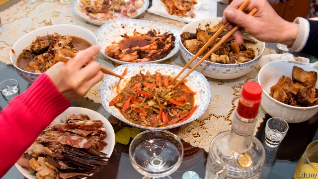
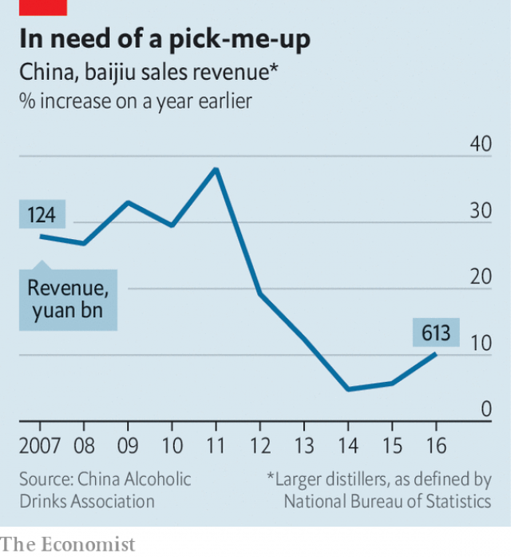

###### Spirit of the pits

# Can baijiu, China’s sorghum firewater, go global? 

##### An ancient liquor tries to follow vodka and tequila 

 

> Jan 31st 2019 

DISTILLERS AT Kweichow Moutai, the world’s most valuable alcoholic-drinks firm, like to tell an old story about their company’s first big break. It relates how, in 1915, Chinese officials chose to exhibit Moutai’s sorghum-based spirit at an exposition in San Francisco. When the doors opened the snooty American audience sneered at the delegation’s plain earthenware jars. Fearing disaster, or perhaps simply by accident, a Chinese delegate smashed one on the floor, releasing its aroma to the crowd. The scent and the commotion attracted the judges, who eventually awarded it a top prize. 

The tale is told with relish to visitors in Maotai, the pretty riverside town in the south-western province of Guizhou that gave the company its name (the spelling of Kweichow Moutai is based on old-style romanisation). The medal the liquor won in San Francisco hangs in a corporate museum, next to a video-wall showing a re-enactment of the incident. That was the day, explains the exhibit, that the brand “went global”. Down a hill, in the heart of the town, is a plaza named “1915 Square” that hums with visitors. At its centre is a giant gold-painted monument in the shape of a cracked liquor jar. 

That the company should take such pride in this bygone foreign endorsement is odd, given how much it has to celebrate at home. Moutai has long called itself the “national liquor”—though last year it gave up a years-long battle to trademark this description. Feted by Communist leaders who often serve it to visiting dignitaries, Moutai is among the most expensive of the brands of baijiu (literally meaning white, or clear, alcohol) that are commonly bought to celebrate the Chinese new year, which this year begins on February 5th. The festival is a frenzy of baijiu imbibing and gift-giving among family and friends. 

The liquor—a broad family of grain-based spirits selling for anything between a few dollars and a few thousand dollars per bottle—is the most-drunk spirit on earth. But this is only by dint of its popularity in China. Each year drinkers there spend about three times more on baijiu than they do on beer and roughly 15 times more than on wine. The 10bn litres produced each year is more than twice the annual global production of vodka, the next most popular spirit. It would fill a bath for every person in Britain. In 2017 Moutai’s market capitalisation reached $71.5bn, overtaking that of Diageo, a British drinks giant. 

Over the years Europeans and Americans have grown to love vodka, a once-obscure Russian gut-rot, and tequila, a Mexican drink made from spiky plants. But Chinese liquor firms have made few inroads globally. About 95% of Moutai’s sales are in China. So it is remarkable that the company tries to suggest that it has had a century of success abroad. Only recently have it and some of China’s thousands of other baijiu-makers begun stepping up efforts to develop foreign markets. 

This will be a challenge. To unaccustomed palates, baijiucan be an assault on the senses. The primary ingredient is sorghum, or sometimes rice. In contrast with the making of whisky or beer, the grains are usually fermented while solid. This requires them to be mixed with a yeast-filled agent and then heaped in mounds, packed in buried jars or sometimes sealed pits. When the solid mixture is suitably stinky it is distilled by heating in a still that operates like a steamer (see picture), to produce high-alcohol liquid. Production of the simplest type can be completed in a week or two. More complex ones require multiple fermentations and distillations that can take up to nine months. In either case, the spirit is eventually aged in ceramic jars as tall as a human being. 

What results is a startling variety of products, many with an alcohol content above 50%. At its most drinkable, it is sweet, aromatic and has a vodka’s crispness. At its most pungent it can be a punchy mix of mushrooms, liquorice and old socks. Connoisseurs divide the drink by flavour into four categories: rice, light, strong and sauce. But it is rarely consumed for its subtleties. It is more a social lubricant, usually drunk at mealtimes with family, colleagues or clients. It is downed in shots rather than sips. Endless toasting can turn banquets into tests of endurance. 

In the workshop of a small, independent baijiu distillery in Maotai, shirtless men rake out hot piles of sorghum that they have tipped from steaming wheelbarrows. Zhao Liyong, the owner, hops perilously around the lip of an empty fermentation pit, a brick-lined hole that looks about six feet deep. He still makes the drink the way his grandfather did. Later, over a plate of pork intestines, his tongue loosened by a bottle of his own liquor, Mr Zhao lists some of his product’s magical properties: it can treat ulcers, soothe colds and turn enemies into friends, he insists. After cups have been raised a few more times, your correspondent struggles to think of a toast to match Mr Zhao’s, that “you will come to love China, love baijiu, and love me.” 

Foreigners’ ignorance of the drink is perplexing when one considers the world’s familiarity with Chinese food. It does not help that Westerners generally do not drink spirits neat. Making good use of baijiu in a cocktail tends to require more imagination and ingredients than are found in many bars and homes. Its high alcohol content makes it expensive in countries that tax booze highly. Visitors who have lived in China commonly return home with bad stories about baijiu, which often have less to do with the liquid itself—though its hangovers are legendary—than the way it has been foisted on them at raucous events. Hosts delight in challenging reluctant guests to drink, and demanding they do so at the same down-in-one pace. The Chinese equivalent of “cheers” is ganbei, meaning “empty [your] cup”. 

There may be historical explanations for the West’s lack of interest. Derek Sandhaus, the author of “Baijiu: The Essential Guide to Chinese Spirits”, says America’s taste for Chinese food first took off at the time of Prohibition. He thinks this coincidence denied Chinese liquor culture a chance to ride on the coat-tails of the new cuisine. That many small Chinese restaurants and takeaways in America forgo alcohol licences is a present-day obstacle, too. Mexican foodsellers have more incentive to shoulder the hassle and expense of licensing because they are confident that they can cash in on sweet poisons such as margaritas. This has lately made it easier for Latin American drinks-makers to introduce obscurer spirits, such as mezcal, a hipster cousin of tequila, or pisco. 

 

But for a long time China’s big baijiu-makers were not that interested in foreign sales. Since China began opening its economy to the outside world in the late 1970s, the distillers have mostly been preoccupied with meeting domestic demand (baijiu production roughly tripled in the ten years to 2013). Those that do have foreign ambitions, as in other industries, are not always up to the task. Many are state-owned (Moutai is publicly listed, but Guizhou’s government has a big stake) and conservative in their marketing. 

Over the past few years, however, attitudes have been changing. In addition to exporting their best-known brands, baijiu-makers have been creating new drinks specifically to be sold abroad. In 2016 Red Star, the maker of Erguotou, a cheap baijiu ubiquitous in Beijing, launched a spirit in Europe called Nuwa. Last year Luzhou Laojiao, a storied distiller in Sichuan, a south-western province, released a baijiu in America named Ming River (it is a joint venture in which Mr Sandhaus holds a share). In June Moutai began promoting one of its cheaper brands in New Zealand, as the base for a cocktail it calls the Dancing Kiwi. Olive Chen from Waba, a China-based group of drinks-makers and distributors, says New Zealand’s small size and Western culture makes it a good place to test the drink’s potential for other foreign markets. 

All of this is in part a response to ructions at home. Giving expensive bottles of baijiu has long served as a quiet method of bribing people. After he took over as China’s leader in 2012, Xi Jinping launched a campaign against corruption and profligacy in government. Almost overnight his efforts deprived baijiu-makers of their best buyers: state-owned firms and government agencies. For many distillers, revenue growth slumped (see chart). 

 

The drama has made them less complacent, prompting a rethink of their export strategies, and much else. In China they are working harder to sell more baijiu to consumers instead of businesses, a task that includes making sure it is well stocked in bars as well as restaurants. They are also wondering how to hedge against worries that young Chinese, and women especially, are not as keen on the stuff as their fathers (one youngster calls baijiu “something your dad drinks”; another says it is “just for drunks”). Minnie Yu, an analyst for Nielsen, a research firm, says distillers are trying to attract younger people with lower-strength versions in smaller bottles. 

Baijiu companies are aware that they increasingly have to compete in their home market with Western drinks such as gin, whisky and wine. Many have concluded, perhaps correctly, that making their brands look and feel international to Chinese drinkers will help them hold their own against these fashionable foreign tipples. This strategy, rather than the chance of big profits in America, may explain why Wuliangye, another baijiu-maker, has been splashing out on advertising space in New York’s Times Square. Paul Mathew, a baijiu enthusiast who runs Demon, Wise and Partners, a cocktail bar in London, says Chinese firms regularly seek his advice on the British drinks market. But he says their goal is often just to get footage of a foreign bartender making cocktails with their spirit, which they can circulate on social media in China to show that their brand is taken seriously by foreigners. Many distillers see benefit in looking like they are tapping an overseas market—one that never forgot the fragrance from that broken jar. 

-- 

 单词注释:

1.baijiu[]:[网络] 中国白酒；啤酒；正确而简单的译法 

2.sorghum['sɒ:gәm]:n. 高粱, 芦黍糖浆, 甜得发腻的东西 [医] 蜀黍, 高梁 

3.firewater['faiәwɒ:tә]:n. 烈酒 

4.vodka['vɒdkә]:n. 伏特加酒 [化] 伏特加酒 

5.tequila[tә'ki:lә]:n. 蒸馏酒, 龙舌兰酒 

6.Jan[dʒæn]:n. 一月 

7.distiller[dis'tilә]:n. 蒸馏者, 蒸馏器, 制酒者 [化] 蒸馏器 

8.Kweichow['^wei'dʒәj]:见Guizhou 

9.Moutai[]:[网络] 茅台；茅台酒；贵州茅台 

10.exposition[.ekspә'ziʃәn]:n. 阐述, 讲解, 说明, 博览会, 展览会 [经] 展览会, 集市, 义卖市场 

11.san[sɑ:n]:abbr. 存储区域网（Storage Area Networking） 

12.francisco[fræn'siskәu]:n. 弗朗西斯科（男子名, 等于Francis） 

13.snooty['snu:ti]:a. 傲慢的, 自大自满的, 鄙视别人的 

14.sneer[sniә]:n. 冷笑, 嘲笑 vi. 嘲笑, 冷笑 vt. 嘲笑着说, 嘲笑得使 

15.earthenware['ә:θәnweә]:n. 陶器 [化] 陶器; 土器 

16.aroma[ә'rәumә]:n. 浓香, 香气 [医] 香气, 芳香气 

17.commotion[kә'mәuʃәn]:n. 骚动, 暴乱 [医] 震荡 

18.relish['reliʃ]:n. 滋味, 风味, 美味, 爱好, 食欲, 调味品 vt. 调味, 喜欢, 玩味 vi. 有味道 

19.Maotai[]:[网络] 茅台酒 

20.riverside['rivәsaid]:n. 河边, 河畔 

21.Guizhou['^wei'dʒu:]:贵州(位于中国西南部) 

22.romanisation[]:[网络] 罗马化 

23.corporate['kɒ:pәrit]:a. 社团的, 合伙的, 公司的 [经] 团体的, 法人的, 社团的 

24.plaza['plɑ:zә]:n. 广场, 市场, 购物区 

25.hum[hʌm]:n. 嗡嗡声, 哼声, 杂声 vi. 发低哼声 vt. 哼, 用哼声表示 interj. 哼, 嗯 

26.bygone['baigɒn]:n. 过去的事, 往事 a. 过去的 

27.endorsement[in'dɒ:smәnt]:n. 支持, 认可, 背书 [经] 背书, 担保, 保证 

28.trademark['treidmɑ:k]:n. 商标 [法] 商标 

29.fete[feit]:n. 庆祝, 祭祀, 节日 vt. 宴请, 招待 

30.dignitary['dignitәri]:n. 高贵的人, 高官, 高僧, 要人 

31.literally['litәrәli]:adv. 逐字地, 按照字面上地, 不夸张地 

32.frenzy['frenzi]:n. 疯狂, 狂暴, 狂怒 [医] 暴怒, 狂乱 

33.imbibe[im'baib]:vt. 饮, 吸取, 吸入 vi. 喝, 吸收水分 

34.dint[diŋt]:n. 凹痕, 作用 vt. 打击出凹痕 

35.popularity[.pɒpju'læriti]:n. 名声, 受大众欢迎, 流行 

36.drinker['driŋkә]:n. 饮者, 酒徒 

37.capitalisation[,kæpitәlai'zeiʃən;-li'z-]:n. <主英>=capitalization 

38.diageo[]: 迪阿吉奥公司总部所在地：英国主要业务：饮料 

39.spiky['spaiki]:a. 大钉一般的, 长而尖的, 钉满钉子的, 有穗的 

40.inroad['inrәud]:n. 侵入, 得手, 侵害 [法] 袭击, 侵犯, 损害 

41.globally[]:[计] 全局地 

42.unaccustomed[.ʌnә'kʌstәmd]:a. 不习惯的, 不惯的, 异乎惯例的, 不寻常的 

43.palate['pælit]:n. 腭, 味觉, 趣味, 爱好 [医] 腭 

44.assault[ә'sɒ:t]:n. 攻击, 袭击 vt. 袭击, 攻击 vi. 发动攻击 

45.ferment['fә:ment]:n. 酵素, 发酵, 动乱 v. (使)发酵, (使)动乱 

46.mound[maund]:n. 土墩, 堤, 小山 vt. 筑堤, 用土堆防卫 vi. 积成堆 

47.suitably['sju:tәbli]:adv. 合适地, 适当地, 相配地 

48.stinky['stiŋki]:a. 发恶臭的 

49.distil[]:vt.vi. 蒸馏, 提取...的精华, 用蒸馏法提取 vi. 滴下, 渗出 

50.fermentation[,fә:men'teiʃәn]:n. 发酵 [化] 发酵 

51.distillation[.disti'leiʃәn]:n. 蒸馏 [化] 蒸馏; 蒸馏法 

52.ceramic[si'ræmik]:a. 陶瓷的 n. 陶瓷制品 

53.drinkable['driŋkәbl]:a. 可以喝的, 饮用的 n. 饮料 

54.aromatic[.ærәu'mætik]:a. 芬芳的 [医] 芳香的; 芳香剂 

55.crispness[krɪspnəs]:n. 易碎, 精神愉快 

56.pungent['pʌndʒәnt]:a. 刺激性的, 尖刻的, 苦痛的 [医] 冲味的, 刺激味的 

57.punchy[]:a. 有力的, 生气勃勃的 

58.liquorice['likәris]:n. 甘草 [化] 甘草 

59.connoisseur[.kɒnә'sә:]:n. 鉴赏家, 鉴定家, 内行 

60.subtlety['sʌtlti]:n. 微妙, 精明 

61.lubricant['lu:brikәnt]:a. 润滑的 n. 润滑物, 润滑油, 润滑剂 

62.mealtime['mi:ltaim]:n. 进餐时间 

63.client['klaiәnt]:n. 客户, 顾客, 委托人 [计] 客户, 客户机, 客户机程序 

64.sip[sip]:n. 啜饮, 小口喝, 抿 vi. 啜饮 vt. 啜 [计] 单列直插式组件 

65.banquet['bæŋkwit]:n. 宴会 

66.endurance[in'djuәrәns]:n. 忍耐, 忍耐力, 耐性 [机] 持九性 

67.distillery[dis'tilәri]:n. 蒸馏室, 酿酒厂, 酒厂 [化] 酒厂; 造酒厂 

68.shirtless[]:a. 赤膊的；无上装的 

69.wheelbarrow['hwi:l.bærәu]:n. 手推车, 独轮车 

70.zhao[]:n. 赵（姓氏） 

71.hop[hɒp]:n. 单脚跳, 跳跃, 舞会, 飞行 vi. 单脚跳, 跳跃 vt. 跃过, 跳上, 加蛇麻子于, 服麻醉药 [计] 跳跃式传输 

72.perilously[ˈperɪləslɪ]:adv. 充满危险地, 危机四伏地 

73.intestine[in'testin]:a. 内部的, 国内的 n. 肠 

74.magical['mædʒikәl]:a. 魔术的, 有魔力的, 不可思议的 

75.ulcer['ʌlsә]:n. 溃疡, 腐烂物 [医] 溃疡 

76.soothe[su:ð]:vt. 缓和, 使安静, 安慰, 奉承 vi. 起安慰作用 

77.ignorance['ignәrәns]:n. 无知, 愚味 [法] 无知, 不知情, 愚昧 

78.perplex[pә'pleks]:vt. 使困惑, 使复杂化, 使为难 [法] 困惑, 使复杂化, 使纠缠不清 

79.familiarity[fә.mili'æriti]:n. 熟悉, 精通, 亲密 

80.cocktail['kɒkteil]:n. 鸡尾酒, 开味品 a. 鸡尾酒会的 

81.booze[bu:z]:vi. 豪饮 n. 酒, 酒宴 

82.les[lei]:abbr. 发射脱离系统（Launch Escape System） 

83.hangover['hæŋәuvә]:n. 宿醉, 残留物, 遗物 [电] 残存物 

84.foist[fɒist]:vt. 硬卖给, 偷偷插入, 使混入 

85.raucous['rɒ:kәs]:a. 沙哑的, 粗声的, 喧闹的 

86.ganbei[]:[网络] 甘比 

87.derek['derik]:n. 德里克（男名） 

88.prohibition[.prәuhi'biʃәn]:n. 禁令, 禁止 

89.takeaway[]:a. 外吃的, 外卖的 n. 外卖食品的餐馆, 外卖食品的商店 

90.forgo[fɒ:'gәu]:vt. 摒绝, 放弃 

91.foodsellers[]:[网络] 食品商 

92.incentive[in'sentiv]:n. 动机 a. 激励的 

93.hassle['hæsl]:n. 激烈而持久的争论 vi. 争论 vt. 与...争辩, 使烦恼 

94.margarita[,mɑ:^ә'ri:tә]:n. 玛格丽塔(Margaret的异体)(f.) 

95.mezcal[]:[医] 威廉斯仙人球, 龙舌兰酵汁 

96.hipster['hipstә]:n. 世面灵通的人 

97.pisco['piskәu]:n. 皮斯科白兰地(一种秘鲁白兰地酒) 

98.preoccupy[pri:'ɒkjupai]:vt. 抢先占领, 使全神贯注 

99.triple['tripl]:n. 三倍数, 三个一组 a. 三倍的 vt. 使增至三倍 vi. 增至三倍 

100.alway['ɔ:lwei]:adv. 永远；总是（等于always） 

101.marketing['mɑ:kitiŋ]:n. 行销, 买卖 [经] 推销, 在市场买卖, 销售 

102.specifically[spi'sifikli]:adv. 特定地, 明确地, 按特性 

103.maker['meikә]:n. 制造者, 上帝 [经] 制造者, 出票人 

104.ubiquitous[ju:'bikwitәs]:a. 无所不在的, 到处存在的, 普遍存在的 

105.Beijing[beidʒiŋ]:[经] 北京 

106.Luzhou[]:泸州 

107.laojiao[]:[网络] 泸州老窖；辣椒 

108.storied['stɒ:rid]:a. 传说上有名的, 以历史画装饰的, 分层的 

109.Sichuan['si:tʃ'wɑ:n]:四川(位于中国西南部、长江上游) 

110.ming[miŋ]:n. 明朝 

111.zealand['zi:lәnd]:n. 西兰岛（丹麦最大的岛） 

112.kiwi['ki:wi:]:n. 鹬鸵, 地勤人员, 新西兰人 

113.olive['ɒliv]:n. 橄榄, 橄榄树, 橄榄色, 橄榄枝 a. 黄绿色的, 黄褐色的, 橄榄色的 

114.chen[]:n. 陈 

115.waba[]:[网络] 国际母乳喂养行动联盟；国际母乳哺育行动联盟；华盛顿地区自行车协会(Washington Area Bicyclist Association) 

116.distributor[dis'tribjutә]:n. 分发者, 分布者, 散布者, 分配者, 销售者, 分配器, 配电盘, 自动拆版机 [计] 分配器 

117.ruction['rʌkʃәn]:n. 吵闹, 骚动 

118.bribe[braib]:n. 贿赂 vt. 贿赂, 收买 vi. 行贿 

119.xi[sai. zai. ksai. ksi:]:n. 希腊字母的第14个字母；粒子（等于xi particle） 

120.jinping[]:[网络] 锦屏县；习；锦屏网 

121.corruption[kә'rʌpʃәn]:n. 腐败, 堕落, 贪污 [计] 论误 

122.profligacy['prɒfligәsi]:n. 放荡, 不检点, 浪费 

123.deprive[di'praiv]:vt. 剥夺, 使丧失 [法] 剥夺, 剥夺, 夺去 

124.slump[slʌmp]:n. 暴跌, 垂头弯腰的姿态 vi. 猛然掉落, 陷入, 衰落(经济等) 

125.complacent[kәm'pleisnt]:a. 满足的, 自满的, 得意的 

126.rethink[ri:'θiŋk]:v. 再想, 重想 

127.Minnie['mini]:n. 迫击炮 

128.yu[ju]:n. 禹（传说的中国古代圣君） 

129.analyst['ænәlist]:n. 分析者, 精神分析学家 [化] 分析员; 化验员 

130.nielsen[]:n. 尼耳森（人名） 

131.baijiu[]:[网络] 中国白酒；啤酒；正确而简单的译法 

132.gin[dʒin]:n. 杜松子酒, 轧棉机, 陷阱 vt. 轧棉, 用陷阱捕 

133.correctly[kә'rektli]:adv. 对, 正确, 恰当, 符合一般性准则, 符合行为准则, 端正, 符合 

134.tipple['tipl]:vt. (习惯性地)少量饮(酒) vi. 饮酒 n. 酒, 含酒饮料 

135.advertising['ædvәtaiziŋ]:n. 广告业, 广告 a. 广告的 [计] 发广告 

136.paul[pɔ:l]:n. 保罗（男子名） 

137.Mathew[]:n. 马修（男子名） 

138.enthusiast[in'θju:ziæst]:n. 热心家, 狂热者, 爱好者 

139.demon['di:mәn]:n. 魔鬼 

140.footage['futidʒ]:n. 英尺长度, 英板尺, (影片的)连续镜头 

141.bartender['bɑ:.tendә]:n. 酒保, 酒吧侍者 

142.oversea['әuvә'si:]:adv. 海外, 向国外, 向海外, 国外 a. 外国的, 在国外的, 在海外的, 舶来的 

143.fragrance['freigrәns]:n. 芬芳, 香味 

