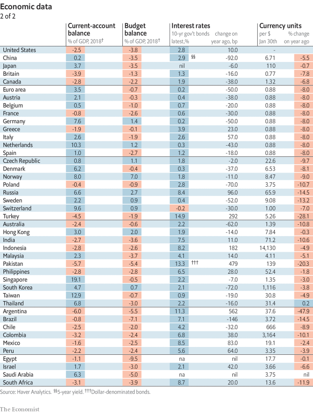
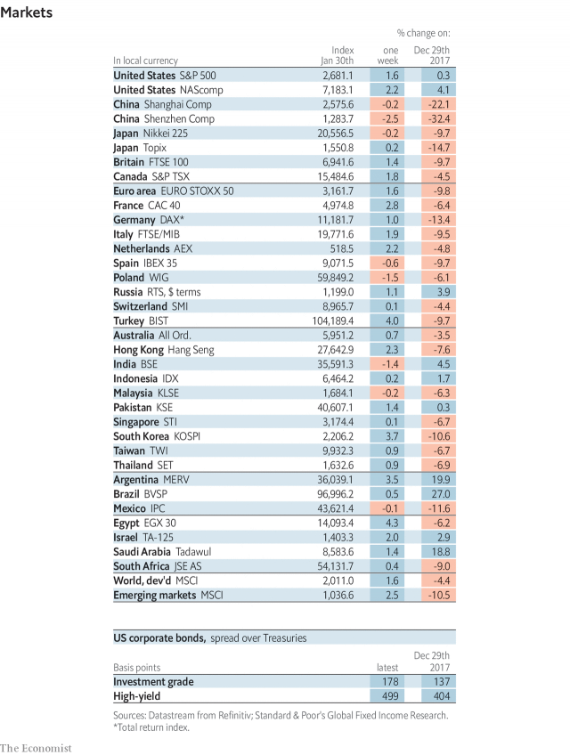

###### The anointing of Juan Guaidó

# Economic data, commodities and markets 

> Feb 2nd 2019 

 

 

 

 

-- 

 单词注释:

1.anoint[ә'nɒint]:vt. 涂油, 施以涂油礼 [医] 涂油膏 

2.juan[hwɑ:n]:n. 胡安（男子名） 

3.datum['deitәm]:n. 论据, 材料, 资料, 已知数 [医] 材料, 资料, 论据 

4.commodity[kә'mɒditi]:n. 农产品, 商品, 有用的物品 [经] 商品, 货物, 日用品 

5.feb[]:abbr. 二月（February） 

