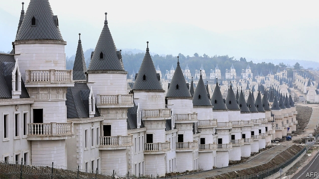

###### Turkey’s oddest ghost town

# Castles full of air 

##### The latest casualty of Erdogan’s economy 

 

> Jan 31st 2019 

HUNDREDS OF identical mini French chateaux stand empty in various states of completion at the Burj al Babas housing development in northern Turkey after its developer, the Sarot Group, filed for bankruptcy last year. If it is ever completed, the development will boast more than 700 identical chateaux as well as shops, restaurants and meeting halls. 

-- 

 单词注释:

1.oddest[]:奇怪的 古怪的（ odd的最高级 ） 

2.casualty['kæʒjuәlti]:n. 意外事故, 伤亡, 受害者 [化] 事故 

3.Jan[dʒæn]:n. 一月 

4.mini['mini]:n. 同类中的极小者, 微型汽车, 超短裙 a. 微型的 

5.chateau[ʃæ'tәu]:n. 城堡 

6.completion[kәm'pli:ʃәn]:n. 完成 [经] 完井, 结束, 完工 

7.burj['bʊrʒ]: [地名] [巴基斯坦] 布尔季 

8.AL[]:[计] 算法语言, 字母, 汇编语言 [医] 铝(13号元素) 

9.baba['bɑ:bә]:n. 兰姆糕 

10.developer[di'velәpә]:n. 开发者 [计] 显影器 

11.Sarot[]:[网络] 晒机 

12.bankruptcy['bæŋkrәptsi]:n. 破产者 [经] 破产, 倒闭 

