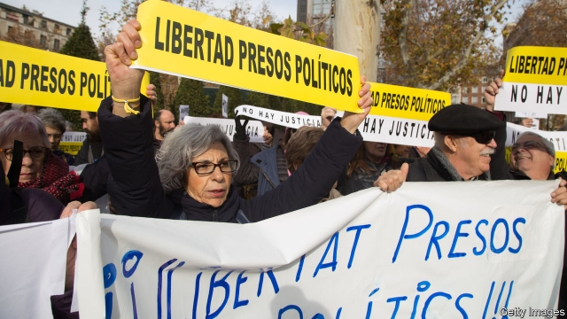

###### Justice in the dock

# Catalonia’s separatist leaders go on trial 

##### Proceedings will last for months 

 

> Jan 31st 2019 

 

FOR UP TO 15 months nine Catalan separatist leaders have been in jail. On February 4th they and three others are due to start what will be the first of many days in the Supreme Court as the oral phase of their trial on charges of rebellion and misuse of public funds gets under way. The charges, which could potentially result in sentences of up to 25 years in jail, arise from an unconstitutional referendum and illegal declaration of independence in one of Spain’s largest and richest regions in October 2017. For supporters of Catalan independence, it is a political trial. For many Spaniards it is retribution for a conspiracy to break up their country. It is also a test of the impartiality of the country’s judiciary. 

The investigating judge, Pablo Llarena, contends that the defendants, most of whom were members of Catalonia’s regional government, pursued for several years a plan to achieve independence “whatever the cost”. He points to “violent episodes” in the final weeks of the campaign, especially a demonstration in which police and court officials searching a Catalan government office in Barcelona were barred from leaving for hours, while their vehicles were trashed. 

In the aftermath of the referendum, which Spanish police tried but failed to prevent, Spain’s government imposed direct rule in Catalonia. It called a fresh regional election in which the separatists again won a narrow majority of seats, though with only 47.5% of the vote. 

The referendum certainly took place in an atmosphere of intimidation. In approving laws to authorise the referendum and set up a new state, Catalonia’s parliament violated Spain’s constitution and its own statute of home rule. Quim Torra, the current Catalan president, recently urged Catalans to pursue “the Slovenian way” to independence, which involved a ten-day conflict and some 80 deaths. Yet many lawyers question whether all this amounts to sufficient violence to justify the charge of rebellion, designed for military coups. 

It is an “unfair, irregular trial” in which the defendants’ rights have been violated, says Alfred Bosch, a member of the current Catalan government. He notes that courts in Germany, Scotland and Belgium granted bail to other defendants, including Carles Puigdemont, the former regional president, who fled abroad, before Mr Llarena dropped extradition proceedings. The Socialist government of Pedro Sánchez, which took office in June, is uncomfortable with the pre-trial detention of the defendants. But it insists that this is a judicial matter in which it cannot interfere. 

The Catalan independence bid has unleashed a conservative reaction in the rest of Spain. In a regional election in Andalucia in December, Vox, a previously insignificant far-right party, won 11% of the vote. Vox is using a quirk in Spain’s legal system to join the state’s case against the separatists as a private party, which will allow it to cross-examine the defendants. This is a propaganda gift for the separatists, who claim, unfairly, that Spain’s judiciary is a holdover from Franco’s dictatorship. 

Mr Sánchez hopes to defuse the Catalan conflict. He wants the separatist parties to vote for his budget, which includes a dollop of extra money for Catalonia. Some may do so: there are growing fissures within Catalan separatism, especially between Mr Puigdemont and Oriol Junqueras, his former deputy, who is the leading defendant but who does not back a further unilateral independence bid. 

The trial will keep the divisive Catalan issue alive during European and regional elections in May. A verdict may not come until the autumn. If the defendants are found guilty, Spain’s politicians will have to decide whether to pardon them. That would be unpopular. But letting them moulder in jail will be seen abroad as a blot on Spain’s democracy. 

-- 

 单词注释:

1.separatist['sepәreitist]:n. 分离主义者, 独立派 

2.proceeding[prәu'si:diŋ]:n. 进行, 程序, 行动, 诉讼程序, 事项 [化] 会议论文集 

3.Jan[dʒæn]:n. 一月 

4.Catalan['kætәlәn]:n. 加泰隆人, 加泰隆语 

5.misuse[.mis'ju:z]:n. 误用, 滥用 vt. 误用, 滥用, 虐待 

6.potentially[pә'tenʃәli]:adv. 可能地, 潜在地 

7.unconstitutional['ʌnkɔnsti'tju:ʃәnәl]:a. 违反宪法的, 不符合宪法的 [法] 违反宪法的, 违宪的, 不合宪法规定的 

8.referendum[.refә'rendәm]:n. （就重大政治或社会问题进行的）全民公决，全民投票 

9.declaration[.deklә'reiʃәn]:n. 宣告, 说明, 宣布 [计] 说明 

10.supporter[sә'pɒ:tә]:n. 支持者, 后盾, 迫随者, 护身织物 [法] 支持者, 赡养者, 抚养者 

11.Spaniard['spænjәd]:n. 西班牙人 

12.retribution[.retri'bju:ʃәn]:n. 报应, 惩罚, 报酬 [法] 惩罚, 报应, 报答 

13.conspiracy[kәn'spirәsi]:n. 同谋, 阴谋, 阴谋集团 [法] 阴谋, 通谋, 共谋 

14.impartiality['im.pɑ:ʃi'æliti]:n. 公平, 无私, 不偏 [法] 公正无私, 公平, 公正 

15.judiciary[dʒu:'diʃiәri]:a. 司法的, 法院的, 法官的 n. 司法部, 司法系统, 法官 

16.Pablo['pæblәu]:n. 巴勃罗（西班牙籍体育明星）；帕布洛（英国水槽产品品牌）；帕布鲁（西班牙著名画家毕加索的姓） 

17.contend[kәn'tend]:vi. 奋斗, 斗争, 竞争 vt. 为...斗争 

18.defendant[di'fendәnt]:n. 被告 [经] 被告方 

19.regional['ri:dʒәnәl]:a. 地方的, 地域性的 [医] 区的, 部位的 

20.demonstration[.demәn'streiʃәn]:n. 示范, 实证 [医] 示教, 实物教授 

21.Barcelona[.bɑ:si'lәunә]:n. 巴塞罗那 

22.trash[træʃ]:n. 垃圾, 废物 vt. 丢弃 

23.aftermath['ɑ:ftәmæθ]:n. 结果, 后果 [法] 后果, 结果 

24.catalonia[,kætә'lәjniә]:n. 加泰罗尼亚（西班牙东北地方） 

25.intimidation[in,timi'deiʃәn]:n. 恐吓, 威胁 [法] 恐吓, 威胁 

26.authorise['ɔ:θәraiz]:vt. 授权；批准；允许；委任（等于authorize） 

27.quim[kwim]:n. <英><忌>女性生殖器 

28.Catalan['kætәlәn]:n. 加泰隆人, 加泰隆语 

29.Slovenian[slәu'vi:njәn]:n. 斯洛文尼亚人[语] a. 斯洛文尼亚人[语]的 

30.coup['ku:]:n. 砰然的一击, 妙计, 出乎意料的行动, 政变 [医] 发作, 中, 击 

31.alfred['ælfrid]:n. 阿尔佛雷德（男子名） 

32.bosch[bɔ:ʃ]:n. 博世（德国公司名） 

33.bail[beil]:n. 保释, 拎环, 杓, 栅栏 vt. 保释, 舀水 

34.carles[]: [人名] 卡莱斯 

35.extradition[.ekstrә'diʃәn]:n. 引渡逃犯, 亡命者送还本国 [法] 引渡 

36.pedro['pi:drәu]:n. 彼得牌戏（一种纸牌戏） 

37.detention[di'tenʃәn]:n. 阻止, 监禁, 拘留 [医] 隔离, 拘留, 滞留, 停滞 

38.judicial[dʒu:'diʃәl]:a. 法庭的, 公正的, 审判上的, 司法的 [法] 司法的, 审判上的, 法官的 

39.cannot['kænɒt]:aux. 无法, 不能 

40.unleash[.ʌn'li:ʃ]:vt. 解开...的皮带, 发出, 发动 

41.Spain[spein]:n. 西班牙 

42.Andalucia[]:n. (Andalucia)人名；(西)安达卢西亚 

43.vox[vɔks]:[医] 语音, 语声 

44.quirk[kwә:k]:n. 古怪举动, 俏皮话, 急转 

45.propaganda[.prɒpә'gændә]:n. 宣传, 宣传活动 [医] 宣传 

46.unfairly[]:adv. 不正当地；不公平地 

47.holdover['hәuldәuvә]:n. 延期, 剩余物, 任期届满后仍占据同样地位的人 [经] 缓缴税款 

48.dictatorship[dik'teitәʃip]:n. 独裁者之职位, 独裁, 独裁政权 [法] 专攻, 独裁权 

49.defuse[.di:'fju:z]:vt. 去掉...的引信, 平息 

50.dollop['dɒlәp]:n. 块, 团 

51.fissure['fiʃә]:n. 裂缝, 裂沟 v. (使)裂开, (使)分裂 

52.separatism['sepәrәtizm]:n. 分离主义 

53.oriol[]:n. (Oriol)人名；(法、西)奥里奥尔 

54.unilateral[.ju:ni'lætәrәl]:a. 单方面的, 单边的, 片面的 [医] 单侧的, 一侧的 

55.divisive[di'vaisiv]:a. 区分的, 制造分裂的, 造成不和的 

56.verdict['vә:dikt]:n. 裁决, 判决, 判断性意见, 定论, 结论 [法] 定论, 判断, 意见 

57.unpopular['ʌn'pɔpjulә]:a. 不得人心的, 不受欢迎的, 不流行的 

58.moulder['mәuldә]:n. 制模工 vi. 腐朽, 衰退 vt. 使腐朽, 使衰退 

59.blot[blɒt]:n. 污点, 墨水渍 vt. 乱涂, 使模糊, 吸干 vi. 弄上墨渍, 吸墨水 

