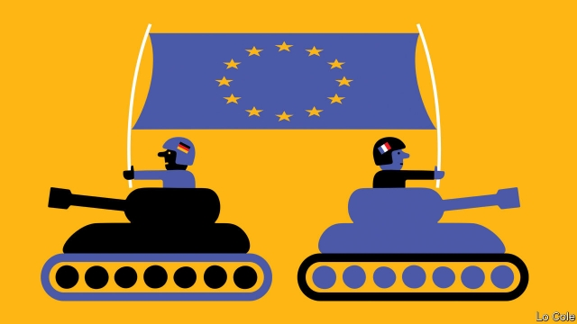

###### The paper Euro-army

# France and Germany are pushing rival models for defence co-operation 

##### Neither is very ambitious 

 

> Jan 31st 2019 

 

ALPHABET SOUP was not on the menu when EU defence ministers met in Bucharest on January 30th. But it was on the agenda. As Europeans scramble to reduce their military dependence on America, they are making acronyms great again. Embryonic schemes include PESCO (Permanent Structured Co-operation), EDF (a European Defence Fund) and E2I (a European Intervention Initiative). Alas, Europeans still seem better at producing bureaucracy than battalions. 

Ambition is not lacking. Last year Emmanuel Macron and Angela Merkel caused a ruckus when they endorsed a “European army”, to the horror of British Eurosceptics and American Atlanticists. On January 10th Ursula von der Leyen, the German defence minister, went one better. “Europe’s army”, she declared, “is already taking shape.” On January 22nd the Aachen treaty between France and Germany promised to develop the “efficiency, coherence and credibility of Europe in the military field”. 

Nor is money the problem. European members of NATO have added more than $50bn to their collective annual expenditure since 2015, the year after Russia invaded Ukraine. That is equivalent to tacking on a military power the size of Britain or France. Donald Trump ought to take note. 

What Europeans cannot agree on is precisely how these swelling capabilities should be joined up and used. Duelling visions of Europe’s military future have given rise to a proliferation of schemes. Seasoned diplomats with decades of experience in European defence policy admit that even they are occasionally baffled. 

Start with PESCO, a collection of 34 EU defence projects launched with great fanfare in December 2017. Its members agreed “to do things together, spend together, invest together, buy together, act together”, as Federica Mogherini, the EU’s foreign-policy chief, put it. The plan would be lubricated with cash from the European Commission. But where Germany saw PESCO as an opportunity to put wind back into the sails of the European project, France was irked that inclusivity had trumped ambition. 

And so, even as PESCO was being finalised, in a two-hour address at the Sorbonne in September 2017, Mr Macron demanded something meatier: a “common intervention force, a common defence budget and a common doctrine for action”. Nine states signed up to the resulting E2I in June 2018. Notably, it stood independent of the EU and so welcomed Denmark, which opts out of the EU’s common security and defence policy, and Britain, leaving completely. 

Germany, quietly seething, saw the effort as a half-baked French attempt to drag others into its African wars while diluting the EU’s role. It signed up anyway, wary of upsetting a wobbly Franco-German axis any further. “Germans couldn’t say no,” says Claudia Major of the German Institute for International and Security Affairs, “but they hated it.” Italy, the EU’s third military power, was less emollient. Its newly elected populist government simply refused to join at all. 

In truth, both schemes have been misunderstood. PESCO is not a standing army or alliance. It is a way to reduce duplication, join up national defence industries and set standards for everything from battlefield medicine to military radios. Nor is E2I a roving strike force, as its grandiose name suggests, but a framework for Europe’s ambitious armed forces (its members account for four-fifths of EU military spending) to act together in future crises. Its members discuss scenarios from the Caribbean to the Baltic, rather than just France’s African stomping grounds. 

In theory, PESCO and E2I can not only support one another but also plug into NATO. In practice, things may be more complicated. Ms Major warns that smaller states, like the Baltics, will be spread thin. She suggests that some may favour France’s glitzier initiative out of the Elysée Palace over its dowdier EU cousin. 

The bigger problem is the gap between the lofty rhetoric of political leaders and the essential modesty of these defence drives. The EU has always accepted that it should focus on crisis management (fighting the likes of pirates and traffickers) rather than collective defence (fighting Russians). For all the big talk, that remains so. 

Not that Europeans are sitting on their guns. European forces are involved in everything from anti-piracy patrols off Somalia to training for soldiers in the Central African Republic. The EU’s mission in Mali involves over 620 people from 22 countries; it has trained nearly 12,000 Malian troops. That is impressive. But there is a disconnect between political rhetoric, which hints at fears of American abandonment, actual policy, which makes no pretence of filling such a vacuum, and practical action, which is even further behind. 

A recent study by Britain’s IISS and Germany’s DGAP think-tanks found that the EU would struggle to meet most of the ambitions implied by its own common security and defence policy, itself a modest document. It would be out of its depth altogether if it faced simultaneous crises or if Britain, which makes up a quarter of the bloc’s defence spending, stayed away. Bigger fights, such as the air campaign against Libya in 2011, are out of the question. 

Furthermore, although some PESCO projects are innovative and important, like anti-mine drones and plans to share overseas bases, others are more dubious. A proposed spy school will be run by Greece and Cyprus; both have extensive ties to Russia. 

Instead of working through clunky institutions, many Europeans are simply cutting smaller deals. Last year Britain bolstered bilateral defence ties to France, Poland, Germany and Norway. To the north, Sweden, Finland and Norway are integrating their air and naval forces. In the south, Estonia has chipped into France’s war in Mali. A genuine European army seems a long way off. 

-- 

 单词注释:

1.ambitious[æm'biʃәs]:a. 有野心的, 抱负不凡的, 雄心勃勃的 

2.Jan[dʒæn]:n. 一月 

3.EU[]:[化] 富集铀; 浓缩铀 [医] 铕(63号元素) 

4.Bucharest['bju:kә'rest]:n. 布加勒斯特(罗马尼亚首都) 

5.scramble['skræmbl]:n. 攀缘, 爬行, 抢夺, 混乱, 紧急起飞 vi. 攀缘, 杂乱蔓延, 争夺, 拼凑, 匆忙 vt. 攀登, 扰乱, 使混杂 

6.dependence[di'pendәns]:n. 依赖, 依存, 信赖 [医] 依赖(如对药物的依赖,即瘾或癖), 从属, 偏利共生 

7.acronym['ækrәunim]:n. 首字母缩拼词, 首字母组合词 [计] 字首组合词 

8.embryonic[.embri'ɒnik]:a. 萌芽的, 初期的, 未成熟 [医] 胚胎的 

9.edf[]:abbr. Economic Development Foundation <菲>经济开发基金会 

10.intervention[.intә'venʃәn]:n. 插入, 介入, 调停 [经] 干预 

11.ala['eilә]:n. 翼, 翅 [化] 丙氨酸 

12.bureaucracy[bjuә'rɒkrәsi]:n. 官僚, 官吏 [法] 官僚主义, 官僚政治, 官僚机构 

13.battalion[bә'tæljәn]:n. 营, 军队, 集团 

14.emmanuel[i'mænjuәl]:n. 以马内利（耶稣基督的别称）；伊曼纽尔（男子名, 等于Immanuel） 

15.macron['mækrәn]:n. 长音符号 

16.angela['ændʒilә]:n. 安吉拉（女子名） 

17.merkel[]: [人名] 默克尔; [地名] [美国] 默克尔 

18.ruckus['rʌkәs]:n. 喧闹, 骚动 

19.endorse[in'dɒ:s]:vt. 支持, 赞同, 背书于, 签署 [经] 赞成, 背书 

20.eurosceptic[ˌjʊərəʊ'skeptɪk]:n. 欧洲统一怀疑论者；反对英国亲近欧盟的人 

21.Atlanticist[-sist]:大西洋主义者 

22.ursula['ә:sjulә]:n. 厄休拉（女子名） 

23.Von[vɔn;fɔn;fәn]:[计] 冯·诺伊曼 

24.der[]:abbr. 区分编码规则（Distinguished Encoding Rules） 

25.leyen[]:[网络] 部女部长莱恩 

26.Aachen['ɑ:kәn]:亚琛[德意志联邦共和国西部城市] 

27.coherence[kәu'hiәrәns]:n. 黏合(性), 连贯性, 一致性 [化] 相干性 

28.credibility[.kredi'biliti]:n. 可信用, 确实性, 可靠 [法] 证据能力, 可信程度, 确实性 

29.NATO['neitәj]:北大西洋公约组织, 北约组织 [经] 北大西洋公约组织 

30.ukraine[ju(:)'krein]:n. 乌克兰（原苏联一加盟共和国, 现已独立） 

31.tack[tæk]:n. 平头钉, 大头钉, 粗缝针脚, 行动方针, 食物 vt. 以大头针钉住, 附加 

32.donald['dɔnәld]:n. 唐纳德（男子名） 

33.trump[trʌmp]:n. 王牌, 法宝, 喇叭 vt. 打出王牌赢, 胜过 vi. 出王牌, 吹喇叭 

34.cannot['kænɒt]:aux. 无法, 不能 

35.precisely[pri'saisli]:adv. 精确地, 明确地, 刻板地, 拘泥地, 正好, 恰恰, 对, 正是如此, 确实如此, 不错 

36.capability[.keipә'biliti]:n. 能力, 性能, 约束力 [化] 能力 

37.duell[]: [人名] 迪尤尔 

38.proliferation[.prәulifә'reiʃәn]:n. 增殖, 激增 [医] 增生, 增殖 

39.diplomat['diplәmæt]:n. 外交官, 有外交手腕的人 [法] 外交家, 外交官, 有权谋的人 

40.baffle['bæfl]:vt. 困惑, 为难, 使挫折 vi. 徒作挣扎 n. 迷惑, 挡板 

41.fanfare['fænfєә]:n. 喇叭边(或号角)嘹亮吹奏声, 吹牛 

42.federica[]:n. (Federica)人名；(西)费德丽卡(女名), 费德里卡；(意)费代里卡, 费代丽卡(女名) 

43.Mogherini[]:莫盖里尼 

44.irk[ә:k]:vt. 使厌倦, 使苦恼 

45.inclusivity[]:n. 包容性 

46.trump[trʌmp]:n. 王牌, 法宝, 喇叭 vt. 打出王牌赢, 胜过 vi. 出王牌, 吹喇叭 

47.finalise[]:vt. 把(计划)最后定下来, 定稿 [经] 使...结束 

48.Sorbonne[sɔ:'bɔn]:n. 索邦神学院(巴黎大学的前身),巴黎大学 

49.intervention[.intә'venʃәn]:n. 插入, 介入, 调停 [经] 干预 

50.doctrine['dɒktrin]:n. 教条, 学说 [医] 学说 

51.notably['nәjtbәli]:adv. 显著地, 著名地, 尤其, 特别 

52.Denmark['denmɑ:k]:n. 丹麦 

53.opt[ɒpt]:vi. 选择 

54.quietly['kwaiәtli]:adv. 安静地, 沉着地, 秘密地 

55.sethe[]:n. (Sethe)人名；(德)泽特 

56.dilute[dai'lju:t]:vt. 冲淡, 稀释 a. 淡的, 稀释的 

57.wary['wєәri]:a. 谨慎的, 小心的, 机警的, 周到的, 唯恐的 

58.wobbly['wɒbli]:a. 摆动的, 不稳定的 

59.claudia['klɔ:djә]:n. 克劳迪娅（女子名） 

60.les[lei]:abbr. 发射脱离系统（Launch Escape System） 

61.emollient[i'mɒliәnt]:a. 使柔软的 n. 软化剂, 润肤剂 

62.Populist['pɔpjulist]:n. 民粹派的成员 

63.alliance[ә'laiәns]:n. 联盟, 联合 [法] 同盟, 联盟, 联姻 

64.duplication[.dju:pli'keiʃәn]:n. 副本, 复制 [医] 重迭, 双折, 复制 

65.battlefield['bætlfi:ld]:n. 战场, 沙场 

66.roving['rәuviŋ]:a. 徘徊的, 流动的 n. 流浪, 漫游, 粗纱 

67.grandiose['grændiәus]:a. 宏伟的, 壮丽的, 夸张的 [医] 夸大的 

68.scenario[si'nɑ:riәu]:n. 剧本提纲, 情节, 剧本, 方案, 事态 [计] 方案 

69.Caribbean[.kæri'bi:әn]:n. 加勒比海 a. 加勒比海的, 加勒比人的 

70.Baltic['bɒ:ltik]:a. 波罗的海的 

71.stomp[stɒmp]:n. 跺脚 vt. 跺, 践踏 vi. 跺脚, 践踏 

72.Baltic['bɒ:ltik]:a. 波罗的海的 

73.glitzy['^litsi]:a. <美><加> 闪光的, 耀眼的, 眩目的 

74.dowdy['daudi]:a. 过时的, 懒散的 n. 懒散女人, 邋遢女人 

75.lofty['lɒfti]:a. 高的, 傲慢的, 崇高的, 高级的, 玄虚的 

76.rhetoric['retәrik]:n. 修辞, 修辞学, 雄辩(术) 

77.modesty['mɒdisti]:n. 谦逊, 质朴, 羞怯 

78.alway['ɔ:lwei]:adv. 永远；总是（等于always） 

79.pirate['paiәrәt]:n. 海盗, 盗印者, 侵犯专利权者 vt. 盗印, 掠夺, 翻印 vi. 做海盗, 从事劫掠 

80.trafficker['træfikә]:n. 商人, 贩子 [法] 贩卖者, 买卖者, 商人 

81.patrol[pә'trәul]:n. 巡逻, 巡逻员, 侦察队 v. 巡逻, 巡视 

82.Somalia[sәu'mɑ:liә]:n. 索马里 

83.Mali['mɑ:li]:n. 马里 

84.Malian['mɑ:liən]:n. 马里人 a. 马里的；马里人的 

85.disconnect[.diskә'nekt]:vt. 使分离, 使不相连, 拆开 vi. 断开 [计] 断开 

86.abandonment[ә'bændәmәnt]:n. 放弃, 抛弃, 放纵 [经] 委付, 废弃, 放弃(采矿权) 

87.pretence[pri'tens]:n. 假装, 虚伪, 借口, 自称, 要求 [法] 假装, 借口, 托词 

88.iiss[]:abbr. International Institute for Strategic Studies 国际战略问题研究所 

89.simultaneous[.simәl'teinjәs]:a. 同时的, 同时发生的 [计] 同时的 

90.Libya['libiә]:n. 利比亚 

91.innovative['inәjveitiv]:a. 革新的, 创新的, 富有革新精神的 

92.drone[drәun]:n. 雄蜂, 懒惰者, 嗡嗡的声音, 无人驾驶飞机(或船) vi. 嗡嗡作声, 混日子 vt. 低沉地说 

93.oversea['әuvә'si:]:adv. 海外, 向国外, 向海外, 国外 a. 外国的, 在国外的, 在海外的, 舶来的 

94.dubious['dju:biәs]:a. 可疑的, 不确定的 

95.Cyprus['saiprәs]:n. 塞浦路斯 [经] 赛浦路斯 

96.clunky[ˈklʌŋki]:a. 粗笨的；笨重的 

97.bolster['bәulstә]:n. 支持, 长枕 vt. 支持, 支撑 

98.bilateral[bai'lætәrәl]:a. 有两边的, 双边的, 双方的 [医] 两侧的 

99.Poland['pәulәnd]:n. 波兰 

100.Norway['nɒ:wei]:n. 挪威 

101.Sweden['swi:dn]:n. 瑞典 

102.Finland['finlәnd]:n. 芬兰 

103.Estonia[es'tәuniә]:n. 爱沙尼亚 

104.chip[tʃip]:n. 屑片, 薄片, 碎片 vt. 削, 切, 削成碎片, 使摔倒, 凿 vi. 削下屑片 [计] 孔屑; 组件; 晶片; 芯片 

