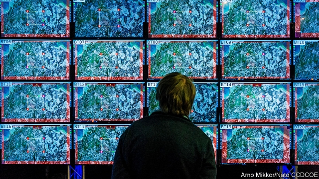

###### Disputing Putin

# How the Baltic states resist Russia 

##### After decades of being force-fed lies from Moscow, they are all but immune 

 

> Jan 31st 2019 

 

IN THE early 1990s the president of newly independent Estonia gave a speech in Hamburg. In it, he disparaged the Soviet occupation of the Baltic states. A little-known Russian official was so outraged that he stormed out. It was Vladimir Putin. 

This story, recounted in Neil Taylor’s new history of Estonia, is instructive. Mr Putin has called the break-up of the Soviet Union the “greatest geopolitical catastrophe of the [20th] century”. To Estonians, Latvians and Lithuanians, that label applies better to the Soviet Union itself. Discussions of history often start with the phrase “Stalin murdered my grandparents.” The sense that their giant neighbour does not truly respect their independence—let alone their membership of the EU and NATO since 2004—pervades Baltic politics to this day. 

Given how tiny the Baltic states are, and how vast and threatening the Russian military exercises near their borders, you might expect them to be gloomy. Especially when the president of their main ally, America, seems to view alliances as encumbrances. Yet the mood is oddly upbeat. 

Despite Donald Trump’s doubts, the NATO mission in the Baltics is effective. A multinational NATO battalion in each country is small enough not to provoke Russia but big enough to deter it. “It’s brilliant,” says a Latvian spook. Some 19 out of 29 NATO members have people on the ground. If Mr Putin were to invade, he would have to kill citizens from most of them, making a NATO response inevitable. That is probably too big a risk even for him. 

Despite Mr Trump’s isolationist rhetoric, military co-operation with America has improved during his presidency, thanks to a bigger Pentagon budget and the ardent support of lawmakers who visit the Baltics, says a Lithuanian official. The Americans help with intelligence and live-firing ranges for tanks. All the Baltics would like to see more American troops on their soil. Noting that Poland has offered to host a big American base and call it “Fort Trump”, the Lithuanian official wryly suggests that the Balts should offer to host forward operating bases and name them after Melania, Ivanka and Donald junior. 

All three Baltic states spend around 2% of GDP on defence—the NATO target that Mr Trump often berates allies for not meeting. Since Russia grabbed Crimea, Lithuania has brought back conscription (Estonia has it, too). Training includes guerrilla tactics. 

Russia continually tests NATO’s defences. Sometimes it does this by buzzing warplanes briefly into Estonian airspace to see how quickly the defenders respond. More often it does it digitally, with a veneer of deniability. Attacks are routed via compromised computers that can be anywhere. Lights on a big screen at the Estonian Information System Authority, a government body, show them pinging in from all around the world. Lithuania suffered 50,000 hacks in 2017. “It’s constant,” says an official. 

Yet since a massive cyber-attack on Estonia in 2007, cyber-defences have stiffened. Twelve years ago hackers temporarily crippled banks, media outlets and government offices after Estonia had the temerity to move a much-hated statue of a Red Army soldier to a less prominent site in Tallinn, the capital. Since then, all three states have poured resources into thwarting digital skulduggery. Estonia hosts a NATO cyber-security centre. Separately, the state recruits tech-savvy reservists to spot vulnerabilities. Baltic governments are confident that the Russians have not hacked their voting systems, but they remain vigilant. Estonia holds a parliamentary election in March; Lithuania, a presidential one in May. All three countries will take part in EU elections this spring; all are wary of Muscovite meddling. 

An even bigger worry is information war. Russian trolls and fake newsmongers are determined to undermine NATO, the EU and Baltic democracy. They exaggerate problems, such as discrimination against Russian-speakers. They invent outrages, such as the rape by German NATO soldiers of a non-existent Lithuanian orphan. They stir up disputes, for example over immigration. Lithuania’s president, Dalia Grybauskaite, recently warned that “militant illiteracy and aggressive populism” posed a threat to her country. 

One problem is that Russian minorities in the Baltics tend to watch Russian television, which bubbles with propaganda. But ethnic natives do not, and after decades of hearing lies from Moscow, “we’re vaccinated,” says Eeva Eek-Pajuste of the International Centre for Defence and Security, a think-tank in Tallinn. Most disbelieve anything that sounds Putinny. Visitors to Narva, where a river separates Estonia from Russia, can see visual evidence of the dif-ference in political culture. The EU donated a big dollop of money for a walkway on both sides. The one on the Russian side is only a fraction as long. 

-- 

 单词注释:

1.putin['putin]:n. 普京（人名） 

2.Baltic['bɒ:ltik]:a. 波罗的海的 

3.immune[i'mju:n]:a. 免疫的, 免除的, 不受影响的 n. 免疫者 

4.Jan[dʒæn]:n. 一月 

5.Estonia[es'tәuniә]:n. 爱沙尼亚 

6.hamburg['hæmbә:^]:n. 汉堡（德国城市） 

7.disparage[dis'pæridʒ]:vt. 蔑视, 贬损 [法] 轻视, 贬低, 诽谤 

8.outrage['autreidʒ]:n. 暴行, 侮辱, 愤怒 vt. 凌辱, 虐待, 触犯 

9.Vladimir[vlɑ'dimɪr]:n. 弗拉基米尔（古罗斯弗拉基米尔-苏兹达里公国的古都） 

10.recount[ri'kaunt]:vt. 详述, 叙述, 重新计算 n. 重新计算 

11.neil[]:n. 尼尔（男子名） 

12.instructive[in'strʌktiv]:a. 有益的, 增进知识的 

13.geopolitical[,dʒi(:)әupә'litikәl]:[计] 地理的 

14.Estonian[es'tәuniәn]:a. 爱沙尼亚的 n. 爱沙尼亚人, 爱沙尼亚语 

15.Latvian['lætviәn]:a. 拉脱维亚的 n. 拉脱维亚人, 拉脱维亚语 

16.Lithuanian[.liθju:'einiәn]:n. 立陶宛人 a. 立陶宛的, 立陶宛人的, 立陶宛语的 

17.stalin['stɑ:lin]:n. 斯大林（前苏联领导人） 

18.membership['membәʃip]:n. 会员的资格, 全体会员, 会员数目 [法] 会员资格, 成员资格, 会籍 

19.EU[]:[化] 富集铀; 浓缩铀 [医] 铕(63号元素) 

20.NATO['neitәj]:北大西洋公约组织, 北约组织 [经] 北大西洋公约组织 

21.politic['pɒlitik]:a. 精明的, 明智的, 策略的 

22.ally['ælai. ә'lai]:n. 同盟者, 同盟国, 助手 vt. 使联盟, 使联合, 使有关系 vi. 结盟 

23.alliance[ә'laiәns]:n. 联盟, 联合 [法] 同盟, 联盟, 联姻 

24.encumbrance[in'kʌmbrәns]:n. 阻碍, 妨害物, 累赘 [法] 累赘, 负担, 财产留置权 

25.oddly['ɒdli]:adv. 奇怪地 

26.upbeat['ʌpbi:t]:n. 弱拍, 上升, 兴旺 a. 上升的, 乐观的 

27.donald['dɔnәld]:n. 唐纳德（男子名） 

28.Baltic['bɒ:ltik]:a. 波罗的海的 

29.multinational[.mʌlti'næʃәnl]:a. 多国的, 跨国公司的 n. 跨国公司 

30.battalion[bә'tæljәn]:n. 营, 军队, 集团 

31.provoke[prә'vәuk]:vt. 激怒, 惹起, 诱导 [法] 刺激, 煽动, 激怒 

32.deter[di'tә:]:vt. 制止, 吓住, 威慑 

33.Latvian['lætviәn]:a. 拉脱维亚的 n. 拉脱维亚人, 拉脱维亚语 

34.spook[spu:k]:n. 幽灵, 鬼 vt. 惊吓, 鬼怪般地出没 vi. 惊吓而逃窜, 受惊 

35.isolationist[.aisә'leiʃәnist]:n. 孤立主义者 

36.rhetoric['retәrik]:n. 修辞, 修辞学, 雄辩(术) 

37.presidency['prezidәnsi]:n. 总统职权, 总裁职位 

38.pentagon['pentәgәn]:n. 五角形, 五边形 [经] 五角平台 

39.ardent['ɑ:dnt]:a. 热心的, 激动的, 燃烧般的 [医] 灼热的; 热心的 

40.lawmaker[lɒ:'meikә]:n. 立法者 

41.Lithuanian[.liθju:'einiәn]:n. 立陶宛人 a. 立陶宛的, 立陶宛人的, 立陶宛语的 

42.Poland['pәulәnd]:n. 波兰 

43.fort[fɒ:t]:n. 堡垒, 要塞, 易货站 vt. 设要塞保卫 vi. 设要塞 

44.trump[trʌmp]:n. 王牌, 法宝, 喇叭 vt. 打出王牌赢, 胜过 vi. 出王牌, 吹喇叭 

45.wryly[raɪlɪ]:adv. （面部表情）做鬼脸地, 苦笑地, 嘲讽地 

46.balt[bɔ:lt]:n. 波罗的海地区居民 

47.Melania[]:[医] 川蜷螺属 

48.ivanka[]:[网络] 伊凡卡；伊万卡；伊凡佳 

49.GDP[]:[化] 鸟苷二磷酸 

50.berate[bi'reit]:vt. 严责 

51.grab[græb]:n. 抓握, 掠夺, 强占, 东方沿岸帆船 vi. 抓取, 抢去 vt. 攫取, 捕获, 霸占 

52.Crimea[krai'miә]:n. 克里米亚, 克里米亚半岛 

53.lithuania[,liθju(:)'einjә, -niә]:n. 立陶宛 

54.conscription[kәn'skripʃәn]:n. 征兵, 募兵, 征用(制度) [法] 征兵, 征用 

55.guerrilla[gә'rilә]:n. 游击队 

56.tactic['tæktik]:n. 一项战术, 一条策略 a. 战术的, 顺序的, 排列的 

57.continually[kәn'tinjuәli]:adv. 不断地, 频繁地 

58.buz['bʌz]:abbr. buzzer 蜂音器, 蜂鸣器 

59.warplane['wɒ:plein]:n. 军用飞机 

60.briefly['brifli]:adv. 简短地, 扼要地, 简明地, 简单地 

61.Estonian[es'tәuniәn]:a. 爱沙尼亚的 n. 爱沙尼亚人, 爱沙尼亚语 

62.quickly['kwikli]:adv. 很快地 

63.defender[di'fendә]:n. 防卫者, 防护者, 辩护者 [法] 辩护人, 保护人 

64.digitally[]:adv. 数位 

65.veneer[vә'niә]:n. 饰面薄板, 饰面, 外表 vt. 镶饰, 胶合, 虚饰 

66.deniability[di,naiə'biləti]:n. 推诿不知情的本领；否认本领 

67.rout[raut]:n. 溃败, 大败, 乌合之众, 盛大晚会 vt. 使溃败, 使败逃, 打垮, 用鼻拱, 挖起, 搜, 唤起 vi. 用鼻拱地, 搜 

68.ping[piŋ]:n. 砰(子弹击中时的声音), 报时的最后一声, 声脉冲 vi. 砰(铛)地发声 [计] internet网络包测程序, 连通性检测命令 

69.hack[hæk]:n. 劈, 砍, 砍痕, 出租车, 干咳, 晒架, 鹤嘴锄 vt. 劈, 砍, 出租, 用旧 vi. 劈, 砍, 干咳, 驾驶出租车 a. 出租的 

70.hacker['hækә]:[计] 计算机窃贼, 计算机新技术挑战者, 黑客 

71.temporarily['tempәrәrәli]:adv. 暂时, 一时, 临时 

72.temerity[ti'merәti]:n. 鲁莽, 蛮勇 

73.les[lei]:abbr. 发射脱离系统（Launch Escape System） 

74.Tallinn['tælin]:塔林[爱沙尼亚共和国首都] 

75.thwart[θwɒ:t]:a. 横放的 vt. 反对, 阻挠, 横过 prep. 横过 adv. 横过 

76.skulduggery[skʌl'dʌgәri]:n. 欺骗, 欺诈, 作假 

77.reservist[ri'zә:vist]:n. 后备军人 

78.vulnerability[.vʌlnәrә'biliti]:n. 易受伤, 易受责难, 易受伤部位 [医] 易损性 

79.vigilant['vidʒilәnt]:a. 警觉的, 警戒的, 警惕的 [法] 警醒的, 警戒的, 注意的 

80.parliamentary[.pɑ:lә'mentәri]:a. 国会的, 议会的, 议会制度的 

81.presidential[.prezi'denʃәl]:a. 总统制的, 总统的, 首长的, 统辖的 [法] 总统的, 议长的, 总经理的 

82.wary['wєәri]:a. 谨慎的, 小心的, 机警的, 周到的, 唯恐的 

83.Muscovite['mʌskәvait]:n. 莫斯科人 [化] 白云母 

84.meddle['medl]:vi. 干涉, 干预, 擅自摸弄 [法] 干预, 插手, 弄乱 

85.troll[trɒl]:vi. 滚动, 参加轮唱, 曳绳钓鱼 vt. 使转动, 轮唱, 高唱, 用曳绳钓(鱼) n. 转动, 轮唱, 钓绳 

86.fake[feik]:n. 假货, 欺骗, 诡计 a. 假的 vt. 假造, 仿造 vi. 伪装 

87.newsmonger['nju:z.mʌŋgә]:n. 爱传播新闻的人, 饶舌者 

88.undermine[.ʌndә'main]:vt. 在...下面挖, 渐渐破坏, 暗地里破坏 [法] 暗中破坏, 以阴谋中伤伤害 

89.rape[reip]:n. 抢夺, 掠夺, 强奸, 葡萄渣, 芸苔 vt. 掠夺, 抢夺, 强奸 

90.dalia[]:戴利亚（人名） 

91.militant['militәnt]:a. 好战的 

92.illiteracy[i'litәrәsi]:n. 文盲, 无知 

93.Populism['pɒpjulizm]:n. 平民主义, 民粹主义 

94.propaganda[.prɒpә'gændә]:n. 宣传, 宣传活动 [医] 宣传 

95.ethnic['eθnik]:a. 人种的, 种族的 [医] 人种的 

96.vaccinate['væksineit]:v. 预防接种 

97.eeva[]:n. (Eeva)人名；(芬)埃娃 

98.disbelieve[.disbi'li:v]:v. 不信, 怀疑 

99.narva[]: [人名] 纳瓦; [地名] [爱沙尼亚、俄罗斯] 纳尔瓦; [地名] [爱沙尼亚·俄罗斯] 纳尔瓦河 

100.donate['dәuneit]:v. 捐赠 

101.dollop['dɒlәp]:n. 块, 团 

102.walkway['wɒ:kwei]:n. 走道, 人行道 

