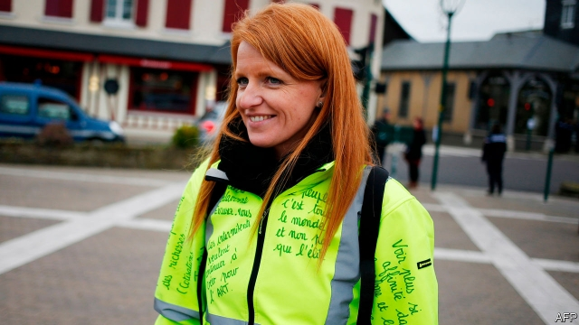

###### From protest to party

# The gilets jaunes are forming not one but two political parties 

##### Neither of which has coherent policies 

 

> Jan 31st 2019 

 

THREE MONTHS ago, Jacline Mouraud, a hypnotherapist from Brittany, opened her laptop, pressed record and offloaded her grievances. Her coup de gueule (angry rant) video against the rising fuel prices, posted on Facebook and YouTube, went viral. It also helped launch the gilets jaunes (yellow jackets) protest movement, which forced France’s president, Emmanuel Macron, into his first political climb-down when he cancelled a fuel-tax increase. This week, buoyed by the popularity of the movement, Ms Mouraud decided to shift her protest from the streets to the ballot box, and launched a gilets jaunes political party. Hers is the second such effort to transform a leaderless movement into an organised political force. 

Ms Mouraud’s version, called The Emerging, has its sights on French municipal elections in 2020. Its guiding principle, she said, is to “remake politics around the heart and empathy” rather than “the rule of money”. With a paradoxical nod to En Marche, the movement founded by Mr Macron to launch his presidential election bid in 2017, her party, she says, will be “neither on the left, nor the right”. Among her ideas is a higher top income-tax rate and fewer perks for parliamentarians. After 11 weeks of demonstrations in cities across France, which have often ended in clashes with riot police, it was time, Ms Mouraud declared, to move from protest to proposal. 

This initiative came only days after another gilet jaune, Ingrid Levavasseur, launched her own party, the Citizen-Led Rally (RIC). A 31-year-old nursing assistant from Normandy, Ms Levavasseur, like her Breton counterpart, has become another familiar face on French television. She says her party will be ready to fight elections in May to the European Parliament, and has already named the first ten candidates on her party list. RIC also happens to be the French acronym for “citizen-led referendums”, which have become a popular demand from the gilets jaunes movement since it widened out from fuel-tax revolt. Ms Levavasseur is less clear about her policies, insisting that they will emerge from the grassroots. But she shares with Ms Mouraud a desire, as she puts it, to “put the human” back into politics. 

The transformation into a political force of a disparate protest movement, whose members are linked through social media and have widely diverging aims, is likely to be, as Ms Levavasseur conceded, “quite complicated”. Just days after she launched the party, her campaign director, Hayk Shahinyan, resigned, citing “doubts” about the venture (and concern about a gilet jaune who had his eye damaged in a clash with the police). He was followed by one of the candidates on her party list, who had received threats on social media. 

Hard-core activists, who seek the overthrow of Mr Macron and have no desire to end the weekly protests, have accused Ms Levavasseur of treason. After it emerged that she voted for Mr Macron in 2017, if only to keep out the nationalist Marine Le Pen, she was accused of being a stooge. “A vote for the gilets jaunes is a vote for Macron,” declared Eric Drouet, a lorry driver who runs the most popular gilets jaunes Facebook group, “Angry France”. 

For now, Ms Levavasseur says that her party’s role is one of co-ordinating different initiatives rather than a quest for a political monopoly on the movement. But even that will be tricky. Political sympathies among the gilets jaunes reach from far-left anarchists to the ultra-right. Ms Levavasseur’s fairly moderate left-leaning instincts are at odds with others’. In a TV debate with Ms Levavasseur, Benjamin Cauchy, a gilet jaune from Toulouse, said that he has been talking to politicians on the right about ways for the movement to “reclaim” an existing political party. 

Established political parties do not see it quite that way round. Jean-Luc Mélenchon, on the far left, as well as Ms Le Pen have been furiously courting the gilets jaunes. Protesters on the roundabouts, declared Ms Le Pen, are “often our voters”. That may be true. But many gilets jaunes see Mr Mélenchon and Ms Le Pen, with their seats in the National Assembly, as part of the system and therefore part of the problem. A recent poll suggested that, if there were a single gilet jaune list at the European elections, it would get 13%, denting both Ms Le Pen’s score (17.5%) and Mr Mélenchon’s (8%). With enfeebled Socialists (5%) and Republicans (11.5%), that leaves just one party that would widen its lead thanks to a gilets jaunes party: En Marche (22.5%), the party founded by Mr Macron, whom the movement so detests. 

-- 

 单词注释:

1.gilet[dʒi'lei]:n. 背心, 马甲 

2.jaune[]:[网络] 汝拉 

3.coherent[kәu'hiәrәnt]:a. 互相耦合的, 清晰的, 明了的，凝聚性的, 连贯的 

4.Jan[dʒæn]:n. 一月 

5.hypnotherapist[hɪpnəʊ'θerəpɪst]: [医]催眠治疗师 

6.brittany['britәni]:n. 布列塔尼（法国西北部一地区） 

7.laptop[]:[计] 膝上型的 

8.offload['ɔflәjd, ɔf'lәjd; (?@) 'ɔ:flәjd]:v. 卸下, 卸货 

9.grievance['gri:vәns]:n. 委屈, 冤情, 苦况 [经] 不满(对雇用条件的) 

10.coup['ku:]:n. 砰然的一击, 妙计, 出乎意料的行动, 政变 [医] 发作, 中, 击 

11.de[di:]:[化] 非对映体过量 [医] 铥(69号元素铥的别名,1916年Eder离得的假想元素) 

12.rant[rænt]:v. 咆哮, 痛骂 n. 咆哮, 大话 

13.facebook[]:n. 脸谱网 

14.youtube[]:n. 视频网站（可以让用户免费上传、观赏、分享视频短片的热门视频共享网站） 

15.viral['vairәl]:a. 病毒的, 病毒引起的 [医] 病毒的 

16.emmanuel[i'mænjuәl]:n. 以马内利（耶稣基督的别称）；伊曼纽尔（男子名, 等于Immanuel） 

17.macron['mækrәn]:n. 长音符号 

18.buoy[bɒi. 'bu:i]:n. 浮标, 航标, 救生圈 vt. 使浮起, 鼓励 

19.popularity[.pɒpju'læriti]:n. 名声, 受大众欢迎, 流行 

20.ballot['bælәt]:n. 投票, 投票用纸, 抽签 vi. 投票, 抽签 vt. 投票选出, 拉选票 

21.leaderless[]:a. 无领袖的, 无领导的 

22.municipal[mju:'nisipl]:a. 市政的, 自治区的, 内政的 [经] 市政的, 市的 

23.remake[ri'meik]:vt. 再作, 再制, 重作 n. 再制, 改作, 重制物 

24.politic['pɒlitik]:a. 精明的, 明智的, 策略的 

25.empathy['empæθik]:n. 移情作用, 共鸣 [医] 移情, 神入 

26.paradoxical[.pærә'dɒksikl]:a. 似非而是的, 矛盾的, 诡论的 [医] 奇异的, 矛盾的, 逆理的, 反常的 

27.en[en]:n. 字母N, (铅字)半方 prep. 在...中, 作为 

28.Marche[]:n. 马尔什（法国中部地区旧省）；马尔凯（位于意大利中部） 

29.presidential[.prezi'denʃәl]:a. 总统制的, 总统的, 首长的, 统辖的 [法] 总统的, 议长的, 总经理的 

30.perk[pә:k]:vi. 昂首, 振作, 举止高傲, 神气活现, 滤煮 vt. 竖起, 打扮, 使振作, 滤煮 n. 小费 

31.parliamentarian['pɑ:lәmen'teәriәn]:n. 议会法规专家, 国会议员, 熟悉议会法规而又有经验的议员 

32.demonstration[.demәn'streiʃәn]:n. 示范, 实证 [医] 示教, 实物教授 

33.clash[klæʃ]:n. 冲突, 撞击声, 抵触 vi. 冲突, 抵触 vt. 使发出撞击声 [计] 对撞 

34.riot['raiәt]:n. 暴动, 喧闹, 放纵 vi. 发动, 暴动, 纵情, 放荡 vt. 浪费, 挥霍 

35.Ingrid['iŋ^rid]:n 英格里德（女子名） 

36.rally['ræli]:n. 重振旗鼓, 集合, 群众集会, 跌停回升 v. 重整旗鼓, 集合, 恢复精神, 团结, 挖苦, 嘲笑 

37.ric[]:abbr. 英国皇家化学学会（Royal Institute of Chemistry） 

38.Normandy['nɒ:mәndi]:n. 诺曼底 

39.Breton['bretn]:a. 布列塔尼(半岛)的 n. 布列塔尼(半岛)人 

40.counterpart['kauntәpɑ:t]:n. 副本, 复本, 配对物, 相应物 [经] 副本, 正副二份中之一 

41.acronym['ækrәunim]:n. 首字母缩拼词, 首字母组合词 [计] 字首组合词 

42.referendum[.refә'rendәm]:n. （就重大政治或社会问题进行的）全民公决，全民投票 

43.les[lei]:abbr. 发射脱离系统（Launch Escape System） 

44.grassroot[]:n. 草根 

45.disparate['dispәrәt]:a. 根本不同的, 全异的, 不相干的 n. 无法相比的东西(或人) 

46.diverge[dai'vә:dʒ]:vi. 分歧, 岔开 vt. 使岔开 

47.concede[kәn'si:d]:vt. 承认, 退让 vi. 让步 

48.Hayk[]:[网络] 哈依克；古代英雄是海克；哈伊克 

49.cite[sait]:vt. 引用, 引证, 表彰 [建] 引证, 指引 

50.activist['æktivist]:n. 激进主义分子 

51.overthrow[.әuvә'θrәu]:n. 推翻, 瓦解, 倾覆 vt. 打倒, 推翻, 倾覆 

52.nationalist['næʃәnәlist]:n. 国家主义者, 民族主义者 

53.LE[]:[计] 小于或等于 

54.stooge[stu:dʒ]:n. 喜剧配角(或丑角), 下手, 助手 vi. 充当配角 

55.eric['erik]:abbr. 科教资源信息中心（Educational Resources Information Center）；电子遥控与独立控制（Electronic Remote and Independent Control） 

56.drouet[]:n. (Drouet)人名；(法)德鲁埃；(西)德罗埃特 

57.quest[kwest]:n. 探索, 寻求, 调查 v. 寻找, 找, 追寻猎物 

58.monopoly[mә'nɒpәli]:n. 垄断, 专卖权, 独占事业 [经] 垄断, 专利品, 垄断(权)独占 

59.tricky['triki]:a. 狡猾的, 机敏的 

60.anarchist['ænәkist]:n. 无政府主义者 [法] 无政府主义者 

61.odds[ɒdz]:n. 可能性, 几率, 机会, 胜算, 不平等 

62.benjamin['bendʒәmin]:[医] 安息香 

63.Cauchy[]:[计] 柯西 

64.toulouse[tu:'lu:z]:n. 图卢兹（法国南部城市） 

65.reclaim[ri'kleim]:vt. 开垦, 改造, 感化, 纠正, 回收 vi. 喊叫, 抗议 

66.furiously[]:adv. 狂暴地；猛烈地 

67.protester[]:n. 抗议者, 持异议者, 拒付者 [经] 反对者 

68.voter['vәutә]:n. 选民, 投票人 [法] 选民, 选举人, 投票人 

69.dent[dent]:n. 凹痕 vt. 使凹下, 削弱 vi. 塌陷 

70.enfeeble[in'fi:bl]:vt. 使衰弱 

71.detest[di'test]:vt. 厌恶, 憎恨 

