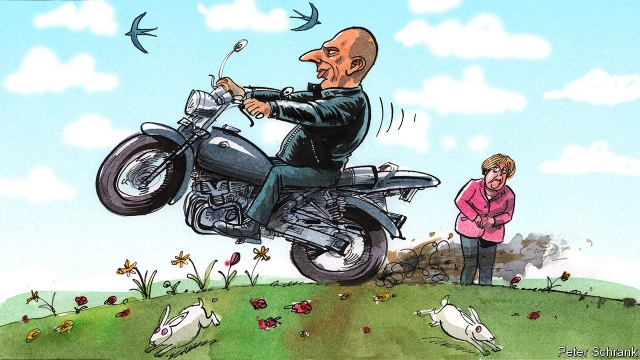

###### Charlemagne

# What Yanis Varoufakis did next 

##### A maverick leftist sallies into transnational European politics 

 

> Jan 31st 2019 

IN A WARM office in Berlin’s trendy Kreuzberg district, Charlemagne is trying to persuade Yanis Varoufakis that he is a politician. “It’s a necessity. I really dislike running and asking people for votes,” protests the Greek economist when asked about European Spring, his new transnational political party. Does he think of himself as a politician? “No. The moment I do, shoot me.” Apparently inadvertently, Mr Varoufakis won his seat in the Greek parliament in 2015, became finance minister, took on the European economic establishment and failed. After six months, he discarded the chains of office in pique. “If you want to be a manager, you can work for Goldman Sachs,” he sighs. 

Not a politician? That evening, in an old warehouse in Berlin’s east, Mr Varoufakis takes to the stage before a young, bookish, international audience at the launch of European Spring’s manifesto for May’s elections to the European Parliament. Perched on the edge of his seat, he seems every bit the vote-wrangler. His right hand clasps the microphone, the left one depicts trillions of euros: slicing and restructuring debts, swishing from side to side to illustrate giant German surpluses, fingers flickering to imitate the vicissitudes of lily-livered social democrats. 

It is easy to mock Mr Varoufakis. As Greek finance minister, he hectored Eurocrats for their desiccated economic orthodoxies—sometimes reasonably (he correctly pointed out that Greece will never repay all of its debts), sometimes outlandishly (covertly planning a parallel Greek payments system). He was ridiculed for a photo-shoot in Paris Match, a French celebrity magazine, which showed him dining stylishly on his roof-terrace beneath the Acropolis. To many critics, his career is one unending book tour: tomes excoriating the international economic establishment fly off the shelves every time he bashes elites in the media. 

Mr Varoufakis’s European ambitions do not exactly disprove the stereotype. He is running in the impending Greek parliamentary election and in the European Parliament elections—for Germany. This is provocative in a country where Mr Varoufakis has long been demonised. “If we wanted to reform the Roman empire we would start in Rome, not in southern Egypt,” he argues. At the rally in Berlin he indulges in Utopianism, imagining the first press conference on the Monday morning of a European Spring-led Europe. The proposals to be announced on that glorious day: €2.5trn in green investments from the European Investment Bank (EIB) over five years, a guarantee from the European Central Bank that it will prop up the prices of EIB bonds in secondary markets and the mutualisation of (good) European debt to lower interest rates. 

All of this sends orthodox eyeballs skywards. Yet one does not have to agree with everything the Greek politician says to find some aspects of his efforts welcome. European Spring, the electoral wing of a trans-European political movement called (rather irritatingly) DiEM25, wants to help Europeanise the European elections. The parliament in Strasbourg is a supra-national body passing supra-national European legislation, but elections to it are fought on national lines by national parties. Europe’s media, trade unions and civic organisations are mostly national. Few political figures are known across borders. In the words of Elly Schlein, a young Italian European Spring candidate: “The EU is a round table where politicians have their backs to each other, facing domestic political concerns instead.” In other words, most of the EU’s debates do not take place at the level where European power is exercised. European Spring thinks that needs to be corrected. 

Moreover, it may breathe some life into the old, tribal European politics. Traditional party groups in the European Parliament are moribund. Only last week it was alleged that Elmar Brok, a walrus-like Christian Democrat from Germany, had been charging constituents to visit the parliament and made €18,000 a year from the wheeze. He denies the accusations. You do not have to agree with the European Spring’s proposals—which include a universal citizen’s income, totally open borders and relaxed fiscal policies—to welcome the possible arrival of new, fresh legislators like Ms Schlein in Strasbourg. “If you try to take over an existing political party, you will be taken over by it,” warns Mr Varoufakis. “They are bureaucratic machines wedded to the nation-state with an institutional aversion to ideas.” 

European Spring is at best a fringe outfit. Even Mr Varoufakis reckons it is unlikely to win more than a handful of seats, and he is not known for understatement. So its effects on the debate in Strasbourg and Brussels are likely to be limited. But at a time when pro-Europeans seem ever more confined to the technocratic centre of politics, it is welcome to find a transnational party making the case for openness from a different perspective. Europe will only be open in the future if openness has defenders on the right, centre and left of politics. Many on the left—Jeremy Corbyn in Britain, Jean-Luc Mélenchon in France, Sarah Wagenknecht in Germany—are turning towards leftist tribalism, Euroscepticism and anti-immigration politics in an attempt to win over disaffected voters. But European Spring embraces none of those things. Mr Varoufakis stresses that the group has liberal strains, and that he has long dealt with figures outside his own ideological camp (he is in close contact with Norman Lamont, a British Conservative former finance minister). European Spring activists talk about bringing together French and Polish workers to defuse national conflicts between the two, encouraging young European volunteers to help refugees in hostels near the “Jungle” refugee camp in Calais and taking on the Italian government in cities like Naples. 

Times are tough for Europe’s liberals. Their tunes no longer sound so good in a post-crisis age, and they are struggling to find new ones. They will undoubtedly disagree with much that Mr Varoufakis and his comrades say. But they are at least fellow fighters in an increasingly difficult struggle against the drift to a Europe of closed societies and economies. 

-- 

 单词注释:

1.Charlemagne['ʃɑ:lә'mein]:查理曼大帝(742-814, 世称 Charles the Great或Charles I, 768-814为法兰克王, 800-814为西罗马帝国皇帝) 

2.yanis[]:[网络] 亚尼斯；上帝的礼物；黑道无间 

3.Varoufakis[]:[网络] 瓦鲁法克斯 

4.maverick['mævәrik]:n. 未烙饲主印记的小牛, 持不同意见的人 vi. 迷路 

5.leftist['leftist]:n. 左翼的人, 左派 a. 左派的 

6.sally['sæli]:n. 突击, 出击, 远足 vi. 突击, 出击, 出发 

7.transnational[træns'næʃәnl]:a. 超越国界的, 跨国的 [法] 超越国界的, 超国家的, 跨国的 

8.politic['pɒlitik]:a. 精明的, 明智的, 策略的 

9.Jan[dʒæn]:n. 一月 

10.trendy['trendi]:a. 随潮流的, 时髦的, 赶潮流的 

11.kreuzberg[]: [地名] [德国] 克罗伊茨山 

12.economist[i:'kɒnәmist]:n. 经济学者, 经济家 [经] 经济学家 

13.apparently[ә'pærәntli]:adv. 表面上, 清楚地, 显然地 

14.inadvertently[ˌɪnədˈvɜ:təntli]:adv. 漫不经心地, 疏忽地; 非故意地 

15.pique[pi:k]:n. 赌气, 愤怒, 不快, 凹凸织物 vt. 伤害...自尊心, 激怒, 刺激, 引起兴趣, 使兴奋 

16.goldman[]:n. 高曼（姓氏） 

17.Sachs[zaks]:n. 萨克斯（汽车零配件生产厂商） 

18.bookish['bukiʃ]:a. 好读书的, 书呆子的 

19.manifesto[.mæni'festәu]:n. 宣言, 声明 

20.perch[pә:tʃ]:n. 栖木, 高位, 杆, 河鲈 v. (使)栖息, 就位, 位于, (使)暂歇 

21.depict[di'pikt]:vt. 描述, 描写 

22.trillion['triljәn]:n. 大量 [经] 兆 

23.restructuring[]:[计] 重构的 

24.swish[swiʃ]:n. 嗖嗖声 vi. 发嗖嗖声, 嗖地挥动 vt. 嗖地挥动 a. 漂亮的, 时髦的 

25.surpluse[]:[网络] 尚余 

26.flicker['flikә]:n. 闪烁, 闪光, 颤动 vi. 闪动, 闪烁, 摇动, 扑动翅膀 vt. 使摇曳, 使闪烁 

27.vicissitude[vi'sisitju:d]:n. 变化无常, 变迁, 荣枯, 盛衰 

28.democrat['demәkræt]:n. 民主人士, 民主主义者, 民主党党员 [经] 民主党 

29.mock[mɒk]:n. 嘲笑, 戏弄, 模仿 a. 假的, 伪造的, 模拟的 adv. 虚伪地 vt. 嘲弄, 模仿, 使失望, 欺骗, 挫败 vi. 嘲弄 

30.Eurocrat['juәrәkræt]:n. 欧洲经济共同体的官员(或职员) 

31.desiccate['desikeit]:vt. 使干, 干贮 vi. 变干 

32.reasonably['ri:znәbli]:adv. 适度地, 相当地 

33.correctly[kә'rektli]:adv. 对, 正确, 恰当, 符合一般性准则, 符合行为准则, 端正, 符合 

34.repay[ri'pei]:v. 偿还, 报答, 报复 

35.outlandishly[aut'lændiʃli]:adv. 怪异地 

36.covertly[]:adv. 偷偷摸摸地；秘密地 

37.ridicule['ridikju:l]:n. 嘲笑, 愚弄, 笑柄 vt. 嘲笑, 嘲弄, 愚弄 

38.celebrity[si'lebrti]:n. 名声, 名人 

39.dining['dainiŋ]:n. 正餐, 宴会 

40.stylishly['staɪlɪʃlɪ]:adv. 时髦地, 新式地 

41.acropolis[ә'krɒpәlis]:n. 古希腊的卫城 

42.unending[.ʌn'endiŋ]:a. 无穷尽的, 无止境的, 不停的 

43.tome[tәum]:n. 册, 卷, 大本书 

44.excoriate[ek'skɒ:rieit]:vt. 剥皮, 擦破皮肤, 严厉的责难 

45.bash[bæʃ]:v. 猛击, 打坏 n. 猛撞, 猛击 

46.elite[ei'li:t]:n. 精华, 精锐, 中坚分子 

47.disprove[.dis'pru:v]:vt. 证明...是不对的, 提出...的反证, 反驳 [法] 证明...不成立, 反驳, 驳斥 

48.stereotype['stiәriәtaip]:n. 铅版, 陈规, 老套 vt. 使用铅版, 把...印制成盲文, 套用老套, 使一成不变 

49.impend[im'pend]:vi. 迫近, 威胁, 悬挂 

50.parliamentary[.pɑ:lә'mentәri]:a. 国会的, 议会的, 议会制度的 

51.provocative[prә'vɒkәtiv]:a. 激发感情的, 挑拨的, 刺激的 n. 刺激物, 挑拨物, 兴奋剂 

52.demonise['di:mәnaiz]:vt.<主英>=demonize 

53.Rome[rәum]:n. 罗马 

54.Egypt['i:dʒipt]:n. 埃及 

55.rally['ræli]:n. 重振旗鼓, 集合, 群众集会, 跌停回升 v. 重整旗鼓, 集合, 恢复精神, 团结, 挖苦, 嘲笑 

56.Berlin[bә:'lin]:n. 柏林, (软质)柏林毛线 

57.indulge[in'dʌldʒ]:vt. 纵情于, 使高兴, 放任, 迁就 vi. 沉溺 

58.utopianism[ju:'tәupiәnizm]:n. 乌托邦思想, 空想的社会改良方案 

59.eib[]:abbr. European Investment Bank 欧洲投资银行 

60.prop[prɒp]:n. 支柱, 支持者, 倚靠人, 道具, 螺旋桨 vt. 支撑, 维持 

61.mutualisation[]:[网络] 化；相互化；共伴效应 

62.orthodox['ɒ:θәdɒks]:a. 正统的, 传统的, 惯常的 

63.eyeball['aibɒ:l]:n. 眼球 [医] 眼球 

64.skywards[ˈskaɪwədz]:adv. 向着天空, 向天空地 

65.electoral[i'lektәrәl]:a. 选举人的, 选举的, (有关)选举的 [法] 选举的, 选举人的, 由选举人组成的 

66.irritatingly['ɪrɪteɪtɪŋlɪ]:adv. 刺激地, 使愤怒地 

67.Europeanise[,jjәrә'pi:әnaiz]:vt.<主 英>=Europeanize 

68.strasbourg['stræsb\\:^, strɑ:z'bu:r]:n. 斯特拉斯堡（法国东北部城市） 

69.civic['sivik]:a. 市的, 市民的, 公民的 [法] 公民的, 市民的, 公民资格的 

70.organisation[,ɔ: ^әnaizeiʃən; - ni'z-]:n. 组织, 团体, 体制, 编制 

71.elly[]:n. 艾莉（女子名） 

72.schlein[]:[网络] 施莱因；施莱茵 

73.EU[]:[化] 富集铀; 浓缩铀 [医] 铕(63号元素) 

74.tribal[traibl]:a. 部落的, 宗族的 

75.moribund['mɒ:ribʌnd]:a. 垂死的 n. 垂死的人 

76.allege[ә'ledʒ]:vt. 宣称, 主张, 提出, 断言 [法] 断言, 指称, 指证 

77.elmar[]: [人名] 埃尔玛 

78.brok[]:abbr. broker 掮客; 经纪人; brokerage 手续费; 佣金 

79.democrat['demәkræt]:n. 民主人士, 民主主义者, 民主党党员 [经] 民主党 

80.constituent[kәn'stitjuәnt]:n. 成分, 选民, 构成物 a. 构成的, 组织的, 选举的 

81.wheeze[hwi:z]:vi. 喘气 vt. 喘息着说 n. 喘气声, 喘息 

82.accusation[ækju:'zeiʃәn]:n. 控告, 指控, 指责 [法] 控告, 起诉, 告发 

83.fiscal['fiskәl]:a. 财政的, 国库的 [经] 财政上的, 会计的, 国库的 

84.legislator['ledʒisleitә]:n. 立法者, 立法官, 立法委员 [法] 立法者, 立法机关成员, 立法委员 

85.wed[wed]:vt. 与...结婚, 使结合 vi. 结婚 

86.institutional[.insti'tju:ʃәnәl]:a. 制度的, 公共机构的, 学会的 [法] 组织机构的, 制度的, 公共机构的 

87.aversion[ә'vә:ʃәn]:n. 厌恶, 讨厌的事, 讨厌的人 [医] 厌恶, 移转, 移位 

88.fringe[frindʒ]:n. 边缘, 端, 流苏, 穗, 初步 vt. 加穗于, 加饰边于 a. 边缘的, 附加的 

89.outfit['autfit]:n. 用具, 配备, 机构 vt. 配备, 供应 vi. 得到装备 

90.reckon['rekәn]:vt. 计算, 总计, 估计, 认为, 猜想 vi. 数, 计算, 估计, 依赖, 料想 

91.understatement[ʌndә'steitmәnt]:n. 软弱无力的陈述, 克制的说法 [经] 少报 

92.Brussel[]:n. 布鲁塞尔（比利时首都） 

93.technocratic[ˌteknə'krætɪk]:a. 由技术专家官员组成的；受技术官僚影响的 

94.openness['әupәnnis]:n. 公开；宽阔；率真 

95.defender[di'fendә]:n. 防卫者, 防护者, 辩护者 [法] 辩护人, 保护人 

96.Corbyn[]:科尔宾（人名） 

97.Sarah['sєәrә]:n. 萨拉(<<圣经>>故事人物) 

98.tribalism['traiblizm]:n. 部落制, 部落文化, 部落主义 

99.Euroscepticism[]:[网络] 欧洲怀疑主义；欧洲怀疑论；欧主义 

100.disaffect[.disә'fekt]:vt. 使疏远, 使不忠, 使不满意 

101.voter['vәutә]:n. 选民, 投票人 [法] 选民, 选举人, 投票人 

102.ideological[.aidiә'lɒdʒikәl]:a. 意识形态的, 空想的 [法] 思想的, 思想上的, 意识形态的 

103.norman['nɔ:mәn]:a. 诺曼第语的；诺曼第人的 

104.Lamont[]:拉蒙特 马尼拉麻 

105.activist['æktivist]:n. 激进主义分子 

106.defuse[.di:'fju:z]:vt. 去掉...的引信, 平息 

107.refugee[.refju'dʒi:]:n. 难民, 流亡者 [法] 避难者, 流亡者, 难民 

108.hostel['hɒstәl]:n. 青年招待所, 宿舍, 旅店 

109.calais['kælei]:n. 加来（法国城市）；卡莱斯牌汽车 

110.Naples['neiplz]:n. 那不勒斯 

