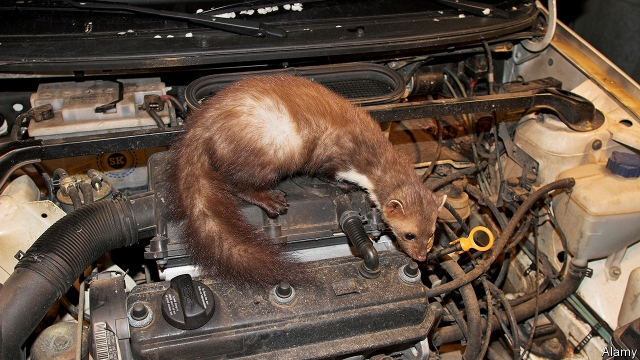

###### The marten menace

# What’s cute, furry and can disable a particle accelerator? 

##### A critter that loves to chew cables 

 

> Jan 31st 2019 

 

THE HEAVY snowfall in central Europe so far this year is making life hard for stone martens. A weasel-like animal, half a metre long with brown fur and a white blaze on its chest, the stone marten has tiny paws too small to keep it suspended on soft snow. It thus has an endearing habit of walking along cross-country ski tracks, where the snow is packed harder. It also has a less endearing habit: gnawing on rubber. Specifically, it likes to crawl into car-engine cavities and chew on the wiring. 

As a result, in Germany, car insurance that covers Marderbisse (marten bites) is a must. According to GDV, an insurers’ group, martens were the fourth-leading cause of non-collision auto damage in Germany in 2017. They chewed through €72m ($79m) worth of cables, up from €66m the year before and €28m in 2005. 

The rise in marten damage may simply be the consequence of more martens. The population has grown in recent decades, and they are colonising areas from which they had disappeared, such as the eastern Netherlands. Another reason may be declining fear of humans, who create lots of warm, dry spaces like attics that make perfect marten dens. 

“They are one of these animals that have become part of the suburban ecosystem,” says Kees Moeliker, director of the Rotterdam Museum of Natural History. He keeps a collection of animals that have died in unusual interactions with humans, including the most dramatic case of marten damage ever. In 2016 one hopped onto an electric transformer at the Large Hadron Collider (LHC) in Switzerland, short-circuiting it and briefly knocking out the particle accelerator. Earlier that year the LHC lost power when a cable was chewed through by an animal which, though rather charred, appears to have been a marten. 

What explains the martens’ suicidal tastes? Some biologists note that electrical insulation manufactured in east Asia sometimes contains fish oil. Others think the culprits may be mostly young martens that do not know what is edible; damage tends to peak in spring, when the young are born. Asked for his theory, Mr Moeliker laughs. “This is something we will probably never know, what’s in the head of the marten,” he says. 

-- 

 单词注释:

1.marten['mɑ:tin]:n. 貂, 貂皮 

2.menace['menis]:n. 威胁, 胁迫 v. 威吓, 胁迫 

3.cute[kju:t]:a. 可爱的, 聪明的, 伶俐的 [医] 品他病 

4.furry['fә:ri]:a. 毛皮的, 盖着毛皮的, 似毛皮的 

5.critter['kritә]:n. [方][谑]家畜；马；牛；[贬]人 

6.Jan[dʒæn]:n. 一月 

7.snowfall['snәufɒ:l]:n. 降雪, 降雪量 

8.endear[in'diә]:vt. 使受喜爱, 使受钟爱 

9.les[lei]:abbr. 发射脱离系统（Launch Escape System） 

10.gnaw[nɒ:]:v. 咬, 啃, 侵蚀, 消耗, 折磨 

11.specifically[spi'sifikli]:adv. 特定地, 明确地, 按特性 

12.cavity['kæviti]:n. 洞, 空穴, 腔 [化] 空穴 

13.GDV[]:[=granule-derived virus]颗粒体衍生病毒 

14.colonise['kɔlәnaiz]:vi. 开拓殖民地；移民于殖民地 

15.Netherlands['neðәlәndz]:n. 荷兰 

16.attic['ætik]:n. 阁楼, 顶楼 [医] 鼓室上隐窝 

17.den[den]:n. 兽穴, 洞穴 [法] 匪巢, 贼窝 

18.suburban[sә'bә:bәn]:a. 郊外的, 郊区的, (贬)偏狭的, 土气的, 见识不广的 n. 郊区居民 

19.ecosystem['i:kәu.sistәm]:n. 生态系统 [医] 生态系 

20.kee[]:n. 凯（姓氏）；著名拉链品牌 

21.Rotterdam['rɔtәdæm]:[经] 鹿特丹 

22.hop[hɒp]:n. 单脚跳, 跳跃, 舞会, 飞行 vi. 单脚跳, 跳跃 vt. 跃过, 跳上, 加蛇麻子于, 服麻醉药 [计] 跳跃式传输 

23.hadron['hædrɔn]:[化] 强子(强相互作用粒子) 

24.collider[kəˈlaɪdə(r)]: 碰撞机 

25.lhc[]:abbr. 液氢容器（Liquid Hydrogen Container ） 

26.briefly['brifli]:adv. 简短地, 扼要地, 简明地, 简单地 

27.accelerator[әk'selәreitә]:n. 加速剂, 加速器, 油门 [化] 加速器; 早强剂; 促进剂; 硫化促进剂 

28.char[tʃɑ:]:n. 家庭杂务, 炭 vi. 打杂, 烧焦 

29.suicidal[sjui'saidәl]:a. 自杀的, 自杀性的, 自我毁灭的 [法] 自杀的 

30.biologist[bai'ɒlәdʒist]:n. 生物学家 [医] 生物学家 

31.insulation[.insju'leiʃәn. 'insә-]:n. 绝缘；隔离, 孤立 

32.culprit['kʌlprit]:n. 犯人, 罪犯, 刑事被告 [法] 犯罪者, 犯人, 罪犯 

33.edible['edibl]:n. 食品, 食物 a. 可食用的 

