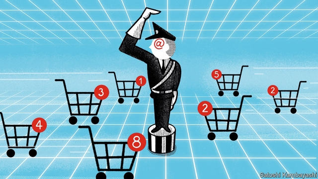

###### E-commerce

# A new initiative aims to modernise global trading rules 

##### It will pit the world’s big powers against each other 

 

> Jan 31st 2019 

“SATISFACTION GUARANTEED!” promises the seller of “The Law and Policy of the World Trade Organisation” (WTO). The magic of e-commerce means that the doorstopper can be exported from America to Tajikistan for a cool $35.95 (plus shipping). A new initiative on digital trade at the WTO strives to add to the laws and policies described within its pages. But far from increasing general satisfaction, this plan is controversial. 

At first glance, it is hard to see why. On January 25th representatives of 76 WTO members gathered at the annual shindig in Davos announced plans to negotiate new rules covering “trade-related aspects of electronic commerce”. Compared with the trade talks between America and China that restarted this week in Washington, this venture seems positively collegial. It makes sense: trade rules were written when cloud computing was the stuff of science fiction. What better way to demonstrate the value of the WTO, just as President Donald Trump is busy undermining it? 

But a closer look reveals conflict. Though the 76 members account for 90% of global trade, they are a minority of WTO members. Many developing countries claim that tighter e-commerce rules would tie national regulators’ hands and that the issue is a distraction from others they care about more, such as limiting rich countries’ agricultural subsidies. 

The plan is to sidestep such complaints, which have blocked agreement at the WTO for years. Instead of getting all members to sign up to a multilateral deal, a like-minded group will set rules among themselves. Hold-outs, like India and South Africa, will not be able to block progress if their demands are not met. The cost is the legitimacy that a broader group would generate—and the fact that non-signatories will free-ride on any deal, gaining from others’ commitments, without having to make any themselves. 

Further battles lie ahead. “Countries don’t have a shared definition of what they’re negotiating,” complains Susan Aaronson of George Washington University. The WTO defines e-commerce as the “production, distribution, marketing, sale or delivery of goods and services by electronic means.” That is broad. 

An agreement could include regulations covering spam emails or rules helping digital purchases zip through customs. It could reach deep into members’ domestic regulations to cover cybersecurity or the protection of personal data. It could prevent barriers to cross-border data flows, or ban requirements to store citizens’ data on local servers. Every two years WTO members renew a promise not to tax digitally provided goods, such as films from Netflix. A new deal could make that permanent. 

American negotiators would like all of the above. Their technology firms benefit from data flowing freely, which helps them train algorithms and generate sales. Data-localisation is expensive, and could weaken security by giving hackers more targets. And, obviously, they would rather their digital sales were not taxed. 

This powerful lobby group’s ambitions have already been enshrined in deals away from the WTO. The United States-Mexico-Canada Agreement (USMCA), which America’s Congress is supposed to ratify later this year, bans customs duties on digital products. So does the Trans-Pacific Partnership (TPP), which was negotiated by 12 countries, including America, and revived by the others when Mr Trump pulled America out. The TPP bars governments from forcing companies to hand over their source code, and the USMCA goes further by including algorithms, too. Both ban data-localisation requirements. 

Many worry that American technology companies are using trade rules to neuter national regulators. In theory, there are exceptions to the rules regarding data localisation and technology transfer. But critics fear that governments will be wary of invoking those exceptions, and that arbiters at the WTO will side with companies. 

It will be hard to get European negotiators on board with some of this. European law treats privacy as a fundamental human right, and the free flow of data as secondary; the Americans (and Japanese) start from the premise that data should flow and only then consider exceptions on privacy grounds. Still, a recent deal between the European Union and Japan suggests the differences may not be insurmountable. 

The biggest fight will be with China. Its government views data as an issue of sovereignty, and trade in data as a national-security matter. Chinese representatives reportedly tried to narrow the scope of the talks, threatening not to participate. They joined in the end, presumably deciding that it would be better to have influence over any new rules rather than see standards that could become global set without them. Other countries see little value in rules that enshrine China’s draconian approach to data, but also know the value of having a country of China’s size involved. 

American administrations have tried to resolve these differences in the past. The Transatlantic Trade and Investment Partnership, a proposed deal between America and the EU, was supposed to cover the two sides’ differing approaches to data. Together with the TPP, it was meant to draw China into a less hostile regulatory pattern. 

Americans are once again working with other countries to pull in China. In December Roberto Azevêdo, the WTO’s head, described American efforts on e-commerce as “very active”. But negotiators may be short of bargaining power. Plurilateral negotiations on narrow topics at least mean that China cannot block all discussion. But they also remove the opportunities to bargain unrelated concessions against each other, which is how trade negotiators reach consensus. This initiative could be the success the beleaguered WTO desperately needs. Or it could be another demonstration of its weakness. 

-- 

 单词注释:

1.modernise['mɔdәnaiz]:vt.vi. (使)现代化, (使)适应现代需要 vi. 用现代方法 

2.Jan[dʒæn]:n. 一月 

3.organisation[,ɔ: ^әnaizeiʃən; - ni'z-]:n. 组织, 团体, 体制, 编制 

4.WTO[]:[计] 给操作员送信息 

5.doorstopper['dɔːstɒp]:n. 制门器, 门制止器；[亦作slamming stile, stop](钉在门框的)制门木条 

6.Tajikistan[tɑ:dʒiki'stɑ:n]:n. 塔吉克斯坦 

7.strive[straiv]:vi. 努力, 奋斗, 斗争 

8.shindig['ʃindig]:n. 喧哗, 盛大舞会 

9.davo[]:abbr. Dynamic Analogue of Vocal Tract 声道动态模拟（设备） 

10.restart[.ri:'stɑ:t]:v. 重新开始, 重新启动 [计] 重新启动 

11.Washington['wɒʃiŋtn]:n. 华盛顿 

12.positively[]:adv. 明确地, 肯定地, 无疑地, (非正式)确实地, 真正地 

13.collegial[kә'li:dʒiәl]:a. 学校的, 大学的, 大学生的, 社团的 

14.computing[kәm'pju:tiŋ]:[计] 计算 

15.donald['dɔnәld]:n. 唐纳德（男子名） 

16.trump[trʌmp]:n. 王牌, 法宝, 喇叭 vt. 打出王牌赢, 胜过 vi. 出王牌, 吹喇叭 

17.undermine[.ʌndә'main]:vt. 在...下面挖, 渐渐破坏, 暗地里破坏 [法] 暗中破坏, 以阴谋中伤伤害 

18.distraction[dis'trækʃәn]:n. 娱乐, 分心的事物, 分心 [医] 注意力分散, 内脱位, 牙弓过宽 

19.sidestep['saidstep]:n. 横跨的一步, 台阶 vt. 横跨一步躲避, 回避 vi. 回避问题, 躲避打击 

20.multilateral[.mʌlti'lætәrәl]:a. 多边的, 多国的 [经] 多边的, 涉及多方的 

21.legitimacy[li'dʒitimәsi]:n. 合法, 正统, 正当 [法] 合法性, 正统性, 婚生 

22.susan['su:zn]:n. 苏珊（女子名） 

23.aaronson[]:n. (Aaronson)人名；(荷)阿龙松；(英)阿伦森 

24.george[dʒɔ:dʒ]:n. 乔治（男子名）；自动操纵装置；英国最高勋爵勋章上的圣乔治诛龙图 

25.marketing['mɑ:kitiŋ]:n. 行销, 买卖 [经] 推销, 在市场买卖, 销售 

26.spam[]:n. 罐头猪肉, 垃圾邮件 v. 发送垃圾邮件 

27.cybersecurity[]:[网络] 网络安全；赛博安全；网络空间安全 

28.datum['deitәm]:n. 论据, 材料, 资料, 已知数 [医] 材料, 资料, 论据 

29.server['sә:vә]:n. 服伺者, 上菜用具, 发球员 n. 服务器 [计] 服务器, 服务器启动程序, 服务台程序 

30.digitally[]:adv. 数位 

31.netflix[]:n. 全球十大视频网站中唯一收费站点 

32.negotiator[ni'gәuʃieitә]:n. 磋商者, 交涉者, 议定者 [经] 谈判者, 交易者, 协商者 

33.algorithm['ælgәriðm]:n. 算法 [计] 算法 

34.hacker['hækә]:[计] 计算机窃贼, 计算机新技术挑战者, 黑客 

35.lobby['lɒbi]:n. 大厅, 休息室, 游说议员者 vi. 游说议员, 游说 vt. 游说 

36.enshrine[in'ʃrain]:vt. 入庙祀奉, 铭记 

37.ratify['rætifai]:vt. 批准, 认可 [经] 证实, 肯定, 确认 

38.partnership['pɑ:tnәʃip]:n. 合伙, 合股, 合作关系 [经] 合伙(合作)关系, 全体合伙人 

39.TPP[]:[化] 硫胺素焦磷酸 

40.revive[ri'vaiv]:vt. 使苏醒, 使复兴, 使振奋, 回想起, 重播 vi. 苏醒, 复活, 复兴, 恢复精神 

41.neuter['nju:tә]:a. 中性的, 不及物的, 生殖器不完全的 n. 中性词, 无性动物, 阉割动物 

42.regulator['regjuleitә]:n. 调整者, 校准者, 校准器, 调整器, 标准钟 [化] 调节剂; 调节器 

43.localisation[,ləukəlai'zeiʃən, -li'z-]:n. 本土化；定位 

44.wary['wєәri]:a. 谨慎的, 小心的, 机警的, 周到的, 唯恐的 

45.invoke[in'vәuk]:vt. 祈求, 恳求, 实行, 援引, 引起 [计] 调用; 请求 

46.arbiter['ɑ:bitә]:n. 仲裁人, 裁决者, 公断人 [计] 判优程序 

47.privacy['praivәsi]:n. 隐私, 隐居, 秘密 [计] 个人保密权 

48.premise['premis]:n. 前提, 房屋连地基, 上述各项 vt. 预先提出, 引出, 作为...的前提 vi. 作出前提 

49.insurmountable[.insә'mauntәbl]:a. 难以克服的, 不能超越的 

50.sovereignty['sɒvrәnti]:n. 主权, 独立国 [法] 主权, 主权国家, 统治权 

51.reportedly[ri'pɒ:tidli]:adv. 根据传说, 根据传闻, 据报道 

52.draconian[drә'kәjniәn]:a. 严厉的, 残酷的 

53.transatlantic[.trænsәt'læntik]:a. 横渡大西洋的, 大西洋彼岸的, 美国的 

54.EU[]:[化] 富集铀; 浓缩铀 [医] 铕(63号元素) 

55.les[lei]:abbr. 发射脱离系统（Launch Escape System） 

56.regulatory['regjulәtәri]:a. 受控制的, 统制的, 调整的 [经] 规则的 

57.Roberto[]:n. 罗伯托（人名） 

58.plurilateral[]:[网络] 复边；诸边；为复边贸易协定 

59.negotiation[ni.gәuʃi'eiʃәn]:n. 谈判, 磋商, 交涉 [经] 谈判, 协商 

60.cannot['kænɒt]:aux. 无法, 不能 

61.unrelated[]:[法] 无关的 

62.concession[kәn'seʃәn]:n. 特许, 让步, 认可 [经] 核准, 许可, 特殊(权) 

63.beleaguer[bi'li:gә]:vt. 围, 围攻 

64.desperately['despәrәtli]:adv. 拼命地；绝望地；极度地 

65.demonstration[.demәn'streiʃәn]:n. 示范, 实证 [医] 示教, 实物教授 

