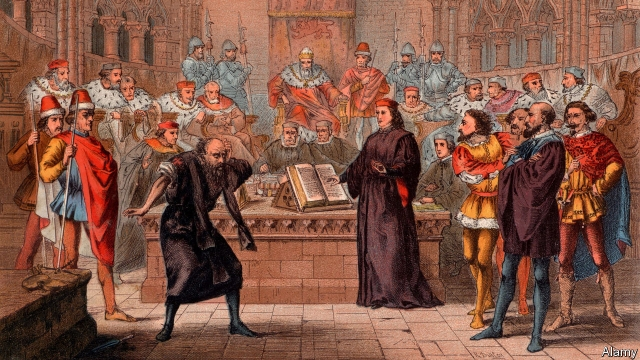

###### Letter and spirit

# Conflicts in the credit-derivatives market threaten to undermine it 

##### A ruling on the exact meaning of a complex contract surprises markets 

 

> Jan 31st 2019 

SHAKESPEARE WAS a fan of the quibble. His plots often hinge on the gap between word and intended meaning. Macbeth was supposed to be invincible because he could be harmed by “none of woman born”—but his killer, Macduff, was delivered by Caesarean section. In “The Merchant of Venice” Portia saves Antonio by arguing that though he agreed to forfeit a pound of flesh to Shylock if he defaulted on a loan, he did not agree to lose blood. 

Traders in credit-derivative markets are keen on quibbles, too. Credit-default swaps (CDSs) are insurance-like derivatives designed to compensate lenders when a company goes bust. A simple enough aim, you might think, but there are plenty of devilish details. A company can go bust in many ways: it can close and have its assets sold off, or restructure its debt and keep operating. And CDS contracts pay out the difference between a bond’s face value and the price of the cheapest bond available, even though the underlying characteristics of a company’s various bonds can differ widely. 

In 2018 GSO, a branch of Blackstone, the world’s largest private-equity firm, came under fire for offering cheap financing to Hovnanian, an American house-builder, on condition that Hovnanian would default on a payment to a subsidiary, triggering the CDS contracts. Financing took the form of a long-term, low-coupon bond that traded well below face value, meaning the CDS would pay out handsomely when valued against that bond—even though Hovnanian’s other bonds were trading close to face value. (Blackstone says that its arrangement with Hovnanian was fully compliant with the rules of this market.) 

Later that year traders started trying, so far without success, to get CDS contracts on Rallye, the parent company of Casino, a French supermarket, to pay out because an obscure covenant on one of its bonds required shareholder equity to exceed €1.2bn ($1.4bn), a condition it no longer met. 

Last week, however, quibblers were given pause by an arbitration ruling that appeared to break with the convention of sticking to the letter of contracts, rather than trying to divine their intentions. The case arose when $600m-worth of CDS contracts plunged in value. Traders realised that the entity they were written on, VodafoneZiggo, a Dutch telecoms company, had been wound down. Its bonds had been transferred to a new entity, rendering its CDSs potentially worthless. 

This would not have mattered if market supervisors had been informed within 90 days. But investors did not notice for almost a year. So they turned instead to a clause saying that the CDS could be transferred to a new entity if it had assumed “all of the obligations” of the old one. 

CDS documents usually capitalise the word “obligation”, a cue that the writer is referring to the entity’s bonds. But in one place it was written in lower-case, implying that it referred to any obligations, for example tax liabilities, that the old VodafoneZiggo entity might still have. An ad hoc committee of lawyers from ten banks and five fund managers was convened to hear the dispute. It ruled that the ongoing obligations were “immaterial”, and that the CDS should be transferred. Markets were astonished: its value shot back up. 

The decision matched the spirit of the CDS. But deviating from the letter of the contract raises broader issues. The perception that the value of a CDS might be determined by an unaccountable committee could undermine the CDS market. It is already shrinking: according to the Bank for International Settlements, the notional value insured by CDSs has fallen from $61.2trn in 2007 to $9.4trn in 2017. This is partly because of welcome regulatory changes, such as netting of contracts. But it has also reduced liquidity. 

If the market vanishes, it would be a loss. CDSs allow banks to lend to a wider range of firms, since they can hedge their credit exposure. They allow pension funds, which are often required to protect their capital, to invest in higher-yielding bonds. Quibbles about contracts always exist; the fight over who resolves them will go on. 

-- 

 单词注释:

1.undermine[.ʌndә'main]:vt. 在...下面挖, 渐渐破坏, 暗地里破坏 [法] 暗中破坏, 以阴谋中伤伤害 

2.Jan[dʒæn]:n. 一月 

3.Shakespeare['ʃeik.spiә]:n. 莎士比亚 

4.quibble['kwibl]:n. 遁词, 双关语 vi. 吹毛求疵, 争吵, 说模棱两可的话 vt. 对...诡辩 

5.hinge[hindʒ]:n. 铰链, 关键, 枢纽 vt. 装铰链 vi. 靠铰链移动, 依...而转移 

6.Macbeth[mәk'beθ]:n. 麦克佩斯 

7.invincible[in'vinsәbl]:a. 不能征服的, 无敌的 

8.killer['kilә]:n. (非正式)杀人者, 屠杀者, 猛兽, 致死(疾病), 杀手, 止痛药, 限制器, 瞄准器 [计] 删除程序; 断路器 

9.Macduff[]:麦克达夫 

10.Caesarean[si'zєәriәn]:a. 恺撒的, 帝国的 n. 专制独裁者 

11.Venice['venis]:n. 威尼斯 

12.portia['pɔ:ʃiә]:n. 波西亚（女子名） 

13.antonio[æn'tәuniәu]:n. 安东尼奥（男名） 

14.forfeit['fɒ:fit]:n. 没收物, 罚金, 丧失 vt. 没收, 丧失 a. 丧失了的 

15.shylock['ʃailɔk]:n. (喻)敲诈勒索的放债者, 冷酷无情的商人, 冷酷无情的人, 夏洛克 

16.default[di'fɒ:lt]:n. 违约, 不履行责任, 缺席, 默认值 v. 疏怠职责, 缺席, 拖欠, 默认 [计] 默认; 默认值; 缺省值 

17.trader['treidә]:n. 商人, 商船 [经] 交易者, 商船 

18.cdss[]:abbr. compressed data storage system 压缩数据存储系统 

19.derivative[di'rivәtiv]:a. 引出的, 派生的 n. 引出之物, 派生物, 衍生字 

20.lender['lendә]:n. 出借人, 贷方 [经] 出借者, 贷方, 贷款人 

21.bust[bʌst]:n. 半身像, 胸部, 失败, 殴打 vt. 使爆裂, 使破产 vi. 爆裂, 破产 [计] 操作错 

22.devilish['devliʃ]:a. 魔鬼似的, 该咒骂的, 可恶的, 邪恶的, 凶暴的, 异常的, 过分的, 非常的 adv. (非正式)非常, 过分地, 极 

23.asset['æset]:n. 资产, 有益的东西 

24.restructure[ri:'strʌktʃә]:vt. 更改结构, 重建, 调整 

25.underlie[.ʌndә'lai]:vt. 位于...之下, 成为...的基础 

26.GSO[]:一般参谋 

27.Blackstone[]:n. 百仕通集团（即黑石集团, 全球最大私募基金公司）；布莱克斯通（英国前文化部长）；黑石镇（美国马萨诸塞州的一个镇） 

28.hovnanian[]: [人名] 霍夫纳尼安 

29.subsidiary[sәb'sidiәri]:n. 子公司, 附件, 辅助者 a. 辅助的, 次要的, 津贴的 

30.trigger['trigә]:n. 触发器, 扳机 vt. 触发, 发射, 引起 vi. 松开扳柄 [计] 切换开关 

31.handsomely['hænsәmli]:adv. 漂亮地, 整齐地, 当心地, 慢慢地, 优厚地, 慷慨地, 美观地 

32.fully['fuli]:adv. 十分地, 完全地, 充分地 

33.compliant[kәm'plaiәnt]:a. 顺从的, 屈从的 [电] 适用于, 配合...使用 

34.rallye[ˊræli]:n. 长距离赛车 

35.casino[kә'si:nәu]:n. 卡西诺赌场, 卡西诺牌戏 

36.covenant['kʌvәnәnt]:n. 契约, 盟约 v. 立契约, 缔结盟约 

37.shareholder['ʃєә.hәuldә]:n. 股东 [法] 股东, 股票持有人 

38.equity['ekwiti]:n. 公平, 公正 [经] 权益, 产权 

39.quibbler[]:n. 诡辩者 [法] 诡辩者, 狡辩者 

40.arbitration[.ɑ:bi'treiʃәn]:n. 仲裁, 公断 [计] 仲裁 

41.divine[di'vain]:a. 神的, 神圣的, 非凡的 n. 神学家 

42.entity['entiti]:n. 实体, 实存物, 存在 [计] 实体 

43.Dutch[dʌtʃ]:n. 荷兰人, 荷兰语 a. 荷兰的 

44.telecom['telәkɔm]:telecommunication 电信 

45.potentially[pә'tenʃәli]:adv. 可能地, 潜在地 

46.supervisor[.sju:pә'vaizә]:n. 管理者, 监督者, 指导者, 视导员 [计] 管理程序 

47.investor[in'vestә]:n. 投资者 [经] 投资者 

48.clause[klɒ:z]:n. 子句, 条款 [计] 子句 

49.capitalise['kæpitәlaiz]:vt. 用大写字母写, 用大写字母印, 投资于, 使变为资本, 提供资本给 vi. 利用 

50.liability[laiә'biliti]:n. 责任, 债务, 倾向 [经] 责任, 义务, 负债 

51.hoc[]:abbr. 下议院, 众议院（House of Commons）；肝卵圆细胞（Hepaticoval Cells）；重油催化裂化（Heavy Oil Cracking ）；最高输出信道（Highest Outgoing Channel）；均质铸锭（Homogeneous Casting） 

52.convene[kәn'vi:n]:vt. 集合, 召集, 召唤 vi. 聚集, 集合 

53.ongoing['ɒngәuiŋ]:a. 前进的, 进行的, 不间断的 n. 前进, 发展 

54.immaterial[.imә'tiәriәl]:a. 非物质的, 无形的, 精神的 [法] 非物质的, 无形的, 非实质的 

55.deviate['di:vieit]:vi. 脱离, 偏离 vt. 使偏离 a. 脱离常规的 n. 脱离常规的人 

56.perception[pә'sepʃәn]:n. 知觉, 感觉, 领悟力, 获取 [医] 知觉 

57.unaccountable[.ʌnә'kauntәbl]:a. 无法解释的, 无责任的 [法] 难以申辩的, 不可解释的, 无关系的 

58.notional['nәuʃәnәl]:a. 概念的, 想像的 [经] 名义上的 

59.regulatory['regjulәtәri]:a. 受控制的, 统制的, 调整的 [经] 规则的 

60.liquidity[li'kwiditi]:n. 流动性, 流畅 [经] 流动性 

61.alway['ɔ:lwei]:adv. 永远；总是（等于always） 

