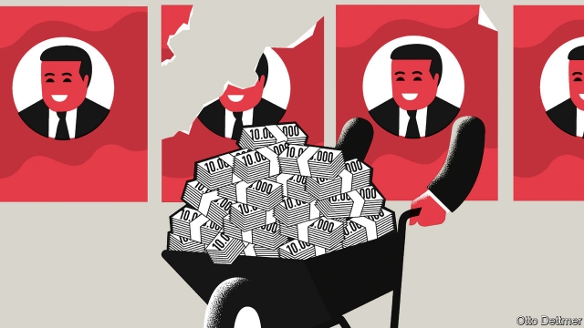

###### Free exchange

# Hyperinflations can end quickly, given the right sort of regime change 

##### For long-suffering Venezuelans, that cannot come too soon 

 

> Jan 31st 2019 

BANKNOTES USED as toilet paper. Wheelbarrows of cash exchanged for a loaf of bread. Prices in supermarkets revised upwards each hour. These vignettes of hyperinflation would be funny if they did not cause such hardship. This is now Venezuela’s situation, in what may be the final days of the ill-starred regime of Nicolás Maduro. An estimate by Steve Hanke of Johns Hopkins University put the country’s inflation rate last year at 100,000%, with prices doubling roughly once a month. The IMF reckons that in 2019 it may reach 10,000,000%. 

Hyperinflations are not an exclusively modern problem. Rome suffered one under the emperor Diocletian. But the spread of fiat currencies, backed by the credibility of a government rather than a physical commodity such as gold, has made them more common. They came in devastating bursts over the past century: in the aftermath of the first and second world wars, during the post-Soviet transition from communism to capitalism, and more recently in misgoverned poor countries, mostly in Africa and Latin America. They are not cases of garden-variety inflation run amok. Rather, they demonstrate a catastrophic breakdown in a state’s capacity to govern. In a narrow sense, they are a monetary phenomenon, with printing presses running nonstop. Yet the important question for economists, and for those trying to end them, is why the presses ran out of control in the first place. 

The culprit, nearly always, is a politically unmanageable fiscal burden. Huge budget deficits can erode confidence in a state’s fiscal discipline, causing the currency to weaken. Heavy government borrowing and a worsening exchange rate, which raises the cost of imports, fuel inflation. Most governments in such circumstances avert looming crisis by reining in borrowing and money growth. Indeed, periods of high inflation are not that unusual, according to Stanley Fischer, a former vice-chairman of the Federal Reserve, Ratna Sahay of the IMF and Carlos Végh of the World Bank. During the post-war period, they note, a fifth of a sample of 133 countries experienced inflation in excess of 100% at some point. But most avoided hyperinflation. Indeed, a country with annual inflation of 100-200% was more than twice as likely to see inflation decline the following year as it was to see it rise. 

But sometimes the situation deteriorates. Politicians may be unable to impose the necessary reforms without losing the backing of the interest groups keeping them in power. Excessive spending continues, increasingly funded by seigniorage—spending power captured by the government thanks to the gap between the face value of new banknotes and the cost of printing them. As the bills mount, so does inflation. 

Hyperinflation often occurs against the backdrop of war or other social chaos. Germany’s Weimar government, beset by political unrest and burdened with war debts and reparations, stumbled into economic oblivion. But it can begin in more prosaic circumstances. In the 1970s Bolivia enjoyed a commodity-driven boom under the rule of a military leader, Hugo Banzer, during which it borrowed heavily from abroad. Banzer was pushed from power in 1978. During the ensuing upheaval, global economic conditions turned; interest rates soared and resource prices tumbled. The left-leaning government that came to power in 1982 inherited annual inflation of 300%, a shrinking economy and the loss of access to foreign creditors. But as Jeffrey Sachs of Columbia University documented in an analysis published in 1987, Bolivia’s new leadership had won support by promising to increase social spending. Attempts to limit spending or raise taxes enraged interest groups on which the government depended. The reliance on seigniorage continued, and inflation rose to 60,000%. 

Economists once thought that high inflation should prove damnably persistent, as expectations of soaring prices became embedded. Yet in a seminal paper in 1981 Tom Sargent, a Nobel prizewinner, argued otherwise. Rather, expectations of high inflation reflect candid assessments of government policy: people anticipate high inflation when politicians are unserious about reform. A credible policy shift, he notes, can change expectations quickly and at little or no cost. He examined four great inflations in the 1920s and showed that once a credible policy “regime change” occurred, hyperinflation ended in weeks. 

More recent experience confirms that hyperinflation can end quickly under the right conditions. That usually means a sustainable fiscal consolidation, a credible pledge to stop funding the government via seigniorage and a commitment to a new monetary framework, most often via an exchange-rate peg. New political leadership often helps, as does external financial support. A new government took over in Bolivia in 1985, after three years of raging inflation. It raised taxes, slashed public investment, froze public salaries and stopped paying interest on its debt, thus restoring fiscal balance. And it stabilised the exchange rate against the dollar, with help from the IMF. The programme started in earnest late in August 1985; by early September a five-digit inflation rate had flipped to deflation. 

Not every case concludes so neatly. Countries with histories of high inflation can stagger on with it, rather than tumbling into hyperinflation. It then proves frustratingly difficult to escape. This was the situation in Argentina and Brazil in the 1980s and 1990s, as repeated attempts at stabilisation failed to solve the problem conclusively. After extended periods of ineffectual leadership, people may become jaded about reform campaigns, and shock and awe may be required if they are to to be taken seriously. Venezuela, despite a long record of double-digit inflation rates, may dodge this fate; inflation there has rocketed only in the past few years amid an impressive display of fiscal incontinence. For its people, the sooner regime change comes, the better. 

-- 

 单词注释:

1.hyperinflation[,haipәrin'fleiʃәn]:n. 恶性通货膨胀 

2.quickly['kwikli]:adv. 很快地 

3.regime[rei'ʒi:m]:n. 政权, 当权期间, 政体, 社会制度, 体制, 情态 [医] 制度, 生活制度 

4.venezuelan[,venә'zweilәŋ]:a. 委内瑞拉的；委内瑞拉人的 

5.cannot['kænɒt]:aux. 无法, 不能 

6.Jan[dʒæn]:n. 一月 

7.banknote['bæŋknәut]:n. 钞票 

8.wheelbarrow['hwi:l.bærәu]:n. 手推车, 独轮车 

9.vignette[vi'njet]:n. 装饰图案；小插图 

10.maduro[mә'duәrәu]:a. 色深味浓的烟草做的, (雪茄)色深味浓的 

11.steve[]:n. 史蒂夫（男子名） 

12.hanke[]: [人名] 汉克 

13.john[dʒɔn]:n. 盥洗室, 厕所, 嫖客 

14.hopkins['hɔpkinz]:n. 霍普金（姓氏） 

15.inflation[in'fleiʃәn]:n. 胀大, 夸张, 通货膨胀 [化] 充气吹胀; 膨胀 

16.IMF[]:国际货币基金组织 [经] 国际货币基金 

17.reckon['rekәn]:vt. 计算, 总计, 估计, 认为, 猜想 vi. 数, 计算, 估计, 依赖, 料想 

18.Rome[rәum]:n. 罗马 

19.Diocletian[]:n. (Diocletian)人名；(245-约316)戴克里先〈意〉罗马皇帝。 

20.fiat['faiæt]:n. 命令, 严命, 许可 [医] 制成, 作成 

21.credibility[.kredi'biliti]:n. 可信用, 确实性, 可靠 [法] 证据能力, 可信程度, 确实性 

22.commodity[kә'mɒditi]:n. 农产品, 商品, 有用的物品 [经] 商品, 货物, 日用品 

23.devastate['devәsteit]:vt. 毁坏 [法] 使荒废, 毁灭, 掠夺 

24.aftermath['ɑ:ftәmæθ]:n. 结果, 后果 [法] 后果, 结果 

25.transition[træn'ziʃәn]:n. 转变, 转换, 变迁, 过渡时期, 临时转调 [化] 跃迁 

26.capitalism['kæpitәlizәm]:n. 资本主义 [经] 资本主义 

27.misgovern[mis'gʌvәn]:vt. 管理不当 

28.amok[ә'mɔk]:adv. 乱砍乱杀, 杀气腾腾地横冲直撞 [医] [抑郁后暴发]杀人狂 

29.catastrophic[.kætә'strɒfik]:a. 悲惨的, 灾难的 

30.breakdown['breikdaun]:n. 崩溃, 故障 [化] 事故; 击穿 

31.monetary['mʌnitәri]:a. 货币的, 金钱的 [经] 货币的, 金融的 

32.nonstop[nɒn'stɒp]:a. 直达的, 不着陆的, 不休息的 adv. 不休息地 n. 直达车, 直达行驶 

33.economist[i:'kɒnәmist]:n. 经济学者, 经济家 [经] 经济学家 

34.culprit['kʌlprit]:n. 犯人, 罪犯, 刑事被告 [法] 犯罪者, 犯人, 罪犯 

35.alway['ɔ:lwei]:adv. 永远；总是（等于always） 

36.politically[]:adv. 政治上 

37.unmanageable[.ʌn'mænidʒәbl]:a. 难管理的, 难处理的, 难操纵的, 处理不了的 [化] 难以加工的; 难以控制的; 难以管理的 

38.fiscal['fiskәl]:a. 财政的, 国库的 [经] 财政上的, 会计的, 国库的 

39.deficit['defisit]:n. 赤字, 不足额 [医] 短缺 

40.erode[i'rәud]:vt. 腐蚀, 侵蚀 vi. 受腐蚀 

41.worsen['wә:sn]:vt. 使更坏, 使恶化 vi. 变得更坏, 恶化 

42.avert[ә'vә:t]:vt. 转开, 避免, 防止 

43.loom[lu:m]:n. 织布机, 若隐若现的景象 vi. 朦胧地出现, 隐约可见, 可怕地出现 

44.stanley['stænli]:n. 斯坦利（男子名） 

45.Fischer['fiʃə]:n. 费舍尔（诺贝尔化学奖获得者） 

46.Ratna[]:[网络] 拉特纳；星曜代表宝石；惹纳 

47.sahay[]:萨海 

48.carlo[]:n. 卡洛（男子名） 

49.deteriorate[di'tiәriәreit]:v. (使)恶化 

50.hyperinflation[,haipәrin'fleiʃәn]:n. 恶性通货膨胀 

51.backdrop['bækdrɒp]:n. 背景幕, 背景 

52.chao[]:n. 钞（货币） 

53.Weimar['vaimɑ:]:魏玛 

54.beset[bi'set]:vt. 围绕, 使苦恼, 镶嵌 

55.reparation[.repә'reiʃәn]:n. 补偿, 赔偿, 弥补, 修复, 修理 [经] 赔偿, 补偿, 修理 

56.oblivion[ә'bliviәn]:n. 遗忘, (头脑的)一片空白状, 湮没, 大赦, 赦免 [法] 忘却, 被忘却的事, 大赦 

57.prosaic[prәu'zeiik]:a. 散文的, 散文体的, 平凡的 

58.Bolivia[bә'liviә]:n. 玻利维亚 

59.hugo['hju:^әu]:n. 雨果（男子名, 等于Hugh） 

60.banzer[]:[网络] 班泽尔；那其人士勇敢对抗班则尔 

61.ensuing[]:a. 接著发生的 

62.upheaval[ʌp'hi:vl]:n. 举起, 隆起, 大变动, 剧变 

63.soar[sɒ:]:n. 高扬, 翱翔 vi. 往上飞舞, 高耸, 翱翔 

64.creditor['kreditә]:n. 债权人 [法] 债权人, 债主, 贷方 

65.jeffrey['dʒefri]:n. 杰弗里（男子名, 等于Geoffrey） 

66.Sachs[zaks]:n. 萨克斯（汽车零配件生产厂商） 

67.Columbia[kә'lʌmbiә]:n. 哥伦比亚 

68.enrage[in'reidʒ]:vt. 激怒, 使暴怒 

69.seigniorage['si:njәridʒ]:n. 领主特权, 硬币铸造税 [经] 银币(金币)铸造税, 银币(金币)铸造利差 

70.damnably['dæmnәbli]:adv. 可恨地, 厉害地 

71.persistent[pә'sistәnt]:a. 固执的, 坚持的, 持续的, 作用持久的 [法] 坚持的, 固执的, 持续的 

72.embed[im'bed]:vt. 使插入, 使嵌入, 使深留脑中 [计] 嵌入 

73.seminal['seminl]:a. 精液的, 种子的, 生殖的 [医] 种子的; 精液的 

74.tom[tɒm]:n. 雄性动物, 雄猫 

75.Sargent[]:n. 萨金特（姓氏） 

76.Nobel['nәubel]:n. 诺贝尔 

77.prizewinner['praizwinә]:n. 得奖人 

78.candid['kændid]:a. 坦白的, 率直的, 公正的 

79.unserious['ʌnsɪərɪəs]: 不严肃的 

80.credible['kredәbl]:a. 可信的, 可靠的 [法] 可信的, 可靠的 

81.sustainable[sә'steinәbl]:a. 足可支撑的, 养得起的, 可以忍受的 

82.consolidation[kәn.sɒli'deiʃәn]:n. 巩固, 团结, 合并, 加强 [医] 实变 

83.pledge[pledʒ]:n. 诺言, 保证, 誓言, 抵押, 信物, 保人, 祝愿 vt. 许诺, 保证, 使发誓, 抵押, 典当, 举杯祝...健康 

84.peg[peg]:n. 钉, 桩, 栓, 藉口, 销子, 借口 vt. 钉木钉, 固定, 限制, 使受约束 vi. 坚持不懈地奋力于, 疾行 

85.slash[slæʃ]:v. 猛砍, 乱砍 n. 猛砍, 乱砍, 删减 [计] 斜线 

86.stabilise['steibilaiz]:vt.vi. (使)稳定, (使)安定, (使)坚固 vt. 装稳定器 

87.flip[flip]:vt. 掷, 弹, 轻击, 空翻 vi. 用指轻弹, 抽打, 蹦跳 n. 抛, 弹, 筋斗 a. 无礼的 [计] 翻转 

88.deflation[di'fleiʃәn]:n. 放气, 缩小, 通货紧缩 [医] 放气, 解除气胀 

89.neatly['ni:tli]:adv. 整洁地, 干净地, 匀称地 

90.stagger['stægә]:n. 蹒跚, 踌躇 vi. 蹒跚, 犹豫 vt. 使摇摆, 使踌躇, 交错, 错开 a. 交错的, 错开的 

91.frustratingly['frʌstreitiŋli]:adv. 令人泄气地；使人沮丧地（frustrate的副词形式） 

92.Argentina[.ɑ:dʒәn'ti:nә]:n. 阿根廷 

93.Brazil[brә'zil]:n. 巴西 

94.stabilisation[ˌsteɪbɪlaɪ'zeɪʃən]: 稳定 

95.conclusively[]:adv. 最后, 释疑, 确定性, 结论性 

96.ineffectual[.ini'fektʃuәl]:a. 无效的, 无益的 

97.jade[dʒeid]:n. 玉, 翡翠, 老马 a. 绿色的, 玉制的 v. (使)疲倦 

98.awe[ɒ:]:n. 敬畏 vt. 使敬畏 

99.Venezuela[,vene'zweilә]:n. 委内瑞拉 

100.dodge[dɒdʒ]:v. 避开, 躲避 n. 诡计, 躲藏 

101.amid[ә'mid]:prep. 在其间, 在其中 [经] 在...中 

102.incontinence[in'kɒntinәns]:n. 无节制, 荒淫, 失禁 [医] 失禁, 无节制 

