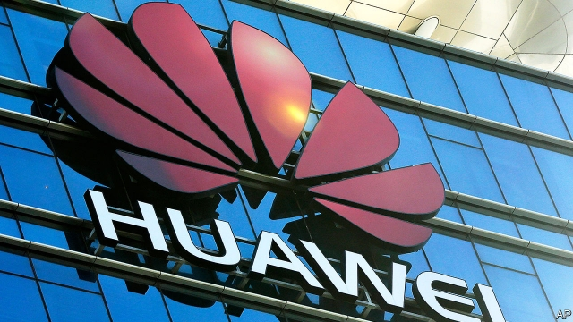

###### Dirty money

# Illicit financial flows are hard to stop 

##### They are even harder to measure 

 

> Jan 31st 2019 

WHEN FOREIGN aid enters developing countries, it is welcomed with handshakes and ribbon-cutting. Private money, by contrast, is sometimes smuggled across borders or siphoned into offshore bank accounts. Everyone agrees that such “illicit financial flows” are a problem. A report published on January 28th by Global Financial Integrity (GFI), a campaign group, estimates that illicit flows to and from developing countries are worth more than a fifth of their total trade with the rich world. 

Governments have pledged to plug the leaks, including as part of the UN’s Sustainable Development Goals. If only they could reach agreement on what they are talking about. A few rich countries, notably America, complain that illicit flows are not properly defined. Statisticians are still puzzling over how they can be accurately measured. 

Obviously, gun-running and drug-trafficking should count; in 2011 the UN estimated that financial flows linked to transnational organised crime were worth 1.5% of global GDP. Bribes, and the proceeds of unregistered trade in legal goods, such as cigarettes, probably should, too. But broader definitions also fold in tax avoidance, which may not be illegal. The result is hopelessly vague, diverting attention from dirty money to smear legitimate businesses, argues Maya Forstater of the Centre for Global Development, a think-tank in Washington. Tax activists retort that the line between lawful and unlawful acts is often blurry. Developing countries lack resources to pursue complex legal cases, so big firms find it easier to get away with avoidance that should count as evasion. 

Measuring illicit flows is even more fraught. One method exploits discrepancies in trade data. The exports that Ghana reports to France, say, should match the imports that France reports from Ghana. In practice, that is rarely the case. Traders may understate the value of exports, or overstate the value of imports, as a way of slipping money out of a country. They may also fiddle paperwork to dodge border taxes. Big inconsistencies hint at wrongdoing. 

GFI combines this method with balance-of-payments data. In 2015 the High Level Panel on Illicit Financial Flows from Africa, a group chaired by Thabo Mbeki, a former South African president, used a similar approach to conclude that a net $50bn leaks out of the continent each year. 

Both figures have been questioned. Some trade discrepancies are indeed caused by fraud, which is why misreporting is less of a problem where corruption is lower or accounting standards are higher. Yet they may also result from errors, quirks or transit trade. One UNCTAD report concluded that almost all South Africa’s gold leaves the country unreported, only for tax officials to point out that most of it was recorded, just in a different format. 

A recent report by the World Customs Organisation concludes that existing methods are simply too unreliable to measure the scale of illicit flows. And anyway, trade data capture only one type of malfeasance (smugglers fly completely under the radar). Some experts take a different tack. Alex Cobham of the Tax Justice Network and Petr Jansky of Charles University, Prague, propose two indicators: one based on mismatches between where multinationals report their profits and where their real activity occurs, and another that is a measure of undeclared offshore assets. 

Perhaps it would be simpler to abandon the catch-all term “illicit financial flows”. But its very vagueness is the reason it caught on. Rich countries like talking about corruption, which they blame on poor-country elites. Poor countries like talking about tax avoidance, which they blame on foreign multinationals. Loose language keeps everyone happy. 

Except the unfortunate statisticians. A team of them from the UN is due to publish some first thoughts this year; it may be several years before an indicator is agreed on. In the meantime, it would be a shame if disagreements distract from action. Beefing up customs authorities, establishing public registries of beneficial ownership and exchanging more information between countries about the taxes citizens and companies pay could all reduce skulduggery—however it is measured. 

-- 

 单词注释:

1.illicit[i'lisit]:a. 不法的, 不正当的, 禁止的 [法] 违法的, 违禁的, 被禁止的 

2.Jan[dʒæn]:n. 一月 

3.handshake['hændʃeik]:n. 握手 

4.smuggle['smʌgl]:vt. 偷运, 走私, 私运 vi. 走私 

5.siphon['saifәn]:n. 虹吸管 vt. 用虹吸管吸出, 抽取 vi. 通过虹吸管 

6.illicit[i'lisit]:a. 不法的, 不正当的, 禁止的 [法] 违法的, 违禁的, 被禁止的 

7.integrity[in'tegriti]:n. 正直, 廉正, 完整 [计] 完整性 

8.gfi[]: [医][=glucagon-free insulin]无胰高血糖素的胰岛素 

9.pledge[pledʒ]:n. 诺言, 保证, 誓言, 抵押, 信物, 保人, 祝愿 vt. 许诺, 保证, 使发誓, 抵押, 典当, 举杯祝...健康 

10.sustainable[sә'steinәbl]:a. 足可支撑的, 养得起的, 可以忍受的 

11.notably['nәjtbәli]:adv. 显著地, 著名地, 尤其, 特别 

12.statistician[.stæti'stiʃәn]:n. 统计员, 统计学家 [经] 统计家 

13.accurately['ækjurәtli]:adv. 正确地, 精确地 

14.UN[ʌn]:pron. 家伙, 东西 [经] 联合国 

15.transnational[træns'næʃәnl]:a. 超越国界的, 跨国的 [法] 超越国界的, 超国家的, 跨国的 

16.GDP[]:[化] 鸟苷二磷酸 

17.bribe[braib]:n. 贿赂 vt. 贿赂, 收买 vi. 行贿 

18.unregistered[ʌn'redʒistәd]:[法] 未登记的, 未注册的 

19.avoidance[ә'vɒidәns]:n. 避免, 避开, 逃避 [经] 回避, 废止, 宣告无效 

20.hopelessly[]:adv. 绝望地, 无可奈何地 

21.divert[dai'vә:t]:vt. 转移, 使欢娱 vi. 转移 

22.smear[smiә]:vt. 涂, 擦上, 玷污, 把...擦模糊 vi. 被弄脏 n. 污点, 污迹, 污蔑 

23.legitimate[li'dʒitimәt]:a. 合法的, 正当的, 婚生的 vt. 认为正当, 立为嫡嗣, 使合法 

24.Maya['mɑ:jә]:n. 马雅人, 马雅语 a. 马雅人的, 马雅语的 

25.Washington['wɒʃiŋtn]:n. 华盛顿 

26.activist['æktivist]:n. 激进主义分子 

27.retort[ri'tɒ:t]:n. 反驳, 顶嘴, 蒸馏器, 曲颈甑 vi. 反驳, 回嘴, 反击 vt. 反击, 反驳, 蒸馏 

28.lawful['lɒ:ful]:a. 法律许可的, 守法的, 合法的 [经] 合法的, 法定的 

29.unlawful[.ʌn'lɒ:ful]:a. 非法的, 不正当的 [法] 不法, 不法的, 非法的 

30.blurry['blә:ri]:a. 模糊的, 不清楚的, 污脏的 

31.evasion[i'veiʒәn]:n. 逃避, 藉口 [法] 回避, 规避, 逃避 

32.fraught[frɒ:t]:a. 含有...的, 伴着...的, 充满...的 

33.discrepancy[dis'krepәnsi]:n. 不符合, 差异, 不相符之处 [化] 不符值; 偏差值 

34.datum['deitәm]:n. 论据, 材料, 资料, 已知数 [医] 材料, 资料, 论据 

35.Ghana['gɑ:nә]:n. 加纳 

36.trader['treidә]:n. 商人, 商船 [经] 交易者, 商船 

37.understate[.ʌndә'steit]:v. 不完全地陈述, 保守地说, 有意轻描淡写 

38.overstate[.әuvә'steit]:vt. 夸大的叙述, 夸张, 过分强调 [经] 多计, 高估 

39.fiddle['fidl]:n. 小提琴, 提琴类乐器 vt. 虚度时光, 拉小提琴 vi. 拉小提琴, (无目的地)拨弄, 瞎搞 

40.dodge[dɒdʒ]:v. 避开, 躲避 n. 诡计, 躲藏 

41.inconsistency[.inkәn'sistәnsi]:n. 不一致, 易变, 前后矛盾的事物 [法] 前后矛盾, 不一致 

42.wrongdoing['rɒŋ'du:iŋ]:n. 干坏事, 坏事 

43.thabo[]:[网络] 塔博 

44.mbeki[]:[网络] 姆贝基；南非总统姆贝基；南非总统穆白吉 

45.fraud[frɒ:d]:n. 欺骗, 欺诈, 诡计, 骗子 [经] 欺诈, 舞弊, 骗子 

46.misreport[,misri'pɔ:t]:[法] 谎报, 误报, 报导不实 

47.les[lei]:abbr. 发射脱离系统（Launch Escape System） 

48.corruption[kә'rʌpʃәn]:n. 腐败, 堕落, 贪污 [计] 论误 

49.quirk[kwә:k]:n. 古怪举动, 俏皮话, 急转 

50.transit['trænsit]:n. 经过, 通行, 运输, 运输线, 转变 vt. 运送, 使通过, 经过 vi. 通过 

51.unctad[]:n. 联合国贸易与发展会议 

52.unreported[,ʌnri'pɔ:tid]:[法] 未告发的, 未揭发的, 未引起的 

53.organisation[,ɔ: ^әnaizeiʃən; - ni'z-]:n. 组织, 团体, 体制, 编制 

54.unreliable[.ʌnri'laiәbl]:a. 不可靠的 [法] 不可靠的, 靠不住的 

55.malfeasance[mæl'fi:zns]:n. 不正当, 不法行为, 坏事, 渎职 [经] 不法行为, 违法乱纪 

56.smuggler['smʌglә]:n. 走私者, 走私船 [经] 走私者, 走私船 

57.tack[tæk]:n. 平头钉, 大头钉, 粗缝针脚, 行动方针, 食物 vt. 以大头针钉住, 附加 

58.Alex[]:[计] 开放网络文件系统 

59.Cobham['kɔbәm]:科巴姆（姓氏） 

60.PETR[]:n. 岩石学 n. (Petr)人名；(俄、保、捷、哈萨)彼得 

61.jansky[d'ʒænskaɪ]: 央 

62.charle[]:n. 查理（男子名）；查理（姓氏） 

63.Prague[prɑ:g]:n. 布拉格 

64.mismatch[mis'mætʃ]:n. 错配 vt. 错配, 使...成不相配的婚姻 

65.multinational[.mʌlti'næʃәnl]:a. 多国的, 跨国公司的 n. 跨国公司 

66.undeclared[.ʌndi'klєәd]:a. 未申报的, 未宣布的 

67.asset['æset]:n. 资产, 有益的东西 

68.vagueness['veignis]:n. 含糊, 暧昧 

69.elite[ei'li:t]:n. 精华, 精锐, 中坚分子 

70.indicator['indikeitә]:n. 指示器, 指示剂, 指标 [计] 指示器 

71.distract[dis'trækt]:vt. 转移, 分心, 使发狂 

72.registry['redʒistri]:n. 登记处, 登记名册 [计] 登录库 

