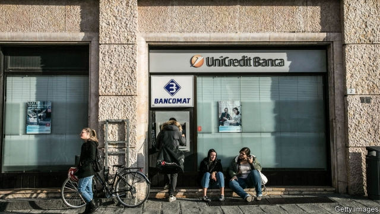
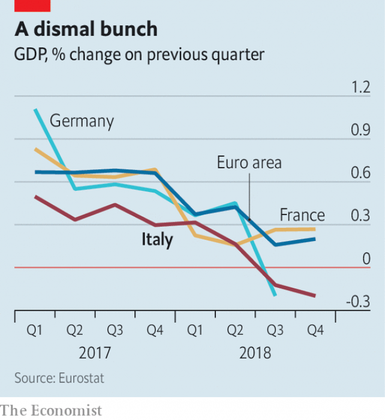

###### Lagging behind

# Italy’s slump reflects trouble both at home and abroad 

##### The weak economy complicates a fraught fiscal position 

 

> Feb 2nd 2019 

ITALY BOASTS no glittering economic record. GDP growth has trailed the euro-area average every year since 1999. Despite a decent showing in 2016-17, the economy has yet to regain fully the output lost during the global crisis a decade ago and a domestic banking scare a few years later. 

Now even its modest recovery seems to have gone into reverse. Figures published on January 31st showed that Italy slipped into recession in the second half of 2018. The economy shrank by 0.2% in the final quarter of 2018, its second consecutive contraction (see chart). The causes are both domestic and external. They seem likely to depress the economy this year, too, and to worsen an already fraught fiscal position. 

The euro zone—notably Germany—has lost momentum as global trade has slowed. Italy has not been immune. Exports rose by nearly 6% in 2017, but Loredana Federico of UniCredit, a bank, reckons they probably grew by just 1% last year. Giada Giani of Citigroup, another lender, argues that the fate of Italy’s economy is tied to that of Germany’s, in part because of integrated manufacturing supply chains. Declining industrial production in Germany is likely to have spread south. (Germany’s GDP fell more sharply than Italy’s in the third quarter of 2018, though some of that dip was caused by a temporary halt to car production because of new emissions standards.) 

 

Italy’s recession is also partly home-grown. In September 2018 its populist government unveiled budget plans for 2019 that defied the European Union’s fiscal rules. As the row with Brussels worsened, government borrowing costs rose sharply. Tensions were eventually defused in December, when the government agreed to run a smaller deficit, largely by dint of postponing its plans to increase spending. Though the spread between Italy’s government-bond yields and those of safe-haven Germany has fallen from its peak, it is still higher than it was a year ago. 

The instability has had an economic cost. A survey of lenders by the European Central Bank (ECB) found that in the fourth quarter of 2018 Italian banks became more fussy about whom they lent to, even as credit standards in other large euro-zone countries eased. That could reflect rising funding costs. The Bank of Italy, the national central bank, expects that rises in sovereign-bond yields will push Italian companies’ borrowing costs up by a percentage point over the next three years. Olivier Blanchard and Jeromin Zettelmeyer of the Peterson Institute for International Economics, a think-tank, estimated in October that such financial-market effects would probably offset the boost from the government’s fiscal measures. 

These domestic and external forces have similar economic effects, notes Nicola Nobile of Oxford Economics, a consultancy. They shake businesses’ and households’ confidence, leading them to delay spending. Measures of sentiment have weakened. The Bank of Italy notes that the share of firms expecting to increase investment in 2019 has fallen. Economists have marked down their forecasts for GDP growth in 2019. The IMF expects growth of 0.6% in 2019, down from its forecast of 1% in October. Mr Nobile and Ms Giani have plumped for a more gloomy 0.2-0.3%. 

ECB-watchers think that the bank may extend its targeted long-term refinancing operations. The scheme, which offers banks cheap funding in return for lending to firms and households, could help ease credit conditions in Italy. Beyond that, policy options are limited. The ECB will inject further stimulus only in the event of a wider slowdown, rather than one confined to Italy. And anyway, any easing might be too little to counter Italy’s deeper slump. 

Italy’s government now finds itself hemmed in. Economic weakness worsens its fiscal position. Public debt, already 132% of GDP, could rise further. The budget deficit will probably exceed the government’s target of 2% of GDP. That worse fiscal position could, in turn, make it harder for the government to stimulate the economy. If the European Commission decides Italy has broken its fiscal rules, any further spending will cause another row. And last year’s episode showed that big spending plans can be self-defeating if financial markets are spooked. Italy’s government would need to convince both Brussels and investors that extra spending would help the economy grow. Until then Italy will stagger on. 

-- 

 单词注释:

1.slump[slʌmp]:n. 暴跌, 垂头弯腰的姿态 vi. 猛然掉落, 陷入, 衰落(经济等) 

2.fraught[frɒ:t]:a. 含有...的, 伴着...的, 充满...的 

3.fiscal['fiskәl]:a. 财政的, 国库的 [经] 财政上的, 会计的, 国库的 

4.feb[]:abbr. 二月（February） 

5.GDP[]:[化] 鸟苷二磷酸 

6.regain[ri'gein]:vt. 取回, 恢复, 重回, 复得 [化] 回潮 

7.fully['fuli]:adv. 十分地, 完全地, 充分地 

8.recession[ri'seʃәn]:n. 后退, 凹处, 衰退, 归还 [医] 退缩 

9.consecutive[kәn'sekjutiv]:a. 连续的, 联贯的 [计] 连续的; 连接的 

10.contraction[kәn'trækʃәn]:n. 收缩, 缩写式, 害病 [医] 收缩; 挛缩; 牙弓内缩 

11.worsen['wә:sn]:vt. 使更坏, 使恶化 vi. 变得更坏, 恶化 

12.euro['juәrәu]:n. 欧元（欧盟的统一货币单位） 

13.momentum[mәu'mentәm]:n. 动力, 动量 [化] 动量 

14.immune[i'mju:n]:a. 免疫的, 免除的, 不受影响的 n. 免疫者 

15.loredana[]:[网络] 达娜；萝蕾丹娜；伊本捷 

16.Federico[]:n. 费德里科（人名） 

17.UniCredit[]:[网络] 意大利联合信贷银行；意大利裕信银行 

18.reckon['rekәn]:vt. 计算, 总计, 估计, 认为, 猜想 vi. 数, 计算, 估计, 依赖, 料想 

19.giada[]:[网络] 杰拓；迦达；翔升 

20.giani[]:[网络] 吉亚尼 

21.citigroup[]:n. 花旗集团1998年4月6日; 花旗公司与旅行者集团宣布合并; 合并组成的新公司称为“花旗集团”; 其商标为旅行者集团的红雨伞和花旗银行的兰色字标。 

22.lender['lendә]:n. 出借人, 贷方 [经] 出借者, 贷方, 贷款人 

23.manufacturing[.mænju'fæktʃәriŋ]:n. 制造业 a. 制造业的 

24.emission[i'miʃәn]:n. 发射, 射出, 发行 [医] 发射, 遗精 

25.Populist['pɔpjulist]:n. 民粹派的成员 

26.unveil[.ʌn'veil]:vt. 揭开, 揭幕, 除去...的面纱 vi. 显露, 除去面纱 

27.defy[di'fai]:vt. 藐视, 挑衅, 使落空 n. 挑战 

28.Brussel[]:n. 布鲁塞尔（比利时首都） 

29.defuse[.di:'fju:z]:vt. 去掉...的引信, 平息 

30.deficit['defisit]:n. 赤字, 不足额 [医] 短缺 

31.dint[diŋt]:n. 凹痕, 作用 vt. 打击出凹痕 

32.postpon[pəs'pɒn]: [医]推迟, 延迟, 搁置 

33.instability[.instә'biliti]:n. 不安定, 不稳定 [医] 不稳定性 

34.ECB[]:[计] 事件控制块 

35.fussy['fʌsi]:a. 易怒的, 爱挑剔的, 难取悦的, 易烦恼的 

36.Olivier[əu'liviə]:n. 奥利维尔（男子名） 

37.Blanchard['blæntʃəd]:n. 布兰卡德（男子名） 

38.Peterson[]:n. 彼得森（男子名） 

39.offset['ɒ:fset]:n. 抵消, 把...并列, 旁系, 支管, 用胶印法印 vt. 弥补, 抵消, 胶印 vi. 装支管 n. 偏移量 [计] 偏移量 

40.nicola[]:n. 尼古拉（男子名） 

41.nobile[]:n. (Nobile)人名；(意、塞)诺比莱；(西)诺维莱 

42.Oxford['ɒksfәd]:n. 牛津, 牛津大学 

43.consultancy[]:n. 商量, 协商, 磋商, 会诊, 与...商量, 咨询, 请教, 找(医生)看病, 查阅, 考虑 [经] 咨询业务, 咨询服务 

44.sentiment['sentimәnt]:n. 感情, 感伤, 情操, 情绪, 感想, 意见 [医] 情感, 情操 

45.economist[i:'kɒnәmist]:n. 经济学者, 经济家 [经] 经济学家 

46.IMF[]:国际货币基金组织 [经] 国际货币基金 

47.plump[plʌmp]:a. 圆胖的, 丰满的, 直接下落的, 直率的 vt. 突然放下, 支持, 使丰满, 使鼓起 vi. 扑通落下, 投票赞成, 变丰满, 鼓起 adv. 沉重地, 突然地, 直截了当地 

48.refinancing[rifi'nænsiŋ]:[经] 重新集资金 

49.inject[in'dʒekt]:vt. 注射, 注入, 使入轨 [医] 注射 

50.stimulus['stimjulәs]:n. 刺激, 激励, 刺激品 [医] 刺激特, 刺激 

51.slowdown['slәudaun]:n. 降低速度, 减速 

52.hem[hem]:n. 边缘, 折边, 哼声 vt. 缝边, 包围, 关闭 vi. 做折边, 发哼声 interj. 哼 

53.spook[spu:k]:n. 幽灵, 鬼 vt. 惊吓, 鬼怪般地出没 vi. 惊吓而逃窜, 受惊 

54.investor[in'vestә]:n. 投资者 [经] 投资者 

55.stagger['stægә]:n. 蹒跚, 踌躇 vi. 蹒跚, 犹豫 vt. 使摇摆, 使踌躇, 交错, 错开 a. 交错的, 错开的 

