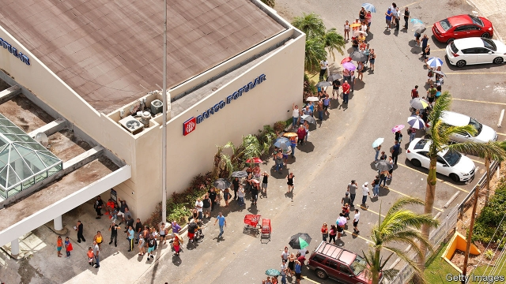

###### Banco Popular

# Puerto Rico’s biggest bank came out of Hurricane Maria stronger 

##### Even as people leave the island, Popular’s customer base has swelled 

 

> Jan 31st 2019 

 

PUERTO RICO was never the most financially stable of places. After years of trouble its government defaulted in 2016. Then, in 2017, Hurricane Maria roared in. The island took close to a year to restore electricity fully, and financial restructuring continues. Manufacturers decamped during the power cuts; many did not return. Banco Popular, the biggest financial institution, which had already been buffeted by a wave of bad loans, was hit by another. Its failure would have been no surprise. 

Prepare to be astonished, then: Popular is in pretty decent shape. Part of that is due to the island’s tentative recovery. Sales of cement and cars have been strong; tourism is starting to pick up. But even so, Popular’s performance is striking. The KBW index, a broad measure of American banking stocks, has fallen by 16% in the past year; Popular’s shares are up by a third. Over the past five years the KBW index rose by 46%; Popular’s shares doubled. 

Earnings, published on January 23rd, were up 77% in 2018, after stripping out some large one-time items. Return on assets on the same basis was 1.04%, strong for a bank, and return on equity a passable 9%. Non-performing loans have fallen to 2.3% of total loans, from 9.6% in 2009. The bank’s core capital ratio (common equity as a share of risk-adjusted assets) is so high, at 17%, that the bank could be considered over-capitalised. Few investors are complaining, though. Buy-backs doubled this year, dividends rose by 20% and its solid balance-sheet has allowed it to refinance debt yielding as much as 8% with debt yielding 6%, despite a broader trend of rising interest rates. 

Large American banks came out of the crisis protected from failure but blocked from acquisitions and encouraged to shrink. Popular—no tiddler, with $48bn in assets—is not only free of those restraints but benefits from them. It sold some operations after the crisis to raise capital and increase efficiency: branches in Chicago and Los Angeles, and half of a data-processing firm. But it also made acquisitions. As the first jitters were starting in 2007, it bought Citibank’s Puerto Rican retail network. It picked up two Puerto Rican banks that had gone into receivership: Westernbank in 2010 and Doral in 2015. In 2018, when regulators were pressing Wells Fargo to reduce assets, Popular bought from it a long-coveted car-hire company. 

The Wells deal has already exceeded profit expectations. Together, the acquisitions have boosted Popular’s market share to 54% of the island’s deposits and 46% of loans. Normally that would look like over-concentration, but right now solvency and stability are more urgent concerns. 

And Popular banked a great deal of credit during Hurricane Maria. Twelve hours after the storm had blown over, the bank’s main data centre had been restarted on emergency generators. Many mobile-phone towers and phone lines remained down for months, making branches hard to operate. But people and businesses were desperate for cash to buy and sell fuel, food and other staples. Popular’s response—an extraordinary one for extraordinary times—was to download data onto encrypted laptops early every morning and send it out with employees who would stand by tellers and authorise withdrawals. 

That response may explain the most telling fact about Popular’s performance: although Puerto Rico’s population has declined since Maria, the bank’s customer base has grown. Much of what bankers do is abstract and technical. Just as important, though less tangible, is the trust earned by keeping going when others do not. 

-- 

 单词注释:

1.banco['bæŋkәu]:n. 审判官席 

2.Puerto[]:n. 垭口, 港口, 山口 n. (Puerto)人名；(西)普埃尔托 

3.Maria[mә:'raiә, mә'riә]:n. 玛丽亚（女名） 

4.Jan[dʒæn]:n. 一月 

5.Puerto[]:n. 垭口, 港口, 山口 n. (Puerto)人名；(西)普埃尔托 

6.rico[]:abbr. 反诈骗腐败组织集团犯罪法（Racketeer Influenced and Corrupt Organizations Act） 

7.financially[]:adv. 金融上；财政上 

8.default[di'fɒ:lt]:n. 违约, 不履行责任, 缺席, 默认值 v. 疏怠职责, 缺席, 拖欠, 默认 [计] 默认; 默认值; 缺省值 

9.fully['fuli]:adv. 十分地, 完全地, 充分地 

10.restructuring[]:[计] 重构的 

11.decamp[di'kæmp]:vi. 撤营, 逃走, 逃亡 [法] 撤退, 逃走, 逃亡 

12.kbw[]:abbr. Klan Border Watch (along the Mexican border) 三K党边境警戒（沿墨西哥边境）; knowledge based warfare 基于知识的战争，知识化战争 

13.earning['ә:niŋ]:n. 收入（earn的现在分词） 

14.asset['æset]:n. 资产, 有益的东西 

15.equity['ekwiti]:n. 公平, 公正 [经] 权益, 产权 

16.passable['pæsәbl]:a. 可通行的, 可渡过的, 尚可的, 可流通的 

17.investor[in'vestә]:n. 投资者 [经] 投资者 

18.dividend['dividend]:n. 被除数, 股利 [计] 被除数 

19.refinance[.ri:fai'næns]:vt. 再为...筹钱, 再供...资金 

20.tiddler['tidlә]:n. [英口]小鱼；小孩儿 

21.Chicago[ʃi'kɑ:gәu]:n. 芝加哥 

22.los[lɔ:s]:abbr. 月球轨道航天器（Lunar Orbiter Spacecraft）；视线（Line of Sight） 

23.angeles[]:n. 安杰利斯（姓氏）；天使城（菲律宾地名） 

24.jitter['dʒitә]:vi. 神经过敏, 战战兢兢 [计] 跳动; 抖动 

25.rican[]:adj. 波多黎各岛的(人) n. 波尔图 [网络] 日佳 

26.doral[]: [医]夸西泮(quazepam)制剂的商品名; [人名] 多勒尔 

27.regulator['regjuleitә]:n. 调整者, 校准者, 校准器, 调整器, 标准钟 [化] 调节剂; 调节器 

28.fargo['fɑ:ɡəu]:n. 法戈（美国北达科他州东南部城市） 

29.solvency['sɒlvәnsi]:n. 偿付能力, 溶解力 [法] 有清偿能力, 偿付能力, 支付能力 

30.datum['deitәm]:n. 论据, 材料, 资料, 已知数 [医] 材料, 资料, 论据 

31.restart[.ri:'stɑ:t]:v. 重新开始, 重新启动 [计] 重新启动 

32.staple['steipl]:n. 主要产物, 常用品, 主要要素, 原料, 订书钉, 钩环 a. 主要的, 重要的 vt. 分级, 钉住 

33.encrypt[in'kript]:[计] 加密 

34.laptop[]:[计] 膝上型的 

35.teller['telә]:n. 叙述者, 讲故事者, 出纳员 [经] 出纳员 

36.authorise['ɔ:θәraiz]:vt. 授权；批准；允许；委任（等于authorize） 

37.withdrawal[wið'drɒ:l]:n. 提款, 撤退, 退回, 撤消, 退隐, 戒毒过程 [医] 戒除, 脱瘾 

38.banker['bæŋkә]:n. 银行家, 庄家 [经] 银行业者, 银行家 

39.les[lei]:abbr. 发射脱离系统（Launch Escape System） 

40.tangible['tændʒәbl]:n. 可触知的东西, 有形资产 a. 可触摸的, 有实体的, 非相像的, 有形的, 明确的 

